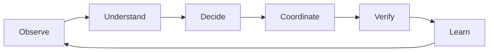
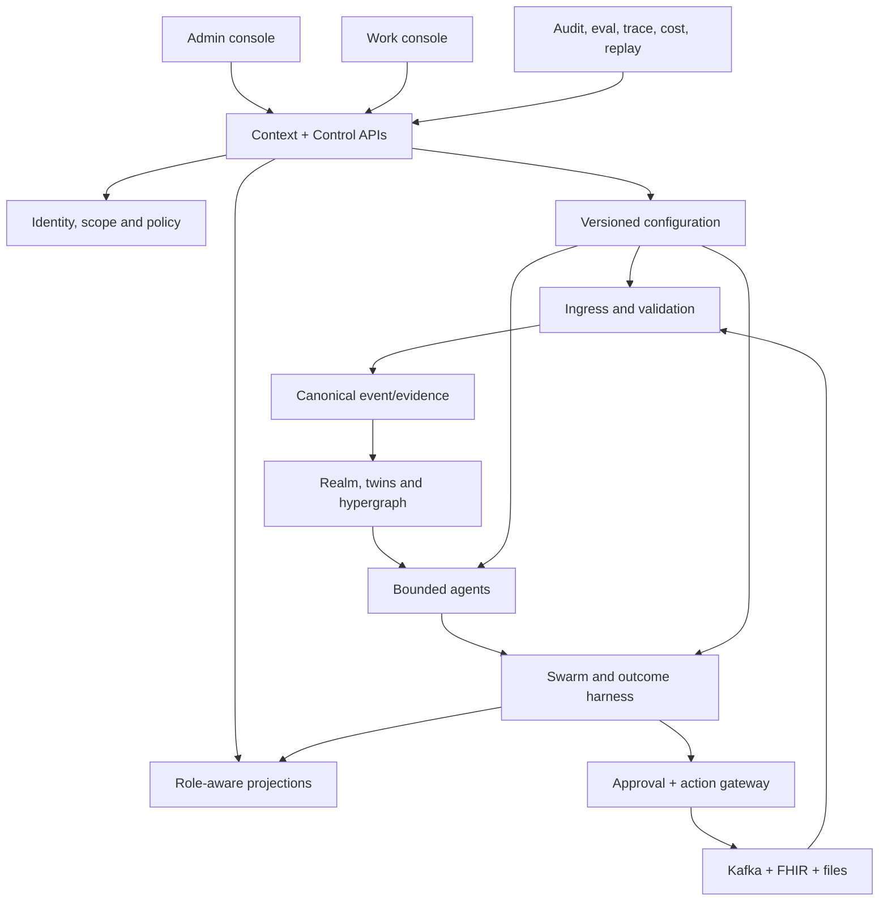
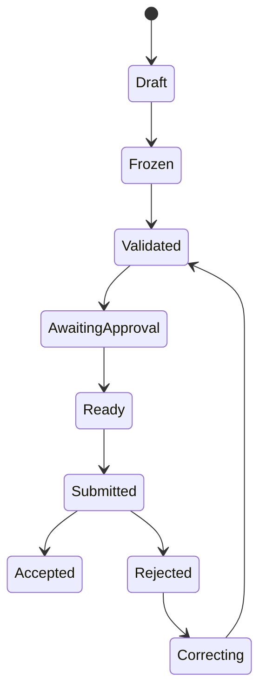
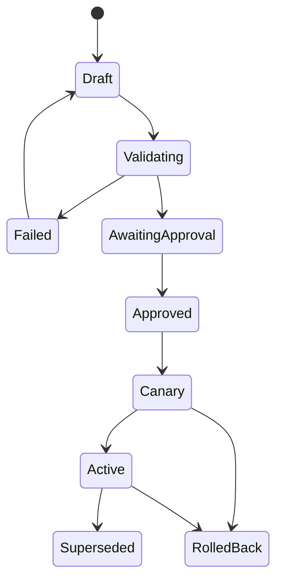

# Anant Harness Healthcare Intelligence Platform

> **Implementation appendix:** The authoritative product definition is [ANANT_HARNESS_PRODUCT_SPEC.md](./ANANT_HARNESS_PRODUCT_SPEC.md). This appendix supplies detailed engineering, migration and acceptance guidance.

## Healthcare implementation, migration and acceptance appendix

| Field | Value |
|---|---|
| Target repository | `bayyagari86/anant-harness` |
| Target branch | `with-ode` |
| Renal source repository | `renal-swarm-intelligence` |
| Renal source baseline | `c39e1a48572f841d70619cd873cf97277de81728` |
| Target planning baseline | `cc0d801eaed4ce615447bf70f1c3b4dbcfa211ae` |
| Product horizon | 2026–2039 |
| Intended audience | Anant product, design, architecture, backend, frontend, data, ML, security, quality and implementation teams |
| Status | Implementation appendix |

---

## 1. How to use this document

This appendix is the implementation contract for making Anant Harness deliver the complete product behavior of Renal Swarm Intelligence while becoming a generic healthcare platform for providers, payers and hybrid organizations.

When this document conflicts with a prototype shortcut, this document wins. When an implementation decision is not specified, choose the option that preserves:

1. human authority;
2. tenant, organization and person scope;
3. exact provenance;
4. bitemporal history;
5. deterministic replay;
6. configuration without application redeployment;
7. backend authority over browser convenience;
8. compatibility with SQLite for the demonstrator and PostgreSQL for production.

The word **must** is an acceptance requirement. **Should** is a strong default that needs a recorded architecture decision to change.

### 1.1 Merge meaning

“Merge Renal Swarm into `with-ode`” means all of the following:

- carry forward every completed Renal Swarm product surface, role journey, contract, control and closed loop;
- retain Anant’s working backend, realm, twin, FHIR, CMS, Kafka, event-outbox, identity, knowledge, measure and persistence implementations;
- move renal-only catalogs, terminology and policies into a versioned renal solution pack;
- expose the same platform to provider and payer solution packs;
- make the two authoritative UIs share identity, contracts, design language and backend truth;
- remove dead ends, client-authored truth and production-path demo fallbacks.

It does **not** mean blindly combining unrelated Git histories or importing the Renal Next.js server runtime beside Anant’s Fastify runtime. This is a controlled product-and-capability merge. Reuse the Renal UI behavior, styles, contracts and tests; adapt data access to Anant’s backend.

---

## 2. Product definition

### 2.1 One-sentence product

Anant Harness is a governed healthcare intelligence and outcome-coordination platform that listens to an organization’s existing event and clinical data plane, builds traceable temporal understanding, lets bounded AI agents contribute proposals, routes decisions to authorized humans, coordinates actions through existing systems, verifies outcomes, and continuously learns under audit.

### 2.2 Plain-language promise

The platform tells each user:

- what needs attention;
- why it matters;
- which evidence supports it;
- what the agents agree or disagree about;
- what the user is authorized to do;
- who owns the next step;
- whether the action was acknowledged;
- whether the intended outcome actually happened.

The product is successful only when it closes that loop. A dashboard, alert, recommendation or model response without ownership, action, acknowledgement and outcome is incomplete.

### 2.3 Core loop



### 2.4 What the product is

- An event-first business and clinical outcome harness.
- A governed multi-agent runtime with bounded specialist cells.
- A temporal person, organization and facility intelligence substrate.
- A configuration and release platform for healthcare workflows, measures and policies.
- A role-specific work system for provider, payer, quality, regulatory and executive operations.
- A regulatory evidence, readiness, packaging and reconciliation system.
- A simulation, counterfactual, red-team and assurance environment.
- A shared institutional knowledge hypergraph.

### 2.5 What the product is not

- Not an EMR, claims system, care-management system or source-of-record replacement.
- Not an autonomous diagnosis, prescription, treatment-change or submission engine.
- Not an unbounded “agents talking to agents” system.
- Not a generic chatbot placed over patient data.
- Not a static CMS dashboard.
- Not a frontend-only demo.
- Not a product that calls synthetic data “live.”
- Not a collection of screens that end at “view details.”

---

## 3. Non-negotiable product and engineering principles

1. **Kafka remains the movement layer.** The harness uses the organization’s event estate; it does not create a second point-to-point AI integration mesh.
2. **FHIR and source systems remain systems of record.** The harness stores evidence, projections, decisions and outcome coordination, then writes only through governed adapters.
3. **Every agent is bounded.** Typed inputs, typed proposal outputs, explicit tools, action allowlists, model limits, eval gates, owner, output topic, DLQ and kill switch are mandatory.
4. **The swarm does not own decisions.** Cells contribute independent proposals. The harness detects conflicts and arbitrates policy. Authorized people approve governed actions.
5. **Evidence precedes inference.** Every fact, insight, recommendation, measure and submission line must resolve to source evidence and provenance.
6. **Assessment answers are untrusted evidence, never instructions.** Structured and unstructured answers retain exact source context and pass deterministic/grounded safety checks.
7. **Time is first class.** Preserve valid time, recorded time, corrections and supersession.
8. **Deny by default.** Missing scope, purpose, relationship, authority, freshness, evidence or approval blocks the affected action.
9. **Replay is a trust primitive.** The same configuration, inputs and deterministic components must reproduce the same result. Divergence is a priority-zero incident.
10. **No production mocks.** Synthetic data is permitted only in labeled simulator/reference tenants and test fixtures.
11. **Configuration is released, not edited live.** Draft → validate → red/green test → approve → activate → monitor → rollback.
12. **No redeploy for customer configuration.** Organizations, sources, mappings, topics, agents, models, prompts, thresholds, policies, workflows, measures, roles and UI lenses hot-resolve from the active release.
13. **Secrets never enter the browser or configuration document.** Store binding references only.
14. **Regulations are executable, versioned metadata.** Proposed, final, effective and superseded sources coexist with explicit effective windows.
15. **The platform is generic; packs are specific.** Renal is the first complete solution pack, not hard-coded platform identity.

---

## 4. Existing target foundation: preserve, do not rewrite

The `with-ode` branch already contains a functional end-to-end substrate. Teams must reuse it.

| Capability | Existing target implementation | Product instruction |
|---|---|---|
| API/runtime | Fastify server in `src/server/` | Keep as authoritative backend |
| Identity | local auth, OIDC, WorkOS, SCIM, invites, break-glass | Extend role bundles and scopes; do not move auth to UI |
| Data | SQLite/PostgreSQL-compatible `SqlStore`, production Postgres event store | Add portable migrations and repositories |
| Events | broker abstraction, Kafka, Redis Streams, NATS, RabbitMQ, SQS/SNS, Pub/Sub, Event Hubs, in-process | Kafka is the healthcare reference path; retain abstraction |
| Reliability | transactional outbox, idempotency, broker telemetry, retries, dead-letter support | Surface in admin UX and correlate to agent outcomes |
| FHIR | typed R4 resources, ingest/export, emulator, subscriptions, CDS hooks | Use as clinical exchange boundary |
| CMS/measures | authority catalogs, measure store, real CQL/FHIR evaluation, CMS readiness | Build full readiness-to-reconciliation workflow |
| Knowledge | source registry, subscriptions, adapters, provenance, agent tool bus | Bind solution packs and evidence |
| Realms/twins | realm registry, presences, perception, policy, episodes, snapshots, replay | Use for person/member/provider/facility/plan context |
| Hypergraph | typed graph, ledger, projections, versioning | Back Shared Intelligence and dependency maps |
| Agents | authoring, registry, runtime, tools, planners, model adapters | Add complete UI configuration and topic operations |
| Swarm | bounded cells, evidence fusion, insights, NBAs, outcome episodes | Generalize namespace while preserving renal compatibility |
| Simulation | deterministic scenarios and durable fleet | Use for rehearsal, training and demos only |
| Assurance | audit, governance ledger, cost, traces, model/drift data, red-team workspace | Turn into blocking release workflow |
| UI 1 | `admin-ui/` served at `/admin/ui/` | Authoritative platform/operator console |
| UI 2 | `exec-app/` served at `/exec/` | Authoritative work/intelligence console |

### 4.1 Third UI decision

The repository also contains `ui/`, an older Next.js surface. It must not become a third product UI.

By the end of the merge:

- `/admin/ui/` and `/exec/` are the only supported product consoles;
- useful behavior in `ui/` is ported or deliberately rejected;
- CI marks `ui/` as deprecated;
- documentation no longer directs users there;
- it is removed in a later cleanup release after route/feature parity is proven.

---

## 5. Current-state critique

The target branch has strong backend breadth and an impressive Renal executive UI, but the current experience is not yet a 10/10 product journey.

| Gap | Why it matters | Required correction |
|---|---|---|
| Renal UI opens as a module collection | First-time users must understand architecture before value | Default every user to role-scoped **My Work** |
| Client references `demoContext` and fills reference-only fields | UI may appear authoritative when backend is unavailable | Backend returns complete view models; unavailable data becomes explicit error/empty state |
| Role model is too coarse | `admin/md/safety` cannot express enterprise, provider and payer decision rights | Add configurable business role bundles plus scope and purpose |
| Renal language is embedded in platform shell | Payer and non-renal provider users see irrelevant concepts | Server-provided solution-pack lens and terminology |
| Admin onboarding is fragmented | A customer cannot move confidently from tenant creation to usable cockpit | One resumable onboarding rail with blocking gates |
| Agent authoring, swarm cells and messaging are separate concepts | Administrators cannot understand what runs, listens, publishes or fails | One Agent Studio with manifests, triggers, topics, tests, releases and operations |
| Topic configuration lacks full partition/key semantics | Ordering and cross-person contamination risks remain hidden | Versioned input/output topic plan with partition and key tests |
| DLQ exists technically but is not a first-class journey | Operators cannot safely remediate poison messages | Dedicated DLQ page, evidence, repair, authorization and idempotent replay |
| Red-team replay is a demonstration action | Failed scenarios do not produce owned remediation and retest | Release-blocking findings workflow |
| CMS readiness and submission artifacts are split | Users cannot follow calculation through receipt/reconciliation | One regulatory episode state machine |
| Cards can drill down without completing work | “More detail” is not a closed loop | Every actionable detail has authorized command, owner, SLA, acknowledgement and outcome |
| Two UIs do not hand off context cleanly | Admin activation and user operation feel like separate products | Signed server context and console switcher preserving safe identifiers |
| Provider/payer model is implicit | The platform cannot be sold or configured broadly | Explicit provider, payer and hybrid organization/entity lenses |
| Demo and production claims can blur | Trust collapses if a contract-only test looks live | Persistent data-origin and verification-mode badges |

### 5.1 Baseline journey score

This score is intentionally strict.

| Dimension | Current target | Target |
|---|---:|---:|
| First-use clarity | 5 | 10 |
| Role relevance | 5 | 10 |
| Closed-loop completion | 6 | 10 |
| Evidence and trust | 8 | 10 |
| Admin onboarding | 5 | 10 |
| Agent/Kafka operability | 6 | 10 |
| Failure recovery | 5 | 10 |
| Provider/payer generality | 3 | 10 |
| Assurance and governance | 7 | 10 |
| Handoff/testability | 6 | 10 |
| **Overall** | **5.6/10** | **10/10 acceptance gate** |

A 10/10 score is not a visual-design opinion. Each target score requires the executable acceptance tests defined later.

---

## 6. Platform, pack and lens model

### 6.1 Generic platform

The generic platform owns:

- tenant and environment;
- organization graphs;
- identity, roles, scopes and purpose of use;
- integration, Kafka and FHIR connections;
- canonical events and evidence;
- temporal projections;
- realms, twins and hypergraph;
- agent runtime and swarm arbitration;
- workflow and outcome coordination;
- policy, approval and action gateway;
- knowledge, authority and measure infrastructure;
- configuration release lifecycle;
- observability, assurance, audit, cost and replay;
- generic UI composition.

### 6.2 Solution pack

A solution pack is a versioned bundle:

```ts
interface HealthcareSolutionPack {
  id: string;
  version: string;
  domain: string;
  organizationTemplates: string[];
  terminology: Record<string, string>;
  entityTypes: string[];
  relationshipTypes: string[];
  canonicalEventBindings: string[];
  assessmentBindings: string[];
  agentManifestIds: string[];
  outcomeDefinitions: string[];
  workflowIds: string[];
  policyIds: string[];
  measurePackIds: string[];
  authoritySourceIds: string[];
  uiLensId: string;
  evalSuiteIds: string[];
  redTeamSuiteIds: string[];
  migrationVersion: string;
}
```

### 6.3 Renal solution pack

The completed Renal Swarm behavior becomes `healthcare.renal-enterprise@1.x` and includes:

- enterprise → division → region → market → facility → unit/shift topology;
- patient, treatment, chair, machine, staff, assessment, access, transportation, intervention, measure and submission entities;
- 12 bounded renal cells;
- renal outcome episode types and NBAs;
- facility digital twin and what-if scenarios;
- ESRD CMS/QIP source and measure bindings;
- provider role presets;
- renal UI labels, navigation, guided demo and scorecards;
- renal green-team and red-team suites.

### 6.4 Provider, payer and hybrid lenses

| Operating model | Default hierarchy | Person term | Operational objects |
|---|---|---|---|
| Provider | enterprise → division → region → market → facility/practice → unit/service line | patient | encounter, schedule, capacity, staff, device, order, task |
| Payer | enterprise → line of business → state/market → plan/product → network → cohort | member | claim, authorization, appeal, care gap, contract, network, case |
| Hybrid | provider tree + payer tree joined by contract, attribution and shared measures | person | all authorized objects |

The canonical data model uses neutral entity types. The UI lens supplies user-facing terminology. A patient and member can refer to the same tokenized person in different authorized contexts without merging scopes or identifiers in the browser.

### 6.5 Outcome catalog proving the abstraction

The generic platform must support outcomes through configuration, not new navigation or runtime forks.

| Provider outcome families | Payer outcome families | Shared platform primitive |
|---|---|---|
| transition continuity, missed care, access follow-up | care-gap closure, post-discharge outreach | person-scoped outcome episode |
| chair/bed/room/schedule capacity | network capacity and appointment access | constraint-backed operations twin |
| staffing, credential and coverage risk | reviewer/case-manager capacity | workforce projection and governed plan |
| clinical/operational quality variation | HEDIS/Stars/quality variation | measure, evidence and improvement episode |
| device, supply and maintenance readiness | provider/network data quality | asset/data-quality episode |
| revenue integrity and clean claims | payment integrity and claim anomaly review | deterministic evidence and review task |
| patient experience and barriers | member experience and SDOH barriers | assessment evidence and human follow-up |
| referral and demand conversion | steerage, leakage and network adequacy | demand/network forecast and policy |
| CMS facility reporting | plan/contract/regulatory reporting | authority, measure and submission lifecycle |
| treatment/care-plan review | authorization, appeal and utilization review | Class C/D governed decision boundary |

The second proof pack must implement at least one payer journey using the same episode, evidence, proposal, policy, command, acknowledgement and outcome contracts. A payer-only fork of the runtime fails this requirement.

---

## 7. Organization, identity and role model

### 7.1 Scope model

Every tenant configures an organization graph, not fixed columns. Nodes carry:

- `organizationNodeId`;
- `tenantId`;
- type and label;
- parent/child edges;
- effective dates;
- external identifiers;
- jurisdiction;
- data residency;
- solution-pack bindings;
- allowed purpose-of-use values.

Events, evidence, work items, agents, measures, actions and UI queries carry a scope reference. Aggregation never grants drill-through.

### 7.2 Business role bundles

Seed, but do not hard-code:

**Platform**

- Platform Administrator
- Integration/Kafka Administrator
- Identity and Security Administrator
- AI/Agent Administrator
- Configuration Release Approver
- Clinical Safety Officer
- Regulatory/CMS Administrator
- Data Steward
- Auditor

**Provider**

- Enterprise Executive / COO
- Division Vice President
- Regional Operations Director
- Facility/Practice Administrator
- Medical Director
- Quality Director
- Finance Leader
- Biomedical/Asset Leader
- Care Coordinator
- Nurse/Clinician

**Payer**

- Enterprise/LOB Executive
- Market/Plan President
- Network Operations Leader
- Medical Director
- Utilization Manager
- Case Manager
- Appeals Supervisor
- Quality/Stars Leader
- Payment Integrity Leader
- Actuarial/Finance Leader

Each bundle maps to capabilities, action classes, approval rights, organization scope, evidence visibility, purpose of use and console access. Platform-adapter identities can execute approved plans but cannot approve them.

### 7.3 Console authorization

- `/admin/ui/`: platform, integration, identity, model, security, data and regulatory administration.
- `/exec/`: clinical, operations, quality, payer, executive and assurance work.
- dual-authorized users receive a switcher from `GET /api/v1/context`.
- the server verifies access on console document requests and every API call.
- the UI never sends a role as authority. A demo perspective switch is allowed only in a labeled simulator tenant and is resolved server-side.

---

## 8. Authoritative information architecture

### 8.1 Platform/operator console: `/admin/ui/`

1. Launchpad / onboarding
2. Organization and environments
3. Identity and roles
4. Integrations
5. Kafka topics, partitions and DLQ
6. FHIR and data mappings
7. Knowledge and authority sources
8. Solution packs
9. Agent Studio
10. Models, tools and credentials
11. Policies, approvals and workflows
12. Measures and regulatory configuration
13. Simulation and test data
14. Red team / green team
15. Releases and deployments
16. Runtime operations
17. Audit, privacy, retention and compliance

### 8.2 Work/intelligence console: `/exec/`

1. My Work
2. Outcome Command
3. Person Intelligence
4. Provider Operations
5. Payer Operations
6. Assessment Intelligence
7. Quality and CMS Operations
8. Swarm Control
9. Agent Operations
10. AI Assurance
11. Executive Outcomes
12. Configuration Studio
13. Shared Intelligence

Navigation is returned by the Context API according to role, scope and active pack. Hidden modules are not security controls.

### 8.3 One view per concept

- Agent design and release lives in Agent Studio.
- Agent runtime and messages live in Agent Operations.
- Kafka infrastructure and DLQ live in Event Operations.
- Patient/member work lives in Person Intelligence.
- Cross-agent proposals and conflicts live in Swarm Control.
- Final coordinated work lives in Outcome Command.
- Measures/submissions live in Quality and CMS Operations.
- Evals, red team, drift, model safety and cost live in AI Assurance.

Do not duplicate these concepts across screens.

---

## 9. Universal interaction and closed-loop standard

### 9.1 My Work is the default

After authentication, every non-platform user lands on **My Work**. It contains only work the server says the user can see or act on.

Each row/card answers:

- What happened?
- What outcome is at risk?
- How urgent is it?
- What value or population is affected?
- Why is this assigned to me?
- What decision right is required?
- What is the next safe action?

### 9.2 Human-readable five-stage rail

The UI presents:

1. Detected
2. Understood
3. Needs decision
4. In progress
5. Verified

The backend retains the detailed episode states:

```
observed | watching | understood | proposed | blocked |
awaiting-approval | coordinating | verifying |
resolved | escalated | rejected | reopened
```

### 9.3 Universal work-item detail

Every actionable card, KPI, graph node, alert, agent, message, episode, measure, facility, plan, person, source, release and DLQ record opens a route-addressable detail surface. It must contain:

| Section | Required content |
|---|---|
| Overview | outcome, state, urgency, owner, SLA, scope |
| Why this matters | plain-language consequence and affected value/population |
| Evidence | exact allowed evidence, source, valid/recorded time, hash, confidence |
| Contributions | agents, proposals, abstentions, dependencies and conflicts |
| Policy | action class, rules evaluated, authorization and blockers |
| Activity | immutable timeline of state transitions and actors |
| Decision | allowed actions for current user; reason required where applicable |
| Execution | command, destination, idempotency key, delivery status |
| Outcome | acknowledgement, observed result, metric impact, verification rule |
| Assurance | trace, config version, eval status, cost, replay link |

The backend assembles this context from an identifier. The browser must not send evidence, permissions or policy results as truth.

### 9.4 Action behavior

Every action must:

1. show the expected effect;
2. show whether approval is required;
3. require a reason when rejecting, overriding, replaying or using break-glass;
4. submit an idempotent intent;
5. receive a durable command/decision identifier;
6. update the UI optimistically only for non-authoritative progress;
7. reconcile against backend acknowledgement;
8. move the work item to waiting, verified, escalated or reopened;
9. append an audit record.

No button may only change local React state while implying a business action occurred.

### 9.5 Empty, loading and failure states

- Loading uses skeletons with no synthetic values.
- Empty says why there is no work and when the scope last refreshed.
- Unauthorized says which capability is absent without leaking evidence.
- Backend unavailable preserves navigation but shows no reference-data fallback.
- Contract-only tests are labeled **Contract verified—not connected to broker**.
- Simulator data displays **Synthetic** on every relevant page and export.
- Public CMS/source data displays **Public authority data** and source timestamps.

### 9.6 Usability, accessibility and information-density rules

- Meet WCAG 2.2 AA for both consoles.
- All work, configuration and graph operations must be keyboard accessible.
- Preserve visible focus, skip links, semantic landmarks, field labels and useful screen-reader announcements.
- Never encode risk/status by color alone.
- Keep one clear primary action per task state; secondary actions remain visually subordinate.
- Use progressive disclosure: plain-language outcome first, technical trace and raw contract later.
- Dense operational pages use sticky filters/headers, column controls, saved views and pagination/virtualization.
- Destructive, external, replay, break-glass and override actions require confirmation with affected scope.
- Toasts never carry the only record of success/failure; durable state is visible on the page.
- Dates show local timezone and retain exact UTC on inspection. Numbers identify numerator, denominator, unit and freshness.
- Responsive layouts support laptop and large command-center displays. Mobile supports triage and approval but does not hide required evidence.
- User-visible language comes from the active lens and localization catalog, not string replacement in components.
- Deep links preserve only safe identifiers and filters. No PHI, evidence excerpts or secrets enter URL or browser storage.

---

## 10. End-to-end journey specifications

### Journey A — Platform administrator onboards a provider

**Entry:** Platform Administrator selects “Create healthcare environment.”

**Flow**

1. Choose Provider and organization template.
2. Enter tenant/environment, legal entity, timezone, residency, retention and environment class.
3. Create/import organization hierarchy.
4. Connect identity and map groups to business/platform roles.
5. Configure Kafka and FHIR.
6. Subscribe to CMS/public sources.
7. Install the renal pack or another provider pack.
8. Review generated agents, topics, policies, measures, workflows and UI lens.
9. Start isolated rehearsal tenant.
10. Run green/red/integration suites.
11. Request approvals.
12. Activate with canary scopes and rollback target.
13. Invite or map users.
14. Open the role-authorized work console.

**Closed-loop result:** environment status becomes `active`; first inbound event is accepted; a role-scoped work item appears; activation dossier links config hash, approvers, tests and runtime health.

**Failure/recovery:** each failed step remains resumable, identifies owner and remediation, and blocks later activation without deleting prior evidence.

### Journey B — Platform administrator onboards a payer

Same control flow as Journey A, with payer hierarchy, member/plan/network mappings, X12/claim/authorization event bindings, payer solution packs, payer roles and payer work queues.

**Closed-loop result:** a test claim/care-gap/authorization event resolves to the correct plan and member scope, creates a bounded work item, and completes through an acknowledgement in rehearsal.

### Journey C — Kafka setup, partition validation and activation

**Actor:** Integration/Kafka Administrator.

1. Create bridge connection using a secret binding reference.
2. Choose security protocol and schema registry.
3. Discover topics or enter an allowlisted topic.
4. Map event contract/version.
5. Set consumer group, partition policy, key strategy, offset start and replay window.
6. Define shared/per-agent outputs, acknowledgements and DLQ.
7. Run contract test.
8. Run live read-only broker test.
9. Reconcile only approved output/DLQ topics.
10. Produce and consume a synthetic canary envelope.
11. Approve topic plan in a configuration release.

**Closed-loop result:** the connection reports live broker evidence, partition count, ACL checks, schema compatibility, canary receipt and lag baseline. Runtime uses the active plan.

**Failures:** missing topic, wrong key, disallowed partition, incompatible schema, poison message, unavailable broker, ACL denial and duplicate canary each create a specific failing check. Inputs are never auto-created.

### Journey D — FHIR connection and mapping

**Actor:** Integration Administrator/Data Steward.

1. Configure base URL, auth binding, tenant headers and FHIR version.
2. Read CapabilityStatement.
3. Select subscription, bulk export or polling pattern.
4. Map resources and profiles to canonical facts.
5. Validate identifier resolution and organization scope.
6. Test read-only data with redaction.
7. Run golden FHIR bundle through ingestion.
8. Inspect canonical events/evidence and mapping coverage.
9. Activate mapping release.

**Closed-loop result:** a FHIR event retains raw provenance, generates canonical scoped evidence and appears in a rehearsal work item.

### Journey E — Public authority and CMS source activation

**Actor:** Regulatory/CMS Administrator.

1. Select official source from registry.
2. Inspect authority, publication status, URL, effective dates and expected cadence.
3. Sync and verify content hash.
4. Bind source to solution/measure packs.
5. Run freshness and supersession tests.
6. Approve source snapshot.

**Closed-loop result:** measures use a pinned effective source. Proposed rules may run scenarios but cannot activate a final submission release.

### Journey F — Agent creation, single/multi-topic test and release

**Actor:** AI/Agent Administrator.

1. Create from template or clone.
2. Define one bounded responsibility and business owner.
3. Choose deterministic, model-backed or hybrid mode.
4. Add one or multiple versioned input topics.
5. For each input, define event contract, partitions, key/order policy, filters and correlation.
6. Define required evidence, freshness and allowed context.
7. Choose model/router, prompt/rule version and deterministic fallback.
8. Select allowlisted tools.
9. Define typed proposal output, confidence/abstention, approval class, budgets and kill switch.
10. Choose shared or dedicated output topic and DLQ.
11. Run isolated test.
12. Inspect trace, evidence, tool calls, proposal, policy verdict, output envelope and destination.
13. Run golden, adversarial, cost, latency and replay suites.
14. Add to release, request approval and activate.

**Closed-loop result:** the agent consumes only configured partitions, emits a valid proposal envelope to its configured output, produces no direct clinical action, and is visible in Agent Operations.

### Journey G — Provider frontline outcome

**Actor:** Facility Administrator/Care Coordinator.

1. A discharge event and assessment answer arrive.
2. Temporal state shows the next treatment is unconfirmed.
3. Transition, continuity, assessment, capacity and transportation cells contribute.
4. Harness detects one conflict, applies policy and ranks a Class B NBA.
5. My Work assigns it to the Facility Administrator.
6. User opens evidence and activity.
7. User approves “confirm chair and transportation.”
8. Command enters transactional outbox.
9. Downstream scheduler/transport system acknowledges.
10. Treatment attendance arrives.
11. Episode verifies and resolves.
12. quality, operational and economic outcomes update.

**Failure branches:** no chair → regional escalation; no transport acknowledgement → timeout/escalation; late correction → reopen and replay; duplicate events → no duplicate action.

### Journey H — Clinical/assessment review

**Actor:** Medical Director/Nurse/authorized reviewer.

1. Structured and free-text answers arrive.
2. Structured answers map deterministically.
3. Free text is treated as untrusted and extracted into cited candidates.
4. Negation, temporality, uncertainty, person scope and content injection checks run.
5. Agent abstains when evidence is insufficient.
6. Reviewer compares exact span with candidate fact.
7. Reviewer confirms, corrects or rejects with reason.
8. Downstream cells re-evaluate.
9. Episode changes or remains blocked.

**Closed-loop result:** reviewer decision is durable and versioned; no embedded answer text can invoke a tool or command.

### Journey I — Facility digital-twin simulation

**Actor:** Facility/Regional Operations.

1. Select facility, time window and scenario.
2. Backend snapshots chair, machine, staff, schedule, patient constraints and policies.
3. User changes a threshold or constraint in an isolated fork.
4. Deterministic solver produces capacity/outcome deltas.
5. UI shows assumptions, affected people, conflicts, equity and cost.
6. User saves scenario, discards it or proposes a governed plan.
7. Proposed plan enters approval; it never silently changes production schedules.

**Closed-loop result:** an approved plan becomes an action episode and is verified by downstream acknowledgements.

### Journey J — Payer care-gap/utilization outcome

**Actor:** Case Manager/Utilization Manager.

1. Claim, authorization or care-gap event arrives.
2. Member, benefit, plan, network and provider context is assembled.
3. Quality, utilization, network and policy cells contribute.
4. Policy checks benefit, jurisdiction, clinical-review and communication rules.
5. Authorized user approves a provider/member follow-up or review task.
6. Existing case-management/authorization adapter executes.
7. Response, authorization decision, appointment or claim arrives.
8. Episode resolves; quality, utilization, network and economic outcomes update.

**Failure branches:** missing benefit evidence blocks; conflicting authorization facts route to human review; cross-plan evidence is denied.

### Journey K — CMS measure, package, submission and reconciliation

**Actor:** Regulatory/CMS Administrator + required approvers.

1. Open measure readiness and denominator gaps.
2. Drill from aggregate to authorized evidence.
3. Reconcile mappings, exclusions and corrections.
4. Freeze evidence window.
5. Calculate with pinned measure/source/config versions.
6. Run schema, completeness, temporal and gold-set validation.
7. Create content-addressed package and dossier.
8. Obtain dual approval for Class D submission.
9. Transmit only when certified connector and credentials exist.
10. Capture receipt/rejection.
11. Correct and resubmit when necessary.
12. Reconcile final status and retain package, evidence snapshot and receipt.

**Reference-mode rule:** the demo stops before live transmission and says exactly why.

### Journey L — Agent messaging and DLQ recovery

**Actor:** Kafka Topic Administrator/Agent Operator.

1. Open Agent Operations messaging page.
2. Filter by tenant, environment, topic, agent, partition, key, correlation, episode and status.
3. Open a message to see redacted envelope, schema, evidence references, run, policy and destination.
4. A failed message moves through retry states.
5. After max attempts, a DLQ record captures error class, safe payload reference, original topic/partition/offset/key, contract, trace and attempts.
6. Operator assigns owner and chooses retry unchanged, repair metadata, quarantine or discard.
7. High-risk repair/replay requires approval and reason.
8. Replay uses a new delivery ID but original business idempotency key.
9. Backend verifies no duplicate effect and links the replay outcome.

**Closed-loop result:** DLQ item becomes resolved, quarantined or permanently rejected with audit evidence.

### Journey M — Red-team finding to safe release

**Actor:** Clinical Safety Officer/Security/AI Administrator/Release Approver.

1. A release automatically runs required adversarial cases.
2. Failed case creates a finding with severity, expected control, observed trace, evidence hash and owner.
3. Release is blocked.
4. Owner changes configuration/code and links remediation.
5. System reruns the exact case plus regression suite.
6. Independent reviewer accepts closure.
7. Release score recalculates.
8. Activation is enabled only when all blocking findings are closed.

### Journey N — Executive outcome and delegation

**Actor:** Provider or payer executive.

1. See only material clinical/quality, operational, regulatory and economic movements.
2. Drill to organization/cohort causes, never unauthorized person text.
3. Inspect which interventions and configuration versions influenced the outcome.
4. Sponsor, delegate or request analysis.
5. Delegated work receives owner/SLA.
6. Executive sees verified result and realized value, not activity counts alone.

### Journey O — Shared Intelligence

**Actor:** authorized analyst/operator.

1. Open a server-backed saved canvas.
2. Explore typed person/facility/plan/measure/source/agent/policy/outcome relationships.
3. Inspect a node or hyperedge with provenance, scope and temporal history.
4. Add a scoped note with citation and version.
5. Request a what-if simulation from selected policy/threshold dependency.
6. Save/share with allowed roles.

**Closed-loop result:** knowledge is versioned and connected to work or a release decision; it is not an unaudited AI memory.

---

## 11. Screen-level contract

| Surface | Primary question | Backend query | Primary mutations | Completion signal |
|---|---|---|---|---|
| My Work | What needs me now? | role/scope work projection | assign, approve, reject, delegate | item reaches waiting/verified/escalated |
| Outcome Command | Are active episodes moving? | episodes + context | proposal/decision/ack/escalate | outcome verification |
| Person Intelligence | What changed over time? | bitemporal person/member projection | review/request follow-up | change reconciled to outcome |
| Provider Operations | Can care be delivered safely? | facilities, schedules, staff, assets | propose/approve ops plan | downstream acknowledgement |
| Payer Operations | Are benefits, access and network actions closing? | plan/member/network projection | review/task/authorization intent | response/claim/quality outcome |
| Assessment Intelligence | What did the person say and what may we infer? | answers + cited candidates | confirm/correct/reject | reviewed evidence version |
| Quality/CMS | Are measures and submissions ready? | measure/source/readiness/submission | reconcile/freeze/package/approve | receipt/reconciliation |
| Swarm Control | What patterns and conflicts emerged? | insights/NBAs/topology | threshold what-if, open episode | governed work created |
| Agent Operations | What ran, consumed and published? | runs/messages/topics/DLQ | pause/kill/replay | healthy run or resolved failure |
| AI Assurance | Is this safe and releasable? | eval/drift/red-team/cost/traces | run suite, assign finding, close | release gate passes |
| Executive Outcomes | Did outcomes and value improve? | scoped rollups/attribution | delegate/sponsor | verified value/outcome |
| Configuration Studio | What behavior will the next release change? | config objects/releases/diff | edit/validate/approve/activate/rollback | active version pointer |
| Shared Intelligence | How are facts and dependencies connected? | hypergraph/canvases/notes | save/note/simulate | cited knowledge/release decision |
| Platform Admin | Is the tenant production-ready? | onboarding/integration/security state | configure/test/reconcile | readiness checklist complete |

Every row, tile and graph object on these screens must resolve to the universal detail contract or be visually non-interactive.

---

## 12. Renal component merge matrix

### 12.1 UI behavior

| Renal source | Target destination | Instruction |
|---|---|---|
| `app/components/role-home.tsx` | new `exec-app/src/components/role-home.tsx` | Port My Work and five-stage education |
| `lib/role-experience.ts` | backend role/lens config + thin exec client types | Move role journey truth to server |
| `app/product-shell.tsx` | `exec-app/src/app.tsx` | Port role-first default, scoped nav, active-work bar, resumable IDs and guided journey |
| `command-cockpit.tsx` | existing target component | Preserve, replace demo-derived state with backend context |
| `patient-intelligence.tsx` | rename presentation to Person Intelligence; keep renal label via lens | Add provider/payer variants |
| `facility-twin.tsx` | Provider Operations/facility twin | Keep simulation server-side |
| `assessment-intelligence.tsx` | existing target component | Add review decision closed loop |
| `cms-control.tsx` | Quality and CMS Operations | Complete receipt/reconciliation states |
| `swarm-control.tsx` | existing target component | Preserve topology, clusters, propagation, conflicts and what-if |
| `agent-operations.tsx` | existing target component | Add topic/partition/DLQ/message details |
| `assurance-center.tsx` | existing target component | Convert red tests to findings/remediation/retest workflow |
| `executive-outcomes.tsx` | existing target component | Add provider/payer lens and delegation |
| `configuration-studio.tsx` | existing target component | Use generic config release API |
| `intelligence-workspace.tsx` | existing target component | Use typed backend hypergraph and saved canvases |
| `admin-console.tsx` | `admin-ui/` implementation, not duplicate exec admin | Consolidate admin workflow in authoritative admin console |
| `workflow-detail-drawer.tsx` | shared exec detail pattern | Expand to universal detail contract |
| `app/globals.css` | `exec-app/src/globals.css` + shared tokens | Port final design tokens and accessibility states |

### 12.2 Contracts and configuration

| Renal source | Target |
|---|---|
| `contracts/canonical-event.schema.json` | canonical event schema registry |
| `contracts/assessment-evidence.schema.json` | evidence contract |
| `contracts/agent-manifest.schema.json` | agent spec extension |
| `contracts/swarm-insight.schema.json` | generic insight/proposal contract |
| `contracts/next-best-action.schema.json` | NBA contract |
| `contracts/outcome-episode.schema.json` | realm/swarm episode contract |
| `contracts/agent-output-envelope.schema.json` | Kafka agent output |
| `contracts/agent-output-dlq.schema.json` | DLQ record |
| `contracts/kafka-topic-plan.schema.json` | versioned topic/partition plan |
| `contracts/asyncapi.yaml` | merged AsyncAPI |
| `contracts/control-plane.openapi.yaml` | generated/validated OpenAPI |
| `config/agent-manifests.json` | renal solution-pack agent manifests |
| `config/enterprise-operating-model.json` | renal provider org/role template |
| measure/source/policy/red-team configs | renal pack configuration bundle |

### 12.3 Runtime behavior

Do not copy the Renal local runtime over Anant. Translate these behaviors:

| Renal behavior | Anant implementation point |
|---|---|
| server-resolved work item context | Fastify Context/Work API over scopes, workspace and realm |
| agent output routing | Kafka broker/outbox + versioned topic plan |
| partition/key admission | Kafka bridge/event router before canonical append |
| DLQ/replay | broker DLQ + durable generic DLQ repository and admin routes |
| configuration hot activation | `SqlStore` release pointer + runtime resolver |
| platform authorization | existing session/identity/access + capability checks |
| red/green eval gates | release service using current red-team/eval data |
| bitemporal evidence | event/ledger/hypergraph stores |
| outcome engine | existing swarm workspace + realm episodes |
| public knowledge | existing knowledge registry/adapters |

### 12.4 Test behavior

Port the intent of every Renal test. Do not merely copy filename assertions.

- role-first default and bounded navigation;
- identifier-only resumability;
- server-re-resolved work details;
- contract validation;
- admin authorization;
- topic plan and partition logic;
- agent output/DLQ envelopes;
- release lifecycle;
- outcome state transitions;
- security headers and secret rejection;
- rendered accessibility and drill-down behavior.

Replace source-code-regex tests with component, API and browser assertions where practical.

---

## 13. Backend service architecture



### 13.1 Experience API

Add versioned, generic endpoints while retaining `/admin/swarm/*` compatibility:

| Endpoint | Purpose |
|---|---|
| `GET /api/v1/context` | identity, role bundles, scopes, active pack/lens, navigation, capabilities, console access |
| `GET /api/v1/work` | prioritized scoped work |
| `GET /api/v1/work/:id` | universal detail |
| `POST /api/v1/work/:id/actions` | typed idempotent intent |
| `GET /api/v1/outcomes` | scoped outcome episodes |
| `GET /api/v1/outcomes/:id` | episode detail |
| `GET /api/v1/persons/:id/timeline` | authorized bitemporal timeline |
| `GET /api/v1/operations/provider` | provider operational projection |
| `GET /api/v1/operations/payer` | payer operational projection |
| `GET /api/v1/graph` | typed scoped hypergraph |
| `GET|POST /api/v1/canvases` | saved intelligence canvases |

### 13.2 Platform API

Use `/admin/platform/*` for generic administration:

- bootstrap/onboarding status;
- organizations/hierarchies;
- identity/role bundles;
- integrations/Kafka/FHIR/CMS;
- topic plans and DLQ;
- solution packs and lenses;
- agents and test runs;
- policies/workflows/measures;
- assurance findings;
- releases/validate/approve/activate/rollback;
- runtime health and audit.

Existing routes remain adapters during migration. Do not break the current executive console while generic APIs land.

### 13.3 Existing backend reuse map

Before adding a service, inspect and extend the listed route family. New generic routes should call the same domain service/repository rather than duplicate state.

| Existing route family | Capability already available | Merge use |
|---|---|---|
| `/auth/*`, `/admin/auth/*` | sessions, users and console identity | common authentication and account administration |
| `/admin/identity/*`, `/scim/v2/*` | OIDC/WorkOS/SCIM, invites and break-glass | enterprise identity onboarding |
| `/admin/onboarding/*` | templates, organization/facility bootstrap and wizards | generic provider/payer onboarding service |
| `/admin/orgs/*`, `/admin/settings/*` | organizations, facilities, units, people, assessments, lifecycle and realms | organization/entity configuration |
| `/admin/fhir/*` | ingest, export, mapping, coverage, subscriptions and emulator | FHIR connection/mapping tests; emulator remains rehearsal-only |
| `/admin/knowledge/*` | sources, subscriptions, credentials, artifacts, scheduler and knowledge agents | CMS/public authority and local corpus |
| `/admin/measures/*`, `/admin/cms/*` | measure store, sync, evaluation, coverage and readiness | quality and submission pipeline |
| `/admin/realms/*`, `/admin/hypergraph/*` | worlds, people, effects, perception, episodes, plans, policy, snapshots and graph | person/facility/plan context and replay |
| `/admin/swarm/*` | cells, insights, NBAs, episodes, releases, red team, simulations, evidence, traces, models, drift, topology and catalogs | renal compatibility and generic outcome service extraction |
| `/admin/broker*`, `/events/broker` | broker health, drivers and replay | event operations |
| `/admin/simulator/*` | deterministic scenario fleet | onboarding rehearsal and demo |
| `/admin/llm-adapters/*`, `/admin/liquid/*` | model adapters, health, training/promotion and comparison | model configuration and assurance |
| `/admin/counterfactual*` | forks, runs, compare and apply | what-if and rehearsal |
| `/admin/webhooks*`, `/admin/alerts*`, `/admin/retention*`, `/admin/audit*` | enterprise delivery, monitoring, lifecycle and evidence | action delivery, compliance and operations |

The current backend may expose more routes than the UI needs. Do not mirror endpoint count in navigation. Compose task APIs around user jobs.

### 13.4 Context API rule

The Context API returns only:

- safe identity display;
- authorized roles/scopes;
- installed pack/lens metadata;
- permitted navigation/actions;
- safe aggregate badges.

It does not return secrets, raw policy code, cross-scope identifiers or PHI not required for the current view.

### 13.5 API behavior standard

- All mutations accept an idempotency key and return the durable resource/decision identifier.
- Use optimistic concurrency (version/ETag) for editable configuration.
- Validation errors return field paths and safe remediation.
- Authorization errors fail closed without confirming the existence of out-of-scope resources.
- Long-running tests, simulations, syncs, package builds and releases return a run ID with poll/stream status.
- List APIs use stable cursor pagination, deterministic sort and bounded filters.
- Responses expose data freshness, source mode and active configuration version.
- Error envelopes contain `code`, `message`, `traceId`, `retryable` and optional safe `details`.
- APIs never return credential values or unrestricted raw event bodies.
- OpenAPI and AsyncAPI are generated/validated in CI; frontend clients use generated or contract-tested types.

---

## 14. Canonical data and event contracts

### 14.1 Canonical event

Required:

- immutable event ID and type;
- schema name/version;
- tenant/environment;
- organization scope;
- subject type/token;
- purpose of use;
- valid and recorded time;
- correlation and causation;
- source pointer;
- integrity hash;
- classification;
- payload;
- Kafka topic/partition/offset/key when applicable;
- active configuration release.

### 14.2 Evidence

Evidence adds:

- exact value/span or immutable pointer;
- instrument/question/profile version;
- respondent and channel where applicable;
- extraction/model/prompt/rule versions;
- negation, temporality and uncertainty;
- confidence basis points;
- reviewer decision;
- visibility and downstream-use policy;
- supersedes/superseded-by relation.

### 14.3 Agent proposal

An agent proposal is not an action. It contains:

- agent/version/run/step;
- trigger event references;
- evidence references;
- proposed kind and typed payload;
- confidence and uncertainty;
- abstention reason;
- required action class;
- expected outcome;
- dependencies and conflicts;
- model/tool/config provenance;
- output topic, partition key and envelope hash.

### 14.4 NBA

The harness ranks proposals into an NBA with:

- outcome and scope;
- urgency and expiry;
- expected value;
- evidence sufficiency;
- contributing and dissenting cells;
- policy result;
- owner and required role;
- action class;
- permitted decisions;
- idempotency key.

### 14.5 Outcome episode

The episode is the unit of closed-loop work. It relates:

- trigger/evidence;
- state transitions;
- proposals/conflicts;
- policy decisions;
- approvals/rejections;
- commands;
- acknowledgements;
- outcome evidence;
- measures and value;
- configuration and trace.

### 14.6 Configuration release

The release pins:

- tenant/environment;
- organization model;
- adapters/mappings;
- topic plan;
- solution packs/lenses;
- agent manifests;
- model/prompt/tool policies;
- action policies and thresholds;
- workflows;
- sources/measures;
- eval/red-team suites;
- content hash;
- validation evidence;
- approvers;
- active/rollback pointers.

---

## 15. Kafka and messaging specification

### 15.1 Input handling

Each input binding must configure:

- topic and contract version;
- consumer group;
- all partitions or explicit partition allowlist;
- message-key strategy;
- ordering scope;
- offset start;
- replay window;
- deduplication key;
- event-time skew policy;
- maximum in-flight;
- retry/backoff;
- poison-message policy;
- classification and redaction.

Suggested stable keys:

- person events: `tenantId + personId`;
- facility events: `tenantId + facilityId`;
- plan/member events: `tenantId + planId + memberId`;
- episode events: `tenantId + episodeId`;
- submissions: `tenantId + submissionId`.

Admission fails closed on key/partition mismatch when ordering is required.

### 15.2 Output topics

Every active agent must have exactly one resolved output binding:

- shared: `anant.agent.output.v1`; or
- dedicated: `anant.agent.<agent-id>.output.v1`.

The configuration UI may switch mode, but activation validates ACLs, schema, retention, partitions and consumers.

Required related topics:

- `anant.agent.output.dlq.v1`;
- `anant.action.command.v1`;
- `anant.action.ack.v1`;
- `anant.outcome.state.v1`;
- `anant.assurance.event.v1`.

### 15.3 DLQ

DLQ records must retain:

- original topic, partition, offset and key;
- safe payload pointer/hash, never unsafe log dumping;
- tenant/environment/scope;
- schema/contract;
- producer/agent;
- attempts and timestamps;
- error class and safe message;
- trace/correlation/causation;
- configuration version;
- remediation and reviewer;
- replay ID and final resolution.

Default max attempts is configurable, seeded to eight. Replay requires authorization and uses business idempotency to prevent duplicate effects.

### 15.4 Messaging page

Agent Operations must show one dense, scannable page:

- broker/bridge health;
- throughput, lag, retry and DLQ KPIs;
- input/output topic topology;
- messages by agent/topic/partition;
- agent contribution and conflict;
- run/trace/cost;
- failure reason and next action.

Filters must preserve shareable identifiers in URL state without embedding PHI.

---

## 16. Agent and swarm specification

### 16.1 Agent manifest

Required configuration:

- identity, semantic version and owner;
- pack/domain and bounded purpose;
- deterministic/model/hybrid mode;
- single/multiple trigger bindings;
- required evidence and freshness;
- scope and purpose rules;
- model/router/prompt/rule version;
- tool allowlist and tool schemas;
- proposal schemas;
- confidence and abstention thresholds;
- action class;
- time, step, token, cost and rate budgets;
- fallback;
- input/output topic policy;
- DLQ;
- eval and red-team suites;
- kill switch;
- rollback version;
- support owner and runbook.

### 16.2 Renal cell registry

The renal pack ships:

1. Hospital Transition
2. Treatment Continuity
3. Assessment Intelligence
4. Facility Capacity
5. Access Surveillance
6. CMS Readiness
7. Workforce Resilience
8. Growth and Demand
9. Clinical Quality
10. Experience and Equity
11. Revenue Cycle
12. Asset Reliability

Each cell contributes; none may directly invoke a clinical or external submission command.

### 16.3 Swarm intelligence

The swarm layer must expose:

- which cells were eligible, ran, timed out or abstained;
- each proposal and evidence;
- conflicts and dependencies;
- evidence-fusion/arbitration result;
- ranked NBAs;
- propagation across facilities/networks/cohorts;
- cross-facility clusters;
- regulatory impact;
- expected outcome and value;
- policy what-if simulations.

Agents do not call each other directly. Shared state and proposals are mediated by the harness.

---

## 17. Assessment Intelligence specification

Structured answers use versioned deterministic mappings. Free text uses:

1. untrusted-content boundary;
2. scope and purpose validation;
3. language/encoding normalization;
4. patient/member-scoped retrieval only;
5. cited extraction;
6. negation, temporality, uncertainty and attribution checks;
7. strict structured output;
8. confidence/abstention;
9. human confirmation when downstream significance requires it.

The system stores:

- instrument/question/version;
- raw immutable pointer and safe exact span;
- answer type/value;
- respondent/channel/language;
- consent and purpose;
- valid/recorded time;
- extracted concept;
- model/prompt/rule version;
- evidence references and hash;
- reviewer decision;
- downstream effects.

Prompt injection inside an answer must not alter system instructions, tool selection, policy or commands.

---

## 18. CMS and regulatory specification

### 18.1 Authority registry

Each authority source includes:

- authority and jurisdiction;
- source type;
- publication status;
- publication/effective/superseded dates;
- official URL;
- retrieval method/time;
- content hash;
- refresh cadence;
- pack/measure dependencies;
- credential requirement;
- validation status.

### 18.2 Measure lifecycle

- Proposed sources are sandbox-only.
- Final effective sources may be approved into active packs.
- Superseded versions remain replayable.
- Calculation uses real CQL/FHIR where applicable.
- Every population decision links measure/library/value-set/source provenance.
- Mapping changes run denominator/numerator parity tests.

### 18.3 Submission lifecycle



External transmission is disabled until:

- organization credentials are configured;
- connector certification is recorded;
- network/security checks pass;
- required approvers exist;
- Class D approval is complete;
- package hash matches the approved dossier.

---

## 19. Shared Intelligence and hypergraph

Required typed relationships include:

- person/member ↔ provider/facility;
- person/member ↔ plan/product;
- person/member ↔ assessment/evidence/intervention/outcome;
- facility ↔ chair/machine/staff/schedule;
- provider/network ↔ contract/authorization/claim;
- measure ↔ population/evidence/source;
- regulation ↔ policy/measure/workflow;
- pack ↔ source/agent/model/tool/eval;
- agent ↔ topic/proposal/conflict/outcome;
- release ↔ every active configuration object.

Three.js is appropriate for spatial exploration of large topology, propagation and dependencies. Operational work remains in accessible tables, timelines and details. The canvas must support keyboard-accessible alternatives.

Notes/comments require scope, author, citation, version and history. Embeddings may aid retrieval but are never authority.

---

## 20. AI assurance, red team and green team

### 20.1 Release gates

Every release runs:

**Schema/contract**

- JSON schema/OpenAPI/AsyncAPI;
- backward compatibility;
- FHIR profile validation;
- Kafka key/partition contract;
- database portability.

**Green team**

- provider happy paths;
- payer happy paths;
- assessment extraction/golden sets;
- measure parity;
- expected episode closure;
- deterministic replay;
- performance, cost and availability.

**Red team**

- prompt/tool injection;
- cross-person, cross-facility, cross-plan and cross-tenant leakage;
- unauthorized role/action and approval bypass;
- poisoned FHIR and malicious files;
- duplicate, out-of-order, stale, corrected and poison Kafka events;
- wrong partition/key and offset reset;
- schema drift;
- hallucinated or missing citations;
- stale/conflicting authority;
- unsafe clinical recommendation;
- submission tampering;
- model/provider/tool outage;
- DLQ flood and replay duplication;
- cost/rate exhaustion;
- re-identification from aggregates;
- break-glass abuse.

**Integration**

- identity;
- live broker read/canary;
- FHIR read;
- source sync;
- action adapter acknowledgement;
- observability export.

**Promotion**

- approver separation;
- no open blocking findings;
- rollback target;
- canary scopes;
- support/on-call owner;
- runbook links.

### 20.2 Finding workflow

`open → assigned → remediating → retest-failed | retest-passed → independently-reviewed → closed`

Critical and high findings block. Medium findings follow configured risk acceptance with named approver and expiry. Findings cannot be deleted; false-positive disposition retains evidence.

### 20.3 Runtime assurance

Monitor:

- groundedness and citation coverage;
- abstention and override rate;
- policy blocks;
- drift;
- tool errors;
- latency;
- token/cost budget;
- Kafka lag/retry/DLQ;
- acknowledgement timeouts;
- outcome verification;
- replay divergence.

Kill switches operate by agent, model, tool, pack, tenant and environment.

---

## 21. Security, privacy and governance

- Browser is untrusted.
- Same-origin APIs validate origin, content type, size and session.
- RBAC establishes role; ABAC applies scope, relationship, purpose, time and action class.
- Person-authored exact text is redacted when role lacks evidence-review authority.
- Aggregates use minimum-cell-size and re-identification controls.
- Secrets are runtime binding references only.
- Provider model requests exclude PHI unless an explicitly approved deployment policy permits it.
- Logs never contain secrets, raw tokens, authorization headers or unrestricted PHI.
- All mutations are audited with actor, reason, config, trace and before/after references.
- Break-glass is time-bound, reasoned, notified and reviewed.
- Retention, legal hold, DSAR and deletion operate on configured jurisdiction policy.
- External action adapters use independent credentials and allowlists.
- Clinical Class C and all Class D actions require human authority.

---

## 22. Persistence model

Use the existing SQL abstraction. All logical tables must run on SQLite and PostgreSQL. Prefer:

- text business identifiers;
- integer basis points and flags;
- ISO timestamps;
- JSON serialized as text with application/schema validation;
- no required JSONB, array, enum or engine-specific function in portable migrations.

Required durable concepts:

- tenants/environments;
- organization nodes/edges;
- role/capability bindings;
- integration connections;
- FHIR mappings;
- topic plans and bindings;
- solution-pack installations;
- agent manifests;
- configuration objects/releases/approvals;
- canonical event/evidence references;
- temporal projections;
- agent runs/steps/tool approvals;
- proposals/insights/conflicts/NBAs;
- outcome episodes/transitions/commands/acknowledgements;
- eval/red-team runs/findings;
- model/drift/cost records;
- DLQ records/replays;
- authority sources/artifacts;
- measure runs/submission packages/receipts;
- canvases/notes/comments;
- audit records.

Existing `swarm_workspace` documents may provide compatibility, but production queries and invariants should move to typed repositories. Migration must be online and replayable.

---

## 23. Configuration and release lifecycle



Activation changes an active-release pointer atomically. New events resolve the active release at admission; in-flight episodes retain their pinned version unless an explicit governed migration occurs.

No UI action may claim “production deployed” until:

- all gates passed;
- human approval recorded;
- live integration checks passed;
- canary/activation succeeded;
- runtime confirms the active hash.

---

## 24. Observability and operating objectives

Every business trace correlates:

`event → evidence → state → agent run → proposal → policy → approval → command → acknowledgement → outcome → measure/value`.

Minimum dashboards:

- platform availability;
- ingress rate and validation;
- Kafka consumer lag, retries and DLQ;
- outbox backlog/dead;
- agent runs, timeouts, abstention and cost;
- policy blocks and approval aging;
- action delivery and acknowledgement;
- episode aging and reopen rate;
- source freshness and measure health;
- model drift and eval regression;
- tenant/scope denial anomalies.

Initial objectives, configurable by environment:

- no acknowledged event silently lost;
- duplicate business effects: zero;
- replay divergence: zero;
- unauthorized cross-tenant evidence: zero;
- command without required approval: zero;
- external submission without receipt correlation: zero;
- P95 Context API under agreed operational target;
- clear degraded status when a dependency is unavailable.

Do not invent green status. Health distinguishes process, database, broker, source, model and action-adapter readiness.

---

## 25. Delivery epics and build order

### Epic 0 — Freeze baselines and protect compatibility

- Tag Renal source baseline and target baseline.
- Capture screenshots, API fixtures and behavior tests.
- Add an architecture decision for the controlled merge.
- Keep `/admin/swarm/*` operational.

**Exit:** current target build/tests pass; rollback is documented.

### Epic 1 — Shared contracts and solution-pack model

- Add generic contract package and schemas.
- Define tenant, organization, lens, solution pack, topic plan, agent output/DLQ and configuration release.
- Implement renal pack from existing catalogs.
- Add compatibility translation.

**Exit:** current renal screens render through generic pack contracts.

### Epic 2 — Context API, roles and My Work

- Implement business role bundles/scopes.
- Port role journeys and role-home.
- Add server-driven navigation, terminology and console switcher.
- Add universal work detail/action APIs.
- Make My Work default.

**Exit:** every seeded role completes its top task without visiting architecture screens.

### Epic 3 — Admin onboarding

- Build resumable launchpad and provider/payer/hybrid wizard.
- Wire existing onboarding, identity, org, settings and knowledge routes.
- Add readiness gates and handoff to work console.

**Exit:** a fresh tenant reaches rehearsal with no file edit/redeploy.

### Epic 4 — Kafka, topics and DLQ

- Persist full partition/key plans.
- Add topic discovery/test/reconcile.
- Add shared/per-agent outputs.
- Add messaging and DLQ page.
- Add audited, idempotent replay.

**Exit:** poison-message journey completes safely.

### Epic 5 — Agent Studio

- Unify authoring, cells, models, tools, topics, evals and releases.
- Add isolated test runner and trace/output inspection.
- Add single/multi-topic support and budgets.

**Exit:** admin creates, tests, releases, pauses, rolls back and deletes/archives safely without code.

### Epic 6 — Complete provider and renal loops

- Port every Renal component behavior.
- Finish assessment review, facility simulation, command acknowledgement and outcome verification.
- Preserve enterprise topology, clusters, emerging risk and regulatory maps.

**Exit:** Renal demo runbook passes against Anant backend only.

### Epic 7 — Payer lens and loops

- Add payer org/entities/events/agents/workflows.
- Implement care-gap/utilization/authorization/network representative loops.

**Exit:** payer personas see only payer-relevant work and close a rehearsal episode.

### Epic 8 — CMS end to end

- Unify authority, measure, readiness, package, approval, transmission gate, receipt and reconciliation.

**Exit:** dry run is complete; live transmission remains blocked until prerequisites are proven.

### Epic 9 — Assurance and releases

- Turn red/green tests into required suites/findings.
- Add remediation/retest.
- Add canary, rollback and runtime monitoring.

**Exit:** unsafe release cannot activate.

### Epic 10 — Shared Intelligence

- Bind canvas to typed hypergraph.
- Add saved scopes, notes, citations, time and what-if entry.

**Exit:** graph insight becomes cited work/release decision.

### Epic 11 — Production hardening and cleanup

- Security/tenant isolation/PHI review.
- Load, chaos, restore, retention and incident drills.
- Deprecate `ui/`.
- Documentation, runbooks and operator training.

**Exit:** full definition of done passes.

---

## 26. Merge, migration and cutover instructions

### 26.1 Work sequence

1. Create implementation branches from `with-ode`; never develop against an unpinned moving source.
2. Tag the Renal and target baselines recorded at the top of this document.
3. Add shared schemas and behavior tests before replacing any client adapter.
4. Introduce generic backend services/facades behind existing `/admin/swarm/*` routes.
5. Port My Work, role context and universal detail first.
6. Move one module at a time from reference/client mapping to complete backend view models.
7. Run renal parity after every module.
8. Install renal catalogs as solution-pack configuration and remove duplicate client catalogs only after parity.
9. Add payer proof pack without forking runtime code.
10. Cut the UIs to generic APIs, keep compatibility adapters for one release, then deprecate.

### 26.2 Data migration

- Inventory existing `swarm_workspace` kinds and map each to a typed generic concept.
- Backfill tenant, environment, scope, configuration version and provenance.
- Preserve IDs referenced by URLs, traces and demos.
- Dual-read during verification; compare projections and record mismatches.
- Switch writes to generic repositories behind a feature flag.
- Backfill/checksum again, switch reads, retain rollback.
- Never rewrite or delete audit/event/evidence history.

### 26.3 UI cutover

- Build shared tokens and contract client without coupling build pipelines.
- Add server context and console switcher to both UIs.
- Migrate routes in slices: My Work → Outcome → Person/Operations → Regulatory → Agent/Assurance → Admin.
- Remove client fallback only when the corresponding backend empty/error/loading states exist.
- Keep a screenshot and interaction parity suite for renal views.
- Mark `ui/` deprecated immediately; delete only after two-console parity and route-usage review.

### 26.4 Rollback

Rollback must restore:

- prior application version;
- prior active configuration release;
- prior UI asset bundle;
- compatible database read path;
- Kafka consumer offsets according to the approved replay plan.

Rollback must not erase events, evidence, decisions, messages or findings created during the failed release.

### 26.5 Cross-functional ownership

| Workstream | Accountable owner | Required partners |
|---|---|---|
| Product journeys and acceptance | Product lead | clinical, payer, operations, UX, QA |
| Solution-pack model and architecture | Platform architect | domain, data, backend, frontend |
| Identity/security/privacy | Security lead | IAM, legal/privacy, backend, QA |
| Kafka/FHIR/integrations | Integration lead | customer platform, data, security |
| Agents/swarm/model governance | AI platform lead | clinical safety, product, SRE |
| CMS/measures/submissions | Regulatory product lead | quality, data, compliance |
| UIs/design system/accessibility | Experience lead | product, frontend, accessibility QA |
| Reliability/observability/cutover | SRE lead | backend, integration, security |
| Test/replay/red team | Quality and assurance lead | all workstreams |

No single engineer self-approves a production release, clinical-safety closure or external submission.

---

## 27. Verification strategy

### 27.1 Unit

- policy, scope, bitemporal projection;
- partition/key routing;
- idempotency;
- state machines;
- evidence redaction;
- agent manifest and output validation;
- release gates;
- measure calculations;
- DLQ decisions.

### 27.2 Integration

- SQLite and PostgreSQL contract parity;
- Kafka with multiple partitions;
- FHIR ingestion and correction;
- outbox to broker to acknowledgement;
- source sync and freshness;
- model/tool failure;
- CMS package/receipt;
- identity and role mapping.

### 27.3 Security

- tenant/facility/plan/person isolation;
- purpose-of-use;
- role/action class;
- secret injection/retrieval;
- CSRF/origin/content-type;
- prompt/tool injection;
- break-glass;
- aggregate re-identification.

### 27.4 Browser

Automate the complete journeys A–O. Every test asserts backend state, not only visible text.

Minimum role journeys:

- platform admin onboarding;
- Kafka admin topic/DLQ;
- agent admin build/test/release;
- Facility Administrator renal outcome;
- Medical Director assessment review;
- Quality Director CMS dry run;
- payer case manager outcome;
- Safety Officer red-team remediation;
- executive delegation/value verification.

### 27.5 Replay

For each golden scenario:

- same input/config → same deterministic result;
- duplicate delivery → one effect;
- correction → reopened/recomputed history;
- replayed DLQ → linked delivery, no duplicate effect;
- old release remains replayable after activation;
- source version changes only affect its effective window.

---

## 28. Demonstration script

The handoff build must support one 20-minute proof:

1. Sign in as Platform Administrator.
2. Resume provider onboarding.
3. Test Kafka/FHIR/public sources.
4. Inspect 12 agents, single/multi-topic triggers, outputs and DLQ.
5. Run release red/green gates and activate without redeploy.
6. Switch to Facility Administrator.
7. Start on My Work.
8. Open discharge/treatment continuity episode.
9. Inspect exact assessment evidence and cell conflict.
10. Approve Class B coordination.
11. Show Kafka outbox/message/acknowledgement.
12. Show treatment outcome verify and item close.
13. Run facility what-if without changing production.
14. Switch to Quality and produce CMS dry-run package.
15. Run a red-team case, show blocked release, remediation and passing retest.
16. Open Shared Intelligence topology and trace outcome dependencies.
17. Switch to Executive and show verified outcome/value.
18. Switch to payer lens and show one member/network closed loop.

The presenter must clearly label synthetic, public authority, contract-only and live-connected data.

---

## 29. Definition of done

The Anant team may call the product complete only when all statements are true:

### Product

- Renal Swarm capability is fully present in `with-ode`.
- Renal is a solution pack, not hard-coded platform identity.
- Provider, payer and hybrid organization models work.
- My Work is the default for business users.
- Every interactive operational item opens meaningful detail.
- Every action reaches acknowledgement and outcome or explicit escalation.
- No dead-end buttons or local-only business mutations exist.

### Admin/configuration

- A new customer can onboard without code or redeploy.
- Kafka, FHIR, CMS sources, identity, hierarchy, packs, agents, models, tools, policies, measures and workflows are configurable.
- Agent creation and testing are available through UI.
- Agents support single/multiple topics and partition-aware consumption.
- Every agent has shared/dedicated output topic and DLQ.
- Config release, approval, activation, canary and rollback work.

### Intelligence

- Assessments use structured and cited unstructured evidence safely.
- Swarm contributions, conflicts, abstentions and dependencies are visible.
- NBAs are policy-governed and human-authorized.
- Facility twins and policy/threshold what-if simulations are isolated.
- Provider and payer representative outcomes close.

### Regulatory

- Public authority sources are real, versioned and provenance-linked.
- Measures pin exact source/config/evidence versions.
- CMS workflow covers readiness through reconciliation.
- Reference mode never claims live submission.

### Assurance

- Red/green suites are release gates.
- Findings have owner/remediation/retest/independent closure.
- Drift, safety, cost, traces, audit and kill switches are operational.
- Replay divergence, duplicate effects and unauthorized evidence are zero in acceptance tests.

### Engineering

- Backend remains source of truth.
- Two authoritative UIs share identity/contracts/design/context.
- `ui/` is deprecated and non-authoritative.
- Production paths contain no mock fallback.
- SQLite demo and PostgreSQL production pass the same repository contracts.
- Typecheck, unit, integration, contract, security, browser, Docker, Kafka and replay suites pass.
- Runbooks cover setup, release, rollback, DLQ, source staleness, model outage, incident response and restore.

---

## 30. 10/10 journey critique and final gate

Before release, a cross-functional reviewer must score each dimension from executable evidence.

| Dimension | Evidence required for 10/10 |
|---|---|
| First-use clarity | New user identifies first task, why, authority and next step without coaching |
| Role relevance | Each provider/payer/platform persona sees only relevant navigation and work |
| Closed-loop integrity | Every reference journey reaches ack/outcome/escalation with audit |
| Evidence/trust | Every claim resolves to permitted source, time, hash and configuration |
| Admin self-service | Fresh tenant activates rehearsal without source edit or redeploy |
| Agent operability | UI creates/tests/releases/observes/stops/rolls back agents and topics |
| Failure recovery | Kafka/FHIR/model/source/action failures have owned, safe recovery |
| Provider/payer breadth | Both operating models complete representative journeys |
| Safety/governance | Unsafe release/action is demonstrably blocked and remediated |
| Handoff quality | A new Anant team can build/run/test/demo from docs and scripts |

Any dimension below 10 blocks the “complete” label. Record the gap as a product finding, assign an owner, add an acceptance test and retest.

### Final critique questions

- Can the user tell real, synthetic, contract-only and inferred data apart?
- Does every click either act, explain or navigate meaningfully?
- Can the user always tell who owns the next step?
- Can the user see what the AI was allowed to do and what it was not?
- Can an auditor reconstruct the exact decision later?
- Can a correction reopen the result without deleting history?
- Can an admin understand topic, partition, key, output and DLQ behavior on one screen?
- Can a provider and payer user use the same platform without renal terminology leakage?
- Can the team change a policy or threshold and know the impact before activation?
- Can the team stop or roll back the smallest unsafe unit?
- Does any demo path silently continue when backend truth is unavailable?
- Does any metric celebrate agent activity instead of verified outcome?

If any answer is “no” or “unclear,” the journey is not 10/10.

---

## 31. Handoff checklist for the Anant team

1. Read this specification as the build authority.
2. Tag and preserve the two baselines.
3. Create epics 0–11 and link every story to a journey and definition-of-done item.
4. Add a traceability sheet: requirement → design → API/event/schema → code → test → demo step.
5. Begin with contracts/context/My Work, not visual restyling.
6. Keep current backend services; add generic facades and missing invariants.
7. Port Renal UI behavior through backend contracts, not client demo data.
8. Make Renal the first pack and payer the second proof.
9. Implement blocking red/green release gates before production activation.
10. Do not declare completion until the 10/10 scorecard and full test matrix pass.

This is the product to build: a configurable, event-native, evidence-grounded, human-governed healthcare intelligence harness that turns specialist AI contributions into verified provider, payer and regulatory outcomes.
