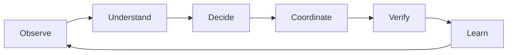
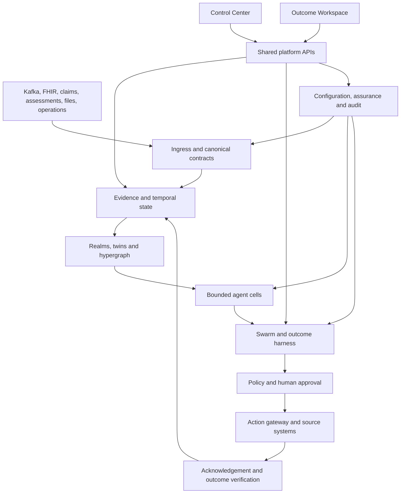
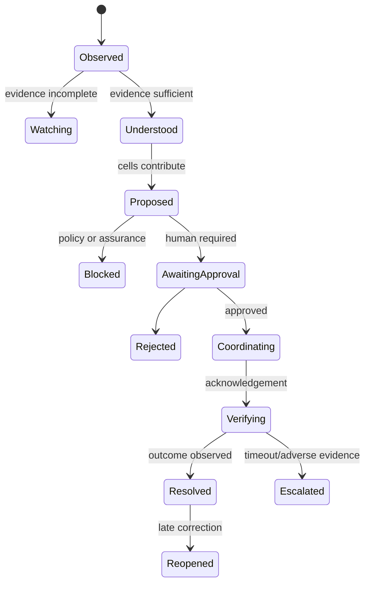
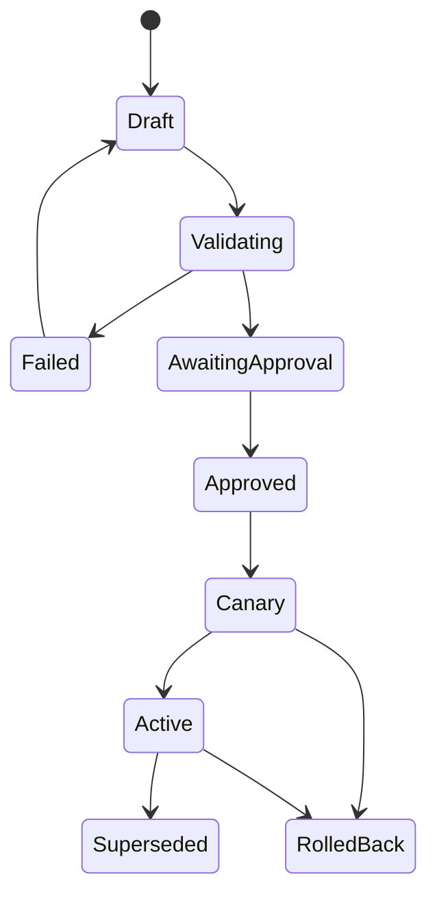

# Anant Harness

## Product requirements document: governed healthcare intelligence and outcome orchestration

| Document field | Value |
|---|---|
| Product | Anant Harness |
| Product experiences | Anant Control Center and Anant Outcome Workspace |
| Reference solution pack | Renal Swarm |
| Supported operating models | Provider, payer and hybrid |
| Architecture posture | Event-first, FHIR-aware, CMS-grounded, Kafka-backed |
| Persistence posture | SQLite-compatible demonstrator; PostgreSQL production |
| Product horizon | 2026–2039 |
| Target repository/branch | `bayyagari86/anant-harness` / `with-ode` |
| Intended readers | Product, design, domain, engineering, data, AI/ML, security, compliance, SRE and quality teams |
| Status | Authoritative product specification |
| Last updated | 2026-08-25 |

---

## 1. Executive product summary

Anant Harness is a governed healthcare intelligence and outcome-orchestration platform.

It sits above an organization’s systems of record and event infrastructure. It observes clinical, administrative, operational, assessment, claims, device and regulatory signals; constructs scoped temporal understanding; lets bounded specialist agents contribute evidence-backed proposals; applies deterministic policy and human approval; coordinates actions through existing systems; waits for acknowledgement; verifies the real-world outcome; and records everything needed to explain, replay and improve the decision.

The product has two coordinated experiences:

- **Anant Control Center** (`/admin/ui/`) is where organizations are onboarded, integrations are connected, packs and agents are configured, policies and measures are governed, adversarial tests are run, releases are approved and production is operated.
- **Anant Outcome Workspace** (`/exec/`) is where clinical, operational, payer, regulatory and executive users understand what changed, make authorized decisions, coordinate work and verify outcomes.

They are not separate products. They are two views of the same tenant, organization graph, active configuration, evidence ledger, agent runtime, outcome episodes and audit history.

Renal Swarm is the complete reference solution pack. It proves the platform can coordinate patient continuity, assessments, facility operations, quality, access, workforce, assets, revenue and CMS workflows across a large renal enterprise. The platform must then support additional provider and payer packs through configuration rather than new application forks.

### 1.1 The product promise

For every material situation, Anant answers:

1. What happened?
2. What is now true?
3. Why does it matter?
4. Which evidence supports that understanding?
5. What did each bounded agent contribute?
6. Where did agents disagree or abstain?
7. What does policy allow?
8. Which human has the decision right?
9. What action was sent to which system?
10. Was it acknowledged?
11. Did the intended outcome occur?
12. What should the organization learn or change?

A screen, alert, recommendation, message or model output that cannot answer this sequence is not a complete Anant experience.

---

## 2. Product thesis

Healthcare organizations do not need another disconnected dashboard, generic copilot or autonomous agent layer. They need a governed system that can connect fragmented evidence to accountable action and verified outcomes without replacing the systems they already trust.

Anant’s thesis is:

> Healthcare intelligence becomes valuable only when evidence, specialized reasoning, policy, human authority, execution and outcome verification operate as one replayable loop.

The durable loop is:

### 2.1 Why now

Healthcare enterprises increasingly have:

- event streams without a cross-domain outcome layer;
- FHIR access without coherent longitudinal reasoning;
- assessments containing valuable patient/member context that remains underused;
- public regulatory content that changes independently of application code;
- many specialized analytics that cannot coordinate;
- AI pilots with weak evidence, authority and operational closure;
- regulatory and safety obligations that require traceability;
- pressure to improve outcomes while lowering administrative burden.

Anant turns these ingredients into a controlled operating system for intelligence and action.

### 2.2 Differentiation

| Alternative | What it does | What Anant adds |
|---|---|---|
| EMR/claims/care-management system | Records and executes domain transactions | Cross-system evidence, reasoning, coordination and outcome verification |
| Population dashboard | Describes performance | Assigns accountable work and proves closure |
| Rules engine | Applies deterministic conditions | Temporal context, agent contributions, policy arbitration, simulation and learning |
| Generic AI copilot | Produces answers or content | Bounded authority, source evidence, typed proposals, HITL, action acknowledgement and replay |
| Agent framework | Runs tools and models | Healthcare entities, measures, realms, twins, packs, governance and business outcomes |
| Integration platform | Moves data | Interprets events into governed outcome episodes |
| Regulatory reporting tool | Calculates or submits measures | Connects source authority, operational remediation, package approval and reconciliation |

---

## 3. Product goals and non-goals

### 3.1 Goals

**G1 — Close outcomes.** Convert material signals into verified provider, payer, operational and regulatory results.

**G2 — Make AI governable.** Every agent is bounded, testable, observable, stoppable and auditable.

**G3 — Preserve evidence.** Every claim and decision resolves to permitted evidence, provenance and time.

**G4 — Work with existing estates.** Kafka, FHIR, APIs, files and source systems remain integral.

**G5 — Configure, do not recode.** Customers can onboard, add packs, edit agents/policies/measures and release behavior without redeploying application code.

**G6 — Support provider and payer models.** A common platform supports different organization structures, concepts, roles and outcomes.

**G7 — Make regulatory operations executable.** Public authority, measure logic, evidence windows, approvals, packages and receipts are one lifecycle.

**G8 — Rehearse before impact.** Simulations, counterfactuals and red/green teams precede production authority.

**G9 — Operate as a product.** Reliability, security, cost, drift, support and rollback are visible and owned.

**G10 — Remain adaptable through 2039.** Versions, effective dates, packs, schemas and compatibility gates outlive any single CMS year, model or vendor.

### 3.2 Non-goals

- Replacing EMRs, payer core systems, claims platforms or enterprise Kafka.
- Autonomous diagnosis, prescribing, treatment/order change or external regulatory submission.
- Storing secrets or unbounded PHI in the browser, logs or model prompts.
- Letting agents create arbitrary tools, topics or cross-agent communication paths.
- Treating embeddings or model output as authoritative evidence.
- Hiding synthetic/reference behavior behind “live” language.
- Shipping one hard-coded renal application.
- Supporting a third independent product UI.

---

## 4. Product principles

1. **Outcome before architecture.** Users start with accountable work, not agents, graphs or Kafka.
2. **Human authority is explicit.** Action classes and decision rights are visible before action.
3. **Backend truth, frontend intent.** Browsers render safe projections and submit intended operations.
4. **Evidence before inference.** Derived facts include source, time, scope, hash and confidence.
5. **Bitemporal history.** Preserve when a fact was true and when it became known.
6. **Agents propose; the harness governs.** No uncontrolled agent-to-agent decision chain.
7. **Deterministic where possible.** Eligibility, measures, policy, schema, reconciliation and idempotency do not depend on a language model.
8. **Fail closed, degrade clearly.** Missing authority, evidence, freshness, scope or approval blocks only the affected action and explains the next step.
9. **No production mock fallback.** Test and simulator data are explicit tenant modes.
10. **One concept, one home.** Avoid duplicated administration and contradictory dashboards.
11. **Configuration is released.** Draft, validate, test, approve, activate, monitor and roll back.
12. **Replay is a trust primitive.** Divergence is a priority-zero defect.
13. **Every action expects an acknowledgement.** “Sent” is not “done.”
14. **Every outcome can reopen.** Late or corrected evidence never requires erasing history.
15. **Safety and assurance are runtime features.** They are not documentation added after launch.

---

## 5. Target customers and buying centers

### 5.1 Provider organizations

- multi-site dialysis organizations;
- health systems and ambulatory networks;
- specialty provider groups;
- primary care and population-health organizations;
- home health and post-acute networks;
- care-management organizations;
- quality and regulatory operations teams.

### 5.2 Payer organizations

- national and regional health plans;
- Medicare Advantage and Medicaid plans;
- value-based care organizations;
- utilization and care-management teams;
- network, quality, Stars/HEDIS and payment-integrity teams;
- provider-sponsored plans.

### 5.3 Primary economic buyers

- Chief Operating Officer;
- Chief Clinical/Medical Officer;
- Chief Information/Digital Officer;
- Chief Data/AI Officer;
- Quality/Regulatory executive;
- Payer line-of-business or plan president;
- Chief Information Security/Compliance Officer.

### 5.4 Product champions

- regional/facility operations;
- care management;
- utilization management;
- quality/CMS operations;
- data/integration platform teams;
- AI governance and clinical safety;
- enterprise architecture.

---

## 6. Users, roles and jobs to be done

Roles are configurable bundles. The following are product presets, not hard-coded authorization.

### 6.1 Platform roles

| Role | Primary job |
|---|---|
| Platform Administrator | Onboard and operate tenants/environments |
| Identity and Security Administrator | Connect identity, roles, scopes and break-glass |
| Integration/Kafka Administrator | Connect and operate event/data integrations |
| Data Steward | Govern mappings, quality and lineage |
| Pack Builder | Assemble domain configuration into a solution pack |
| AI/Agent Administrator | Configure, test, release and stop agents |
| Model/Tool Administrator | Govern models, prompts, tools and credentials |
| Clinical Safety Officer | Approve safety policy and close findings |
| Regulatory/CMS Administrator | Govern sources, measures and submissions |
| Configuration Release Approver | Authorize activation and rollback |
| Auditor/Privacy Officer | Inspect access, evidence, decisions and retention |
| SRE/Operations | Monitor health, incidents, DLQ, cost and recovery |

### 6.2 Provider business roles

| Role | Job to be done |
|---|---|
| Enterprise executive | Direct attention/capital to material verified outcomes |
| Division/market leader | Coordinate cross-region constraints and accountability |
| Regional operations director | Resolve issues facilities cannot close locally |
| Facility/practice administrator | Run a safe, reliable operating day |
| Medical director | Review evidence and govern clinical decisions |
| Quality director | Move variation to evidence-backed improvement and attestation |
| Care coordinator | Coordinate patient-facing and service tasks |
| Nurse/clinician | Review clinical facts and complete authorized care work |
| Finance/revenue leader | Connect operational causes to financial outcomes |
| Biomedical/asset leader | Protect capacity through reliable assets and supplies |

### 6.3 Payer business roles

| Role | Job to be done |
|---|---|
| LOB/plan executive | Improve clinical, service, regulatory and economic outcomes |
| Market/plan leader | Coordinate market performance and network response |
| Network operations leader | Address access, adequacy, leakage and provider performance |
| Medical director | Govern clinical/utilization decisions |
| Utilization manager | Resolve authorization and utilization work |
| Case manager | Coordinate member and provider follow-up |
| Appeals supervisor | Ensure evidence-complete, timely and compliant resolution |
| Quality/Stars leader | Close care gaps and explain measure variation |
| Payment integrity leader | Review anomalies without autonomous denial |
| Actuarial/finance leader | Evaluate value, risk and cost attribution |

### 6.4 Universal user job

> “Show me the few things requiring my authority, explain them with evidence, let me take a safe action, and tell me when the real outcome is verified.”

---

## 7. Product mental model

Anant is built from durable product primitives.

### 7.1 Tenant and environment

A customer organization has isolated development, rehearsal, staging and production environments. Each environment has independent configuration, credentials, topics, data, releases and audit.

### 7.2 Organization graph

A configurable graph represents provider and payer structures.

- Provider example: enterprise → division → region → market → facility → unit/shift.
- Payer example: enterprise → line of business → state/market → plan/product → network → cohort.
- Hybrid example: both graphs joined through contracts, attribution, facilities and shared measures.

### 7.3 Realm

A realm is a governed world in which entities, people/twins, policies, time, evidence and effects coexist. Realms may represent a facility, cohort, plan, program, rehearsal or counterfactual.

### 7.4 Twin

A twin is the governed digital representation of a persona, organization, facility, plan, asset or other operational actor. It has identity, scope, perception, policy, skills, memory and effects. It is not a chatbot profile.

### 7.5 Evidence

Evidence is an immutable or content-addressed fact/source reference with tenant, subject, purpose, valid time, recorded time, provenance, integrity, classification and visibility.

### 7.6 Agent cell

A cell is a bounded specialist. It receives typed, scoped evidence; may use approved models/tools; and emits a typed proposal or abstention. It does not own the final decision.

### 7.7 Swarm

A swarm is the coordinated set of cells contributing independently to a situation. The harness records contributions, conflicts, abstentions and dependencies.

### 7.8 Next-best action

An NBA is the harness-ranked, policy-checked option presented to the authorized human. It includes expected outcome, urgency, value, evidence sufficiency, approval class and owner.

### 7.9 Outcome episode

An episode is the durable closed-loop unit connecting observation, evidence, proposals, policy, human decisions, commands, acknowledgements and verified outcome.

### 7.10 Solution pack

A pack is a versioned installable configuration of ontology, integrations, agents, workflows, policies, measures, sources, roles, UI lens, evals and migrations for a healthcare domain or business outcome.

### 7.11 Experience/lens

A lens controls terminology, navigation, summaries, work types and visual composition for a role and installed pack. It does not change underlying authorization or data truth.

### 7.12 Configuration release

A release pins every behaviorally meaningful configuration and the evidence that proved it safe to activate.

---

## 8. Product architecture

### 8.1 Six product layers

1. **Sources and telemetry** — Kafka, FHIR, HL7, claims, assessments, files, APIs, devices and public authorities.
2. **Evidence and measure substrate** — canonical events, evidence, bitemporal state, CQL/FHIR measures and provenance.
3. **Realm and twin runtime** — organization, person, facility, plan, policy, perception, memory and effect.
4. **Agent and rehearsal runtime** — bounded cells, model/tool routing, simulation, counterfactuals and evals.
5. **Outcome harness** — conflict/policy arbitration, NBAs, episodes, approvals, commands, acknowledgements and verification.
6. **Experiences and governance** — two UIs, role cockpits, configuration, assurance, audit and releases.

---

## 9. The two-product-experience model

### 9.1 Anant Control Center

**Purpose:** build, configure, prove, release and operate the platform.

Primary areas:

1. Home and onboarding
2. Organizations and environments
3. Identity, roles and access
4. Integrations and data mappings
5. Event Operations: Kafka topics, partitions, offsets, messages and DLQ
6. FHIR and interoperability
7. Knowledge and authority sources
8. Solution Pack Studio
9. Agent Studio
10. Models, prompts, tools and credentials
11. Policies, approvals and workflows
12. Measures and regulatory configuration
13. Simulator and counterfactual rehearsal
14. Green Team and Red Team
15. Releases, canaries and rollback
16. Runtime health, traces, cost and incidents
17. Audit, privacy, retention and compliance

### 9.2 Anant Outcome Workspace

**Purpose:** turn intelligence into verified business and care outcomes.

Primary areas:

1. My Work
2. Outcome Command
3. Person Intelligence
4. Provider Operations
5. Payer Operations
6. Assessment Intelligence
7. Quality and CMS Operations
8. Swarm Control
9. Agent Operations
10. AI Assurance
11. Executive Outcomes
12. Configuration Studio
13. Shared Intelligence

### 9.3 How the two experiences work together

They share:

- session identity;
- tenant/environment;
- organization scope;
- role/capability bindings;
- active solution packs and lens;
- active configuration release;
- event/evidence/outcome stores;
- agent/run/message state;
- assurance findings;
- audit and trace IDs.

Cross-console choreography:

| Control Center action | Outcome Workspace effect |
|---|---|
| Install a pack | Authorized navigation, work types and terminology appear |
| Activate an agent | Eligible events begin producing proposals |
| Change threshold/policy | New episodes resolve the active version; what-if shows expected impact first |
| Kill an agent/tool/model | Workspace shows degraded/abstention state, never silent disappearance |
| Configure topic/output/DLQ | Agent Operations shows live resolved routing |
| Approve a measure/source pack | Quality/CMS uses pinned effective version |
| Block a release through red team | Workspace remains on previous active release |
| Roll back | New work uses rollback version; existing episodes retain history |
| Open an incident | Authorized business users see impacted work and fallback |
| Resolve business outcome | Control Center observability/evals receive outcome feedback |

### 9.4 Cross-console handoff requirements

- A user with both rights sees a server-authorized console switcher.
- Handoff preserves safe identifiers: tenant, environment, scope, work/trace/release ID.
- It never puts PHI, evidence text, secrets or roles in the URL.
- “Inspect configuration” from a work item opens the exact active release/object.
- “Inspect business impact” from a configuration object opens an authorized aggregate or affected-work view.
- Unauthorized handoff fails closed and retains a safe return path.
- Both UIs use one design-token system and consistent status vocabulary.
- The older repository `ui/` is not a third product; useful behavior is consolidated into these two experiences and it is deprecated after parity.

---

## 10. Universal product loop

### 10.1 Business-visible stages

1. Detected
2. Understood
3. Needs decision
4. In progress
5. Verified

### 10.2 Detailed episode states

### 10.3 Closure contract

An episode cannot be marked resolved merely because:

- an agent responded;
- an NBA was approved;
- a task was queued;
- a message was produced;
- a downstream API returned 2xx.

Resolution requires outcome evidence matching the configured verification rule. If only delivery is acknowledged, the state is Verifying.

### 10.4 Reopening

Late, corrected or contradictory evidence appends a new transition and may reopen the episode. Prior decisions and outcomes remain intact for audit.

---

## 11. My Work and universal work-item experience

### 11.1 Default landing

Every business user lands on **My Work**, not a dashboard or architecture module.

My Work is a prioritized, role-scoped queue combining:

- urgency;
- expected outcome/value;
- decision right;
- due/SLA;
- evidence readiness;
- dependency status;
- escalation level;
- organization scope.

### 11.2 Work item content

Each item shows:

- plain-language title;
- outcome at risk;
- affected person/population/facility/plan;
- stage;
- urgency/due time;
- owner;
- value or impact;
- why assigned to this user;
- one clear next action.

### 11.3 Universal detail

Every actionable card, KPI, graph node, alert, agent, message, episode, measure, organization, source, release and DLQ row opens an addressable detail surface.

Required tabs/sections:

1. Overview
2. Why this matters
3. Evidence
4. Agent contributions and conflicts
5. Policy and authority
6. Activity timeline
7. Decision/actions
8. Execution and acknowledgement
9. Outcome and value
10. Assurance, configuration, cost and replay

### 11.4 Action standard

Every action:

- comes from server-authorized capabilities;
- states expected effect and action class;
- requires reason for reject, override, replay, break-glass or destructive behavior;
- uses an idempotency key;
- creates a durable decision/command;
- shows owner and acknowledgement expectation;
- remains visible until verified, rejected or escalated;
- appends audit.

No UI action may imply business completion using local component state alone.

---

## 12. Customer onboarding product journey

Onboarding is a resumable, gated product workflow in Control Center.

### Step 1 — Customer and environment

Configure:

- legal/display identity;
- provider, payer or hybrid model;
- environments;
- deployment/hosting;
- region/residency;
- timezone;
- retention/legal hold;
- support and incident contacts.

**Exit:** tenant/environment exists with isolated IDs and audit.

### Step 2 — Organization graph

Choose template, import or construct hierarchy.

Provider templates include enterprise, division, region, market, facility/practice, unit/service line and shift.

Payer templates include enterprise, LOB, market/state, plan/product, network, group and cohort.

**Exit:** graph validates parentage, dates, external IDs and scope boundaries.

### Step 3 — Identity and decision rights

Connect OIDC/SAML/SCIM or use labeled local demo identity.

Map groups to:

- product role bundles;
- organization scopes;
- clearance;
- purpose of use;
- action classes;
- approval rights;
- console access;
- break-glass policy.

**Exit:** deny-by-default, separation-of-duties and sample-access tests pass.

### Step 4 — Event and data integrations

Configure Kafka, FHIR, claims/files/APIs and operations sources.

**Exit:** authentication, connectivity, schema/mapping, scope and read-only canary tests pass.

### Step 5 — Knowledge and public authority

Subscribe to CMS and other public sources. Configure freshness, credential bindings and effective-date rules.

**Exit:** source artifacts are hashed, versioned, current and bound to intended packs.

### Step 6 — Install solution packs

Select renal or other provider/payer packs. Preview:

- dependencies;
- organization concepts;
- topics and mappings;
- agents;
- workflows;
- measures/sources;
- policies and approvals;
- UI lens;
- expected storage/cost;
- required roles;
- eval and red-team suites.

**Exit:** dependencies resolve without cross-pack conflict.

### Step 7 — Configure agents and workflows

Review generated/default manifests, topics, models, tools, thresholds, action classes, owners and fallback.

**Exit:** every active agent has valid typed inputs, output topic, DLQ, eval gate, owner and kill switch.

### Step 8 — Rehearse

Launch isolated deterministic scenario with labeled synthetic data. Run provider/payer/pack golden journeys and counterfactuals.

**Exit:** expected episodes close and results are replayable.

### Step 9 — Green/red/integration gates

Run required release suites.

**Exit:** no blocking finding; live integrations distinguish contract-only from connected verification.

### Step 10 — Approve and activate

Choose canary scopes, activation window, rollback target and approvers.

**Exit:** active release hash is confirmed by runtime.

### Step 11 — Handoff to business users

Invite/map roles, preview role journeys, open Outcome Workspace.

**Exit:** each launch persona sees relevant My Work and completes a first safe task.

### Step 12 — Operate and improve

Monitor adoption, outcomes, failures, drift, cost and source freshness. Configuration changes repeat the governed release lifecycle.

---

## 13. Solution Pack Studio

### 13.1 Product purpose

Pack Studio lets authorized teams turn a domain or business outcome into an installable, governable product configuration without forking Anant.

### 13.2 Pack contents

A pack may define:

- metadata, ownership and compatibility;
- organization templates;
- terminology/lens;
- entity and relationship types;
- canonical event bindings;
- FHIR/claims/file mappings;
- assessment instruments and extraction policies;
- agent manifests;
- workflows and outcome definitions;
- policies, action classes and approvals;
- authority sources and measures;
- dashboard/workspace compositions;
- simulations and golden data;
- green/red/eval suites;
- migrations and rollback.

### 13.3 Pack lifecycle

`Draft → Validate → Rehearse → Review → Publish → Install → Configure → Activate → Monitor → Upgrade/Roll back → Retire`

### 13.4 Pack requirements

- semantic versioning;
- signed/content-addressed artifact;
- dependency and compatibility range;
- explicit data/PHI needs;
- no embedded secrets;
- no unrestricted tool/model authority;
- source/measure effective dates;
- installation preview;
- migration and rollback;
- test coverage;
- support owner and runbook;
- license/provenance metadata.

### 13.5 Cross-pack behavior

Packs may share platform sources, entities, models and tools. Conflicts are explicit:

- terminology conflicts are lens-scoped;
- policy conflicts use deny-wins unless an approved precedence exists;
- event bindings require compatible schemas;
- agents cannot duplicate action ownership silently;
- measures remain independently versioned;
- pack uninstall is blocked while active episodes/dependencies exist.

### 13.6 No-redeploy requirement

Creating, installing, configuring, activating, upgrading and rolling back a pack must not require rebuilding frontend/backend binaries unless the pack requests a genuinely new platform capability.

---

## 14. Renal Swarm reference pack

Renal Swarm is the golden pack against which product completeness is judged.

### 14.1 Scope

- enterprise renal topology;
- patient–facility–measure–intervention–outcome relationships;
- facility digital twins;
- cross-facility patterns and clusters;
- emerging-risk propagation;
- regulatory impact maps;
- swarm contribution/dependency views;
- policy/threshold what-if simulation;
- patient voice and assessments;
- provider operations and CMS workflows.

### 14.2 Renal roles

- EVP/COO;
- Division Vice President;
- Regional Operations Director;
- Facility Administrator;
- Medical Director;
- Quality Director;
- Finance leader;
- Biomedical leader;
- care coordinator;
- authorized clinical reviewer;
- platform roles.

### 14.3 Renal cells

1. Hospital Transition
2. Treatment Continuity
3. Assessment Intelligence
4. Facility Capacity
5. Access Surveillance
6. CMS Readiness
7. Workforce Resilience
8. Growth and Demand
9. Clinical Quality
10. Experience and Equity
11. Revenue Cycle
12. Asset Reliability

Each cell is bounded and emits proposals only.

### 14.4 Renal outcome families

- post-discharge treatment continuity;
- missed/at-risk treatment;
- transportation and schedule barriers;
- vascular access review;
- catheter reduction improvement;
- chair/machine/staff capacity;
- workforce coverage;
- asset maintenance;
- quality variation;
- patient experience/equity;
- referral and demand capacity;
- clean-claim/revenue integrity;
- ESRD CMS/QIP readiness and submission.

### 14.5 Reference renal closed loop

1. ADT discharge event arrives through Kafka/FHIR adapter.
2. Assessment answer indicates transportation/schedule constraint.
3. Bitemporal patient/facility state updates.
4. Transition, continuity, assessment, capacity and experience cells run.
5. Agents contribute evidence-backed proposals and one conflict.
6. Harness applies action policy and ranks a Class B NBA.
7. Facility Administrator receives My Work assignment.
8. User inspects exact evidence, contributions and policy.
9. User approves chair/transport coordination.
10. Command enters transactional outbox and Kafka.
11. Scheduler/transport system acknowledges.
12. Treatment attendance arrives.
13. Episode verifies/resolves.
14. Operational, quality, patient and economic outcomes update.
15. Trace/eval feedback informs monitoring.
16. A late correction can reopen and replay the episode.

A build that cannot demonstrate every step is not a complete renal pack.

---

## 15. Generic provider product requirements

The provider platform must support multiple packs using the same primitives.

### 15.1 Provider outcome catalog

| Outcome family | Example packs |
|---|---|
| Transitions and continuity | renal, hospital-to-home, primary care, oncology |
| Access and scheduling | specialty access, ambulatory, urgent care |
| Capacity and flow | dialysis, ED throughput, infusion, imaging |
| Quality and safety | infection, readmission, medication, chronic disease |
| Assessments and patient voice | behavioral health, SDOH, PROs, experience |
| Workforce and assets | staffing, credentialing, biomed, supplies |
| Revenue integrity | clean claims, eligibility, coding, denials prevention |
| Regulatory | CMS quality, facility reporting, accreditation |
| Growth/demand | referral conversion, network demand, service-line planning |

### 15.2 Provider closed-loop requirement

Every provider pack must prove at least:

- one person-level care/coordination episode;
- one operational/facility episode;
- one quality/regulatory episode;
- one cross-scope escalation;
- one acknowledgement timeout;
- one late correction/reopen;
- one red-team block;
- one configuration change without redeploy.

---

## 16. Generic payer product requirements

### 16.1 Payer concepts

- member/person;
- line of business;
- plan/product/benefit;
- provider/network/facility;
- claim/encounter;
- authorization/utilization review;
- appeal/grievance;
- care gap;
- case/program;
- quality measure;
- contract/value-based arrangement;
- risk and cost;
- communication and consent.

### 16.2 Payer outcome catalog

| Outcome family | Example |
|---|---|
| Care-gap closure | evidence-based outreach and verified service |
| Transitions | post-discharge follow-up and medication reconciliation |
| Utilization | evidence-complete human review |
| Authorization | policy/evidence reconciliation and timely decision |
| Appeals | complete packet, SLA and resolution |
| Network access | adequacy, appointment access and leakage |
| Quality/Stars | measure gaps, interventions and verified closure |
| Payment integrity | anomaly review without autonomous denial |
| Member experience/SDOH | cited barriers and coordinated follow-up |
| Value-based performance | provider/contract outcomes and attribution |

### 16.3 Reference payer closed loop

1. Claim/authorization/care-gap event arrives.
2. Member, benefit, plan, provider/network and measure context resolves.
3. Quality, utilization, network and assessment cells contribute.
4. Policy checks jurisdiction, benefit, clinical-review and communication rules.
5. Case manager or medical director receives the work.
6. Authorized decision creates a case/provider/member action.
7. Existing payer system acknowledges.
8. Provider/member response or subsequent claim/event verifies outcome.
9. Quality, utilization, network and economic measures update.
10. Failure, correction and appeal can reopen the episode.

### 16.4 Payer safety boundary

- No autonomous denial, adverse benefit determination or clinical decision.
- High-impact utilization/authorization/appeal outcomes require authorized human review.
- Payment-integrity agents prepare evidence and review tasks, not payment holds.
- Cross-plan/member evidence is denied by default.

---

## 17. Functional module requirements

### 17.1 Outcome Command

**Purpose:** resolve active care, service, operational and regulatory episodes.

Must provide:

- prioritized episode board;
- state/owner/SLA;
- evidence sufficiency;
- proposals/conflicts;
- policy and action class;
- approval and command state;
- acknowledgement/outcome;
- escalation/reopen;
- batch action only where policy and evidence permit;
- complete audit/replay.

### 17.2 Person Intelligence

**Purpose:** understand temporal change for a patient or member.

Must provide:

- longitudinal bitemporal timeline;
- encounters/claims/assessments/interventions;
- active episodes and work;
- measures/care gaps;
- attributed provider/plan/facility;
- exact evidence where authorized;
- corrections/supersession;
- relationship- and purpose-based redaction.

The server assembles person context. The browser never joins raw data.

### 17.3 Provider Operations

**Purpose:** manage facilities, practices, capacity, schedules, workforce and assets.

Must provide:

- enterprise/facility topology;
- facility digital twin;
- capacity, late arrivals, staff and asset state;
- cross-facility clusters;
- emerging risk propagation;
- safe scenario simulation;
- governed plan proposal and acknowledgement;
- no silent production schedule mutation.

### 17.4 Payer Operations

**Purpose:** manage plan, member, network, authorization, case and quality operations.

Must provide:

- LOB/plan/network topology;
- work/case aging;
- access and adequacy;
- utilization/authorization trends;
- care gaps and outreach;
- provider contract/quality views;
- policy/jurisdiction impact;
- governed task/decision workflows.

### 17.5 Assessment Intelligence

**Purpose:** turn structured and unstructured answers into safe, cited evidence.

Must provide:

- instrument/question/version;
- exact answer/span;
- respondent/channel/language;
- valid/recorded time;
- structured deterministic mappings;
- cited candidates for free text;
- negation, temporality, uncertainty and attribution;
- model/prompt/rule version;
- confidence/abstention;
- human confirm/correct/reject;
- downstream effects and replay.

Assessment content is untrusted. Embedded instructions never become system/tool instructions.

### 17.6 Quality and CMS Operations

**Purpose:** manage measures, sources, readiness, packages, approvals, submission and reconciliation.

Must provide:

- authority registry;
- proposed/final/effective/superseded states;
- source freshness and hash;
- measure/library/value-set provenance;
- denominator/numerator/exclusion evidence;
- mapping/data-quality gaps;
- freeze/calculation/validation/reconciliation;
- dual approval;
- content-addressed package;
- certified transmission gate;
- receipt/rejection/resubmission;
- exact retained dossier.

Reference mode must stop before live transmission and say why.

### 17.7 Swarm Control

**Purpose:** understand specialist intelligence and cross-system patterns.

Must provide:

- eligible/running/completed/timed-out/abstained cells;
- proposals and evidence;
- conflicts and dependencies;
- fused/ranked NBAs;
- cross-facility/network/cohort patterns;
- emerging-risk propagation;
- regulatory impact map;
- threshold/policy what-if;
- create governed episode from an insight;
- no direct agent-to-agent authority.

### 17.8 Agent Operations

**Purpose:** operate agents and their message fabric.

Must provide a dense overall page:

- runtime and broker health;
- all agents and statuses;
- single/multi-topic inputs;
- partitions, key and consumer group;
- shared/dedicated outputs;
- throughput/lag/retry/DLQ;
- recent messages and runs;
- proposals, abstentions and conflicts;
- model/tool/cost/latency;
- trace and evidence;
- pause/kill/replay according to capability.

### 17.9 AI Assurance

**Purpose:** prove models, agents, tools, packs and releases are safe and performant.

Must provide:

- eval suites and thresholds;
- green-team results;
- red-team scenarios/findings;
- groundedness/citation coverage;
- drift;
- policy blocks and overrides;
- model/tool availability;
- token/cost/latency;
- incident and remediation;
- retest and independent closure;
- release gate and kill switches.

### 17.10 Executive Outcomes

**Purpose:** show clinical/quality, operational, regulatory and economic outcomes.

Must provide:

- material movements;
- enterprise hierarchy rollups;
- provider/payer lens;
- attributed interventions and configuration;
- realized versus expected value;
- delegated initiatives;
- outcome confidence and limitations;
- privacy-preserving drill-down;
- no celebration of agent activity as business value.

### 17.11 Configuration Studio

**Purpose:** see and govern behavior changes.

Must provide:

- configuration object catalog;
- current versus draft diff;
- dependency and impact graph;
- policy/threshold simulation;
- validation/eval status;
- approvers;
- activation/canary/rollback;
- active runtime hash;
- no direct secret values.

Business roles may inspect relevant configuration but edit only with platform capability.

### 17.12 Shared Intelligence

**Purpose:** capture and explore institutional knowledge and dependencies.

Must provide:

- Obsidian-style saved canvases;
- typed temporal healthcare hypergraph;
- person/facility/plan/measure/intervention/outcome relations;
- pack/source/agent/model/tool/policy/eval dependencies;
- scope-aware access;
- source/evidence inspection;
- notes, comments, citations and versions;
- what-if entry points;
- keyboard-accessible table/tree alternative to Three.js.

---

## 18. Control Center functional requirements

### 18.1 Home

Show:

- onboarding/release/runtime status;
- blocking gates;
- incidents/DLQ/source staleness;
- active release and rollback;
- suggested next administrative task;
- safe handoff to Outcome Workspace.

### 18.2 Integration Center

Support:

- Kafka;
- FHIR;
- HL7/event streams;
- files/SFTP;
- claims/X12;
- APIs/webhooks;
- public authority/knowledge adapters.

Every integration has connection mode, credentials reference, data class, scope, owner, last test, health, runbook and dependent packs.

### 18.3 Event Operations

Support:

- broker/bridge;
- topic discovery;
- contracts/schema registry;
- partition plans;
- message-key and ordering policy;
- consumer groups/offsets/replay;
- output topic reconciliation;
- messages, lag, retries and DLQ;
- canary tests;
- audited replay.

Input topics are verified, not silently created. Approved output/DLQ topics may be reconciled by the organization bridge.

### 18.4 Pack Studio

Support:

- create/clone/import;
- ontology and terminology;
- mappings;
- agents/workflows/policies;
- measures/sources;
- UI lens;
- simulations/evals;
- dependency/impact;
- package/publish/install/upgrade/rollback.

### 18.5 Agent Studio

Support:

- create/clone/version;
- bounded responsibility and owner;
- one/multiple topic triggers;
- partition/key/filter/correlation;
- evidence needs/freshness;
- deterministic/model/hybrid mode;
- model/prompt/rule/fallback;
- tool allowlist;
- typed proposal schema;
- threshold/abstention;
- action class/HITL;
- budgets/rate limits;
- output topic/DLQ;
- isolated test;
- eval/red team;
- release, pause, kill and rollback.

### 18.6 Policy and Workflow Studio

Support:

- action classes;
- role/capability approvals;
- deny-by-default policies;
- jurisdiction/effective dates;
- SLA/escalation;
- outcome definitions/verification;
- command and acknowledgement adapters;
- deterministic simulation;
- versioning/release.

### 18.7 Release Center

Support:

- immutable release manifest;
- object/dependency diff;
- schema/green/red/integration/promotion suites;
- findings;
- separation of duties;
- canary scopes;
- activation window;
- rollback;
- runtime confirmation;
- historical replay.

---

## 19. Kafka and messaging requirements

### 19.1 Inbound binding

Each binding specifies:

- tenant/environment;
- topic;
- contract/version;
- consumer group;
- all partitions or explicit allowlist;
- key strategy;
- ordering scope;
- offset initialization;
- replay window;
- event-time skew;
- maximum in flight;
- retry/backoff/max attempts;
- deduplication/idempotency;
- classification/redaction;
- owning pack/agent.

### 19.2 Intelligent partition handling

The runtime:

1. reads topic, partition, offset and key;
2. validates the configured contract;
3. validates tenant/scope and key semantics;
4. preserves ordering where required;
5. deduplicates business events;
6. routes only to eligible scoped agents;
7. records admission/rejection;
8. retries bounded failures;
9. sends poison events to DLQ;
10. supports audited replay.

Suggested stable keys:

- provider person: tenant + patient;
- provider operations: tenant + facility;
- payer member: tenant + plan + member;
- episode: tenant + episode;
- submission: tenant + submission.

### 19.3 Agent outputs

Every active agent resolves exactly one output:

- shared `anant.agent.output.v1`; or
- dedicated `anant.agent.<agent-id>.output.v1`.

Related product topics include:

- `anant.agent.output.dlq.v1`;
- `anant.action.command.v1`;
- `anant.action.ack.v1`;
- `anant.outcome.state.v1`;
- `anant.assurance.event.v1`.

### 19.4 DLQ user journey

1. Retry exhausts.
2. Durable DLQ record retains safe original metadata, error, trace and payload hash/pointer.
3. Control Center assigns owner and severity.
4. Operator inspects schema/key/partition/config and related outcome.
5. Operator chooses retry unchanged, repair metadata, quarantine or reject.
6. Risky repair/replay requires approval and reason.
7. Replay uses a new delivery ID and original business idempotency key.
8. System proves no duplicate effect.
9. Record closes or escalates.

---

## 20. FHIR, evidence and data-quality requirements

### 20.1 FHIR

Support:

- CapabilityStatement discovery;
- tenant/auth headers;
- resource/profile inventory;
- ingest/export;
- subscriptions/polling/bulk;
- canonical mappings;
- identifier and organization resolution;
- bundle transaction semantics;
- correction/deletion handling;
- CDS hooks only within policy;
- provenance and raw pointer;
- read/write capability separation.

FHIR emulator data is labeled rehearsal data and never used as production fallback.

### 20.2 Data quality

Track:

- completeness;
- validity;
- conformance;
- timeliness;
- uniqueness;
- referential integrity;
- scope/identity resolution;
- temporal consistency;
- source freshness;
- reconciliation status.

Data-quality defects may block a proposal, measure, action or submission while leaving unaffected workflows available.

### 20.3 Bitemporal evidence

Every mutable real-world fact preserves:

- valid-from/to;
- recorded-at;
- supersession;
- original source;
- configuration used for derivation.

Current-state UI always provides an “as of” inspection path.

---

## 21. Agent, model and tool governance

### 21.1 Agent manifest

Required:

- ID/name/version;
- pack/domain;
- business owner/support owner;
- bounded purpose;
- mode;
- trigger bindings;
- evidence/context permissions;
- model/router/prompt/rule;
- tools and schemas;
- proposal types;
- confidence/abstention;
- action class;
- time/step/token/cost/rate budgets;
- fallback;
- output/DLQ;
- eval/red-team suites;
- kill switch;
- rollback;
- runbook.

### 21.2 Model gateway

- Provider-neutral routing.
- No browser-supplied endpoints/keys.
- Credential bindings resolved server-side.
- HTTPS and allowlisted providers.
- PHI excluded unless explicit approved policy.
- Structured output and schema validation.
- Request storage disabled where supported.
- Model/prompt/version recorded.
- Failover and deterministic fallback explicit.
- Evaluation score and cost gate before activation.

### 21.3 Tools

- strict input/output schemas;
- allowlist by agent/tenant/environment;
- scope/purpose validation;
- read versus write separation;
- time/output/rate bounds;
- tool call audit;
- HITL before high-impact write;
- MCP endpoints HTTPS, credential-bound and allowlisted.

### 21.4 Progressive authority

Agents begin with observation/proposal authority. Production action authority increases only through explicit policy and evidence. Clinical/high-impact/external actions never become fully autonomous.

---

## 22. Assessment requirements

Structured and unstructured answers are first-class evidence.

Required pipeline:

1. validate tenant/person/instrument/question;
2. preserve immutable source and exact value;
3. treat text as untrusted;
4. normalize language/encoding;
5. use person-scoped retrieval;
6. extract cited candidates;
7. test negation, time, uncertainty and attribution;
8. schema validate;
9. apply confidence/abstention;
10. request human confirmation when needed;
11. record reviewer decision;
12. re-evaluate dependent episodes/measures.

Prompt injection in assessment text must be a required red-team case for every language-capable pack.

---

## 23. CMS and public-authority requirements

### 23.1 Authority registry

Record:

- authority/jurisdiction;
- document/source type;
- official URL;
- proposed/final/effective/superseded status;
- publication/effective windows;
- retrieved time;
- content hash;
- cadence/freshness;
- credentials;
- dependent packs/measures;
- approval.

### 23.2 Measures

- Real CQL/FHIR evaluation where applicable.
- Measure/library/value-set/source provenance.
- Exact population membership evidence.
- Version/effective-date coexistence.
- Golden-set parity.
- Mapping-change impact analysis.
- Proposed source never activates a final submission.

### 23.3 Submission lifecycle

`Draft → Evidence frozen → Calculated → Validated → Reconciled → Awaiting approval → Ready → Submitted → Accepted/Rejected → Corrected/Resubmitted`

A submission is Class D. Live transmission requires:

- certified connector;
- credentials;
- network/security;
- dual approval;
- matching package hash;
- active source/measure pack;
- audit and support ownership.

The product retains package, frozen evidence snapshot, approvals and receipt.

---

## 24. Facility, provider, payer and policy simulations

Simulation is isolated from production.

Users can vary:

- policy thresholds;
- staffing;
- chair/bed/room capacity;
- machine/assets;
- schedules;
- demand;
- benefit/network constraints;
- agent confidence;
- source/measure version;
- workflow SLA.

Simulation must show:

- baseline and variant;
- assumptions;
- affected population;
- clinical/quality, operational, equity, regulatory and economic deltas;
- conflicts/policy violations;
- uncertainty;
- configuration hash.

“Apply” creates a governed proposal/release; it does not mutate production directly.

---

## 25. Configuration and release requirements

### 25.1 Configurable objects

- tenant/environment;
- organization and roles;
- integrations/mappings;
- topic plans;
- packs/lenses;
- agents/models/prompts/tools;
- policies/thresholds;
- workflows/outcome verification;
- sources/measures;
- UI composition/branding;
- eval/red-team suites;
- alerts/retention.

### 25.2 Release state

### 25.3 Activation semantics

- Activation atomically changes active release pointer.
- New events resolve active release at admission.
- In-flight episodes retain pinned release unless governed migration.
- Prior release remains rollback/replay target.
- Runtime confirms the active hash.
- “Deployed” is not shown until runtime confirmation.
- Customer configuration does not require code redeploy.

---

## 26. Assurance requirements

### 26.1 Green team

- provider and payer happy paths;
- schema/contract compatibility;
- FHIR mapping;
- assessment golden set;
- measure parity;
- policy expected decisions;
- action acknowledgement;
- outcome closure;
- deterministic replay;
- latency, scale, cost and resilience.

### 26.2 Red team

Required threats:

- prompt/tool injection;
- cross-person/facility/plan/tenant leakage;
- role/action/approval bypass;
- poisoned FHIR/files;
- duplicate/out-of-order/stale/corrected/poison Kafka;
- wrong key/partition/offset reset;
- schema drift;
- hallucinated/missing citations;
- stale/conflicting authority;
- unsafe clinical proposal;
- external-submission tampering;
- model/tool/provider outage;
- DLQ flood/replay duplication;
- budget/rate exhaustion;
- aggregate re-identification;
- break-glass abuse;
- pack dependency/supply-chain tampering.

### 26.3 Finding lifecycle

`Open → Assigned → Remediating → Retest failed/passed → Independent review → Closed`

Critical/high findings block release. Medium risk acceptance requires named approver, reason and expiry. Findings cannot be deleted.

### 26.4 Runtime assurance

Monitor:

- groundedness/citation;
- abstention/override;
- policy blocks;
- drift;
- tool/model errors;
- latency/cost;
- Kafka lag/retry/DLQ;
- approval/action/ack time;
- episode aging/reopen;
- outcome verification;
- replay divergence.

Kill switches exist for agent, model, tool, pack, tenant and environment.

---

## 27. Security, privacy and compliance

- Browser is untrusted.
- Server validates identity, role, scope, relationship, purpose, time and action class.
- Role visibility is not authorization.
- PHI is minimized in model context, logs, URLs and exports.
- Exact assessment text is redacted by capability.
- Secrets are binding references; values never persist in product configuration or return to browser.
- Mutations require same-origin/session, JSON, bounded size and idempotency.
- Cross-scope resource existence is not disclosed.
- Break-glass is time-bound, reasoned, notified and reviewed.
- Aggregates use re-identification/minimum-cell controls.
- Audit records actor, reason, config, trace and before/after references.
- Retention, legal hold, DSAR/deletion and audit export are configurable.
- External adapters use independent credentials and allowlists.
- Class C clinical communication/review requires authorized human.
- Class D treatment/order/submission requires dual approval and source-system control.
- Customer-owned keys/private networking/BAA/certification remain production deployment gates.

---

## 28. UX and design requirements

### 28.1 Experience qualities

- Outcome-led.
- Role-specific.
- Calm under pressure.
- Evidence-visible.
- Dense but scannable.
- Clear about authority.
- Honest about uncertainty and data mode.
- Consistent across both UIs.
- Accessible and keyboard operable.
- Fast enough for operational work.

### 28.2 Status vocabulary

Use consistent labels:

- data: live-connected, public authority, synthetic, contract-only, unavailable;
- work: detected, understood, needs decision, in progress, verified;
- system: healthy, degraded, blocked, unavailable;
- release: draft, failed, awaiting approval, canary, active, rolled back;
- evidence: source, derived, confirmed, corrected, rejected;
- agent: active, paused, killed, degraded, abstained, failed.

Never use color alone.

### 28.3 Interaction rules

- One dominant action per task state.
- Progressive disclosure: outcome first, technical trace later.
- Persistent scope/environment/data-mode indicator.
- Visible owner and SLA.
- Durable success/failure state, not toast-only.
- Confirmation for replay, override, break-glass, destructive and external actions.
- Identifier-only deep links.
- No PHI in browser storage.
- URL restores safe view/work/trace context.
- Loading contains no fake values.
- Empty state explains why and freshness.
- Backend failure never falls back to demo data.

### 28.4 Accessibility

Meet WCAG 2.2 AA:

- semantic structure;
- visible focus;
- screen-reader names/status;
- keyboard tables/dialogs/canvas alternative;
- contrast;
- reduced motion;
- non-color status;
- zoom/reflow;
- accessible chart summaries;
- error association.

### 28.5 Large-screen and mobile

Laptop and command-center screens support full operation. Mobile supports safe triage, evidence review and approvals but may defer complex configuration/graph authoring; it must never hide evidence required to approve.

---

## 29. Backend and data requirements

### 29.1 Existing platform assets

The current backend already provides valuable product foundations:

- Fastify APIs;
- sessions, OIDC/WorkOS/SCIM, invites and break-glass;
- organization/onboarding/settings;
- SQLite/PostgreSQL stores;
- event broker abstractions, Kafka and transactional outbox;
- FHIR R4 ingestion/export/mapping/subscriptions;
- measures/CQL/CMS readiness;
- knowledge registry/adapters/provenance;
- realms, twins, hypergraph, policy, episodes, snapshots/replay;
- agent authoring/runtime/models/tools;
- swarm cells/insights/NBAs/outcomes;
- simulator/counterfactual;
- audit, webhooks, alerts, retention, cost and observability.

The product work composes these into coherent journeys. It must not replace functioning domain services with frontend mocks.

### 29.2 Experience APIs

The backend exposes role/scope/pack-aware projections:

- context/navigation/capabilities;
- My Work;
- universal work detail;
- typed actions;
- episodes;
- person/member timelines;
- provider/payer operations;
- measures/submissions;
- agent operations/messages/DLQ;
- assurance;
- outcomes;
- hypergraph/canvases.

The browser sends identifiers and intent, not authoritative evidence or roles.

### 29.3 API standards

- versioned contracts;
- OpenAPI/AsyncAPI validation;
- stable cursor pagination;
- deterministic sort;
- bounded filtering;
- idempotency on mutations;
- optimistic concurrency on configuration;
- long-running operation IDs;
- trace ID;
- safe structured errors;
- freshness and active configuration version;
- no credentials/raw unrestricted payloads.

### 29.4 Persistence

Logical contracts run on SQLite and PostgreSQL:

- text IDs;
- ISO timestamps;
- integer basis points/flags;
- validated JSON-as-text where portability matters;
- no required PostgreSQL-only type in portable migrations.

Production can add JSONB indexes, row-level security and partitioning without changing product contracts.

---

## 30. Observability and reliability

Every trace connects:

`event → evidence → state → agent run → proposal → policy → approval → command → acknowledgement → outcome → measure/value`

### 30.1 Required operating views

- API/store/broker/source/model/action-adapter health;
- ingest and validation;
- Kafka lag/retry/DLQ;
- outbox pending/dead;
- agent runs/timeouts/abstention/cost;
- approval/action/ack aging;
- episode aging/reopen;
- source freshness;
- measure/submission;
- drift/eval regression;
- access denials/anomalies;
- configuration release and rollback.

### 30.2 Reliability invariants

- no acknowledged event silently lost;
- no duplicate business effect;
- no command without required approval;
- no cross-tenant evidence access;
- no accepted submission without matching receipt;
- no unreported replay divergence;
- no false “healthy” when critical dependency is down;
- degraded dependencies show controlled fallback/abstention.

### 30.3 Recovery

Runbooks and product operations cover:

- broker outage;
- FHIR/source outage;
- model/tool outage;
- schema drift;
- stale authority;
- outbox backlog;
- DLQ surge;
- slow acknowledgements;
- incorrect configuration activation;
- database restore;
- tenant/security incident;
- external submission rejection.

---

## 31. Product analytics and success metrics

### 31.1 North-star metric

**Verified Outcome Closure Rate:** percentage of material episodes that reach verified outcome within the configured SLA, with complete evidence and audit.

This is segmented by pack, outcome type, role, organization scope and risk class.

### 31.2 Outcome-loop metrics

- time to detect;
- time to understand;
- time awaiting decision;
- time to coordinate;
- time to acknowledgement;
- time to verified outcome;
- escalation/reopen rate;
- stale work rate;
- acknowledgement failure;
- duplicate-effect rate.

### 31.3 Intelligence quality

- evidence sufficiency;
- citation coverage;
- groundedness;
- abstention;
- disagreement/conflict;
- human acceptance/correction/rejection;
- false-positive/false-negative on golden sets;
- drift;
- replay parity.

### 31.4 Product adoption

- onboarding completion time;
- time to first verified outcome;
- pack install/upgrade time;
- active roles;
- My Work completion;
- cross-console handoff success;
- drill-down/action completion;
- admin self-service rate;
- configuration changes without code/redeploy.

### 31.5 Operational and economic value

Pack-specific:

- treatments/care gaps/appointments protected;
- capacity recovered;
- quality gap closure;
- submission defect reduction;
- administrative time reduced;
- revenue/payment integrity;
- avoided rework;
- value realized versus expected.

Attribution must state confidence and cannot assign all improvement to AI activity.

### 31.6 Guardrail metrics

- safety findings;
- unauthorized attempt;
- PHI/log incident;
- policy override;
- break-glass use;
- cost per verified outcome;
- alert/workload burden;
- equity regression;
- model/tool/vendor concentration.

---

## 32. End-to-end product journeys

### 32.1 Journey 1 — New customer to first outcome

Platform admin creates provider/payer tenant → organization/identity/integrations configured → pack installed → agents/topics/policies/measures reviewed → rehearsal passes → red/green gates pass → release approved/activated → business user lands on My Work → takes governed action → acknowledgement arrives → outcome verifies → admin sees healthy trace and business value.

### 32.2 Journey 2 — Pack builder to installed pack

Builder creates/compiles pack → maps ontology/events/assessments → adds agents/workflows/policies/measures/lens → runs validation/rehearsal/red team → publishes signed version → customer previews dependencies/data/authority → installs/configures → releases → monitors outcomes → upgrades/rolls back.

### 32.3 Journey 3 — Agent administrator

Create/clone agent → configure single/multi-topic partitions/keys → define evidence/model/tools/proposals/budgets/action class/output/DLQ → isolated test → inspect trace → run eval/red team → add to release → approve/activate → observe messages/outcomes → pause/kill/rollback if unsafe.

### 32.4 Journey 4 — Renal continuity

Discharge + assessment → temporal state → multiple renal cells → conflict/policy → FA decision → chair/transport command → acknowledgement → treatment attendance → verified outcome → measure/value update → possible late reopen.

### 32.5 Journey 5 — Provider operational twin

Capacity/staff/asset signal → facility state → capacity/workforce/asset cells → what-if fork → operator compares safe variants → approves plan → scheduler/work system ack → capacity/treatment result → verification.

### 32.6 Journey 6 — Assessment review

Answer → deterministic/cited extraction → injection/negation/time/scope checks → abstain or candidate → authorized human confirm/correct/reject → dependent episodes re-evaluate → audit.

### 32.7 Journey 7 — Payer care gap/utilization

Claim/auth/care-gap → member/plan/network state → payer cells → benefit/jurisdiction policy → case manager/medical review → existing system action → acknowledgement → service/claim/outcome → quality/cost update.

### 32.8 Journey 8 — CMS submission

Authority/source → measure gap → evidence reconciliation → freeze → calculate → validate → dual approve → certified transmit or explicitly stop in reference mode → receipt/rejection → correct/resubmit → final reconciliation.

### 32.9 Journey 9 — DLQ recovery

Poison/failure → bounded retries → DLQ → owner diagnosis → repair/quarantine/reject → approved replay → idempotency proof → episode resumes or remains escalated → close finding.

### 32.10 Journey 10 — Red-team remediation

Release runs required adversarial suite → failure/findings → activation blocked → owner remediates → exact retest + regression → independent close → release re-evaluates → canary/activate.

### 32.11 Journey 11 — Executive delegation

Executive sees material outcome movement → drills to authorized aggregate causes/config → delegates/sponsors → owner and SLA created → work completes → executive sees verified value and limitations.

### 32.12 Journey 12 — Shared Intelligence to action

User explores typed graph → inspects evidence/policy/dependency → adds cited institutional note → starts what-if or creates work/release change → decision and outcome link back to canvas.

---

## 33. Release and delivery strategy

### Phase 0 — Product coherence foundation

- Name the two experiences.
- Implement shared context/status/design tokens.
- Default Outcome Workspace to My Work.
- Establish one active pack/lens/config truth.
- Deprecate third UI.

**Exit:** users perceive one product.

### Phase 1 — Closed-loop golden thread

- Universal detail/action contract.
- Complete renal continuity event-to-outcome journey.
- Backend acknowledgements and reopen.
- Cross-console trace/config handoff.

**Exit:** one 10/10 closed loop.

### Phase 2 — Customer onboarding and release

- Resumable onboarding.
- Integration/FHIR/CMS/identity gates.
- Release suites/canary/rollback.
- Role handoff.

**Exit:** new rehearsal customer without code edit.

### Phase 3 — Pack and Agent Studio

- Pack lifecycle.
- Generic lens.
- Agent authoring/topics/outputs/DLQ/testing.
- No-redeploy activation.

**Exit:** authorized admin builds and releases a pack/agent through UI.

### Phase 4 — Complete renal enterprise

- All renal modules/outcomes.
- Facility twin, clusters, emerging risk and regulatory map.
- Assessment and CMS closure.
- Role journeys.

**Exit:** Renal Swarm is a complete golden pack.

### Phase 5 — Payer proof

- Payer graph/lens/roles.
- Care gap/utilization/authorization/network journey.
- Cross-pack behavior.

**Exit:** same platform primitives close payer outcomes.

### Phase 6 — Assurance and production hardening

- Full red/green findings lifecycle.
- SLOs, chaos, restore, privacy/security.
- Model/tool/source/broker incidents.
- Product analytics.

**Exit:** production readiness and 10/10 judge gate.

---

## 34. Product acceptance test matrix

### 34.1 Product coherence

- Both UIs show the same tenant/environment/release.
- A pack activation changes authorized Outcome Workspace navigation without redeploy.
- Cross-console links preserve safe context.
- Unauthorized console/API access fails closed.
- No third supported UI.

### 34.2 Closed loop

- Event creates evidence/state/episode.
- Multiple agents contribute independently.
- Conflict/abstention is visible.
- Policy and human approval occur.
- Command uses outbox/idempotency.
- Acknowledgement changes state.
- Outcome evidence, not send status, resolves.
- Correction reopens without deleting history.

### 34.3 Administration

- Fresh tenant reaches rehearsal using UI.
- Kafka/FHIR/public sources test.
- Agent is created with multi-topic input, partitions, dedicated output and DLQ.
- Release gates block unsafe change.
- Activation and rollback require no code redeploy.
- Runtime confirms exact release hash.

### 34.4 Provider/renal

- Facility Administrator completes continuity journey.
- Medical Director completes assessment review.
- Operations user simulates and proposes, not silently applies.
- Quality user creates CMS dry-run package.
- Executive sees verified outcome/value.

### 34.5 Payer

- Payer role sees payer terminology/navigation only.
- Member/plan/network scope resolves.
- Case/utilization action requires correct authority.
- Existing system acknowledgement and outcome close.
- Cross-plan evidence is blocked.

### 34.6 Failure and assurance

- Duplicate/out-of-order/correction/poison Kafka.
- FHIR/model/tool/source outage.
- Prompt injection.
- Cross-tenant leakage attempt.
- Unsafe clinical proposal.
- Stale CMS authority.
- DLQ replay without duplicate effect.
- Failed red test creates finding and blocks.
- Remediation/retest closes.
- Replay parity passes.

### 34.7 UX/accessibility

- New user identifies task, evidence, authority and next action without training.
- Every interactive element has meaningful detail or action.
- No fake loading/empty values.
- Data mode is always clear.
- Keyboard and screen-reader flows pass.
- No PHI in URL/storage.
- Business completion is never local-only.

---

## 35. Independent product-judge critique

### 35.1 Judge’s current assessment of `with-ode`

Anant has unusually rich backend depth for its stage. It already contains the hard primitives many products postpone: realms, twins, policy, hypergraph, FHIR, CMS measures, knowledge provenance, agent authoring, event brokers, outbox, replay, identity, audit, simulation and a substantial Renal UI.

The central weakness is not technical possibility. It is product coherence.

The current experience can still feel like:

- a powerful backend catalog;
- an operator admin application;
- a separate renal executive demonstration;
- several overlapping configuration paths;
- screens that expose capabilities before establishing the user’s job;
- a reference experience that sometimes fills gaps with client catalog data;
- a product whose provider/payer abstraction is asserted more than proven.

### 35.2 Current score

| Dimension | Score | Judge rationale |
|---|---:|---|
| Product thesis | 8.5 | Distinctive governed outcome harness |
| Backend/platform depth | 9.5 | Exceptional breadth and real primitives |
| Healthcare grounding | 8.5 | FHIR, CMS, measures, assessments and realms are real |
| First-use clarity | 4.5 | Users encounter modules before a golden task |
| Two-UI coherence | 5.0 | Shared backend exists, shared product journey does not yet fully exist |
| Closed-loop integrity | 6.0 | Episodes/actions exist; every screen does not yet prove ack/outcome |
| Pack/generic architecture | 5.5 | Many packs exist, but product lens/lifecycle is incomplete |
| Provider breadth | 7.0 | Strong renal/provider substrate |
| Payer readiness | 3.5 | Backend can support it; product proof is limited |
| Agent operability | 6.5 | Runtime/authoring exists; topic/DLQ/release UX is fragmented |
| Assurance/governance | 7.5 | Strong controls; findings/remediation must become first-class |
| Regulatory lifecycle | 7.0 | Source/measure/readiness strong; full submission reconciliation incomplete |
| UX trust/accessibility | 6.0 | Sophisticated UI; truth modes and universal patterns need tightening |
| Product measurability | 5.0 | Needs outcome-loop and adoption instrumentation |
| **Overall** | **6.5/10** | Technically rich, product journey not yet unified |

### 35.3 P0 product findings

**P0-1 — No single golden thread across both UIs.**  
The product must demonstrate admin configuration → activation → business work → action → acknowledgement → outcome → learning.

**P0-2 — My Work is not yet the universal business entry.**  
Architecture and modules are discoverable, but the user’s job is not always first.

**P0-3 — Configuration and runtime truth are not consistently one object.**  
Every screen must show the active version and stop using client reference values as authoritative fallback.

**P0-4 — “Action” does not always mean externally acknowledged and outcome verified.**  
All modules must adopt the closure contract.

**P0-5 — Pack abstraction is not yet the product shell.**  
Renal terminology/navigation must be supplied by an installed lens; payer must prove the abstraction.

**P0-6 — Two UIs risk becoming separate products.**  
They need common context, design/status language and cross-console tasks.

### 35.4 P1 findings

- Onboarding must become one resumable journey.
- Agent authoring, topics, messages, DLQ, evals and release need one mental model.
- Red-team failures need finding/remediation/retest, not just run results.
- CMS needs package-to-receipt reconciliation.
- Role model needs configurable provider/payer decision rights.
- Shared Intelligence must link to work/release decisions.
- Product analytics must focus on verified outcomes.
- Accessibility must be tested, not inferred.

### 35.5 What would make the product exceptional

Anant becomes category-defining when a customer can:

1. onboard its real event/FHIR/identity estate;
2. install a domain pack;
3. configure bounded agents and policies;
4. prove safety in rehearsal;
5. activate without redeploy;
6. give every role a precise My Work experience;
7. see agents disagree without letting them self-authorize;
8. execute through current systems;
9. verify outcomes and value;
10. replay the exact reason later;
11. add a second provider or payer pack without changing the platform shell.

That is the 10/10 experience.

---

## 36. The 10/10 product gate

A cross-functional product jury scores the released product. Each dimension must receive 10 from executable evidence, not presentation.

| Dimension | Evidence required for 10/10 |
|---|---|
| Product clarity | New user explains Anant and first task after one session |
| First-use journey | User reaches and completes relevant work without architecture coaching |
| Two-UI unity | Admin and business experiences share truth and hand off context safely |
| Closed-loop integrity | Reference journeys reach acknowledgement/outcome/escalation/reopen |
| Evidence/trust | Every claim links permitted source, time, hash and configuration |
| Human authority | No high-impact action bypasses role/policy/approval |
| Pack configurability | Renal plus payer proof use same runtime/shell; no redeploy |
| Agent operability | UI builds/tests/releases/observes/stops/rolls back agents/topics |
| Failure recovery | Broker/FHIR/model/source/DLQ failures have safe owned recovery |
| Regulatory completeness | Source-to-measure-to-package-to-receipt lifecycle is traceable |
| Assurance | Unsafe releases are blocked, remediated, retested and independently closed |
| UX/accessibility | Every click is meaningful; WCAG AA; no fake fallback/data ambiguity |
| Reliability/security | Zero duplicate effect, replay divergence and unauthorized evidence in tests |
| Outcome value | Product measures verified outcomes, burden and cost honestly |
| Team handoff | A new team can build, run, test, operate and demo from product artifacts |

Any score below 10 creates a product finding with owner, acceptance test and retest. The product cannot be called complete while a P0/P1 finding remains open.

---

## 37. Definition of done

### One product

- Control Center and Outcome Workspace feel and operate as one system.
- They share identity, tenant, scope, pack/lens, release, status and audit.
- The legacy third UI is non-authoritative/deprecated.

### Closed journeys

- All twelve end-to-end journeys pass.
- Every business action reaches acknowledgement and outcome or explicit escalation.
- Corrections reopen safely.
- Every clickable item explains or advances work.

### Generic packs

- Renal Swarm is complete.
- At least one additional provider configuration and one payer proof use the same platform.
- Packs install/configure/release/upgrade/rollback without application redeploy.
- Cross-pack conflicts and dependencies are governed.

### Agents and events

- UI supports agent creation, single/multi-topic triggers, partitions/keys, models/tools, outputs and DLQ.
- Every agent is bounded, evaluated, observable and killable.
- Kafka delivery/retry/replay is idempotent and auditable.

### Evidence and regulatory

- Structured/unstructured assessments are safe and cited.
- Public authority sources are real, versioned and effective-dated.
- Measures retain CQL/FHIR/source provenance.
- CMS dry-run is complete; live submission is honestly gated and reconciled.

### Governance and operations

- Red/green teams block release.
- Findings have remediation/retest/closure.
- Drift, safety, cost, traces, audit, retention, incidents and rollback operate.
- No production mock fallback.
- SQLite demo and PostgreSQL production honor the same contracts.

### Quality

- Unit, contract, integration, security, replay, accessibility, browser, Kafka and deployment tests pass.
- Product analytics measure the full loop.
- Runbooks cover onboarding, releases, failures, DLQ, restore and incident response.
- The 10/10 jury gate passes.

---

## 38. Key risks and mitigations

| Risk | Mitigation |
|---|---|
| Backend breadth overwhelms users | My Work first, task APIs and progressive disclosure |
| Two UIs diverge | shared context/design/status/contracts and cross-console acceptance tests |
| Renal hard-codes platform | lens/pack model and payer proof |
| Agents create unsafe action chains | proposal-only cells, harness arbitration, action classes and HITL |
| UI shows demo truth when backend fails | no production fallback; explicit modes/errors |
| Configuration becomes ungoverned “no-code” | immutable releases, tests, approval, canary and rollback |
| Kafka complexity leaks to business users | Event Operations owns infrastructure; business UI shows only relevant state |
| DLQ replay duplicates effects | original business idempotency plus linked replay |
| CMS/source content becomes stale | authority registry, cadence, effective windows and blocking freshness |
| Model/vendor changes behavior | versioned gateway, eval gates, drift, fallback and replay |
| Payer expansion forks platform | common primitives plus pack/lens acceptance |
| Outcome attribution overclaims value | confidence, comparison and limitation disclosure |
| Graph becomes decorative | typed backend graph, evidence and links to work/release |
| Scope/PHI leakage | server Context APIs, deny-by-default ABAC and security tests |

---

## 39. Required product artifacts

The team maintains:

- this PRD;
- architecture decision records;
- product information architecture;
- role/capability matrix;
- solution-pack specification and SDK/schema;
- OpenAPI and AsyncAPI;
- canonical event/evidence/agent/outcome/release schemas;
- workflow/state-machine definitions;
- data dictionary/lineage;
- threat model and red-team catalog;
- eval/golden datasets;
- UX flows and design tokens;
- traceability matrix: requirement → design → contract → code → test → metric → demo;
- deployment/runbooks;
- release dossier;
- customer onboarding guide;
- demo script and data-origin disclosure.

---

## 40. Product demonstration standard

A 20-minute demonstration must prove:

1. Admin resumes onboarding in Control Center.
2. Kafka/FHIR/public sources show honest test modes.
3. Renal pack, 12 agents, topics, partitions, outputs and DLQ are visible.
4. Admin changes a safe configuration.
5. Green/red/integration suites run.
6. Release activates without redeploy and runtime confirms hash.
7. Admin switches to Facility Administrator in Outcome Workspace.
8. My Work shows the continuity episode.
9. Evidence includes exact assessment/source/time.
10. Swarm shows contributions, conflict and policy.
11. User approves permitted Class B action.
12. Kafka/outbox/acknowledgement are visible.
13. Treatment event verifies and closes outcome.
14. Facility what-if is isolated.
15. Quality user creates CMS dry-run package.
16. Red-team failure blocks a new release and remediation/retest closes it.
17. Shared Intelligence traces dependencies.
18. Executive sees verified value.
19. Payer lens closes one member/network outcome.
20. Presenter clearly distinguishes synthetic, public authority, contract-only and live-connected data.

---

## 41. Final product decision

Anant Harness will be built and judged as:

> A configurable, event-native, evidence-grounded and human-governed healthcare intelligence platform in which bounded agents help provider and payer organizations move from signals to verified outcomes, while two coordinated product experiences make the platform buildable, operable and usable end to end.

Renal Swarm is the reference proof. It is not the ceiling. Every future pack must inherit the same evidence, authority, closure, assurance and replay standards.

