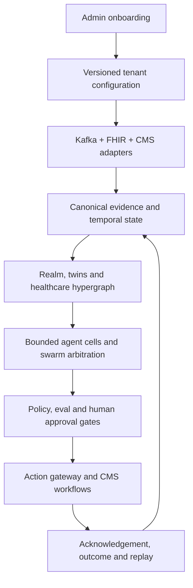

# Anant Healthcare Intelligence Platform — Port and Productization Plan

**Target branch:** `with-ode`  
**Plan status:** implementation baseline approved by product owner; code changes begin after this plan  
**North star:** one governed, event-first healthcare intelligence platform in which Renal Swarm is the first installable solution pack—not a hard-coded product boundary.

## 1. Outcome

An organization administrator can onboard a provider, payer, or hybrid enterprise without a redeploy; connect Kafka, FHIR, CMS/public authority sources, identity, and storage; configure and test bounded AI agents; run green-team and red-team validation; activate a versioned release; and hand users into role-specific command cockpits.

Every surfaced insight must close a loop:

1. receive evidence;
2. establish scoped, temporal state;
3. produce bounded agent proposals;
4. arbitrate policy and conflicts;
5. obtain human approval when required;
6. execute through an allowlisted adapter;
7. observe acknowledgement and outcome;
8. retain provenance, audit, cost, and replay evidence.

No production workflow may silently substitute mock data. The simulator remains available as an explicitly labeled, isolated test tenant.

## 2. Current branch baseline

The `with-ode` branch already provides the correct foundation:

- Fastify backend with public, admin, enterprise, CMS, FHIR, simulator, knowledge, realm, and swarm routes.
- SQLite/Postgres-compatible durable store and production Postgres bootstrap.
- Kafka and alternative event-broker drivers, transactional outbox, idempotency, bridge, broker telemetry, and dead-letter capabilities.
- FHIR R4 ingestion/export, CMS source catalogs and measure evaluation.
- Realm, twin, hypergraph, temporal ledger, bounded swarm cells, NBA decisions, outcome episodes, simulation, replay, and policy.
- Two server-gated UIs:
  - `/admin/ui/`: operator/admin control plane.
  - `/exec/`: React executive/clinical intelligence workspace.
- Server-issued session identity and role-enforced console access.
- A backend-driven Renal Swarm console with 12 modules and durable workspace APIs.

The port will preserve these backend primitives. It will remove renal-only assumptions from the platform shell and move them into a versioned renal solution pack.

## 3. Product model

### 3.1 Platform versus solution packs

| Layer | Generic platform responsibility | Renal solution-pack responsibility |
|---|---|---|
| Identity | users, roles, scopes, purpose of use, break-glass | renal role presets and escalation paths |
| Organization | enterprise hierarchy and data boundaries | divisions, regions, markets, facilities, shifts |
| Events | Kafka/FHIR ingestion, validation, routing, replay, DLQ | renal event contracts and routing presets |
| Intelligence | twin/realm/hypergraph/state/cell runtime | renal cells, triggers, evidence needs, NBAs |
| Governance | policy, HITL, evals, red team, release gates | renal clinical boundaries and CMS-specific gates |
| Outcomes | generic episode/action/outcome contracts | missed treatment, access, infection, adherence, capacity |
| Regulatory | source registry, executable measures, submissions | ESRD QIP and dialysis facility measures |
| Experience | role-aware workspace and reusable widgets | renal navigation, terminology, dashboards, guided demo |

Additional packs—primary care, home health, oncology, utilization management, appeals, quality, and network operations—must use the same contracts and UI composition model.

### 3.2 Organization lenses

The onboarding wizard asks for one operating model:

- **Provider:** enterprise → division → region → market → facility/service line → unit/shift.
- **Payer:** enterprise → line of business → market/state → plan/product → network → member cohort.
- **Hybrid:** both trees connected through contracts, attributed populations, facilities, and shared measures.

Every query, event, agent run, action, measure, and UI card carries an organization scope. Users see only authorized scopes.

### 3.3 Roles

Platform roles are configurable role bundles, seeded with:

- Platform Administrator
- Integration/Kafka Administrator
- Identity and Security Administrator
- AI/Model Administrator
- Clinical Safety Officer
- Regulatory/CMS Administrator
- Data Steward
- Auditor
- Executive
- Provider Operations Leader
- Facility/Practice Leader
- Care Team Operator
- Payer Operations Leader
- Utilization/Case Manager
- Network/Quality Manager

The backend remains authoritative. UI visibility is convenience, never authorization.

## 4. Target architecture

### 4.1 Backend boundaries

- **Experience API/BFF:** role-aware, scope-filtered view models for both UIs; the browser does not derive clinical truth from raw events.
- **Configuration registry:** immutable versions for tenants, hierarchies, adapters, schemas, topics, agents, policies, measures, workflows, UI lenses, and release manifests.
- **Event plane:** Kafka consumers/producers, schema validation, partition/key policy, offset tracking, deduplication, retry, DLQ, audited replay, and transactional outbox.
- **Canonical data plane:** FHIR-aligned resources, normalized events, assessment answers, exact text spans, provenance, content hashes, valid time, and recorded time.
- **Intelligence plane:** realms, twins, hypergraph relationships, deterministic projections, agent cells, evidence fusion, proposals, conflicts, NBAs, and outcome episodes.
- **Governance plane:** deny-by-default authorization, purpose of use, HITL, policy arbitration, model/prompt/tool allowlists, evals, drift, cost, red-team suites, and kill switches.
- **Execution plane:** allowlisted FHIR, messaging, work-queue, submission, and webhook adapters with acknowledgements.
- **Regulatory plane:** authoritative-source registry, effective dates, measure packs, readiness, submission packaging, reconciliation, attestation, and replay.
- **Observability plane:** correlated trace → event → state → evidence → agent run → policy decision → action → acknowledgement → outcome.

## 5. Closed-loop admin onboarding journey

### Step 1 — Create organization

The Platform Administrator selects provider, payer, or hybrid; defines legal entity, environments, region, retention, timezone, and deployment model; and creates the initial organization hierarchy.

**Gate:** valid scopes, unique identifiers, data residency and retention policy.

### Step 2 — Configure identity and decision rights

Connect OIDC/SAML/SCIM or use the local demo identity provider. Map groups to role bundles, organization scopes, clearance, purpose of use, approval classes, and break-glass rules.

**Gate:** deny-by-default access tests, separation-of-duties tests, and console-access tests pass.

### Step 3 — Connect the event and clinical data plane

Configure:

- Kafka bootstrap/bridge, security protocol, credential reference, schema registry, consumer groups, and environment.
- Topic discovery or explicit topic mappings.
- FHIR base URL, authorization mode, tenant headers, subscriptions/bulk export, and resource mappings.
- CMS and other public-source subscriptions with freshness and effective-date rules.

Credentials are referenced by secret IDs; they are never returned to the browser.

**Gate:** connectivity, authentication, schema compatibility, scope isolation, and read-only smoke tests.

### Step 4 — Define Kafka routing

For every inbound mapping, configure:

- event contract and version;
- topic;
- allowed partition set or all partitions;
- message-key strategy;
- ordering scope;
- consumer group;
- offset initialization;
- maximum in-flight work;
- retry/backoff;
- replay window;
- PHI classification.

For every agent, configure:

- a shared governed output topic or dedicated agent output topic;
- output envelope version;
- partition-key strategy;
- allowed consumers;
- retention;
- acknowledgement topic when applicable;
- DLQ topic and maximum attempts.

Default topics:

- `anant.agent.output.v1`
- `anant.agent.<agent-id>.output.v1` when isolation is enabled
- `anant.agent.output.dlq.v1`
- `anant.action.ack.v1`

**Gate:** topic existence/ACLs, partition compatibility, schema validation, key determinism, consumer lag baseline, and DLQ write/read test.

### Step 5 — Install solution packs

Select generic platform capabilities and solution packs. Renal Swarm installs:

- renal ontology and event mappings;
- provider hierarchy presets;
- 12 bounded cell manifests;
- assessment extractors and evidence rules;
- ESRD measures and public-source bindings;
- renal NBAs, episodes, policies, workflows, simulations, and UI lens.

Payer extensions add member, plan, network, authorization, claim, appeal, care-gap, risk, and contract concepts without changing the runtime.

**Gate:** dependency graph, source freshness, agent/tool permissions, measure integrity, and configuration conflicts.

### Step 6 — Configure agents in the UI

The AI Administrator can create or clone an agent, then configure:

- purpose and bounded responsibility;
- single-topic or multi-topic triggers;
- partition/key handling;
- required evidence and freshness;
- model/router and deterministic fallback;
- tools and write permissions;
- proposal schema;
- confidence/abstention thresholds;
- HITL approval class;
- output topic and DLQ;
- eval suite, cost budget, rate limits, kill switch, and ownership.

“Test agent” runs against an isolated replay/simulator scope and displays the full trace, evidence, proposal, policy verdict, output envelope, and expected Kafka destination.

**Gate:** contract, golden-set, groundedness, safety, privacy, cost, latency, and deterministic-replay thresholds.

### Step 7 — Red-team and green-team release

Every configuration release automatically runs:

**Green team**

- happy-path provider and payer scenarios;
- contract compatibility;
- FHIR mapping and assessment extraction accuracy;
- CMS measure parity;
- expected NBA/action/outcome closure;
- performance, cost, and operational resilience.

**Red team**

- prompt injection and tool-command injection;
- cross-patient, cross-facility, and cross-tenant evidence leakage;
- unauthorized role/action;
- duplicate, out-of-order, stale, corrected, and poison Kafka messages;
- wrong partition/key and offset reset;
- schema drift;
- stale or conflicting authority sources;
- hallucinated citations;
- unsafe clinical recommendation;
- model/provider outage;
- DLQ overload and replay duplication;
- policy/threshold manipulation;
- submission tampering;
- denial-of-service and budget exhaustion.

Failures produce an incident-like dossier: attack, expected control, observed behavior, trace/evidence, severity, owner, remediation, retest, and release-block decision.

**Gate:** no unresolved critical/high failures; required approvers sign the immutable release manifest.

### Step 8 — Activate and hand off

Activation is atomic and reversible. The administrator chooses environment, activation window, canary scopes, rollback version, and monitors.

Users are routed into the appropriate workspace:

- admin/integration/security/model roles → `/admin/ui/`;
- executive, clinical, regulatory, provider, payer roles → `/exec/`;
- users with both rights receive a server-authorized console switcher.

The workspace opens on **My Work**, not a generic dashboard.

## 6. Generic healthcare workspace

The `/exec/` application becomes a composition shell driven by tenant, role, scope, and installed solution packs.

Core navigation:

1. My Work / Outcome Command
2. Person Intelligence (patient or member)
3. Provider Operations
4. Payer Operations
5. Assessment Intelligence
6. Quality and CMS Operations
7. Agent and Swarm Control
8. AI Assurance
9. Executive Outcomes
10. Configuration Studio
11. Shared Intelligence
12. Platform Administration (authorized roles)

Renal labels remain when the renal pack/lens is active. Generic or payer users do not see dialysis-specific terminology unless their scope includes that pack.

### 6.1 Provider closed loop

Discharge event → temporal patient state → assessment facts → renal/transition cells propose → policy arbitration → coordinator approval → schedule/transport/clinical task → acknowledgement → treatment outcome → measure and cost update → episode resolved.

### 6.2 Payer closed loop

Claim/authorization/care-gap event → member/plan/network state → utilization/quality cells propose → benefit and policy arbitration → case-manager approval → provider/member action → response/claim outcome → quality, utilization, and contract impact → episode resolved.

### 6.3 UI interaction standard

Every KPI, alert, graph node, agent, message, episode, measure, facility, member/patient, policy, release, and DLQ row is clickable. Detail views must include:

- why this is shown;
- current state and temporal history;
- exact evidence and source provenance;
- agent contributions and conflicts;
- policy/authorization decision;
- available next actions;
- action ownership and SLA;
- acknowledgement/outcome state;
- audit/replay link.

No dead-end cards and no destructive action without confirmation.

## 7. Shared intelligence and hypergraph

The Obsidian-style canvas becomes a server-backed healthcare hypergraph, not a freehand visualization. It supports:

- person/member ↔ provider/facility ↔ plan/product ↔ measure ↔ evidence ↔ assessment ↔ intervention ↔ outcome;
- pack ↔ source ↔ regulation ↔ measure dependencies;
- agent ↔ topic ↔ tool ↔ model ↔ policy ↔ eval dependencies;
- organizational and cross-facility/network propagation;
- policy and threshold impact simulation;
- saved canvases, notes, comments, citations, access scope, and version history.

Three.js is used only where spatial exploration improves understanding; tables and timelines remain the primary operational views.

## 8. Required backend contract additions

1. `GET /admin/platform/bootstrap` — current onboarding state and next required gate.
2. `PUT /admin/platform/organization` — provider/payer/hybrid hierarchy.
3. `GET|PUT|POST /admin/platform/integrations/*` — Kafka/FHIR/CMS configuration and tests.
4. `GET|PUT /admin/platform/topics` — topic, partition, key, schema, retry and DLQ policy.
5. `GET|POST|PUT /admin/platform/agents` and `POST .../:id/test`.
6. `GET|POST /admin/platform/releases` plus validate, red-team, approve, activate and rollback.
7. `GET /api/context` — role/scope/solution-pack navigation and permissions.
8. `GET /api/work` and typed detail/action endpoints for closed-loop work.
9. `GET /api/graph` and saved-canvas CRUD.
10. `GET /admin/platform/dlq`, item detail and audited replay.

Existing `/admin/swarm/*` routes stay compatible during migration and delegate to the generic platform services. Renal-specific contracts move under a renal pack namespace where appropriate.

## 9. Delivery sequence

### Phase A — Contract and vocabulary extraction

- Introduce generic organization, solution-pack, UI-lens, agent-topic, DLQ, and release contracts.
- Add compatibility adapters for existing `/admin/swarm/*` clients.
- Move hard-coded renal reference catalogs behind the renal pack.

**Exit:** existing Renal Swarm UI behaves unchanged through the generic contracts.

### Phase B — Admin onboarding and configuration

- Build the guided onboarding journey in the operator console.
- Implement Kafka/FHIR/CMS discovery, validation, partitions, topics, agent outputs, DLQ, identity, and hierarchy flows.
- Persist every draft and release in SQLite/Postgres-compatible tables.

**Exit:** a new tenant reaches “ready for rehearsal” without file edits or redeploy.

### Phase C — Generic provider/payer experience

- Convert the executive shell to server-defined navigation and terminology.
- Add provider and payer lenses, My Work, and closed-loop details.
- Add authorized switching between the two UIs.

**Exit:** provider and payer personas complete representative work without seeing irrelevant renal concepts.

### Phase D — Agent studio and event operations

- Finish UI-based agent authoring, multi-topic triggers, output topics, partitions, test runs, kill switch, DLQ inspection, and replay.
- Correlate messages to runs, evidence, decisions, and outcomes.

**Exit:** an administrator creates, tests, releases, observes, stops, and rolls back an agent with no code change.

### Phase E — Assurance and release control

- Implement red-team/green-team suites, immutable dossiers, release gates, canary activation, rollback, and production monitoring.
- Add provider and payer adversarial journeys.

**Exit:** an intentionally unsafe release cannot activate; remediation and retest are demonstrable.

### Phase F — End-to-end validation and demo

- Backend unit/integration tests.
- Contract tests for FHIR, CMS, Kafka envelopes and admin APIs.
- Security tests for role/scope/tenant isolation and break-glass.
- Deterministic replay, DLQ and idempotency tests.
- Browser journeys for admin → release → user cockpit → action → outcome.
- Docker Compose smoke test with Postgres, Redis, Kafka profile and both UIs.

**Exit:** one scripted demo proves the entire closed loop and produces an audit/replay package.

## 10. Definition of done

The port is complete only when:

- Renal Swarm is installed/configured as a solution pack and remains fully functional.
- Provider, payer, and hybrid organization models are supported.
- Both UIs share identity, configuration, design language, and backend truth without duplicating authorization or clinical logic.
- Customer onboarding requires no source edit or redeploy.
- Agent triggers support single or multiple input topics and partition-aware consumption.
- Every agent has a configured shared or dedicated output topic and a governed DLQ.
- Kafka failures are inspectable and replayable without duplicate effects.
- CMS/FHIR/public evidence is real, versioned, and provenance-linked.
- Every operational UI item drills into a closed-loop detail and permissible action.
- Red-team and green-team results block releases when thresholds fail.
- Evals, drift, safety, cost, traces, audit, replay, and kill switches are visible and enforced.
- Production paths contain no mock fallback; synthetic data is explicitly isolated.
- Typecheck, unit, integration, security, contract, browser, Docker and replay suites pass.
