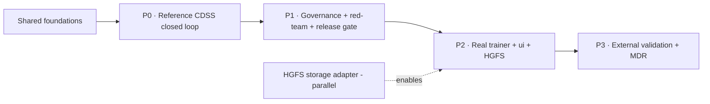

# Incorporating Manifold-Learning EPO Dose Support into Anant Harness

> **Source.** Gil-Casares-Casanova B, Melgarejo-Meseguer F-M, Portoles-Pérez J-M,
> Tornero-Molina F, Rojo-Álvarez J-L. *A Manifold Learning Model for Adjusting
> Anemia Treatment in Chronic Kidney Disease.* **Array 30 (2026) 100837**
> (open access, CC BY). DOI: 10.1016/j.array.2026.100837.
>
> **This doc** = a detailed analysis of how to incorporate that model + method
> into this product, mapped onto the codebase we already have.
> **Date:** 2026-09-09 · **Status:** analysis (not yet implemented).

---

## 1. The paper in one page

**Problem.** Anemia in CKD is treated with erythropoietin (EPO / ESA). Dose
adjustment is subjective and empirical. Goal: an **accurate, interpretable,
individualized EPO-dose decision-support tool** — not an autonomous system.

**Data.** Retrospective 2008–2020, **146 HD patients**, EPO (epoetin alfa, IV,
3×/wk) for ~163 ± 122 weeks. Target Hb **10–12 g/dL** (KDIGO). Dose revised every
4 weeks (±~25%; suspend if Hb keeps rising). ~15 clinical features (Table 1):
Hb, MCV, MCH, iron, ferritin, transferrin, transferrin saturation, CRP, pH, PTH,
calcium, albumin (+ folic acid, bicarbonate, aluminium, total protein) + prior EPO.

**Method.**
- Preprocess: domain-bound outlier clip → weekly (Ts=1 wk) resample → normalize →
  sliding 7-week buffer of ~15 variables (+ EPO 7→4 wks back) ≈ **108-var input**.
- **Manifold learning**: contractive autoencoder **EN (25→5→2)** produces a
  **2-D latent space**; a regressor **RN (2→1)** predicts EPO dose from the latent.
  Leaky ReLU (0.3), Glorot init. Patient-disjoint 70/30 split.
- PCA baseline for "is the data on a manifold?" (reconstruction RMSE).
- Interpretability: 2-D latent colored per variable (polar-transformed),
  Davies–Bouldin for generalization, **permutation relevance Rᵢ** per feature.
- Baselines: SVR, GA-genetic tree (GenTree), random forest, and "mimic" (copy the
  prior dose).

**Results.**
- EPO dose error **797.88 ± 929.50 units** (< one 1000-unit dose) — good enough
  for CDSS under expert supervision.
- Rᵢ: **prior EPO ~40%**, MCV ~16%, calcium/transferrin moderate, rest <5%. Lower
  EPO need correlates with higher MCV/MCH/TSAT/CRP/pH/PTH/albumin (better iron
  stores, less inflammation).
- Hb forecasting from 4–6-wk-old data: MAE <10%.
- SVR has lowest MAE but huge prior-EPO weights ("dose replication" trap); NN is
  competitive and interpretable.

**Framing / limits.** CDSS with **human-in-the-loop**; under EU AI Act + MDR it is
**high-risk software as a medical device** → never autonomous; nephrologist keeps
responsibility. Limits: single retrospective cohort; may amplify historical
clinician variability; black-box → needs XAI; iron params underweighted because of
active iron-repletion protocol; needs external/multicenter validation.

---

## 2. Why this fits the product (it already has the skeleton)

The platform is not a blank slate for this — most of the *governance and
closed-loop machinery* the paper's CDSS needs already exists:

| Product piece | Exists today | Maps to |
|---|---|---|
| ESA / anemia protocol module | `packs/dialysis-provider/medication/` — `MedicationOrder` (dose `units` = EPO), `MedicationAdministration`, **rule-based** `evaluateAnemia()` flags (`hgb-below-9-not-on-esa`, `hgb-above-11-on-esa`, `esa-dose-escalated-without-response-90d`, `iron-not-checked-quarterly`) | The paper's *protocol* layer — keep rules as **guardrails** |
| Lab events | `lab.result-arrived` / labs module `assessLab` (loinc-based); `cms-data` + synthetic patients | Hb (LOINC 718-7), MCV, ferritin, … inputs |
| Time series / temporal state | patient timelines, facility twins, `swarm/traces`, `temporal_states` | The weekly 7-window feature buffer |
| Human-in-the-loop decision engine | **NBAs** (approvalClass A–D) → outcome **episodes** (Coordinating→Verifying→Resolved) → `dispatchCommand` → `acknowledge` → `verify(met)` | The CDSS decision loop |
| Work queue | exec "My Work" role-scoped (MD/nephrology sees clinical items) | Where the dose recommendation is reviewed |
| Measures | `dialysis-provider/measures/esrd-qip.js` + CMS measure catalog | "Hb in 10–12 band", ESA responsiveness |
| Model governance | `model-registry`, `drift_snapshots`, AI Assurance (green/red team, findings, release gates) | MnL model registry + drift + interpretability gate |
| Provenance / citation | canvases, what-if, audit hash-chain | "why this dose" evidence, latent-map citations |
| `ui/` Next.js demo | measures/cases/labs pages | Anemia cases + ESA measures |
| HGFS (planned) | simplex model in `docs/hgfs-simplex-mapping.md` | ESA patient state, dose deltas, care-loop polygon |

---

## 3. Incorporation blueprint

### 3A. Domain & data — extend the existing ESA module

Add an **`anemia/esa-dose` capability inside `packs/dialysis-provider/medication/`**
(the module already owns ESA + the QIP-Hb protocol):

- **Events.** New/typed canonical events driving the loop:
  - `medication.updated` / `medication.ordered` with `rxnormCode` = epoetin alfa,
    `doseAmount`/`doseUnit:'units'` → the ESA order (already modelled).
  - `medication.administered` (IV post-session) → the administration (already modelled).
  - Reuse `lab.result-arrived` for Hb/MCV/MCH/ferritin/transferrin/TSAT/CRP/Ca/PTH/Alb
    (LOINC-coded, weekly cadence in the sim).
- **Reference cohort feature set.** A **feature catalog** (mirror of Table 1) with
  domain bounds for outlier clipping and LOINC map — this becomes the same artifact
  the trainer and the runtime both read (no drift between train and serve).
- **Window builder.** A pure function that assembles the **7-week sliding buffer →
  108-var input** from a patient's event history (reuses the existing
  temporal-state/timeline machinery). Deterministic, testable, and idempotent.

### 3B. Model — governed, trainable, with a reference surrogate

- **Architecture (from the paper):** contractive AE encoder `EN: 108 → 25 → 5 → 2`
  + regressor `RN: 2 → 1`, leaky ReLU(0.3), Glorot. **Output = EPO dose**
  (not Hb — the key novelty vs. earlier ESA papers).
- **Where it runs:**
  - *Inference* — a tiny MLP (~200 weights) runs anywhere: TS in the agent runtime,
    or in the existing **liquid-wasm** worker for an in-browser "try the dose"
    surface. No heavy runtime needed at serve time.
  - *Training* — offline: (a) Python notebook/service (the paper's natural habitat)
    exporting weights (ONNX/JSON), or (b) the **Rust `liquid-train`** stack via a
    `domain-dialysis` model. Recommend (a) for the real trainer + (b) optional.
- **Demo posture (synthetic-first).** Our datasets are synthetic, so we ship:
  - a **reference surrogate** — a small, seeded weight set whose *behavior*
    reproduces the paper's learned structure (prior-EPO ~40% relevance, MCV ~16%,
    calcium/TSAT moderate, slow dose progression), so every closed-loop and
    interpretability surface is demonstrable without real patients;
  - the **real trainer interface** ready to swap in when a real, consented cohort
    is available (same feature catalog + contract).
- **Model as a governed artifact.** Register it in the existing model registry with
  `version`, training window, `drift_snapshots`, and an **interpretability package**
  (Rᵢ permutation importances + latent centroid map) that must ship with it.

### 3C. Decision-support closed loop (reuse the NBA engine)

The recommendation is a **next-best action**, not an autonomous order:

1. Weekly feature window → encoder → latent (L1,L2) → regressor → recommended EPO units.
2. Guardrails from `evaluateAnemia()` rules veto/flag: `hgb-above-11-on-esa`,
   `hgb-below-9-not-on-esa`, `esa-dose-escalated-without-response-90d`,
   `iron-not-checked-quarterly` (never recommend when iron not assessed — matches
   the paper's protocol ordering: fix iron/B12/MCV first).
3. Emit **NBA** `esa.dose-adjust`:
   - `value` = projected saving (dose delta × ESA cost) + Hb-stability benefit,
   - `confidence` = latent-neighborhood agreement,
   - **`approvalClass: 'C'`** (clinical, requires MD/nephrologist — never Class A),
   - `ownerRole: 'medical'` → shows in exec **My Work** for the MD role.
4. Approve → `dispatchCommand('esa.dose-order', {dose})` → order recorded →
   `medication.administered` → `acknowledge` → **outcome episode**
   `anemia.esa-response` keyed on (patient, Hb-band) → next Hb assessment →
   `verify(met: Hb ∈ 10–12)` → **Resolved** (the closed loop the product already
   proves end-to-end).
5. Delta on the episode per monthly adjustment — exactly the paper's
   "slow temporal progression" finding becomes a queryable **vertex delta** in HGFS.

### 3D. Interpretability surfaces (the product's XAI answer)

This is where we beat "SVR/GenTree have better MAE but are black-box":

- **Latent scatter** — the 2-D (polar-transformed) manifold in the exec console,
  colored by Hb / MCV / EPO / ferritin; the current patient is a dot, past
  trajectory is a polyline over **deltas**. Each dot is drillable → provenance.
- **Driver bars** — Rᵢ (permutation importance) per feature shown on every
  recommendation: *"prior EPO 40% · MCV 16% · calcium 8%…"* (the paper's Fig. 10).
- **What-if on a canvas** — "if ferritin → 600 (iron replete), does the recommended
  dose drop?" re-runs the latent projection and records a **cited canvas note**
  (`anemia.what-if:…`), reusing the Shared-Intelligence what-if pattern.
- **Plain-language first, trace later** — the recommendation card states the dose
  + drivers in clinical language; the latent/trace is behind a drill-down
  (consistent with the product's progressive-disclosure rule).

### 3E. Governance, assurance & regulatory posture

- **Red-team scenarios (new rt-013+)** under AI Assurance:
  - *Dose-replication trap* — model simply copies the prior dose (the paper's
    "mimic"/SVR failure) and misses a real change → flagged.
  - *Extrapolation / cohort drift* — patient's labs outside the training manifold
    (the paper's "restrict to similar populations") → latent-distance-based
    **coverage gate**.
  - *Overdosing risk* — recommending an increase while Hb is already rising
    (protocol says reduce/suspend) → safety finding.
  - *Iron/MCV blind spot* — recommending EPO before iron repletion (paper notes
    iron params were underweighted due to the active repletion protocol) → finding.
- **Interpretability gate** — a release cannot activate the ESA advisor without
  its Rᵢ package + a passing coverage/drift check (the paper's XAI/black-box
  limitation becomes a **governed gate**, matching our "unsafe release cannot
  activate" story).
- **Regulatory frame (EU AI Act / MDR)** — the advisor is **CDSS, human-in-the-loop
  (Class C/D human approval), never autonomous**; this is encoded as a product
  rule + red-team + doc, not just prose.

### 3F. Where it shows in the UIs

- **exec (provider/dialysis lens)** — "Anemia & ESA" panel: patient list with Hb
  band + flag pills; recommendation card (recommended dose, current dose, delta,
  driver bars, guardrail flags, approval path); latent scatter; drill to the
  episode/dossier.
- **exec My Work** — `esa.dose-adjust` NBAs for the medical role (Class C).
- **admin / AI Assurance** — the ESA model in the model registry with version,
  drift and interpretability gate status.
- **`ui/` Next.js** — add ESA anemia cases + a "Hb in target" measure row on the
  measures/cases pages (same `DemoData` shapes).

### 3G. HGFS simplices & deltas (ties into the HGFS plan)

- `anant.patient.esa` — vertex, `properties` = current Hb band, onESA, last dose,
  iron-panel recency, latents (L1,L2); **delta per monthly assessment**.
- `anant.lab` — Hb/MCV/ferritin/… vertices (immutable), `external_id` = lab id.
- `anant.cds.epo` — vertex per recommendation: latent coords, recommended dose,
  Rᵢ drivers, model version, guardrail verdicts.
- edge `anant.cds.epo.for` → patient; triangle `(patient, model-version, dose-rec)`
  = accountability of "who/what recommended this"; hyperedge = the multi-lab panel
  behind the window; polygon `anant.esa.loop` = labs → latent → rec → decision →
  order → administration → Hb verify (the closed loop as evidence).
- RBAC: only the medical role sees `anant.cds.epo` and the dose delta chain.

---

## 4. Phased implementation plan — full definitions

> Each phase is **independently shippable and demoable**, adds value on its own,
> and hardens what the previous phase built. Sequencing is driven by the product
> rule: **demonstrate the governed, human-in-the-loop closed loop first; make it
> safe by default; only then put a real (and later, real-world) model behind it.**

### Shared foundations (land before P0)

Small, reusable scaffolding every phase depends on:

- **Synthetic ESA cohort factory** — a deterministic generator of HD patients with
  Hb trajectories (target band 10–12), ESA orders/admin (`doseUnit:'units'`), and
  weekly LOINC labs (Hb, MCV, MCH, ferritin, transferrin, TSAT, CRP, Ca, PTH, Alb)
  so every phase has a stable, replayable dataset (mirrors the existing
  `sim:renal-*` / `outcome-episode-story` seeds).
- **Feature-catalog schema** — the single artifact listing the paper's variables
  (LOINC + unit + domain outlier bounds + nullability) that both the *trainer* and
  the *runtime window builder* read (no train/serve drift). This is the product's
  "no metric is inferred from unauthorized data" contract applied to features.
- **Terminology + synthetic labeling** — "reference model", "CDSS, Class C,
  human-in-the-loop", and the persistent synthetic-data labeling reused by every UI.

**Exit:** a documented feature catalog + a passing cohort generator test.

---

### P0 — Reference CDSS: the governed closed loop on synthetic data

**Objective.** Ship the end-to-end **decision-support journey** with a
behavior-faithful **reference surrogate** model (no real training yet): features →
latent → recommended EPO dose → a Class-C NBA a nephrologist reviews in My Work →
order/administration → Hb verify → resolved outcome episode — plus the
interpretability surfaces. Everything labeled synthetic.

**Deliverables by workstream.**

- **Domain/data** — extend `packs/dialysis-provider/medication/` with an
  `anemia/esa-dose` capability:
  - `esaFeatureCatalog.ts` (Table-1 features, bounds, LOINC map),
  - `esaWindow.ts` (weekly 7-window → ~108-var input; min-lab-density guard),
  - typed ESA events (`medication.updated`/`medication.administered`, rxnorm
    epoetin alfa) wired to the sim.
- **Model** — `esaModel.ts`: reference **surrogate** weights reproducing the
  paper's learned structure (prior-EPO ≈ 40% relevance, MCV ≈ 16%, slow dose
  progression); encoder `EN(108→25→5→2)` + regressor `RN(2→1)`, leaky ReLU(0.3);
  a tiny MLP (~200 weights) that runs in TS (and later the liquid-wasm worker).
- **Closed loop** — emit NBA `esa.dose-adjust` (`approvalClass:'C'`,
  `ownerRole:'medical'`, value = dose×cost + Hb-stability, confidence); My Work
  shows it to the MD role; approve → `dispatchCommand('esa.dose-order')` → order →
  administration → `acknowledge` → outcome episode `anemia.esa-response` →
  next Hb → `verify(met: Hb ∈ 10–12)` → Resolved.
- **Guardrails** — wire existing `evaluateAnemia()` flags as **vetoes**:
  `hgb-above-11-on-esa`, `hgb-below-9-not-on-esa`,
  `esa-dose-escalated-without-response-90d`, `iron-not-checked-quarterly` → no
  recommendation (paper + KDIGO ordering: fix iron/MCV/B12 before EPO).
- **Interpretability** — per-recommendation **driver bars** (surrogate Rᵢ) and the
  **2-D latent scatter** (polar transform) colored by Hb / MCV / EPO / ferritin,
  exposed as data endpoints the exec panel renders.
- **Measure** — add an "Hb in 10–12 target band" measure (and ESA-responsiveness
  derivation) to the QIP/Hb measure set.
- **exec UI** — "Anemia & ESA" panel (provider/dialysis lens): patient list with
  Hb-band + flag pills; recommendation card (recommended vs current dose, delta,
  driver bars, guardrail verdicts, Class-C path); latent scatter; drill to the
  episode dossier. My Work shows the Class-C NBAs.

**Tests.** Unit (catalog bounds, window builder, guardrail vetoes, surrogate
shapes) · route tests (`esa.dose-adjust` → episodes/work) · **one e2e closed-loop
test** proving labs → recommendation → approve → order → admin → Hb verify →
Resolved, plus a deterministic audit/replay package.

**Definition of done / exit criteria.**
1. Full closed loop runs on a synthetic patient with **zero manual steps**.
2. A Class-C `esa.dose-adjust` appears in an MD's My Work and is **not**
   auto-dispatchable (Class C enforced; a non-medical role cannot act).
3. Guardrail vetoes block at least the 4 anemia-response flags with a visible
   reason on the card.
4. Recommendation card shows recommended dose, current dose, delta, Rᵢ drivers,
   and synthetic labeling.
5. e2e + unit tests green; full suite stays green (613+ baseline).

**Dependencies.** None external. **Notes.** Fully synthetic; the surrogate is
explicitly versioned as a *reference* model.

---

### P1 — Governance, red-team & release gate: safe by default

**Objective.** Make the advisor **cannot-act-unsafely** — red-team it, gate
activation on interpretability + coverage, register + monitor drift, and encode
the EU AI Act / MDR posture as product behavior, not prose.

**Deliverables.**

- **Red-team scenarios rt-013…rt-016** under AI Assurance (replayed vs the live
  policy, exactly like rt-001…rt-012):
  - *rt-013 dose-replication trap* — model copies the prior dose and misses a
    required change (paper's "mimic"/SVR failure) → flag.
  - *rt-014 cohort/out-of-manifold extrapolation* — labs outside the training
    manifold (paper's "restrict to similar populations") → coverage finding.
  - *rt-015 overdosing while Hb rising* — recommending an increase when the
    protocol says reduce/suspend → safety finding.
  - *rt-016 iron/MCV blind spot* — recommending EPO before iron repletion (paper
    notes iron params are underweighted under an active repletion protocol) →
    finding.
- **Coverage gate** — latent-distance / lab-density check: patients whose window
  falls outside the reference manifold (or has < min lab density) are **blocked
  from a recommendation** with an explicit "insufficient data / out of model
  range" verdict.
- **Interpretability gate** — a release cannot **activate** the ESA advisor
  without its Rᵢ package + passing coverage + no blocking findings (reuses the
  existing `blockingFindings`/release-gate machinery — "unsafe advisor cannot
  activate").
- **Model registry + drift** — register the advisor (version, reference/surrogate
  flag, window); start KS/per-feature drift + latent shift snapshots.
- **Regulatory posture** — product rule + doc: CDSS = **human-in-the-loop, Class
  C/D, never autonomous**; nephrologist retains responsibility; MDR/AI-Act risk
  classification recorded as an assurance finding gate (never a silent black box).

**Tests.** Each red-team scenario passes under `block` and fails under `allow`;
an advisor missing interpretability/coverage cannot activate; a drifted/out-of-
manifold patient yields a "blocked" verdict (no NBA).

**Definition of done / exit criteria.**
1. rt-013…016 exist, run in the suite, and produce findings under an unsafe policy.
2. Activating the advisor requires interpretability + coverage gates with **no
   blocking findings**; an unsafe activation is rejected (failed release).
3. Out-of-manifold / low-density patients get a **blocked** recommendation with a
   human-readable reason (verified in the exec panel + tests).
4. Model registry shows the advisor + its drift; drift snapshots are written.
5. A "regulatory posture: CDSS / HITL / Class C" finding is part of the release
   dossier.

**Dependencies.** P0. **Notes.** This phase is what makes P2's real model safe to
introduce.

---

### P2 — Real trainer + outward surfaces + HGFS persistence

**Objective.** Replace the reference surrogate with a **real trained model** under
the *same contract*, open external surfaces (`ui/`, in-browser), and persist the
whole ESA domain to **HGFS** (vertices, deltas, edges, triangles, polygons).

**Deliverables.**

- **Python trainer** (`anemia-train/`): contractive AE `EN(108→25→5→2)` + `RN(2→1)`,
  leaky ReLU(0.3), Glorot, patient-disjoint 70/30 split, permutation Rᵢ, and
  export to **ONNX/JSON** using the same feature catalog (no train/serve drift).
- **Serving** — load exported weights through the existing `esaModel.ts` contract;
  compute drift (per-feature KS + latent centroid shift) at serve time.
- **`ui/` (Next.js)** — add ESA anemia **cases** + "Hb in target" measure rows on
  the existing measures/cases pages (same `DemoData` shape → API-backed when the
  ui loader lands).
- **HGFS projector** (ties into `docs/hgfs-simplex-mapping.md`) — write:
  - `anant.patient.esa` vertex (**delta per monthly dose adjustment**),
  - `anant.lab` vertices (Hb/MCV/ferritin…),
  - `anant.cds.epo` vertex (latent coords, recommended dose, Rᵢ, model version,
    guardrail verdicts),
  - edge `anant.cds.epo.for` → patient, triangle `(patient, model-version, rec)`,
    polygon `anant.esa.loop` (labs → latent → rec → decision → order → admin → Hb
    verify).
  - RBAC: only the medical role reads `anant.cds.epo` + the dose delta chain.
- **(optional) in-browser inference** — tiny WASM path (existing liquid-wasm) so a
  clinician can interactively probe the latent space offline.

**Tests.** Train→serve parity on a golden dataset (deterministic weights);
exported weights load and reproduce reference outputs; drift metrics computed;
HGFS projector asserts expected vertices/deltas/edges/triangle/polygon per tenant.

**Definition of done / exit criteria.**
1. Offline train → ONNX/JSON weights → same `esaModel.ts` contract serves a
   recommendation; golden parity test passes.
2. `ui/` renders ESA anemia cases + Hb measure from the shared shape.
3. HGFS contains `anant.patient.esa` deltas + `anant.cds.epo` + the
   `anant.esa.loop` polygon for a driven synthetic cohort; medical-role RBAC is
   enforced on reads.
4. No regression: P0 loop + P1 red-team/gates still green with the real model.

**Dependencies.** P1 (governance before real model) + the HGFS storage adapter
(parallel infra track). **Notes.** The "real trainer" is still trained on
*synthetic* data until P3 supplies a consented cohort — keep the synthetic label.

---

### P3 — External validation & regulatory readiness

**Objective.** Path from the governed demo to a **validated, deployable CDSS**:
real/consented cohorts, multicenter validation hooks, and the artifacts a
regulatory file needs.

**Deliverables.**

- **Validation study scaffold** — protocol + metrics (MAE in EPO units, % within
  one dose, quartiles, Spearman; Hb-forecast MAE <10% like the paper), external
  cohort import (FHIR / HL7 messages → canonical events), and a performance report
  the red-team/gates consume.
- **Prospective trial hooks** — "suggest, don't auto-act" study-mode recording of
  clinician acceptance/adoption (the paper's physician-trust finding).
- **MDR technical file** — risk classification (high-risk CDSS per AI Act / MDR),
  intended use, clinical evaluation plan, XAI + coverage evidence, and the
  human-in-the-loop design record.
- **Trust & UX studies** — clinician review of latent scatter + driver bars
  (measures interpretability adoption, per the paper's XAI concern).

**Exit criteria.** (blocked on real data + a production HGFS deployment): a
multicenter-validated model artifact with a completed risk file and an auditable
HITL deployment, released through the normal gates.

**Dependencies.** Real consented data; production HGFS; P0–P2 stable.

---

## 5. Sequencing & rationale

**Why this order.** The product's core promise is *governed, human-in-the-loop AI*.
P0 proves the **journey** and interpretability on a synthetic surrogate; P1 makes
that journey **safe by default** (red-team + gates) *before* any real model is
introduced; P2 only then swaps in a **real model under the same governed
contract** and persists to HGFS; P3 validates with **real populations**. Each
phase is demoable and shippable alone, and no phase requires a regulatory leap.

**Deliberately out of scope / non-goals** for all phases: autonomous EPO ordering,
real-time closed-loop dosing, claims/reimbursement integration, and replacing the
nephrologist. The advisor **suggests**; the clinician **decides**; the platform
**governs + audits** every step.

---

## 6. Key risks & decisions

1. **Synthetic data.** The paper needs 146 real patients' *clinician* decisions.
   Our demo is synthetic → ship the **reference surrogate** (behavior-faithful) +
   the **real trainer interface**, and be explicit (the product's synthetic-labeling
   rule already covers this).
2. **Ground truth = clinician, not physiology.** The model learns past human
   dosing (paper's own bias limitation). Our red-team + guardrails are the answer,
   plus a "learning from historical decisions" note on every recommendation.
3. **Iron/B12 ordering.** Paper + product agree: correct iron/MCV before EPO.
   Encode as a hard guardrail (`iron-not-checked-quarterly`, MCV outside range →
   no recommendation).
4. **Where training runs** (Python vs Rust `liquid-train`) — pick Python for the
   real trainer; keep a tiny TS/WASM inference path.
5. **Class of the action** — fix at **Class C** (nephrologist) so it can never be
   auto-dispatched; align with the existing approval-class semantics.
6. **Interpolation validity** — weekly resampling of sparse labs can fabricate
   trends; require a minimum lab density before the advisor activates (a coverage
   input), and show sample count on the card.
