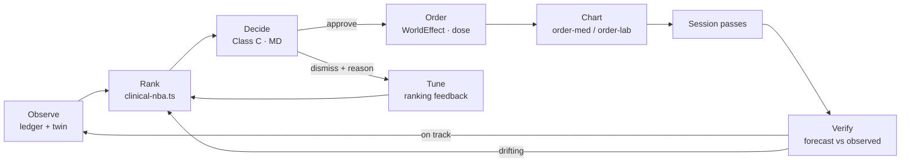

# Clinician Workflow — Three-Phase Plan

**Status:** proposed · **Date:** 2026-09-12 · **Owner:** clinical workflow track
**Companion docs:** `docs/ui-cohesion-persona-matrix.md`, `docs/living-cohorts.md`, `docs/renal-protocols-implementation-strategy.md`

---

## 1. Why this plan exists

The clinical *logic* in this platform is sound: seven protocol packs, coverage gates that refuse,
guardrails that block, Class-C human-in-the-loop, dynamic and user-defined cohorts that compose
protocol outputs. What is missing is the **operative workflow** — and it is missing at three joints
that were never connected, not from a lack of intelligence.

| # | Joint | What exists today | The gap |
|---|---|---|---|
| **J1** | approve → **the patient** | `OutcomeEpisodeCoordinator.dispatchCommand(id, action)` records an idempotent command (`src/swarm/outcome-episode.ts:263`) | The command is a **string**, never a `WorldEffect`. All 11 call sites pass a bare kind. Nothing reaches the realm ledger, and the **dose never travels** |
| **J2** | dismiss → **the reason** | `NbaDecision { decision: 'approved' \| 'dismissed' }` (`src/swarm/workspace.ts:663`) | No `reason` field, while `CohortDecisionDoc` *requires* one — its own comment says a decline "is the only feedback the fleet gets". NBA dismissals lose exactly that signal |
| **J3** | verify → **this patient** | `scoreEsaTwinDrift` (forecast-vs-observed, MAPE bar 10%), `esaWhatIf` 12-week projections | Verification runs a **CMS measure at cohort level**, not "did *this* patient respond". The patient-level answer is already computed and never wired to `verify` |

### Why a nephrologist notices immediately

They sign an action; the state chip flips to *Coordinating*; **nothing appears in the patient's
record**. Later, the loop "closes" on a measure they cannot see at the bedside. That is the
difference between a demo and a tool used on Monday.

### The target loop

**J1 is D. J2 is H. J3 is G.** Everything else already works.

---

## 2. Non-negotiable invariants

These hold in every phase and are asserted by tests, not by convention.

1. **Never autonomous.** Every clinical action reaches a patient only through a recorded human decision. No phase introduces an auto-order path.
2. **Fail closed.** If the information needed to act is missing (no dose, stale iron, blocked coverage), the action does not dispatch — it reports why.
3. **One approval, not two.** The episode is the human decision. When it dispatches, the effect must **not** re-enter the realm's HITL gate as a fresh pending approval (`src/realm/effect-reducer.ts:130` suspends before authority — a naive wiring doubles every approval).
4. **Idempotent in the chart, not just in the machine.** Replaying a command with the same key must produce **one** order.
5. **The value claim keeps its unit.** A dose travels as a dose, a lab as a lab. No phase re-denominates anything.
6. **No new models.** Every phase below is wiring, presentation and control flow. The intelligence is already built and tested.

---

## 3. Phase 1 — The operative loop *(approve means something)*

> **Status: implemented 2026-09-12.** Seam, command order draft, dispatcher, route wiring,
> anemia's order draft and 17 tests (`tests/clinical-dispatch.test.ts`). Verified live against
> `realm:b3`: an approved episode produced a real `Encounter` in the record
> (`urn:realm:realm:b3:encounter:f1-pt-0001-followup-7758`, readable as FHIR with
> `subject: Patient/f1-pt-0001`), a retry reported `replayed: true` with the same `effectId` and
> placed nothing, a command with no draft failed closed (`no-order-draft`), and the cell contract
> blocked a mismatched action (`cell treatment-continuity may not emit order-lab`).
>
> **Remaining before the phase is closed:**
> - Pack-created episodes must carry `realmId` (the clinical bridge knows it from the finding).
>   Until then a dispatch needs the caller to pass `realmId`, and the fixture-seeded demo episodes
>   (`patient:p-esa-1`) cannot dispatch at all — correctly, since no realm contains them.
> - The exec approval flow should surface `dispatch` / `dispatchError` instead of discarding the
>   new fields, so "signed but not placed" is visible where the decision was made.
> - Anemia drafts `order-med`; the other six packs still need their drafts (mechanical, each is a
>   few lines once its dose/target is identified).

**Goal:** an approved action becomes a real order in the patient's record, carrying the amount, exactly once.

### Work

| Step | Change | Where |
|---|---|---|
| 1.1 | `EpisodeCommand` gains an **order draft**: `{ effect: WorldEffectKind; payload: Record<string, unknown> }` — the same shape the reducer already consumes (`order-med` needs `code/dose/route/frequency/indication`, `src/realm/effect-reducer.ts:271`) | `src/swarm/outcome-episode.ts` |
| 1.2 | `ClinicalActionSpec`/`ClinicalFinding` gain an `order` draft so the **pack** states the order, not the console. Anemia supplies `{ code: 'epoetin-alfa', dose: String(recommendedDose), route: 'IV', frequency: 'weekly' }` | `src/swarm/clinical-nba.ts`, each `src/swarm/*.ts` |
| 1.3 | The proposal payload carries the order draft to the episode, so `dispatchCommand` receives it (no console-side invention of a dose) | `clinicalNbaState` → episode `propose()` |
| 1.4 | A **single** dispatcher seam: `dispatchApprovedCommand(realm, presence, episode)` emits the effect with the human's presence and an `approvedBy` reference, so HITL sees a decided approval rather than opening a second one | new `src/swarm/command-dispatch.ts` |
| 1.5 | Route wiring: `POST /admin/swarm/episodes/:id/decide` → dispatch. The episode's `approve` and the realm emit become one transaction-ish step, with the emit failing closed if the realm/presence is absent | `src/server/swarm-routes.ts:363` |
| 1.6 | FHIR write-back is free: `effectToFhirResource` already maps `order-med` → `MedicationRequest` and `order-lab` → `ServiceRequest` | `src/fhir/effect-map.ts` |

### Tests (Phase 1 exit)

- **Idempotency in the chart:** dispatch twice with the same `idempotencyKey` → **one** medication entity, one ledger effect.
- **One approval:** an approved episode leaves `hitl.listPending()` **unchanged** (no second pending approval).
- **Dose travels:** the dispatched `MedicationRequest`/medication entity carries `dose`/`route`/`frequency` from the recommendation.
- **Fail closed:** an action whose spec has no order draft, or whose card is blocked/out-of-coverage, throws a typed error and does **not** touch the ledger.
- **Reversibility:** a dispatched order is visible in the ledger with its `effectId`, so rollback/hold remains possible through the existing vocabulary (`hold-med`).

### Demo moment it unlocks

> "Dr. — approves the ESA increase for `rb-knoxville-a-pt-0008`. Open the patient: a weekly
> epoetin-alfa order at 10,000 u is in the record, ordered by her, with the evidence attached."

---

## 4. Phase 2 — Patient-level verification and clinical language

> **Status: implemented 2026-09-12.** `verify` carries a kind + detail; `esaPatientOutcome`
> derives the patient's own response from the twin; `POST /episodes/:id/ack {kind:'patient-outcome'}`
> scores forecast-vs-observed from the live ledger; dismissals require a reason (`reason-required`);
> the queue reads as `problem · patient` / `Proposed: … · N evidence objects · class X`; the ranked-action
> detail is relabelled (Priority, Approval effort, Risk if wrong) with internal identifiers behind a
> *Technical detail* toggle; the exec drawer shows Order (placed / not placed) and the patient's response.
> Tests: `tests/clinical-workflow-p2.test.ts` (6). Full suite **1239 passed + 3 skipped**.
>
> **Note on the label change:** three tests asserted the OLD titles (kind ids with dots swapped for
> spaces). They now assert case-insensitively against the clinical words and additionally assert the
> raw kind id does NOT reach a title. The subject's internal `patient:` prefix is stripped for display.

**Goal:** the clinician sees what happened to **this** patient, in language they own.

### Work

| Step | Change | Where |
|---|---|---|
| 2.1 | `verify` accepts a **patient-level outcome** as well as a measure: `{ kind: 'measure' \| 'patient-outcome', met, detail }`. Outcome derived from the twin's forecast-vs-observed (`scoreEsaTwinDrift`) | `src/swarm/outcome-episode.ts`, `src/swarm/anemia-twin.ts` |
| 2.2 | The episode detail renders a **response card**: predicted vs observed, MAPE, verdict — the same numbers the twin page already shows | `/api/work/:id` detail, `exec-app` drawer |
| 2.3 | **Dismissal requires a reason** for ranked actions, mirroring cohorts: `NbaDecision.reason` (required on `dismissed`, 400 otherwise) and the criterion version in force | `src/swarm/workspace.ts:663`, `src/server/swarm-routes.ts` |
| 2.4 | **Queue summary becomes clinical.** Replace `Outcome episode in AwaitingApproval · approval class C · 2 evidence ref(s)` with `problem · patient · proposed action · due` | `src/server/platform-routes.ts:192` |
| 2.5 | **Vocabulary pass** on the decision surfaces: "Rank score" → **Priority**; "Policy cost" → **Approval effort**; `proposal kind: adequacy.ktv.proposal` → hidden behind a technical-details toggle; `Bel/Pl/K` → **"Evidence: corroborated / weak / contested"** with the numbers demoted to the tooltip | `exec-app/src/components/ranked-actions-panel.tsx`, `fleet-actions-board.tsx`, `my-work.tsx` |

### Tests (Phase 2 exit)

- Dismissing without a reason → `400`; with a reason → durable, retrievable, attributed to the actor.
- `verify` records a patient-level outcome; the drawer payload contains predicted, observed and verdict.
- The queue summary contains the patient id and the action (regression test at the wire — this is the surface that told the reader nothing).
- No internal identifier (`proposal kind`, `insight kind`, `cell kind`) is rendered without a clinician-readable label.

### Demo moment it unlocks

> "Two weeks after her dose change: predicted 10.4 g/dL, observed 10.6, MAPE 2.6% — on track."

---

## 5. Phase 3 — The daily rhythm *(the adoption layer)*

**Goal:** it fits a dialysis day and sells itself without a script.

> **Status: Phase 3 COMPLETE — 3.1, 3.2, 3.3, 3.4, 3.5 and 3.6 implemented 2026-09-12**
> (64 tests across `tests/clinical-workflow-p3.test.ts`, `tests/adoption-metrics.test.ts`,
> `tests/next-session.test.ts`, `tests/round-digest.test.ts` and `tests/round-routes.test.ts`;
> full suite 1304 passed + 3 skipped).
>
> Two decisions made while implementing, both to keep one answer from meaning two things:
> - **The decision rules live in one place** (`src/swarm/nba-decision.ts`). The swarm route and
>   My Work both call `validateRankedDecision` + `decideRankedAction`, so "a deferral must name a
>   time" is enforced identically at every door. A rule duplicated per surface is a rule that
>   drifts, and the surface that drifts is always the one nobody tested.
> - **Only an approval touches clinical state.** Deferring and handing off record a statement about
>   the human, not the patient, so they must not open or advance an episode.
>
> A pre-existing defect surfaced and was fixed: `listNbaDecisions()` claimed to return the latest
> decision per NBA but, because it overwrote a Map while walking a newest-first list, returned the
> **oldest**. A re-decision was therefore invisible — a snooze could keep hiding an action after a
> later dismissal, and a superseded dismissal could reappear as current. It now compares `updatedAt`.
> Nothing can be trusted downstream of a decision ledger that reports a stale answer.

### Work

| Step | Change | Reuses |
|---|---|---|
| 3.1 | ✅ **Approve a trajectory, not a number.** The dose what-if curve (candidates vs the 10–12 band, MPC choice) renders **inside the approval** | `esaWhatIf`, `anemia-cds` forecast panel |
| 3.2 | ✅ **Next-session lens** (chair-side): patients at IDH risk *next session* with the specific UF change and its counterfactual | fluid prior + `what-if` |
| 3.3 | ✅ **"Since your last round"** digest: what moved, what is newly at risk, ordered by severity delta | protocol registry severities + durable `round-snapshot` |
| 3.4 | ✅ **A refusal becomes an order.** "No recommendation — iron panel stale (122 d)" offers a one-click lab order through the same dispatch path | coverage gate + `order-lab` |
| 3.5 | ✅ **Defer and hand off.** "Snooze until next session" / "hand to covering MD" (weekend coverage is already a demo insight) | `nba-decision` store, extended |
| 3.6 | ✅ **Adoption metrics on the cockpit:** verdict coverage of today's ranking, dismissal reasons clustered by meaning, and how work moves between people | `analyseCohortDeclines` pattern |

### 3.4 in detail — a refusal that is a data gap

The anemia guardrail blocks a dose when iron status is stale, which left the clinician with a
refusal and nothing to do about it. `anemiaActionFor(rec)` now converts that specific block into
`order-iron-panel`, a real `order-lab` owned by the `iron-management` cell (which already permits
`order-lab`), so the action passes the allowlist instead of being rejected. What it deliberately
does NOT do:

- No dose is fabricated. `esaOrderDraft` still returns nothing for a blocked window; the order that
  is placed is the iron panel, never an invented titration.
- A **microcytic** block with a *fresh* panel stays silent (`blocked` → `null`). That block is a
  clinical decision, not a missing test, and inventing an order for it would be noise.
- The guardrail's own words are carried into the recommendation, so the order and the audit trail
  explain themselves.

### 3.5 in detail — "not now" and "not mine"

Both are first-class answers because they are the realistic ones; forcing either into a dismissal
would poison the only quality signal the ranking gets.

- **Deferred** requires a parseable future instant. A timeless deferral is a silent dismissal, so it
  is refused (`defer-until-required`), and so is a time that has already passed
  (`defer-until-in-the-past`, which would hide the action forever).
- **Handed off** requires a recipient (`handed-to-required`). The handoff moves the work only to a
  console that can actually approve it; a handoff to a console that cannot stays in the decision
  console with the recipient named as owner, because an action that vanishes is indistinguishable
  from an action that was lost.
- **The queue obeys the stored time**, not an in-process timer: a deferral is hidden while in force
  and appears the moment it is due. An unparseable time fails **open** (visible), because hiding
  work forever is worse than showing it once too early.
- `GET /admin/swarm/nba` no longer reports a deferral or a handoff as `dismissed`.

### 3.1 in detail — the trajectory travels with the number

`esaWhatIf` already computed the candidate curve; the approval showed only the chosen dose. Now the
curve is attached at **ranking time** (`ClinicalFinding.trajectory` → `NbaCandidate.trajectory` →
the proposal payload) and the console *renders* it. It never recomputes it: a second derivation could
disagree with the value being approved, and then two truths exist for one decision.

Two honest constraints:

- **The dose being approved is always one of the curve's rows** (the KDIGO ±25% dose is a candidate
  factor), so the reader can see what the dose in front of them actually projects. The controller's
  preferred candidate is marked separately — if the two differ, the reader can see that too, which
  is information, not a defect to hide.
- **A blocked analysis carries its reason and no points.** A flat fabricated line would put an
  invented Hb projection in front of a prescriber, which is the thing the guardrail exists to stop.

### 3.6 in detail — adoption without a scoreboard

The cockpit now reports whether the ranking is being answered, and refuses to invent what it cannot
measure:

| Reported | Why it is trustworthy |
|---|---|
| Verdict coverage of **today's** ranking | Computed against the currently published actions, not against history. A pile of verdicts on actions nobody suggests any more is history, and counting it as coverage would flatter the number |
| Dismissal reasons, clustered **by meaning** | Word order and punctuation are folded, different meanings are not. Every wording that fed a cluster is kept and shown, so the fold hides nothing |
| **Concentrated** vs **clustered** | Concentration is a property of the dismissals (≥2, ≥60% share). Cluster status also needs the 5-decision floor. One refusal is one opinion and is never promoted to a finding |
| Defer / handoff share | Read as *work moved*, not as refusal — the honest reading of a correct-but-early suggestion |
| ~~Time to decision~~ | **Not measured.** The moment a ranked action first appeared to a human is not recorded anywhere, so any latency computed from the decision row would measure nothing but the clock. The panel states this explicitly rather than showing a number nobody should trust |

Adding the missing instrument (a first-seen timestamp on the ranking) is deliberately left out of
this slice: it is a data-model change, not a display change, and shipping an estimate instead would
be worse than shipping the gap.

### 3.2 in detail — the counterfactual is real or it is absent

The lens ranks the whole unit by the IDH risk of the **next** session and carries, for every
patient it flags, the change the fluid pack proposes *and what that change does to the risk*.

One rule carries the whole feature. `fluidRecommend` computes the expected series from
`recommendedRate ?? ufRateMlH`, so for a hold, a temperature/sodium profile or an adherence-first
block the two rates are identical and the "expected" series *is* the current one. Presenting that as
a counterfactual would be a number that looks like evidence of benefit and is really an absence of
change — so the counterfactual is emitted only when the rate actually changes, and its absence
carries a reason the clinician reads. Live, this is not a corner case: of the 4 flagged patients,
3 propose "address between-session adherence first" and therefore have **no** rate counterfactual,
and the view says so.

Also carried: `unassessable` (no telemetry, or a target weight nobody has re-checked) is counted
**outside** the risk bands. A patient whose risk could not be measured is not a low-risk patient.

### 3.3 in detail — the baseline has to be recorded

Severity is a function of a patient's *entire* window at one moment, so it cannot be re-derived for
a past moment from the ledger. The baseline is therefore a recorded round (`round-snapshot`,
newest-first, scoped by clinician), and `diffRounds(null, …)` returns `baseline: null` **with a
reason** rather than an empty list — an empty diff reads as a calm fleet, which is the one thing a
digest must never imply.

The diff obeys three rules:

| Rule | Why |
|---|---|
| Movements under 0.05 severity are not reported | These severities come from fixed rules; a zero-drift cohort must not fill the list with decimal noise |
| "Newly at risk" = green/unknown **before** and red/amber **now** | A patient who was already red and got worse is a *worsening*, not a discovery — calling it new would make the digest look like it found more than it did |
| Departed ≠ improved | Discharged, transferred or removed patients are named separately. Leaving is not recovering |

`?by=<clinician>` scopes the baseline, so a clinician is compared against their own last round and
never silently handed a colleague's.

### Tests (Phase 3 exit)

- ✅ The trajectory is present in the approval payload (ranked action **and** proposal), the ordered dose appears among its rows, and a blocked analysis carries a reason with zero fabricated points — no client-side recomputation.
- ✅ A snoozed action reappears at the stated time and not before; a handed-off action names its recipient as owner and does not appear for a role whose console cannot act on it.
- ✅ Coverage refusals produce a dispatchable lab order, placed into the patient's record with the patient injected by the bridge and the guardrail reason preserved.
- ✅ The lens shows a counterfactual **only** when the rate changes, reports the absence with a reason otherwise, and never counts an unassessable window as low risk.
- ✅ A digest with no recorded round returns `baseline: null` at the wire; a recorded round is durable across a server restart and reusable as the next baseline; the same inputs diff to **zero** movements and a re-run is byte-identical.
- ✅ Adoption metrics refuse to report a `timeToDecision` field at all; a single dismissal is never promoted to a finding; a deferral is never counted as a dismissal.

### Defect found while verifying — FIXED (`realm.stop()` / `realm.start()`)

Verifying 3.3 live turned up a defect unrelated to the digest that would have made every page in
this phase look broken in a demo:

> Resuming a paused fleet advanced the tick counter while the realms emitted **nothing** — the
> effects total stayed at `27571` across 986 ticks. Every protocol severity was frozen, and the
> digest was correctly reporting "nothing moved".

**Root cause.** `Realm`'s constructor arms a clock listener that runs `ambient.tick()` (lab
maturation, patient trajectory, the insurance clock) and `rules.onTick()`. `stop()` cancels that
subscription and nulls the handle, but `start()` restarted **only the clock** — it never re-armed.
One `pause()` → `resume()` cycle therefore left a realm that *looked* alive (the tick counter
climbed, the status said `running`) with every ambient process permanently dead.

**Fix.** Both subscriptions now live in one idempotent `arm()`, called from the constructor *and*
from `start()`. `stop()` keeps tearing them down, so a removed realm still releases its timers.

**Evidence.** The identical resume that produced 0 effects now produced **+3617 in 20 seconds**; the
round digest went from "nothing moved" to **28 movements — 14 worsened, 14 improved, 5 newly at
risk** — each naming real drivers from the ledger (`CRP 11.5 mg/L — ESA hyporesponsiveness`,
`IDWG 5 kg (>2.5 kg) — volume overload`, `1 shortened session(s) on the ledger`).

**Regression tests.** `tests/realm-lifecycle.test.ts` (ambient processes tick after a stop/start; the
clock is genuinely stopped while stopped; repeated cycles do not multiply subscriptions; effect→rules
still produces its Experience) and `tests/simulator.test.ts` ("a resumed fleet still produces
events"). **Two of the four lifecycle tests fail if the fix is reverted** — verified by reverting it,
so the tests are known to catch the defect rather than merely pass.

### Demo moment it unlocks

> Pre-round: "Three patients will crash next session under the current UF — here is the change,
> and here is what it does to their nadir BP." Round: one approval with the trajectory in front of
> them. Next week: the response curve, per patient.

---

## 6. Defect → phase map (nothing dropped)

| Finding | Phase |
|---|---|
| Command carries a verb, not an order; nothing reaches the chart | **1** |
| Dose does not travel with the action | **1** |
| Double-approval trap (realm HITL + episode) | **1** |
| Idempotency proven in the machine, not in the chart | **1** |
| Verification is cohort-level, not patient-level | **2** |
| Dismissal has no reason (asymmetric with cohorts) | **2** |
| Queue summary is machine prose | **2** |
| `Bel/Pl/K`, `policy cost`, `rank score`, `proposal kind` leak to clinicians | **2** |
| Approving a number instead of a trajectory | **3** |
| Refusals are dead ends rather than lab orders | **3** |
| No defer / handoff (weekend coverage) | **3** |
| No feedback loop from dismissals into ranking | **2** (capture) → **3** (surface) |

---

## 7. Sequencing, risk and scope

**Order is deliberate.** Phase 2's dismissal reasons are the input Phase 3's adoption metrics
read; Phase 1 must land first or Phase 2 verifies orders that were never placed.

| Risk | Mitigation |
|---|---|
| Double approval (realm HITL gate + episode approval) | Invariant 3 + an explicit test that `listPending()` is unchanged after an approved dispatch |
| Duplicate orders on retry | Idempotency key travels to the reducer; test asserts one entity |
| "Synthetic" orders mistaken for real ones | Keep the synthetic label end-to-end; the order is written to the sim realm and labelled as such |
| Language pass breaking auditor surfaces | Auditor-facing views keep the technical vocabulary; the pass is scoped to clinician surfaces |
| Scope creep into new models | Invariant 6 — this plan is wiring only |

### Explicitly **not** in scope

- Any autonomous ordering path, in any phase.
- New predictive models or retraining.
- Redefining protocol → cohort assignment (separate decision; see the protocol-assignment analysis).
- Merging the ops and exec consoles (a separate decision about where clinician work lives).

### Definition of done

- **Phase 1:** an approved action lands in the patient's chart once, with its amount, and the realm's approval queue is untouched.
- **Phase 2:** every ranked action can be dismissed with a reason, and every approved action can be verified against the patient's own response.
- **Phase 3:** a clinician can run a pre-round and a post-round from one screen, with the trajectory in front of them and the response behind them.
