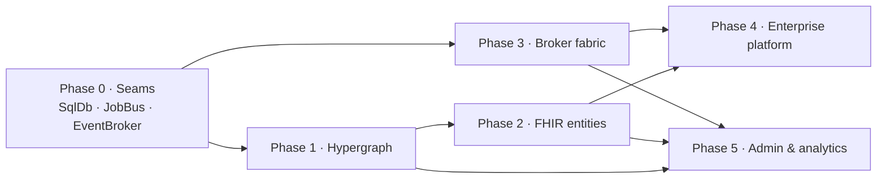

# Enterprise Implementation Roadmap — Anant Health Harness

> A phased, milestone-driven plan to take the harness from its current state to a governed,
> interoperable, enterprise healthcare platform. Grounded in `spec.md` + the gap analysis in
> `docs/spec-gap-fhir-analysis.md`. Each phase has a goal, concrete deliverables (files),
> acceptance criteria, and dependencies. Status legend: ✅ done · 🚧 in progress · ⬜ planned.

---

## 0. The architecture principle: everything is a swappable seam

The platform is built on **port / adapter seams** so no external system is hard-coded:

| Seam | Port | Adapters | Selector | Status |
|---|---|---|---|---|
| **Durable SQL** | `SqlDb` (`src/server/sql/sql-db.ts`) | `SqliteSqlDb`, `PostgresSqlDb` | `HH_STORAGE` | ✅ SQLite + **Postgres `anant-health`** verified |
| **Durable jobs** | `JobBus` (`src/server/job-bus.ts`) | `BullMQJobBus`, `KafkaJobBus`, `InProcessJobBus` | `HH_JOBBUS_DRIVER` | 🚧 exists, **unwired** (no handlers/enqueuers in prod) |
| **Event streaming** | `EventBroker` (⬜ new, §Phase 3) | inprocess, kafka, redis-streams, bullmq, rabbitmq, nats, sqs-sns, pubsub, event-hubs | `HH_EVENTBROKER_DRIVER` | ⬜ design below |
| **Identity** | `IdentityProvider` (`src/identity/`) | OIDC, SAML, WorkOS, SCIM | config | ✅ |
| **Ingestion** | `mapFhirBundle` / HL7v2 / CDA / X12 / stream (`src/adapters/`) | — | per-adapter | ✅ (FHIR-lite) |
| **Measure engine** | `MeasureEvaluator` (`src/measures/`) | cql-execution + cql-exec-fhir | — | ✅ |

**The event requirement:** "read and write events to all major event broker platforms" maps to the
`EventBroker` seam — one port, one canonical event shape (`CanonicalEvent`), N broker drivers.
Write path = transactional outbox → broker; read path = broker → `streamMessageToEvent` (already
exists in `src/adapters/event-stream.ts`) → `CanonicalEvent` → event store + handlers.

---

## Phase 0 — Portable seams (foundation)  [P0]  🚧

**Goal:** finish the three seams so every subsequent phase inherits "runs anywhere."

### 0.1 Durable SQL  ✅
- SQLite default; **Postgres `anant-health` on `localhost:5432`** (`postgres`/`postgres`) done +
  verified (all 10 portable tables migrated; round-trip OK). See `docs/spec-gap-fhir-analysis.md` §8.
- `fhir_resources` table added here in Phase 2 (same portable `MIGRATIONS` array).

### 0.2 Wire the JobBus  ✅
- The `JobBus` port + 3 drivers (BullMQ / Kafka / InProcess) exist. Now wired with real handlers:
  `src/server/job-handlers.ts` — `event.fanout` (JobBus → outbox → broker), `system.heartbeat`
  (liveness), `snapshot.backup` (durable realm backup), `knowledge.sync` (DLQ on failure),
  `agent.trigger` (durable agent invocation). `src/agents/scheduler.ts` — `AgentScheduler`
  enqueues `agent.trigger` jobs. Both `dev.ts` and `bootstrap.ts` register all handlers and
  enqueue a startup heartbeat (verified in dev log).
- Acceptance met: `tests/job-handlers.test.ts` (4) — handler invocation, knowledge.sync DLQ,
  scheduler → handler round-trip. Full knowledge-layer + AgentRuntime invocation wiring is
  Phase 1+ (handlers are the injectable seam).

### 0.3 EventBroker seam (port + drivers + outbox + publish/read paths)  ✅ (Phase 3 breadth open)
- Port: `src/server/event-broker.ts`

```ts
interface EventBroker {
  readonly driver: EventBrokerDriver;                       // 'inprocess' | 'kafka' | ...
  publish(record: { topic: string; event: CanonicalEvent; headers?: Record<string,string> },
          opts?: { partitionKey?: string }): Promise<void>;
  subscribe(binding: StreamBinding, handler: (msg: StreamMessage) => Promise<void>): Promise<void>;
  start(): Promise<void>;
  stop(): Promise<void>;
  health(): Promise<{ ok: boolean; driver: string; detail?: string }>;
  deadLetterSize(): Promise<number>;
}
type EventBrokerDriver = 'inprocess' | 'kafka' | 'redis-streams' | 'bullmq' | 'rabbitmq'
                       | 'nats' | 'sqs-sns' | 'pubsub' | 'event-hubs';
```

- Done: port; `InProcessEventBroker`, `KafkaEventBroker` (kafkajs), `RedisStreamsEventBroker`
  (ioredis); `createEventBroker` factory by `HH_EVENTBROKER_DRIVER`; `event_outbox` table
  (portable) + `SqlStore` outbox methods; `SqlEventOutbox` (`src/server/event-outbox.ts`);
  `withEventBrokerTelemetry` (`src/server/broker-telemetry.ts`) — publish span + counter for
  every driver; `buildApp` optional `onEvent` hook + `GET /events/broker` health route; both
  `dev.ts` and `bootstrap.ts` wire broker + outbox + read-path subscriber + telemetry.
  Conformance `tests/event-broker.test.ts` (6) + `tests/job-handlers.test.ts` (4, incl.
  telemetry decorator). Live-verified: POST /events → outbox delivered → broker recv;
  outbox {pending:0, delivered:1, dead:0}.
- Remaining (Phase 3): rabbitmq/nats/sqs-sns/pubsub/event-hubs drivers; real-broker conformance
  via testcontainers; DLQ topics/streams; realm → broker bridge (Flow A).

---

## Phase 1 — Populate the hypergraph (spec.md §5 gap list)  [P0]  ✅

**Goal:** the typed `HypergraphSchema` (`src/hypergraph/`) is no longer test-only — done.

- **`packs/healthcare-core/nodes.ts`** ✅ — **41 node schemas**: the 21 `EntityKind`s + `realm`
  + effect-derived nodes (care-plan, assessment, claim, prior-auth, measure, …). Invariant:
  every domain node requires `realmId` + the kind's id attr (clinical fields optional —
  enforced at the effect layer in 1b). Substrate `twin.persona`/`memory-entry`/`voice-channel`
  derived from real sources (no `src/twin`/`src/behaviors` — see the gap doc).
- **`packs/healthcare-core/edges.ts`** ✅ — **17 domain hyperedges** (care-team,
  encounter-context, order-context, medication-administration, chair-assignment,
  insurance-coverage, prior-auth-thread, claim-thread, measure-evaluation-provenance,
  ambient-delivery, hitl-approval-thread, intent-plan-tree, safety-event-rca,
  care-plan-lineage, effect-attribution, realm-membership, derived-reference).
  `derived-reference` (Phase 1b) is the generic relation edge: any EntityRecord
  `relation → target` becomes a `from → to` edge with `attributes.relation`.
- **`packs/healthcare-core/hypergraph.ts`** ✅ — `buildHealthcareHypergraphSchema()` +
  `createHealthcareHypergraph()` (schema + `MutationLedger` + `HypergraphStore`).
- **`src/realm/entity-record.ts`** ✅ — the EntityRecord → HyperNode bridge:
  `entityRecordToHyperNode()` (kind→type, urn→id, state→attrs, synthesizes kind-id),
  `materializeEntityGraph()` (fresh store: realm root + every entity node + realm-membership
  edge), `effectToHyperNode()` + `effectAttributionEdge()` (write-path projection; edge
  agent-run binding defaults to `agentSpecId` but honors the live `runId`).
- **`src/hypergraph/queries/healthcare.ts`** ✅ — canned queries: `countsByType`,
  `careTeamFor`, `encountersForPatient`, `effectAttributionFor`, `realmGraph`, `edgesForNode`,
  `nodesForRealm`, `findPatientNode`, `edgesByType`.
- **Admin routes** ✅ — `GET /admin/hypergraph/schema` + `GET /admin/hypergraph/realm/:id`
  (prefers the realm's live bridge when attached, else cold-materializes).
- Tests ✅ — `tests/hypergraph-healthcare.test.ts` (5): schema registration + role-type
  integrity, required-realmId validation, materialize → typed nodes/edges, care-team +
  encounters queries, effect/attribution write path. Live-verified: `realm:hg-1` →
  33 nodes (realm + 26 org-node + facility + unit + 4 patients) + 32 membership edges.

---

## Phase 1b — Live effect → hypergraph bridge  [P0]  ✅

**Goal:** `EffectReducer.apply()` auto-upserts hypernodes/edges on every mutation against a
persistent per-realm store, deriving domain edges from entity relations + the effect ledger.
The hypergraph is no longer a snapshot — it is a live projection of the realm.

- **`src/realm/hypergraph-bridge.ts`** ✅ — `RealmHypergraph` (schema + `HypergraphStore` +
  assert-once `Set`s): realm-root node on construct; `upsertNode` / `ensureMembership` /
  `upsertEdge` (assert-once, schema-validated, silently skips not-yet-live targets);
  `upsertEntity` (node + membership + a `derived-reference` edge per `relation → target`);
  `upsertEffect` (effect node + presence node + agent-run node (`runId = presence.runId ||
  agentSpecId`) + `effect-attribution` edge).
- **`src/realm/effect-reducer.ts`** ✅ — `ReducerOpts.hypergraph?: RealmHypergraph`; after
  `ledger.attachMutations`, `upsertEffect(emitted, presence)` + `upsertEntity` per mutated
  record. Rejected/suspended effects skip projection (only accepted effects mutate the world).
- **`src/realm/realm.ts`** ✅ — `RealmOpts.hypergraph?`, `readonly hypergraph` field, passed
  through to the reducer.
- **`packs/healthcare-core/edges.ts`** ✅ — `derived-reference` edge (from/to multi over all
  node types; `attributes.relation` + `realmId`).
- **Admin routes** ✅ — `POST /admin/realms` attaches `new RealmHypergraph(schema, id)` to every
  realm; `GET /admin/hypergraph/realm/:id` prefers the live bridge (`live: true`) else
  cold-materializes.
- Tests ✅ — `tests/hypergraph-bridge.test.ts` (3): effects populate nodes + membership +
  relation-derived edges (`of-order`), effect-attribution links effect→presence→agent-run,
  assert-once idempotency. Full suite 327 passed; tsc clean. Live-verified: `realm:hg1` after
  admit → order-lab → result-lab: 9 nodes (realm, patient, order, result, 3×effect, presence,
  agent-run) + 8 membership + 3 attribution edges, `live: true`.

---

## Phase 2 — FHIR entity support (all entities consume FHIR)  [P0]  ✅

**Goal:** every entity can hydrate from and serialize to FHIR R4. Full design in
`docs/spec-gap-fhir-analysis.md` §5 (including the complete `EntityKind ↔ FHIR Resource` table
and the effect→resource write mapping). Done — the typed `src/fhir/` model + registry + routes;
`client.ts`/`subscription.ts` (outbound EHR push + CDC) are deferred to the EHR-bridge item below.

- **`src/fhir/types.ts`** ✅ — dependency-light typed R4 subset: Patient, Encounter, Observation,
  ServiceRequest, MedicationRequest, Medication, Practitioner(+Role), Organization, Location,
  Device, Coverage, Claim, CarePlan, Task, CommunicationRequest, Measure, Library, ValueSet,
  AuditEvent, Provenance, Flag, MeasureReport, OperationOutcome, Bundle + datatypes
  (Coding/CodeableConcept/Identifier/Reference/Period/Quantity/HumanName/Address/ContactPoint/
  Meta/Dosage/Annotation/Money/Narrative) + `CODE_SYSTEMS` (LOINC/SNOMED/RxNorm/ICD-10/CPT/MRN/NPI)
  + `code()`/`concept()` helpers.
- **`src/fhir/fhir-bundle.ts`** ✅ — `buildBundle` (deterministic collection Bundle),
  `parseBundle` (validation), `indexBundle` (`{resourceType}/{id}` + `#frag`), `resolveReference`
  (resource refs, contained `#`, identifier-system lookup).
- **`src/fhir/effect-map.ts`** ✅ — **the FHIR write path**: `effectToFhirResource(effect, {ctx})`
  projects every clinical `WorldEffect` → R4 (admit/transfer/discharge→Encounter,
  order-lab/followup→ServiceRequest, order-med→MedicationRequest, result-lab/vitals/
  assessment→Observation (LOINC vitals, component for BP), update-care-plan→CarePlan,
  submit-claim/prior-auth→Claim, open-ticket→Task, flag-safety→Flag, operator-directive→
  CommunicationRequest); PHI `meta.security` stamped. `effectResourceType()` for display.
- **`src/fhir/mapping.ts`** ✅ — `RESOURCE_TO_KIND` + `KIND_TO_RESOURCES` (reconciled to the real
  `EntityKind` union: Claim→insurance, MeasureReport→cost-record, CarePlan→plan, …),
  `ENTITY_FHIR` registry (`hydrate` + `serialize` per kind: patient, facility, unit, encounter,
  order, result, medication, staff, equipment, insurance, org-node, work-artifact, plan,
  cost-record, agent-run), `hydrateBundle` (extends `mapFhirBundle` from 2 → all mapped types),
  `serializeEntity`.
- **`src/fhir/canonical.ts`** ✅ — **consume path into a live realm**:
  `ingestCanonicalEvents({realm, ctx, presence, events})` → effect-able resources become
  `WorldEffect`s through an md ingest presence (Encounter→admit/discharge, ServiceRequest→
  order-lab, MedicationRequest→order-med, Observation→result-lab/vitals, CarePlan→
  update-care-plan), structural resources (Patient/Org/Location/Practitioner/Device/Coverage)
  upsert straight into the EntityGraph + Phase 1b hypergraph bridge. Returns effects + structural
  upserts + skipped.
- **`src/fhir/export.ts`** ✅ — `serializeRealm`/`exportRealmBundle` (realm → R4 Bundle, skips
  derived kinds unless `includeDerived`, optional `includeEffects` for the write path),
  `serializeRealmEntity` (single entity as R4).
- **`src/fhir/routes.ts`** ✅ — `POST /admin/fhir/ingest` (bundle → hydrate → ingest → durable
  mirror), `GET /admin/fhir/export/:realmId` (→ Bundle, `application/fhir+json`),
  `GET /admin/fhir/entity/:realmId/:kind/:id`, `GET /admin/fhir/resources` (mirror),
  `GET /admin/fhir/map`. Registered in `app.ts`.
- **Durability** ✅ — `fhir_resources` table in the portable `MIGRATIONS` + `SqlStore`
  `saveFhirResource` / `listFhirResources` / `getFhirResource` / `clearFhirResources`.
- **Admin** ✅ — "FHIR entities" panel in `admin-ui/index.html`: ingest form (realm + bundle
  JSON), realm export → Bundle (summary + JSON view + download), resource→kind map table,
  durable-mirror `dataGrid`. Verified in-browser.
- Tests ✅ — `tests/fhir.test.ts` (5): bundle utilities, effect→resource write path, entity
  serialize/export round-trip, bundle→realm ingest (effects + structural + hypergraph),
  HTTP ingest→export→entity→mirror. Full suite 332 passed; tsc clean. Live-verified: ingest
  Patient/Encounter/ServiceRequest/Observation into `realm:fhir-live` → 4 hydrated / 3 effects /
  1 structural; export 33 resources across 6 types; entity route returns typed Patient; mirror
  persists 4 resources; hypergraph `live: true` with patient/order/result/effect nodes.
- **Deferred (Phase 5 admin / EHR-bridge):** `client.ts` outbound EHR push, `subscription.ts`
  FHIR Subscription/CDC pump, CDS-Hooks endpoint. (`session-event → AuditEvent` projection landed
  in Phase 4.)

---

## Phase 3 — Event broker fabric: read/write to ALL major brokers  [P0]  ✅

**Goal (explicit requirement):** publish + consume `CanonicalEvent`s through every major
broker behind the single `EventBroker` seam, with conformance-tested drivers. All nine drivers
land; inprocess (CI) + Redis Streams + BullMQ conformance is green against a real containerized
Redis; SDK-backed drivers are lazy-loaded + injectable-SDK tested.

### 3.1 Driver matrix

| Broker | Driver | Publish primitive | Consume primitive | Dependency | Config |
|---|---|---|---|---|---|
| In-process (dev/test) | `inprocess` | in-memory bus | same | — | `HH_EVENTBROKER_DRIVER=inprocess` |
| Apache Kafka | `kafka` | produce → topic | consumer group (+ retry/DLQ topics) | `kafkajs` (already dep) | `HH_KAFKA_BROKERS`, `HH_KAFKA_CLIENT_ID` |
| Redis Streams | `redis-streams` | `XADD` | `XREADGROUP` | `ioredis` (already dep) | `HH_REDIS_URL` |
| Redis (BullMQ) | `bullmq` | `Queue.add` (jobId dedup) | `Worker` | `bullmq` (already dep) | `HH_REDIS_URL` |
| RabbitMQ | `rabbitmq` | exchange `publish` | queue `consume` (DLX DLQ) | `amqplib` (lazy) | `HH_RABBITMQ_URL` |
| NATS (JetStream) | `nats` | `publish(subject)` msgID dedup | explicit-ack consumer | `nats` (lazy) | `HH_NATS_URL` |
| AWS SNS/SQS | `sqs-sns` | SNS `Publish` (FIFO group+dedup) | SQS `ReceiveMessage` | `@aws-sdk/client-sns`+`client-sqs` (lazy) | AWS creds + `HH_SNS_TOPIC`, `HH_SQS_QUEUE_URL` |
| Google Pub/Sub | `pubsub` | `publishMessage` orderingKey | pull subscription | `@google-cloud/pubsub` (lazy) | `HH_PUBSUB_PROJECT` |
| Azure Event Hubs | `event-hubs` | `sendBatch` partitionKey | consumer group | `@azure/event-hubs` (lazy) | `HH_EVENTHUB_CONNECTION`, `HH_EVENTHUB_NAME` |

### 3.2 Deliverables (all ✅)
- **Drivers** — `src/server/{inprocess,kafka,redis-streams,bullmq,rabbitmq,nats,sqs-sns,pubsub,event-hubs}-event-broker.ts`.
  `bullmq` reuses ioredis/bullmq with `jobId = event.id` (broker-level idempotency) and
  `maxRetriesPerRequest: null` for the shared connection; the five SDK-backed drivers use
  `src/server/lazy-require.ts` (lazy `createRequire`, mirrors `node:sqlite`) with **injectable
  SDKs** for tests, and each takes a minimal structural SDK type so the optional deps never
  hard-fail import.
- **Factory** — `event-broker-factory.ts` wires all nine drivers by `HH_EVENTBROKER_DRIVER`;
  missing config/SDK throws a clear `EventBrokerError`.
- **Outbox + replay** — `event-outbox.ts` gains `OutboxPublisher` (periodic flush with backoff)
  and `replay(broker, {since})` → re-publishes delivered events after a `delivered_at` cursor
  (`SqlStore.deliveredOutboxEventsSince`).
- **Read path** — `src/server/event-router.ts`: `BrokerEventRouter` consumes bindings,
  `streamMessageToEvent` → dispatch by event type (+ `'*'` wildcard), with consume/dispatch
  stats.
- **Realm → broker bridge** — `src/server/realm-event-bridge.ts`: `RealmEventBridge` subscribes
  to each realm's effect ledger, `effectToCanonicalEvent` projects every `EmittedEffect`
  (admit→hospitalization.admitted, order-lab→treatment.scheduled, result-lab→
  lab.result-arrived, …), and publishes (durably via the outbox when provided). Admin routes
  attach on `POST /admin/realms`, detach on `DELETE`, plus `POST /admin/realms/:id/bridge`.
- **Telemetry** — `withEventBrokerTelemetry` wraps publish with a span + `broker.event.out`
  metric (Phase 0).
- **Admin** — `GET /admin/broker` (health + DLQ + outbox + bridge stats), `POST /admin/broker/replay`,
  `GET /admin/broker/drivers`; admin UI **System → Event broker** panel (driver card, DLQ,
  outbox, bridge, driver matrix, replay) — verified in-browser.
- **Config + `.env.example`** — all `HH_*` driver vars documented.

### 3.3 Semantics (every driver honors)
- At-least-once delivery + consumer idempotency by `event.id` (outbox marks delivered).
- Ordering per partition key (`subjectId`/`scopeId`) — broker primitive per driver (Kafka
  partition, Redis stream, BullMQ FIFO queue, RabbitMQ single-queue, SQS FIFO, …).
- DLQ per driver (inprocess in-memory list, BullMQ failed set, RabbitMQ DLX queue, SQS redrive,
  NATS max_deliver, …).
- Replay from cursor (outbox `delivered_at`).
- Clearance/scope enforced at the consumer boundary via `ScopedEventStore`.

### 3.4 Acceptance  ✅
- `tests/event-broker-conformance.test.ts` — one suite run per driver: publish N → consume N,
  ordering per partition key, idempotency (at-least-once + dedup-by-id), DLQ, health, outbox
  replay-from-cursor, realm→canonical projection. Green on `inprocess` (CI) **and** on real
  Redis Streams + BullMQ via testcontainers (`RUN_REAL_BROKER_TESTS=1` spins a `redis:7-alpine`
  container). RabbitMQ driver logic is tested against an in-memory fake amqplib SDK; the other
  lazy drivers assert clear missing-SDK errors. Full suite 340 passed; tsc clean. Live-verified:
  create `realm:ph3` → 2 effects → bridge `attached:1 / projected:3 / published:3`, outbox
  delivered 4, replay republished 4; admin Event broker panel live.

---

## Phase 4 — Enterprise platform features  [P1]  ✅

**Goal:** close the enterprise gaps from `docs/spec-gap-fhir-analysis.md` §4. All five
deliverable groups landed; `/api/v1` documented + rate-limited, retention purges per policy,
webhooks verified end-to-end through the outbox.

- **API platform** ✅ — `src/server/api-routes.ts` registers the public `/api/v1/*` surface
  (health, packs, measures, realm summary, FHIR entity read + realm export, event append, audit,
  ePHI DSAR + anonymized export) behind `@fastify/rate-limit` (default 300/60s,
  `HH_RATE_LIMIT_MAX`/`HH_RATE_LIMIT_WINDOW_MS`). OpenAPI docs at `/docs` (+ `/docs/json`) via
  `@fastify/swagger` + `@fastify/swagger-ui`. `Idempotency-Key` on `POST /api/v1/events` via
  `src/server/idempotency.ts` (`IdempotencyRegistry` over the portable `idempotency_keys` table;
  same-key/different-body → 409).
- **Audit & compliance** ✅ — `src/server/audit.ts`: `canonicalToAuditRow` + `canonicalToFhirAudit`
  (canonical event → portable `audit_events` row AND FHIR R4 `AuditEvent`); every `/api/v1/events`
  append is projected. `GET /api/v1/audit` (clearance-gated), `GET /admin/audit` +
  `GET /admin/audit/fhir` (AuditEvent Bundle). `src/server/retention.ts` (`RetentionService` +
  `retention_policies` table) + durable `retention.purge` job handler. ePHI DSAR via
  `src/server/dsar.ts`: `buildDsar` collects a patient + related records; anonymized variant
  strips identifiers + hashes ids (`/api/v1/dsar/:realm/:patient` restricted-phi, `/anonymized`
  any scope).
- **Webhooks** ✅ — `src/server/webhooks.ts`: `WebhookRegistry` (durable `webhook_endpoints`) +
  `WebhookDeliverer` (HMAC-SHA256 signature, `webhook_deliveries` outbox, exponential retry →
  DLQ after maxAttempts). Wired into the event write path (`onEvent` fans out) — the first
  consumer of the Phase 3 fabric. Admin CRUD + `/admin/webhooks/test` + `/admin/webhooks/deliveries`.
- **Observability** ✅ — `src/server/alerts.ts` (`AlertService`, rules + fired `alert_events`,
  `alert.evaluate` job samples broker/outbox metrics); `GET /health` extended with broker health +
  DLQ + outbox when wired.
- **Security** ✅ — secret rotation via the existing `SecretsProvider` (`/admin/secrets`,
  `/admin/secrets/rotate`, versioned); per-origin CORS (`HH_CORS_ORIGINS`); `src/server/mask.ts`
  `maskPhi` redacts identifiers on FHIR/DSAR reads below `restricted-phi`.
- **Admin** ✅ — "Enterprise" panel in `admin-ui/index.html` (Webhooks CRUD + delivery stats,
  Alert rules + evaluate, Retention policies + purge, Audit grid + FHIR export, API docs link) —
  verified in-browser.
- Tests ✅ — `tests/phase4.test.ts` (14): /api/v1 health/packs/realms, OpenAPI paths, FHIR PHI
  masking by clearance, Idempotency-Key replay, DSAR raw + anonymized, AuditEvent projection,
  webhook HMAC + fan-out + retry→DLQ, alert firing, retention purge, maskPhi, secret rotation,
  enterprise admin routes. Full suite 354 passed; tsc clean. Live-verified: extended /health,
  /api/v1 + /docs, idempotency replay, audit mirror, webhook create, alert fire, retention purge,
  DSAR anonymized, Enterprise panel.

---

## Phase 5 — Admin console & analytics  [P1]  ✅

**Goal:** the operator sees the whole enterprise in one place (reuses `dataGrid()`, SVG
diagrams, SSE stream). All panels render on the shell with zero console errors; the deferred
FHIR EHR-bridge (client, subscription pump, CDS-Hooks) also landed here.

- **Hypergraph browser** ✅ — `GET /admin/hypergraph/realm/:id/graph` returns `{nodes, edges}`
  arrays; admin **Hypergraph** panel renders a deterministic concentric SVG (nodes colored by
  type, edges, legend, click-to-inspect attributes). Verified live: `realm:ph5` → 14 nodes /
  19 edges / live bridge.
- **FHIR panel** ✅ (Phase 2) + **Event broker panel** ✅ (Phase 3) + **Enterprise panel** ✅
  (Phase 4).
- **Realtime command center** ✅ — `GET /admin/stream` is a **multi-realm SSE wall** (extends
  `/admin/realms/:id/stream`): per-realm effects + experiences (via `ledger.onAppend` +
  `rules.subscribe`) plus durable webhook delivery activity (SqlStore poller); `?once=1` writes a
  hello + snapshot then closes (previews/tests). Admin **Command center** panel = live wall with
  Pause/Clear. Verified live: emit `record-vitals` → wall line `[effect] realm:ph5 record-vitals`.
- **Compliance dashboard** ✅ — `GET /admin/compliance` reports audit totals by action +
  classification, retention policies, and the PHI inventory (FHIR resources by type/kind). Admin
  **Compliance** panel: stat cards, audit `dataGrid`, retention grid, FHIR AuditEvent Bundle
  export link.
- **FHIR EHR-bridge (deferred Phase 2 items)** ✅ —
  - `src/fhir/client.ts` — `FhirClient` (get/search/push/operation against a remote R4 server;
    bearer token + extra headers; injectable transport).
  - `src/fhir/subscription.ts` — `FhirSubscriptionPump` (poll `_lastUpdated` history per resource
    type → `subscriptionNotificationToEvents` hydrates each via the Phase 2 registry → CanonicalEvents,
    cursor-advanced).
  - CDS-Hooks — `src/fhir/cds-hooks.ts` (`cdsHooksToCards`) + `POST /admin/fhir/cds-hooks`
    (abnormal-result warning, active-med reconciliation, latest vitals, care-gap cards).
- Acceptance ✅ — `tests/phase5.test.ts` (7): FhirClient get/search/push, subscription pump
  hydration + cursor, CDS-Hooks cards (abnormal/med/no-patient), graph endpoint, CDS-Hooks HTTP,
  compliance endpoint, `?once=1` SSE. Full suite 361 passed; tsc clean. All three new panels
  verified in-browser with zero console errors.

---

## Definition of done (project-level) — ALL ✅
1. Hypergraph populated for the 21 `EntityKind`s with invariants enforced (P1 + 1b).
2. All entities hydrate/serialize FHIR R4; FHIR export live (P2).
3. `CanonicalEvent` publish + consume works on **every major broker** via conformance tests (P3).
4. `/api/v1` + OpenAPI + rate-limit + retention + webhooks + AuditEvent (P4).
5. Admin surfaces for all of the above, zero console errors (P5).

---

## Dependency graph



Suggested order: **0 → 1 → 1b → 2 → 3 → 4 → 5**, with Phases 1–3 parallelizable after Phase 0.
Phase 3 (broker fabric) is a hard requirement from product; Phases 1–2 are the spec's core ask.

---

## Cross-cutting

- **Tests:** `npx vitest run --no-file-parallelism` (knowledge-source race) + `cargo test
  --workspace` from `native/` + `npx tsc --noEmit`. New suites: hypergraph invariants (P1),
  FHIR round-trips (P2), broker conformance (P3 — `RUN_REAL_BROKER_TESTS=1` for real
  Redis Streams + BullMQ via testcontainers).
- **Portability:** every new table goes in the shared `MIGRATIONS` array (`sql/schema.ts`);
  every new broker driver keeps lazy optional imports (no hard dep).
- **Config:** all `HH_*` vars documented in `.env.example` as each phase lands.
- **Security:** every new read path rides `ActorContext` + `ensureScope` + `ensureClearance`.

## Definition of done (project-level)
1. Hypergraph populated for the 21 `EntityKind`s with invariants enforced (P1).
2. All entities hydrate/serialize FHIR R4; FHIR export + CDS-Hooks live (P2 + P5 EHR-bridge).
3. `CanonicalEvent` publish + consume works on **every major broker** via conformance tests (P3).
4. `/api/v1` + OpenAPI + rate-limit + retention + webhooks + AuditEvent (P4).
5. Admin surfaces for all of the above, zero console errors (P5).
