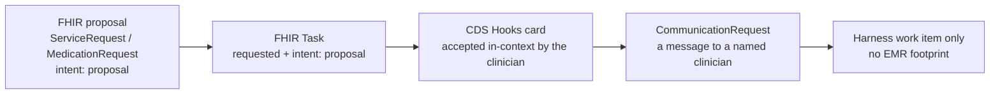

# FHIR ⇄ EMR Integration — Complete Interaction Analysis

**Status:** analysis for review · **Date:** 2026-09-12 · **Branch:** `fhir-integration`
**Scope:** every place this platform must exchange data with a hospital/clinic EMR over FHIR, in both directions.
**Companion:** `docs/fhir-emr-integration-plan.md` (the build plan derived from this analysis)
**Prior art in-repo:** `docs/spec-gap-fhir-analysis.md`, `docs/enterprise-implementation.md` §Phase 2/5, `docs/renal-protocols-implementation-strategy.md`, `docs/ANANT_HARNESS_PRODUCT_SPEC.md` §20.1

---

## 0. Executive summary

The platform already has a **real, working FHIR R4 layer** — not a stub. `src/fhir/` is ~4,800 lines with a hand-built typed R4 model (62 resource types), a bidirectional entity↔resource registry (52 resource mappings), bundle ingestion with true `transaction` atomicity and rollback, an export path, an outbound HTTP `FhirClient`, a change-data-capture pump, CDS Hooks cards, and an in-process emulator to test against.

**What it is not yet** is an *EMR integration*. It is a **FHIR workbench**: it can ingest a bundle you paste into the admin UI, and it can poll a URL you retype each time. Every one of the following is absent, and each is load-bearing for production EMR connectivity:

| # | Missing capability | Consequence |
|---|---|---|
| G1 | **No persisted EMR connection record** | You cannot onboard a hospital once; every poll needs the base URL + bearer token retyped inline (`src/fhir/routes.ts:219-230`) |
| G2 | **No auth** — no SMART/OAuth2, no backend-services JWT, no token refresh | No real EMR will accept an unauthenticated or statically-tokened caller |
| G3 | **No durable CDC** | The poll cursor lives in a JS object that dies with the process; a restart re-pulls from `new Date(0)` |
| G4 | **No outbound write path** | `FhirClient.push()` exists and is called from nowhere. Orders never leave the building |
| G5 | **No Bulk Data `$export`** | You cannot do the initial population load that every EMR integration starts with |
| G6 | **No patient identity resolution** | `Patient/123` from the EMR ≠ `f1-pt-0001` locally; nothing bridges them |
| G7 | **Codes are slugs, not codes** | `epoetin-alfa`, `sepsis.detected`, `KTV-DEL` — none survive a round-trip |
| G8 | **The dialysis session is not on the wire** | The core clinical object of this product (`start-session`/`end-session`) maps to `[]` |
| G9 | **No acknowledgement loop** | Nothing observes whether a written order was accepted |
| G10 | **No consent / purpose-of-use read gate** | `Consent` is a stored resource that no read path consults |

The good news: **the substrate is right.** The design doc's core thesis (`docs/spec-gap-fhir-analysis.md:18-28`) — *"FHIR is two projections over existing machinery, not a new subsystem"* — is demonstrably true in this codebase. `WorldEffect` is a genuine write model; the entity graph is a genuine read model. Almost all the work below is **wiring, persistence, and completeness**, not architecture.

**The single most important thing to get right** is the framing in §5: this platform must be a **read-mostly coordination layer that publishes narrow, governed, expiring *proposals*** — never a charting system and never an order-entry system. That posture is already stated (`docs/ANANT_HARNESS_PRODUCT_SPEC.md:112`, `README.md:233`) and every design decision below follows from it.

### Decisions locked (2026-09-12)

Three review decisions are taken and are load-bearing for everything downstream. See §5 for the full reasoning and the constraints each one adds.

| # | Decision | Effect on this analysis |
|---|---|---|
| **D1** | **We PROPOSE, we do not order.** Every clinical action becomes a FHIR *proposal* (`intent: 'proposal'`, `status: 'draft'`) that a clinician converts inside their own EMR. | Collapses the duplicate-order hazard (B3 downgrades from patient-safety to housekeeping); makes proposal **expiry and retraction** a P0 requirement; turns the outcome loop from "was it acked" into "was it converted", which is *observable* rather than trusted |
| **D2** | **Three EMRs: Epic, Cerner (Oracle Health), Athena.** | Auth becomes three flows, not one; a **vendor profile** becomes a first-class object; the conformance suite runs three times; **Athena is materially harder** and is budgeted separately (§5.3) |
| **D3** | **A session is a `Procedure` inside one `Encounter` per episode of care.** | The session anchor stays `Procedure`; **`Encounter` continuity (gap D12) becomes load-bearing** (resolve the standing episode, reconcile rather than recreate); volume is ~1M *procedures*/year rather than ~1M *encounters*, and every session `Observation` still gets an `encounter` reference via its `Procedure` |

---

## 1. What exists today (verified inventory)

### 1.1 The FHIR module — `src/fhir/` (4,769 lines)

| File | Lines | What it actually does |
|---|---|---|
| `types.ts` | 1044 | Hand-written R4 model: primitives (`Coding`, `Identifier`, `Reference`, `Quantity`, `Dosage`…), `DomainResource` base, 62 resource interfaces, `TYPED_FHIR_RESOURCES` runtime list, `FhirCtx`, `CODE_SYSTEMS`, `code()`/`concept()` helpers |
| `mapping.ts` | 1226 | **The contract.** `RESOURCE_TO_KIND` (52 types), `KIND_TO_RESOURCES` (58 kinds), `ENTITY_FHIR` registry of `{ hydrate, serialize }` pairs, `serializeEntity`, `hydrateBundle` |
| `canonical.ts` | 617 | FHIR resource → `WorldEffect` (`eventToEffects`), structural kind → graph upsert (`structuralState`), `ingestResource`, `ingestCanonicalEvents`, `isStructuralKind` |
| `bundle-ingest.ts` | 380 | Bundle orchestrator: reference index + `urn:uuid`/`Type/id`/`#contained` resolution, structural-first two-pass ordering, `transaction` atomic rollback via realm snapshot, `batch`/`collection`/`message` semantics, per-entry `BundleEntryOutcome`, `dryRun`, `bundle.id` content-hash idempotency, 500-entry guard |
| `effect-map.ts` | 327 | **The write path.** `effectToFhirResource(effect, opts)` — 20 effect kinds → R4; `effectResourceType()` for display. Stamps `meta.security` v3-Confidentiality `R` |
| `fhir-bundle.ts` | 186 | `buildBundle`, `parseBundle`, `buildBundleRefIndex`, `resolveBundleReferences` |
| `emulator.ts` | 151 | `FhirEmulator`, `seedFhirDataset()`, `emulatorSearchBundle()` — an in-process EHR test double |
| `cds-hooks.ts` | 148 | `cdsHooksToCards(req, realm)` — abnormal-results, med-reconciliation, latest-vitals, care-gap cards |
| `subscription.ts` | 110 | `FhirSubscriptionPump.poll()` — `?_lastUpdated=gt<since>&_count=100&_sort=-_lastUpdated` per type, hydrates, advances in-memory cursor |
| `client.ts` | 111 | `FhirClient` — `get`, `search`, `push` (PUT-by-id else POST), `operation` (`$export`/`$validate`), injectable `fetch` |
| `export.ts` | 86 | `serializeRealm`, `serializeRealmEntity`, `exportRealmBundle` |
| `r4-inventory.ts` | 66 | The official 144-resource R4 list, for the coverage report |
| `routes.ts` | 272 | The HTTP surface (below) |
| `index.ts` | 45 | Barrel |

### 1.2 HTTP surface today

| Route | Direction | Notes |
|---|---|---|
| `POST /admin/fhir/ingest` | **in** | Full bundle semantics. `?dryRun`, `realmId`, optional `presence` (role/clearance/purposeOfUse/facilityId/unitId) |
| `GET /admin/fhir/export/:realmId` | **out** | Whole realm as a `collection` Bundle. `?includeEffects`, `?includeDerived` |
| `GET /admin/fhir/entity/:realmId/:kind/:id` | **out** | One entity as its R4 resource(s) |
| `GET /admin/fhir/resources` | — | Durable mirror read |
| `GET /admin/fhir/map` | — | Both registries |
| `GET /admin/fhir/coverage` | — | typed vs mapped vs missing, + audit-provenance note |
| `POST /admin/fhir/cds-hooks` | out | Cards from a live realm |
| `POST /admin/fhir/emulator/seed` · `GET .../state` | — | Test double control |
| `GET /fhir-mock/:resourceType` | out | **Public**, unauthenticated searchset — the pump's default target |
| `POST /admin/fhir/subscription/poll` | **in** | One-shot poll. `{ baseUrl, bearerToken?, resourceTypes?, realmId?, since?, facilityId? }` → 502 on failure |
| `GET /api/v1/fhir/export/:realmId` · `/api/v1/fhir/:realmId/:kind/:id` · `POST /api/v1/fhir` | out/in | Public mirror, rate-limited, PHI-masked by clearance |

**Traffic control on the public mirror is real** (`@fastify/rate-limit`, `api-routes.ts:88-93`) and **read masking is real** (`canReadPhi(actor.clearance) ? resource : maskPhi(...)`, `api-routes.ts:123`). **Auth on `/api/v1` is a placeholder** — `x-actor` JSON header or console session (`bootstrap.ts:198-208`), with the code's own comment saying production must wire a JWT verifier. An OIDC/JWKS verifier does exist (`src/identity/oidc.ts`) but is not connected to `/api/v1`.

### 1.3 Persistence

`fhir_resources` (`src/server/sql/schema.ts:217-227`):

```sql
CREATE TABLE IF NOT EXISTS fhir_resources (
   id TEXT PRIMARY KEY, realm_id TEXT NOT NULL, resource_type TEXT NOT NULL,
   kind TEXT NOT NULL, entity_id TEXT, resource_json TEXT NOT NULL,
   direction TEXT NOT NULL DEFAULT 'in', ingested_at TEXT NOT NULL
)
```
Indexes: `(realm_id, resource_type)`, `(kind, entity_id)`, `(direction, ingested_at)`.

**This table is ingest-only.** The sole writer is `persistMirror()` in `bundle-ingest.ts:326-340` with `direction: 'in'`. Exports are never mirrored, so `direction: 'out'` rows do not exist. There is also **no `generation`/`version`/`etag` column**, and no link table from a resource back to the effect or entity version that produced it.

Supporting tables (`schema.ts`): `event_outbox` (transactional outbox, `:204-216`), `idempotency_keys` (`:229-239`), `audit_events` (`:241-252`), `webhook_endpoints`/`webhook_deliveries` (`:254-277`), `alert_rules`/`alert_events`, `retention_policies` (`:301-313`, with an explicit `BIGINT` widening for 30-day windows), `bridge_leases`/`bridge_receipts`, and `swarm_workspace` (`:361-369`) — the JSON doc store that backs every admin config document.

The **`bundle.id` idempotency ledger is in-memory only** (`bundle-ingest.ts:57`, a module-level `Map`), so replay protection evaporates on restart.

### 1.4 What is *not* present at all

Confirmed by search across `src/`:

- **No `CapabilityStatement`** produced or consumed. (`CapabilityStatement` appears once, in the R4 inventory list, `r4-inventory.ts:42`.)
- **No Bulk Data `$export`** — the string `$export` appears only in a doc comment on `FhirClient.operation` (`client.ts:106`).
- **No SMART on FHIR** — zero hits for `smart`/`SMART` in `src/identity` or `src/server`. No launch context, no scopes, no UDAP.
- **No `src/interop/`** — no HL7 v2 parser, no MLLP, no C-CDA. (v2/CDA/X12 exist only as the light adapters below.)
- **No inbound subscription receiver** — no endpoint an EMR can POST a `Subscription` notification to. Only outbound pull.
- **No FHIRcast.**
- **No `$validate` / profile conformance checking.**
- **No vendor-specific work** — a repo-wide markdown search for `Epic|Cerner|Athena|Meditech|Allscripts|eClinicalWorks` returns zero hits.

### 1.5 Adjacent interop that already exists — `src/adapters/`

A parallel, *older* and *shallower* ingest layer: `fhir-lite.ts` (only `Encounter` + `Observation` → canonical events, its own local interfaces, `:36-84`), `hie.ts` (ADT-style `admit`/`discharge`/`transfer`/`result-available`/`medication-updated` with a `documentPointer`), `hl7v2-lite.ts` (ADT^A01/A03, SIU^S12 field-level), `cda-lite.ts`, `x12.ts` (270/271/278/837/835), `claims-file.ts`, `csv.ts`, `sql.ts`, `event-stream.ts`, `sftp.ts`.

**This is a real duplication risk.** `fhir-lite.mapFhirBundle` and `src/fhir/canonical.ts` both turn FHIR into canonical events, with different fidelity. Any integration work must pick one and retire the other (see plan F0.4).

### 1.6 Governance, audit, PHI

- **Clearance** — a five-level `Clearance` union with a rank table (`server/mask.ts:37-45`); `maskPhi()` deep-redacts `PHI_KEYS` below `restricted-phi`; `canReadPhi()` = rank ≥ 3.
- **Scope/tenant** — `scopeId`/`realmId` everywhere; `ScopedEventStore.ensureScope()` throws unless the actor holds the scope or `scope:*` (`scoped-persistence.ts:38-45`). **`X-Tenant-ID` is not used in this codebase** (it belongs to a different HGFS integration); tenancy here is realm/scope.
- **Purpose of use** — modelled in the identity types (`treatment|billing|quality|research|operations|compliance|break-glass`) and enforced by **agent governance**, not by the FHIR routes.
- **Consent** — `Consent` exists as a resource and an entity kind (`mapping.ts:103`, `serializeConsent` at `:864`) but **no read path consults it**.
- **Audit** — every canonical event projects to an `AuditEvent` (`audit.ts:101-113`) and is served at `GET /admin/audit/fhir`. But **FHIR ingest and export themselves are not audited** — the projection rides canonical events only, and ingest of a structural-only bundle produces no canonical event at all.
- **Security labels** — inconsistent. `effect-map.ts` stamps `meta.security` = v3-Confidentiality `R`; `mapping.ts` serializers set only `meta.source` + `meta.lastUpdated`. The same patient serializes differently depending on which path produced it.
- **Secrets** — two disconnected providers: `src/control-plane/secrets.ts` (interface + in-memory reference impl, no Vault/KMS) and `src/knowledge/secrets.ts` (file-backed, `chmod 0600`, **unencrypted**, with the code itself noting production should use a KMS). The Kafka integration deliberately stores a *binding name* (`binding:KAFKA_BRIDGE_TOKEN`) and the server **rejects anything that looks like a literal secret** (`ops-config-routes.ts:125-134`) — a good pattern with no FHIR equivalent.
- **DSAR** — `collectPatientRecord` + `anonymizeRecord` exist (`dsar.ts:52-70`), read-only, `restricted-phi` for raw. **No erasure-by-subject**; only age-based retention purge (`fhir_resources` default 365d).

### 1.7 What the clinical domain actually needs on the wire

The product is renal. `packs/dialysis-provider/ontology.ts:34-36` states the design intent well:

> *"The types deliberately mirror how CMS + operator SOPs speak about the domain so mapping from FHIR/HL7/CSV feeds is a rename, not a translation."*

**Round-trips today** (verified against `mapping.ts` / `effect-map.ts` / `canonical.ts`):

| Clinical concept | Resource | In | Out |
|---|---|---|---|
| Patient demographics | `Patient` | ✅ | ✅ |
| Facility / chair | `Organization` / `Location` | ✅ | ✅ |
| Staff | `Practitioner` / `PractitionerRole` | ✅ | ✅ |
| Lab order | `ServiceRequest` | ✅ | ✅ |
| Lab result (K, Hgb, Phos, Ca, alb, Kt/V) | `Observation` | ✅ | ✅ |
| Medication order (ESA, iron, binder) | `MedicationRequest` | ✅ | ✅ |
| Vitals (HR, BP, SpO₂, temp, RR) | `Observation` | ✅ | ✅ |
| Immunisation | `Immunization` | ✅ | ✅ |
| Admission / transfer / discharge | `Encounter` | ✅ | ✅ |
| Safety flag | `Flag` | ✅ | ✅ |
| Assessments (PHQ-9, GAD-7, pain, SDOH) | `Observation` (survey) | ✅ | ✅ |
| Care plan / task / claim | `CarePlan` / `Task` / `Claim` | ✅ | ✅ |
| Condition, allergy, procedure, diagnostic report, document, specimen, imaging | structural kinds | ✅ | ⚠️ partial |

**Does not round-trip — and these are the clinically important ones:**

| # | Concept | Where it lives today | Wire status |
|---|---|---|---|
| 1 | **The dialysis session** (`start-session` → `end-session`) | in `patient.state.currentSession{}` then `sessions[]` (last 12), `effect-reducer.ts:324-395` | **none** — `effectResourceType()` falls through to `[]`. Planned as `Procedure`/`Encounter` in `docs/renal-protocols-implementation-strategy.md:195`, never built |
| 2 | **Intra-session machine telemetry** (Qb, Qd, venous/arterial pressure, UF rate, UF volume, temp, symptoms at 5–15 min) | `currentSession.telemetry`, **capped at 24 points** (`effect-reducer.ts:363`) | **none** — and *lossy even internally* |
| 3 | **Delivered adequacy** (Kt/V, URR, recirculation %) | derived at `end-session` | **none** |
| 4 | **Vascular access** (type, flow, recirculation, pressures, cannulation difficulty, events) | `patient.state.access{}` + `accessObservations[]` (24) + `access.events[]` (12) | **none** — `record-access` → `[]` |
| 5 | **Access acoustic capture** | `accessAcoustic[]` | **deliberately none** (synthetic-only guard), but also no coded placeholder |
| 6 | **Dialysis prescription** (Qb, Qd, dialysate composition, target Kt/V, UF goal, anticoagulation, dialyser, temp) | `packs/dialysis-provider/protocol-compliance/index.ts:39-50` + `ontology.ts:105-112` | **none** |
| 7 | **Dry weight / IDWG / UF-rate compliance** | `packs/dialysis-provider/nutrition/index.ts:41-56` | implicit via weight `Observation` at best |
| 8 | **ESRD-QIP measure results** (Kt/V adequacy, missed-treatment ratio, anaemia management) | `packs/dialysis-provider/measures/esrd-qip.ts:41-95` | generic `MeasureReport` mapping exists for `cost-record`; the renal measures are never projected |
| 9 | **CMS forms 2728/2744/2746, NHSN dialysis events** | agent YAML + measure-pack config only | none |
| 10 | **`titrate-med` / `hold-med`** | effect kinds exist | no `effectToFhirResource` case — an approved ESA **dose change** has no `MedicationRequest` representation |
| 11 | **NHSH/BSI reporting out** | `nhsn-bsi-reporter` agent | none |

### 1.8 Code fidelity — the quiet correctness problem

This is the item most likely to cause a silent, expensive integration failure. The clinical engine speaks in **lowercase slugs**, while the FHIR serializers emit them into real code systems:

| Domain value | Emitted as | Real code needed |
|---|---|---|
| `epoetin-alfa`, `sevelamer`, `calcium-acetate`, `cinacalcet`, `calcitriol`, `lanthanum`, `sucroferric-oxyhydroxide`, `ferric-citrate` | `concept(CODE_SYSTEMS.rxnorm, 'epoetin-alfa')` — `effect-map.ts:137` | RxNorm RxCUI (epoetin alfa = `8764`-family) |
| `hepatitis-b`, `influenza`, `pneumococcal`, `sars-cov-2` | `concept(CODE_SYSTEMS.cvx, 'influenza')` — `effect-map.ts:225` | CVX (influenza = `140`/`141`/`150`…) |
| `missed-treatment`, `access-risk`, `lab-critical` | `concept(CODE_SYSTEMS.snomed, effect.safetyKind)` — `effect-map.ts:274` | SNOMED CT concepts |
| `avf` / `avg` / `cvc`, encoded as `accessType: 0|1|2` | numeric feature — `swarm/adequacy.ts:63` | SNOMED / FHIR `Device` + `DeviceUseStatement` |
| `KTV-DEL` | passed as if LOINC — `packs/dialysis-provider/labs/index.ts:67` | LOINC `70961-8` (HD Kt/V), `70960-0` (PD). **Corrected 2026-09-14:** `18262-6` / `18263-4` are LDL / HDL cholesterol, not Kt/V. |
| `assessment` | `concept(CODE_SYSTEMS.loinc, 'assessment', effect.assessmentId)` — `effect-map.ts:210` | LOINC PHQ-9 `44249-1`, GAD-7 `69737-5`, AUDIT-C `72172-0` |
| `AMB` for every encounter | `code('…v3-ActCode','AMB')` — `effect-map.ts:87` | dialysis is `AMB` per-session but the *modality* (in-centre HD vs home HD vs PD) needs its own coding |
| `professional` for every claim | `concept('…claim-type','professional')` — `effect-map.ts:250` | ESRD monthly is CPT `90960`/`90961`-family, and claims for dialysis are **institutional**, not professional |

`effect-map.ts` also does something that will not survive contact with a real EMR: `Number(effect.dose.replace(/[^0-9.]/g,''))` (`:131`) — a string-scrape dose parse. And `effectToFhirResource` emits resources with **no `id`**, so `FhirClient.push()` would POST a *new* resource on every call rather than `PUT` an update.

Also worth noting: **`Procedure` and `DeviceUseStatement` are already mapped** (`mapping.ts:1162`, `:1190`) but **nothing in the renal engine ever creates those entities** — the mappings are dead code waiting for exactly the session/access work in §5.

---

## 2. The integration surfaces — what "bidirectional" actually means here

Twelve distinct flows. For each: what moves, which FHIR mechanism carries it, and the current state.

### S1 — Roster & demographics (in)
Patient/ Practitioner / Organization / Location, and the *authoritative* tie between an EMR patient and a local `patient` entity.
**Mechanism:** Bulk `$export` (initial), `Patient?_lastUpdated` (delta), ADT A01/A08 in practice.
**Today:** `Patient` hydrates to a structural upsert (`canonical.ts:186-196`) keyed by whatever `id` the bundle carries. **No identity resolution, no MRN↔local mapping, no merge handling.** A bundle with `id: "12345"` creates a patient named `12345`.

### S2 — Clinical data (in)
Conditions, allergies, labs, vitals, meds, immunisations, procedures, documents, specimens, diagnostic reports.
**Mechanism:** subscription/CDC on `Observation`, `Condition`, `MedicationRequest`, `AllergyIntolerance`, `DiagnosticReport`; `$export` for backfill.
**Today:** hydration exists for all of these. **No backfill path, no delta cursor durability, no `entered-in-error`/correction handling** — a retracted lab result in the EMR leaves the local `result` entity in place forever.

### S3 — Care delivery / the dialysis session (in **and** out)
The session record, its machine parameters, its per-minute telemetry, its delivered adequacy, its access observations, its dry-weight/IDWG context.
**Mechanism:** `Procedure` per session, attached to one long-lived `Encounter` per episode of care (D3); `Observation` categories `vital-signs` / `laboratory` / `hemodynamic`; `DeviceMetric` for machine channels; `DeviceUseStatement` for access.
**Today: none of it crosses the wire.** This is the single biggest domain gap and the one that makes the product's clinical loop invisible to the EMR (§5).

### S4 — Proposals (out) — *the highest-risk flow* — **now scoped by decision D1**
Lab orders, medication orders, ESA dose changes and holds, referrals, imaging, follow-ups — published as **proposals** (`intent: 'proposal'`, `status: 'draft'`), never as orders (§5.1).
**Mechanism:** `ServiceRequest` / `MedicationRequest` / `Task` at `intent: 'proposal'`, with CDS Hooks cards as the in-context channel and a recorded **degradation ladder** when a vendor cannot carry the flow (§5.3).
**Today:** `effectToFhirResource` produces a *plausible-looking* `ServiceRequest`/`MedicationRequest` with **no `id`, no `requester`, no `identifier`, no `reasonReference`, no `encounter`,** and `FhirClient.push()` is wired to nothing. Semantically these are **drafts, not orders** — they cannot be "re-sent", deduplicated, or reconciled. And `titrate-med`/`hold-med` have no projection at all, so a *dose change* — the highest-value output of the anaemia protocol (`esa-dose-escalated-without-response-90d`) — has no order representation.

### S5 — Results (in)
Lab results arriving against a previously written order.
**Today:** `Observation` → `result-lab` effect, `basedOn` → `orderId` (`canonical.ts:150-160`). Reasonable. But the **closure of the loop is not observable**: nothing checks whether the order we wrote was the order the result is against, and the idempotency is per-bundle, not per-result.

### S6 — Scheduling & ADT (in and out)
Appointments, slots, schedules; admits/discharges/transfers.
**Mechanism:** `Appointment`/`Slot`/`Schedule`; `Encounter` + ADT.
**Today:** kinds and mappings exist for `Appointment`/`Slot`/`Schedule`; the dialysis *shift* and *chair* model (`ontology.ts:78-90`) has **no projection**. Missed-treatment recovery scheduling (`packs/dialysis-provider/scheduling`) proposes slots locally with no wire representation. ADT in is `Encounter` hydration; **ADT is honestly better carried by HL7 v2 in most real estates**, and there is no v2 path.

### S7 — Documents (in/out)
Session notes, discharge summaries, QAPI packets, 2728 forms.
**Mechanism:** `DocumentReference` (+ `Composition` for structured docs), `Binary` for payloads.
**Today:** `DocumentReference` and `Composition` kinds exist and hydrate. **`Binary` is not in the typed model.** No document is ever *produced* (discharge transition summary, QAPI evidence packet at `packs/dialysis-provider/qapi-evidence/` are generated locally as artifacts).

### S8 — Financial (in/out)
Coverage/eligibility in; claims and prior-auth out; remittance and EOB in.
**Mechanism:** `Coverage`, `CoverageEligibilityRequest/Response`, `Claim`, `ClaimResponse`, `ExplanationOfBenefit`, `PaymentReconciliation`.
**Today:** `Claim` out (`submit-claim`, `request-prior-auth`), `Coverage` in. **No eligibility check out, no remittance in.** Claims are structurally wrong for dialysis (§1.8) and contain no `item.net`, `total`, `provider`, `insurance`, or `patient`.

### S9 — Regulatory reporting (out)
ESRD-QIP measures, NHSN dialysis events, CMS 2728/2744/2746.
**Mechanism:** `MeasureReport` (submit), `Bundle` (forms), or the destination's native API (EQRS/NHSN) — **not always FHIR**.
**Today:** `cost-record` → `MeasureReport` mapping exists; the three renal measures are not projected; no submission path. Note `renal-swarm-intelligence/config/measure-packs.json` already tags each measure with `submission: "EQRS" | "NHSN" | "Claims-derived"` — the destination taxonomy exists, the transport does not.

### S10 — Decision support (out, into the EMR's UI)
**Mechanism:** CDS Hooks (`patient-view`, `order-select`, `order-sign`, `encounter-start`), FHIRcast for context sync.
**Today:** `POST /admin/fhir/cds-hooks` answers with cards from a live realm. It is **not** a CDS Hooks *service* — no discovery (`GET /cds-services`), no service registry, no `prefetch` handling, no `hookInstance` dedup, and the card `suggestions[].actions[].resource` is a *description string* rather than a real resource (`cds-hooks.ts:78`).

### S11 — Audit & provenance (out)
**Mechanism:** `AuditEvent` + `Provenance` written back to the EMR.
**Today:** `AuditEvent` projection from canonical events exists and exports. **Nothing writes it to the EMR**, and ingest/export are themselves unaudited (§1.6).

### S12 — Access control data (in)
**Mechanism:** `Consent`, plus SMART scopes and `purposeOfUse`.
**Today:** `Consent` stores; nothing reads it.

---

## 3. Gap register

Numbered, each with severity and the surface it blocks. **P0 = blocks production EMR connectivity. P1 = blocks clinical correctness. P2 = hardening/completeness.**

### Class A — Connectivity (blocks everything)

| # | Gap | Sev | Evidence |
|---|---|---|---|
| **A1** | No persisted EMR connection record (base URL, auth mode, tenant headers, resource scope, enabled directions, mapping version) | **P0** | `GET /admin/platform/integrations` returns only a *count* of FHIR resources (`platform-routes.ts:605-618`); no `PUT .../integrations/fhir` |
| **A2** | No FHIR connectivity/contract test endpoint | **P0** | Only `POST /admin/platform/integrations/kafka/test` exists, and it is **contract-only — no network call** (`workspace.ts:2397-2405`) |
| **A3** | No auth: no OAuth2/SMART, no backend-services JWT, no token cache/refresh, no mTLS | **P0** | zero SDK/OAuth code; `bearerToken` passed inline per request (`routes.ts:221`) |
| **A4** | No `CapabilityStatement` discovery → cannot know what an EMR supports | **P0** | only in the R4 inventory list |
| **A5** | No Bulk Data `$export` (initial load, group/non-group) | **P0** | `$export` in a comment only (`client.ts:106`) |
| **A6** | Credentials are not storable safely — the only real pattern (a *binding name*, `binding:KAFKA_BRIDGE_TOKEN`) has no FHIR analogue, and the knowledge-layer secret store is unencrypted | **P0** | `ops-config-routes.ts:125-134`; `knowledge/secrets.ts` |
| **A7** | Outbound calls have no retry, backoff, rate limit, or timeout | **P1** | `FhirClient.req()` is a bare `fetch` (`client.ts:66-74`) |
| **A8** | No TLS/pinning/audit of outbound requests; no per-EMR egress policy | **P1** | — |

### Class B — Identity & semantics (blocks correctness)

| # | Gap | Sev | Evidence |
|---|---|---|---|
| **B1** | No patient identity resolution / MPI-lite. No MRN system registry, no reference resolution across `Patient/123` ↔ `f1-pt-0001` | **P0** | `FhirCtx.identifierSystems` is declared (`types.ts:1022`) and **never populated**; `structuralState('patient')` keys on `resource.id` |
| **B2** | No `identifier` system assignment on outbound resources; MRN emitted as `value: rec.id` (`mapping.ts:157`) | **P0** | — |
| **B3** | Outbound resources have **no `id`** → `push()` always POSTs (creates duplicates) | **P0** | `effect-map.ts` — every `stamp()`ed resource omits `id` |
| **B4** | No `meta.versionId`/`ETag`/`If-Match` → last-write-wins races with the EMR | **P1** | `Meta` type has `versionId` (`types.ts:80`) but `FhirClient` never sends `If-Match` |
| **B5** | No correction/retraction handling — FHIR `entered-in-error`, deleted resources, and merged patients leave stale local state | **P1** | no handling in `canonical.ts`; only additive upserts |
| **B6** | Idempotency ledger is **in-memory** | **P1** | `bundle-ingest.ts:57` `const bundleLedger = new Map(...)` |
| **B7** | No provenance link from a `fhir_resources` row back to the effect/entity version that produced it | P2 | `fhir_resources` has no such column; `Provenance` is only projected from canonical events |

### Class C — Code & terminology fidelity

| # | Gap | Sev |
|---|---|---|
| **C1** | Drugs are slugs, emitted into RxNorm (see §1.8 table) | **P0** |
| **C2** | Vaccines are slugs, emitted into CVX | **P1** |
| **C3** | Safety flags are slugs, emitted into SNOMED | **P1** |
| **C4** | `KTV-DEL` presented as LOINC; assessments use `'assessment'` as a LOINC code | **P1** |
| **C5** | `accessType` is a numeric 0/1/2, not a coded resource | **P1** |
| **C6** | Claims typed `professional`; ESRD monthly dialysis is institutional CPT `90960`-family | **P1** |
| **C7** | No terminology validation at emit time — malformed codes leave the building silently | **P1** |
| **C8** | No `ValueSet`/`CodeSystem` served to the EMR; `Measure`/`Library` exist in the typed model but no `$expand`/`$lookup` endpoints | P2 |
| **C9** | Dose parsing by regex (`effect-map.ts:131`) | **P1** |

### Class D — Renal clinical completeness

D1 session · D2 intra-session telemetry (and its 24-point lossiness) · D3 delivered adequacy (Kt/V/URR/recirculation) · D4 vascular access track · D5 access acoustic (coded placeholder) · D6 dialysis prescription · D7 dry weight / IDWG / UFR · D8 shift/chair/schedule · D9 ESRD-QIP `MeasureReport` · D10 CMS 2728/2744/2746 + NHSN events · D11 `titrate-med`/`hold-med` projection · D12 `Encounter`/`EpisodeOfCare` continuity (every session should attach to one episode, not create a new `Encounter` each time) · D13 transplant/CKD-transition (the pack advertises `ckd-transplant-transitions`).

**Severity: P1 across the board, except D1/D6 which are P0 for this product** — without them the EMR sees a patient whose dialysis never happened.

### Class E — Runtime & operations

E1 durable CDC scheduler (cursor in memory, `subscription.ts:53`) · E2 no inbound push receiver (EMR→us webhook/`Subscription`) · E3 no reconciliation/conflict job · E4 no DLQ for failed outbound writes · E5 no outbound ack/outcome observation (the *"transport success alone never proves the outcome"* requirement, `renal-swarm-intelligence/docs/RUNTIME_RUNBOOK.md:62-76`) · E6 no throughput/backpressure model · E7 no integration health dashboard · E8 no `Subscription` state machine (rest-hook/websocket/topic) · E9 no `$export` job polling/status · E10 retention policy for outbound artifacts.

### Class F — Governance & compliance

F1 no consent/`purposeOfUse` read gate · F2 inconsistent `meta.security` between `effect-map` (stamps `R`) and `mapping.ts` (stamps nothing) · F3 FHIR ingest/export not audited; structural-only ingest produces no audit row at all · F4 `/api/v1` auth is a placeholder · F5 no `Consent`-driven opt-out propagation · F6 no BAA/`AuditEvent`-to-EMR write-back · F7 `fhir_resources` has no per-resource access log · F8 DSAR covers the realm but not the FHIR mirror or the outbound log.

### Class G — Conformance & certification

G1 no `$validate` · G2 no US Core profile conformance checking (USCDI bindings exist in `healthcare-core/uscdi.ts` with profile URLs, but nothing applies them) · G3 no CapabilityStatement out · G4 no `OperationOutcome` discipline (error shapes are ad-hoc `{ error: 'string' }`) · G5 no sandbox/certification harness (Epic/Cerner/Athena) · G6 no `Bundle` paging/`next` link handling · G7 no `_include`/`_revinclude`/`_elements`/chained-search support · G8 no search parameter registry.

### Class H — Duplication & debt

H1 `src/adapters/fhir-lite.ts` duplicates `src/fhir/canonical.ts` at lower fidelity · H2 `src/server/platform-routes.ts` and `src/server/swarm-routes.ts` both expose admin spelling of the same config · H3 `docs/spec-gap-fhir-analysis.md` says the FHIR layer is "Absent"; `docs/enterprise-implementation.md` says it landed — the docs contradict and neither is current · H4 `spec.md` describes a `src/fhir/mapper/` + `src/fhir/bridge/` layout that was never built (the flat layout won) · H5 `spec.md` models SMART/FHIRcast/UDAP/Bulk/IHE/TEFCA in depth that no landing doc claims — an unresolved gap between target state and reality.

---

## 4. Non-functional requirements the integration must meet

1. **Idempotency, durably.** Every outbound proposal carries a stable `identifier` (derived from the effect ID) so a retry is a no-op **and a later conversion can actually be found**. The in-memory ledger must become a table.
2. **Receipt is not conversion.** A proposal is `published` once the EMR returns a resource `id`/`versionId`; it is `accepted` only when we **observe** it converted. Where the vendor offers no correlation path, the outcome is recorded as **`unknown`** — never inferred, and never treated as a refusal. (E5, **D1**)
3. **Fail closed.** If the information needed to act is missing — no dose, stale iron, blocked coverage, **no expiry window configured**, **no verified patient identity** — the proposal must not publish. Already the stated posture (`docs/clinician-workflow-phases.md:52`), now extended to the wire. (**D1**)
4. **Corrections are first-class.** `entered-in-error`, retractions, merges, and late corrections must be replayable deterministically (the reference runbook already requires this: *"replay duplicates/out-of-order/late-correction before shadow activation"*).
5. **Realm isolation.** Nothing crosses realms. Tenancy stays `realm_id`/`scopeId`.
6. **PHI least-privilege.** Clearance gates reads; `purposeOfUse` gates writes; `Consent` gates both (F1).
7. **Full provenance.** Every inbound resource keeps a raw pointer + content hash; every outbound resource is traceable to the effect and the approval that authorized it.
8. **Shadow mode is the default for every new proposal kind.** The platform's own doctrine: `shadow` (record it, touch nothing external) → `bound` (publish), cut over **per effect kind, gated by human approval** (`docs/realm-architecture.md:211-215`).
9. **Every proposal expires.** A kind must declare a window; a proposal past it is **retracted** (not deleted) and the non-action is recorded. A concurrency cap applies per patient per kind. **An unbounded pile of machine drafts in an EMR's unsigned-orders list is a clinical hazard, not a UI problem. (D1)**
10. **Deterministic replay.** The same input stream must produce a byte-identical diff.
11. **Observable.** Per connection: last successful poll, lag, error rate, DLQ depth, publish rate, **conversion rate**, **never-actioned rate per kind**, and the count of outcomes we could not observe (`unknown`). (**D1, D2**)

---

## 5. Decisions locked (2026-09-12)

**This platform must not become a charting system.** The docs say so consistently — *"Not an EMR. Reads from EMRs… writes back only through governed channels"* (`README.md:233`); *"FHIR and source systems remain systems of record"* (`ANANT_HARNESS_HEALTHCARE_PRODUCT_SPEC.md:112`).

Three review decisions were taken on 2026-09-12. Each **removes** work and **adds** a constraint, and the constraint is not obvious from the decision alone — so both halves are recorded here.

| # | Decision | Alternative rejected |
|---|---|---|
| **D1** | **We PROPOSE, we do not order.** | Writing live orders (`intent: 'order'`) |
| **D2** | **Epic, Cerner (Oracle Health), Athena.** | A single first EMR; a dialysis-specific system |
| **D3** | **A session is a `Procedure` inside one `Encounter` per episode of care.** | One `Encounter` per session |

---

### 5.1 D1 — Propose, do not order

FHIR already models this and we have been ignoring it: `RequestIntent` is a first-class value set whose `proposal` member exists precisely for a non-authoritative suggesting system.

**The wire shape:**

| We have | FHIR | Key fields |
|---|---|---|
| A proposed lab / imaging / referral | `ServiceRequest` | `status: 'draft'`, `intent: 'proposal'`, `code`, `subject`, `encounter`, `authoredOn`, `requester`, `reasonReference`, `identifier` |
| A proposed medication order or **dose change** | `MedicationRequest` | `status: 'draft'`, `intent: 'proposal'`, `medicationCodeableConcept`, `dosageInstruction.doseAndRate` (structured), `reasonCode`, `identifier` |
| A proposed workflow item / care gap | `Task` | `status: 'requested'`, `intent: 'proposal'`, `code`, `for`, `owner`, `reasonReference` |
| "Consider this" to a named clinician | `CommunicationRequest` | `status: 'active'`, `payload`, `recipient` |
| The same content surfaced **in context** | **CDS Hooks** `suggestions[].actions[].resource` | a real resource the clinician accepts into their own order set |

**What this buys us:**

1. **The duplicate-order hazard disappears.** B3 (outbound resources have no `id`, so `push()` POSTs a duplicate) stops being a patient-safety risk and becomes housekeeping. A duplicated *draft* is noise; a duplicated *order* is harm.
2. **The clinician keeps the pen.** Our HITL becomes an advisory gate, and their EMR's own sign/verify workflow is the authoritative one — two independent human checks, in the correct order.
3. **It is the only option reliably possible on all three vendors.** Athena in particular has partial write support (§5.3).
4. **The outcome becomes measurable, which is strictly better than an ack.** We need not trust a 2xx: we can *observe* whether our proposal became an order (`ServiceRequest.intent` moving `proposal` → `order`, or a `Task` reaching `completed`). That answers the platform's own requirement — *"transport success alone never proves the outcome"* (`renal-swarm-intelligence/docs/RUNTIME_RUNBOOK.md:62-76`) — with evidence rather than logging.
5. **Reversal is trivial.** Retracting a proposal is a status change; retracting an order in a live chart is an incident.

**What it costs us — and this must not be under-scoped:**

1. **Stale proposals accumulate in the EMR's unsigned-orders list, and that is a genuine clinical hazard.** That list is what a nurse works from; fifty unactioned machine drafts is alert fatigue with a pharmacy attached. **New P0 requirement:** every proposal carries `authoredOn` **and** a per-kind expiry, and a sweeper **retracts** it (`status: 'revoked'`) rather than deleting it — recording that it was never actioned. Plus a concurrency cap: never more than N open proposals per patient per kind, and never re-propose an action while one is open.
2. **We must own and observe a six-state proposal lifecycle:** `created → published → surfaced → accepted / rejected / expired / superseded`. Each state needs a mapping from what the EMR tells us — or from what it does not.
3. **"Was it accepted?" is a search problem, not a write problem.** Detecting conversion means querying for the resource that descends from ours. That needs a stable `identifier` we control, or an EMR-side reference back to us, or a `Task` handshake — and the three vendors differ in which they support (§5.3). **An unknown must be recorded as unknown, never as "not accepted".**
4. **Some things cannot be proposals at all — confirmed 2026-09-12.** `submit-claim`, `request-prior-auth`, and the EQRS/NHSN submissions are not clinical suggestions; they keep their own outbound semantics (and, for the regulators, are not necessarily FHIR). **D1 scopes clinical actions only**, not every outbound artifact.

---

### 5.2 D3 — A session is a `Procedure` inside one `Encounter` per episode of care

A dialysis **session** is a `Procedure`. The **`Encounter`** is the longer-lived container the session belongs to — not a per-session resource.

**The wire shape:**

- **Once per episode of care** — an `Encounter` (`status: 'in-progress'`, `class` = `AMB` or the vendor's dialysis class, `period.start`, `subject`, `serviceProvider`, `location` = the facility `Location`). A patient on in-centre HD has roughly one episode per modality/access era, so this is a handful of resources per patient **per year**, not per session. Where the vendor supports it, `EpisodeOfCare` is the more correct container and the `Encounter` hangs off it — but a plain `Encounter` is the portable floor all three vendors accept.
- `start-session` → **`Procedure`** (`status: 'in-progress'`, `code` = the dialysis treatment, LOINC/SNOMED-coded, `performedPeriod.start`, `subject`, **`encounter` = the episode `Encounter`**). We hold the `Procedure.id`, and `end-session` closes **the same** resource.
- `record-session-telemetry` → `Observation`s referencing the session `Procedure` (`partOf`) and its `encounter`.
- `record-access` → `Observation` / `DeviceUseStatement` referencing the session `Procedure`.
- `end-session` → the same `Procedure` (`status: 'completed'`, `performedPeriod.end`, `outcome`) plus the delivered metrics as `Observation`s: Kt/V (LOINC `70961-8`), URR, UF volume, pre/post weight, recirculation %, Qb average; `stoppedEarly`/`complication` as a coded `outcome`.

**What this buys us:**

- **The volume profile is right.** ~1M `Procedure` writes a year records work that actually happened. ~1M `Encounter` writes a year is largely ceremony — and in most estates the EMR *already holds* those encounters, so per-session encounters would mean duplicating a structure someone else owns. The container count drops from one-per-session to a handful per patient per year.
- **It matches the clinical model.** Dialysis *is* a recurring procedure within a standing episode of care — which is also how the renal packs already reason (`sessions[]` inside a patient, not patients inside sessions).
- **Every per-session `Observation` still gets an `encounter` reference** (via its `Procedure`), so the chart-grouping benefit of a per-session encounter is retained without the volume.
- **Billing has a natural shape**: the per-session `Procedure` is the billable line; monthly capitation (MCP) is an episode-level artefact.

**What it costs us — and the first item is a genuine dependency, not a note:**

1. **`Encounter` continuity (gap D12) becomes load-bearing.** Every session's `Procedure` must attach to the **standing** episode `Encounter`, which requires: (a) resolving the episode on first contact and persisting its id; (b) **never creating a second one** for the same (patient, facility, modality); (c) **reconciling with an episode `Encounter` the EMR already has** rather than creating a parallel one. This is F3.6's job and it moves from tidy-up to P0. Getting it wrong does not fail loudly — it produces a chart with a new encounter every week, which is exactly the kind of silent divergence this whole document exists to prevent.
2. **The longitudinal view is still a series query.** Kt/V and IDWG trends come from many `Procedure`s, not one object. F7 and F13 own that explicitly.
3. **An in-progress `Procedure` is a less common pattern than an in-progress `Encounter`.** Some EMRs will not accept one at `start-session`. The vendor profile declares this; where it cannot, we hold the session locally and emit the `Procedure` once at `end-session` — the session is then invisible mid-treatment, which is acceptable **only because it is a known, declared limitation** rather than a surprise.

---

### 5.3 D2 — Three vendors, and they are not three copies of one integration

| | **Epic** | **Cerner / Oracle Health** | **Athena** |
|---|---|---|---|
| FHIR version | R4 | R4 | R4 (partial coverage) |
| Backend auth | SMART Backend Services (`client_assertion` JWT, `RS384`) | SMART Backend Services | **No Backend Services** — OAuth2 via a delegated / marketplace path |
| App model | Epic on FHIR; non-standard `Epic-Client-ID` + tenant header | Oracle Health CODE program | **athenahealth Marketplace** — the marketplace *is* the integration contract |
| Write support | Broad; `intent: 'proposal'` honoured | Broad | **Partial** — narrower FHIR surface; scheduling/orders often via proprietary APIs |
| Bulk Data | `$export` (Patient + Group) | `$export` | Limited |
| Practical note | The most FHIR-mature; treat as the reference implementation | Close second; different sandbox, headers, and page limits | **The hardest.** Budget disproportionately and expect at least one flow to be impossible over FHIR |

**Consequence: "vendor profile" becomes a first-class object**, not a branch inside the auth code. A connection declares a profile supplying: auth flow, header conventions, supported-resource matrix, max page size, rate limit, `$export` variant, **whether proposal conversion is observable and how**, and which flows must degrade. F1 owns the profiles; F12 runs the conformance suite once per vendor.

**The degradation ladder** — when a vendor cannot carry a flow we descend, we do not fail:



**Every degradation is recorded on the proposal with its reason**, so an operator can see *why* an action never reached the chart. Silently dropping to a lower rung would be the same defect class as the swallowed-403 fallbacks already found in this codebase — it must be visible.

---

### 5.4 What we write under these decisions

| Allowed | Never |
|---|---|
| `ServiceRequest` at `intent: 'proposal'` | **`intent: 'order'` on any resource** |
| `MedicationRequest` at `intent: 'proposal'` | Diagnoses, problem list |
| `Task` at `intent: 'proposal'` | Clinical notes / chart text |
| `CommunicationRequest` | Allergies |
| `Procedure` + `Observation` per session, and the episode `Encounter` — the session record, D3 | Demographics, except corrections we are authoritative for |
| `Flag` (safety) | Anything that rewrites the legal record |
| `MeasureReport` (quality submission — separate flow, not a proposal) | — |

Enforced in code as `PROPOSAL_INTENTS` plus a `FORBIDDEN_WRITE_RESOURCES` guardrail with an explicit test. The guardrail is worth writing even though it should never fire: it is the difference between a rule and a hope.

**Shadow-first still applies and is unchanged.** Every proposal kind ships `shadow` (recorded in our own outbox, zero EMR calls) and reaches `bound` only through a per-kind, human-gated cutover.

---

## 6. Risk register

| Risk | Impact | Mitigation |
|---|---|---|
| **Stale proposals accumulate in the EMR's unsigned-orders list** (D1 — *new, P0*) | Alert fatigue; a nurse works from a superseded draft; clinical trust loss | Per-kind expiry + a sweeper that **retracts** (`status: 'revoked'`) and records non-action; cap concurrent open proposals per patient per kind; never re-propose while one is open |
| **A proposal is converted but we never learn it** (D1 — *new*) | We re-propose completed work; clinicians see duplicates | Stable `identifier` we control + conversion observation (F10). **Record "unknown" as unknown — never as "not accepted"** |
| **Three vendors triples the surface** (D2 — *new*) | Divergent behaviour discovered late, per vendor | Vendor profiles as **data**, not branches (F1); degradation recorded on every proposal; conformance suite run once per vendor (F12) |
| **Athena cannot carry a flow over FHIR** (D2 — *new*) | A capability that was promised but does not exist | Discover it in F0/F1 via the capability matrix *before* committing; the degradation ladder is the answer; the marketplace path is scoped explicitly |
| **`Encounter` duplication** (gap D12, now load-bearing under D3) | A new episode `Encounter` per session — a chart nobody can read longitudinally, and a structure the EMR probably already owns | Resolve the standing episode `Encounter` on first contact, persist its id, **reconcile rather than create** (F3.6); a test asserts N sessions produce exactly one `Encounter` |
| **Session `Procedure` volume** (D3) | ~1M `Procedure` writes/year; rate limits, throttling, cost | One `transaction` Bundle per session, never a call per observation; measure bundle size before fixing a cadence (F7/F8). Where the vendor rejects in-progress `Procedure`s, emit once at `end-session` and declare it on the profile |
| **Wrong-patient write** (B1: no identity resolution) | Catastrophic | MPI-lite with multi-factor matching **and** a human confirmation step before the first write per patient; hard-fail on ambiguous |
| **Duplicate proposals** (B3: no `id` → POST not PUT; no stable `identifier`) | Noise in the chart (downgraded from patient harm by D1, still unacceptable) | Stable `identifier` from the effect ID, `identifier` search before create, durable idempotency table, shadow-first |
| **Slug codes reach the EMR** (C1–C5) | Silent data corruption; a clinician cannot act on an uncoded suggestion | Terminology service + emit-time validation that *rejects* unvalidated codes (C7). Blocking, not warning |
| **Dialysis invisible to the EMR** (D1/D6) | The product's core value is unobservable; clinicians see a patient with no treatment history | Session/prescription on the wire is P0, not a later phase |
| **Poll cursor loss re-pulls from epoch** (E1) | Thundering herd against the EMR; rate-limit ban | Durable cursor + `_count` pagination + jittered backoff from day one |
| **Unaudited FHIR access** (F3) | HIPAA finding | Audit FHIR ingest/export/resource-read explicitly, not only canonical events |
| **Unmasked PHI in exports** (F2) | Breach | Uniform `meta.security` stamping on every serializer; single choke point |
| **Scope creep into charting** (§5) | Regulatory exposure, and the product loses its thesis | Enforce `PROPOSAL_INTENTS` + the write allowlist in code with an explicit test |
| **`src/adapters/fhir-lite.ts` drift** (H1) | Two FHIR truths, inconsistent data | Retire it in F0.4 |
| **Docs assert incompatible states** (H3) | Onboarding a new engineer starts from false premises | Reconcile in F0.5 |

---

## 7. Remaining open questions

The three consequence-level decisions are settled (§5). These remain, and each is answerable independently of the build start.

1. **Is HL7 v2 for ADT in scope?** In real US dialysis estates ADT/ORM/ORU arrive on MLLP far more reliably than as FHIR subscriptions. **Recommendation: support both.** Scope-adding, so it needs an explicit yes/no — FHIR-only is defensible now that the target vendors are named.
2. **Session write direction.** D3 removed the volume objection but not the question: **are we the source of the session record, or do we consume the EMR's?** If the EMR already charts sessions, we should consume them and only propose the *deltas* we add (delivered-adequacy analysis, the UF-rate change). Writing a million procedures a year into a chart that already holds them is still wasteful, and it doubles the surface on which the two systems can disagree about the same session.
3. **What is authoritative for identity** — us, the EMR, or an external MPI? This bounds B1 and therefore gates the first write.
4. **Which regulatory destinations are in scope** — EQRS, NHSN, CMS 2728/2744/2746 — and are they FHIR or native APIs? (§S9) These sit *outside* D1's proposal model and need their own transport decision.
5. **Does a session need a billable `Claim`**, and is it per-session or monthly (MCP)? With D3 this interacts with C6 and the episode-`Encounter` structure — the per-session `Procedure` is the natural billable line, so settle them together.
6. **Athena path**: marketplace app, or a partner-mediated backend? And do we have sandbox credentials for all three vendors, or do we begin against the in-process emulator plus a public reference server (HAPI)?
7. **Do we invest in the app-launch model now?** D1 makes CDS Hooks the *strongest* proposal channel (in-context, accepted into the clinician's own order set) rather than a nice-to-have. It is also the only rung that works on all three vendors without a write scope. SMART launch + CDS Hooks as a service is therefore a candidate for Stage V rather than Stage VI — see the plan's F11.

---

## 8. Conclusion

The engineering distance from here to a real EMR integration is **medium-to-large but unusually well-shaped**. The hard architectural questions — "is FHIR a projection or a store?", "what is the write path?" — were answered correctly two phases ago and the code proves it: `effectToFhirResource` and the entity graph are genuine dual projections of one model, and bundle ingestion already has transaction atomicity that many commercial integrations lack.

What is missing is **the connective tissue of a real deployment**: a persisted, authenticated, tested, monitored connection to a named institution; durable cursors and idempotency; identity resolution; code fidelity; an observable, shadow-first proposal path with expiry and retraction; and — for *this* product specifically — the dialysis session and prescription finally crossing the wire, because without those the EMR sees a renal patient who is never dialysed.

Decision D1 makes that last part materially easier: a proposal is a lower-risk object than an order, it is the only form all three target vendors will reliably accept, and its outcome is *observable* rather than merely acknowledged. The cost is real and concentrated in one place — **a proposal that is never actioned and never retracted is a clinical hazard**, so expiry, retraction, and a concurrency cap are P0 requirements rather than polish.

The plan in `docs/fhir-emr-integration-plan.md`, revised for D1/D2/D3, sequences exactly that.
