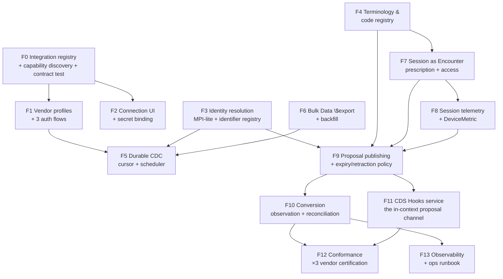

# FHIR ⇄ EMR Integration — Development Plan

**Status:** proposed for review · **Date:** 2026-09-12 · **Branch:** `fhir-integration`
**Derived from:** `docs/fhir-emr-integration-analysis.md` (gap IDs A1…H5 reference that document)
**Baseline:** `e240736` — 1309 passing tests, `npx tsc --noEmit` clean, `exec-app` builds clean

---

## How to read this plan

Fourteen work packages in six stages, revised for the three decisions locked on 2026-09-12 (**analysis §5**): **D1 propose-don't-order · D2 Epic + Cerner + Athena · D3 a session is a `Procedure` in one `Encounter` per episode of care**. Each package states **deliverables**, **the gaps it closes**, and **an exit criterion that is a test, not an opinion**.

Four principles override everything:

1. **Propose, never order.** Every clinical action is published as FHIR `intent: 'proposal'` / `status: 'draft'`. `intent: 'order'` is never emitted by any code path. (D1)
2. **Every proposal expires.** A proposal that is never actioned is **retracted** (`status: 'revoked'`) and the non-action is *recorded*. Unbounded machine drafts in an EMR's unsigned-orders list are a clinical hazard, so expiry, retraction, and a per-patient concurrency cap are P0 — not polish. (D1)
3. **Shadow-first, always.** No proposal kind calls a real EMR on first release. It is written to an outbox we own; a per-kind flag decides whether that outbox is dispatched. This is existing doctrine (`docs/realm-architecture.md:211-215`) and it is what makes the whole plan testable without a hospital.
4. **Blocking over warning.** Where correctness depends on it — an unvalidated code, an ambiguous patient, a missing dose, an unsupported vendor flow — we **refuse and record why**, rather than writing a best guess or silently descending a rung.

| Stage | Packages | Theme | Gate to proceed |
|---|---|---|---|
| **I. Foundations** | F0, F1, F2 | A durable, authenticatable, testable connection — across three vendors | Can point at each vendor's sandbox, authenticate, discover capabilities, and pass a contract test |
| **II. Identity & codes** | F3, F4 | Make what crosses the wire *mean* the same thing on both sides | No slug code can leave the building; an ambiguous patient blocks a proposal |
| **III. Inbound at scale** | F5, F6 | Backfill the population, then keep it current durably | A restart resumes the cursor; a full `$export` populates a realm |
| **IV. The renal wire model** | F7, F8 | Put the dialysis session on the wire — a `Procedure` in an episode `Encounter` | Session, telemetry, access and prescription round-trip, and **N sessions → exactly one `Encounter`** |
| **V. The proposal path** | F9, F10, F11 | Governed, expiring, observable proposals — including cards in context | An approved ESA dose change reaches a vendor sandbox exactly once, is converted, and the conversion is observed |
| **VI. Hardening** | F12, F13 | Conformance ×3 vendors, consent, observability | Certification harness green on all three; US Core conformance clean |



---

# Stage I — Foundations

## F0 — Integration registry, discovery, and the contract test

*The single highest-leverage package. Today an "EMR" is a URL retyped into a form.*

Closes **A1, A2, A4, E8(partly), H1, H3, H4**.

### Deliverables

1. **`FhirIntegration` durable record** — a `AdminFhir` workspace doc alongside `AdminKafka` (`src/swarm/workspace.ts:347-360`), using the same proven `swarm_workspace` (`kind, id`) storage:

   ```ts
   export interface FhirIntegration extends WorkspaceDoc {
     label: string;                     // "Riverbend · Epic production"
     realmId: string;                   // the realm this connection hydrates
     baseUrl: string;
     authMode: 'none' | 'bearer' | 'smart-backend-services' | 'smart-ehr-launch' | 'basic' | 'mtls';
     secretRef: string;                 // 'binding:EMR_RIVERBEND_CLIENT_SECRET' — never a literal
     tenantHeaders: Record<string, string>;   // e.g. Epic's non-standard tenant header
     resourceScope: string[];           // which resource types this connection may touch
     readEnabled: boolean;
     writePolicy: Record<string, 'shadow' | 'bound' | 'off'>;  // PER EFFECT KIND
     mappingVersion: string;            // content-hash of the mapping contract in force
     status: 'not-configured' | 'contract-verified' | 'connected' | 'degraded' | 'failed';
     lastTestedAt?: string; testMode?: string; testSummary?: string;
     capabilities?: CapabilityStatementSummary;   // cached discovery
   }
   ```

   Register `admin-fhir` in **both** the `WorkspaceKind` union and the runtime `WORKSPACE_KINDS` array (`src/swarm/workspace.ts:36-80` and `:~2797`) — a known trap in this codebase.

2. **`PUT /admin/platform/integrations/fhir`** + `GET` — validated exactly like the Kafka route (`ops-config-routes.ts:117-137`): reject anything matching `^[A-Za-z0-9_+/=]{24,}$` in `secretRef` with `secret-value-rejected`. **The secret-binding pattern is the template; copy it, don't invent a new one.**

3. **`POST /admin/platform/integrations/fhir/test`** — a *real* test, unlike the Kafka contract-only one:
   - `GET {baseUrl}/metadata` → parse `CapabilityStatement` (software name/version, FHIR version, supported resource types + interactions, `security` service, `rest.security.cors`).
   - Auth round-trip (per `authMode`).
   - `GET {baseUrl}/Patient?_count=1` (or the first in-scope type) as a live read probe.
   - Record `lastTestedAt` / `testMode: 'live'` / `testSummary`; cache the capability summary.
   - Return a resource-level report (not a boolean) so the operator sees *what* failed.
   - **`assertCapability()`** — compare discovered capabilities against `resourceScope` and warn on any configured type the server does not support. This prevents the classic "onboarded against the wrong endpoint" failure.

4. **`CapabilityStatement` (out)** — `GET /fhir/metadata` on our own surface, describing what we are. Closes G3 in the analysis and is required before any EMR will register us as a CDS service or a Bulk Data source.

5. **`OperationOutcome` discipline** — a `fhirError(code, diagnostics, severity)` helper and a `registerErrorHandler` that emits `OperationOutcome` on every `/fhir/*` and `/admin/fhir/*` route instead of the current ad-hoc `{ error: 'string' }`. Closes **G4**.

6. **Retire `src/adapters/fhir-lite.ts`** — re-point its two callers at `src/fhir/canonical.ts`, delete the file, keep its tests as regression coverage. Closes **H1**.

7. **Doc reconciliation** — a short `docs/fhir-reality.md` recording the true state, and a header note in `spec-gap-fhir-analysis.md` marking its FHIR rows superseded. Closes **H3, H4, H5**.

### Exit criteria
- `curl -X POST .../integrations/fhir/test` against `https://hapi.fhir.org/baseR4` returns a capability summary naming the server and listing ≥ 20 resource types.
- Creating a config with `secretRef: "sk_live_abc123..."` is rejected `422 secret-value-rejected`.
- `GET /fhir/metadata` returns a valid `CapabilityStatement`.
- `npx tsc --noEmit` clean; full suite green with the old `fhir-lite` tests still passing against the new path.

**Effort:** 4–5 days. **Risk:** low. **Everything else depends on this.**

---

## F1 — Vendor profiles and authentication (Epic · Cerner · Athena)

Closes **A3, A5(partly), A6**, and the vendor-specific half of **D2**.

*This is no longer one auth flow. Three vendors with three auth models, three capability surfaces, and three sandbox surfaces means the vendor difference must be **data**, not an `if` in the client.*

### Deliverables

1. **`VendorProfile` as a first-class, data-driven object** — the single place a vendor's differences live:

   ```ts
   export interface VendorProfile {
     id: 'epic' | 'cerner' | 'athena' | 'generic';
     label: string;
     authMode: 'none' | 'bearer' | 'smart-backend-services' | 'oauth2-delegated' | 'basic' | 'mtls';
     fhirVersion: 'R4';
     // Header conventions that are genuinely non-standard per vendor
     staticHeaders: Record<string, string>;   // e.g. Epic's client id + tenant headers
     tokenEndpoint?: string;
     scopes: { read: string; write?: string };
     /** What this vendor actually supports — the degradation ladder reads this. */
     supported: {
       resourceTypes: string[];               // seeded from CapabilityStatement, overridable
       interactions: Record<string, string[]>; // resourceType → ['read','search','create','update']
       bulkExport: 'patient' | 'group' | 'both' | 'none' | 'limited';
       proposalIntent: boolean;               // does it honour intent: 'proposal'?
       conversionObservable: 'identifier-search' | 'task-status' | 'reference-back' | 'none';
       maxPageSize: number;
     };
     rateLimit: { requestsPerMinute: number; burst: number };
   }
   ```

   Ship `epic`, `cerner`, `athena`, `generic` (the emulator + HAPI). **`supported` is seeded from live `CapabilityStatement` discovery where the vendor provides one, and overridden from the profile where it does not** — a profile is a *starting hypothesis*, and discovery is what corrects it.
2. **`FhirAuthProvider`** interface with five implementations:
   - `NoneAuth` — emulator, tests, public reference servers.
   - `BearerAuth` — static token from a secret binding (today's inline behaviour, but now *stored*).
   - **`SmartBackendServicesAuth`** — Epic and Cerner. `client_assertion` JWT (`RS384`; `iss`=`sub`=client_id, `aud`=token endpoint, `jti`, `exp` ≤ 5 min), `POST /token` with `grant_type=client_credentials&scope=system/*.read`, **token cache with proactive refresh at 80 % of `expires_in`**, and single-flight de-duplication so ten concurrent requests share one token fetch.
   - **`OAuth2DelegatedAuth`** — Athena. Athena has **no Backend Services** flow, so this is a genuinely different path (authorization-code or marketplace-delegated, with refresh tokens and a per-practice consent step). Budget it as new work, not a parameter change.
   - `EhrLaunchAuth` — per-user OAuth2 for SMART launch, only needed if F11 ships the app-launch model.
3. **`CapabilityNegotiator`** — given a `VendorProfile` and a live `CapabilityStatement`, produce a **capability report**: which of our required flows the vendor can carry, and for those it cannot, **which rung of the degradation ladder** (analysis §5.3) applies. This runs during F0's contract test and its output is *shown to the operator before they enable anything* — the point is to learn that Athena cannot accept a `MedicationRequest` proposal **during onboarding, not in production**.
4. **Secret storage that is actually safe.** Extend the existing `binding:` indirection to resolve through a `SecretsProvider`, and implement a `FileSecretsProvider` that **encrypts at rest** (AES-256-GCM, key from env/KMS) rather than reusing `src/knowledge/secrets.ts` (plaintext, `chmod 0600`, self-documented as not production-grade). A private key for `client_assertion` is a higher-value secret than a bearer token — treat it accordingly. Add `POST /admin/secrets/rotate` support.
5. **Outbound HTTP hardening** on `FhirClient` (closes **A7, A8**): configurable timeout, retry with jittered exponential backoff on 429/5xx/network only (never on 4xx), honour `Retry-After`, **per-vendor concurrency cap and rate limiter from the profile**, request/response size caps, a `request-id` header, and structured logging of method/path/status/duration/bytes **without ever logging PHI**.
6. **`FhirClient` gains**: `$export` operation helpers with job polling, `paging()` (`Bundle.link[rel=next]` follow, honouring the profile's `maxPageSize`), `_include`/`_revinclude`/`_elements`, `If-Match`/`If-None-Exist` support, `$validate`. Closes **A5, B4, G6, G7**.

### Exit criteria
- A unit test with a mocked token endpoint asserts: one token fetch for ten concurrent calls; refresh before expiry; a 401 invalidates the cache and retries exactly once.
- A retry test asserts 3 attempts on 503 and **1** on 400.
- **A capability test per vendor profile** asserts that the negotiator correctly reports which flows are unavailable and which rung applies — table-driven over `epic`/`cerner`/`athena` fixtures, so a vendor's limitations are pinned by a test rather than by tribal knowledge.
- The rate limiter holds a connection to its profile's `requestsPerMinute` under a synthetic burst.
- No secret value appears in any log line (asserted by a test that greps captured output).

**Effort:** 9–12 days (was 5–6 for a single vendor). **Risk:** medium-high — the Athena delegated path and the per-vendor header/scope conventions are the parts most likely to be wrong in ways only a real sandbox reveals. Build against all three sandboxes early, even with nothing but a capability read.

---

## F2 — Connection management UI

Closes the operator-facing half of **A1, A2, A6**.

### Deliverables
1. `admin-ui` **Integrations → FHIR** panel mirroring the Kafka panel's shape (`admin-ui/js/views/platform-admin.js:6-38`): connection list, create/edit, base URL, auth mode, secret binding, resource scope, read/write toggles **per effect kind**, "Test connection" with the full capability report rendered, and a live status pill.
2. **Per-effect-kind write policy editor** — a table of effect kinds × `off | shadow | bound`, with `shadow` selected by default and a confirmation step to move any kind to `bound`. This is a safety-critical UI: it should be *deliberately* friction-y.
3. Mirror the same surface in the **exec console** (`exec-app`) so the clinical side can see, in plain language, which writes are live. Reuse the existing platform-review component family rather than inventing new tokens.
4. **Realm ↔ connection binding** — a realm's liveness tier (`sim` → `twin-static` → `twin-live`, per `docs/realm-architecture.md`) derived from which channels are actually bound and healthy, displayed in the realm header.

### Exit criteria
Manual: create a connection to the emulator, test it, see the capability report, toggle one effect kind to `bound` and see the status change. Playwright smoke test covering create → test → toggle → delete.

**Effort:** 3–4 days. **Risk:** low.

---

# Stage II — Identity and codes

## F3 — Patient & resource identity resolution

Closes **B1, B2, B4, B7**. **This is the package that prevents wrong-patient writes.** Do not ship F9 without it.

### Deliverables

1. **`IdentifierSystemRegistry`** — a durable, per-realm (or per-connection) map of `system → { kind, entityKind, authoritative: boolean }`. Seeds: `urn:mrn`, `http://hl7.org/fhir/sid/us-npi`, `urn:oid` assigner OIDs, SSN, the EMR's own `Patient.id` system. Populates `FhirCtx.identifierSystems` — **declared at `types.ts:1022` and currently never set**.
2. **`PatientIdentityService` (MPI-lite)**:
   - `resolve(resource: Patient, ctx) → { localId, confidence, method }`
   - Matching ladder: (a) exact identifier match on an authoritative system → `1.0`; (b) local cross-reference from a prior link → `1.0`; (c) deterministic demographics match (family+given+DOB+sex, exact after normalisation) → `0.95`; (d) fuzzy (name variant + DOB within tolerance + MRN format) → `0.6–0.9`, **never auto-applied**.
   - Persisted as a **`PatientCrossReference`** record: `{ realmId, localPatientId, remoteSystem, remotePatientId, confidence, method, linkedBy, linkedAt, verified: boolean }`.
   - **Ambiguity is a first-class outcome**, not an error: `{ status: 'ambiguous', candidates: [...] }` → the write path blocks, and the console shows a human resolution task.
3. **Reverse mapping on emit** — every outbound resource carries `Patient/{remoteId}` (not the local id) plus an `identifier` array containing the MRN in the EMR's own system. Closes **B2**.
4. **Stable outbound identity** — every emitted resource gets a deterministic `id` derived from the effect ID (`sha1(effectId).slice(0,32)` or a UUIDv5 in a namespace we own), so `push()` **PUTs an update** instead of POSTing a duplicate. Closes **B3** — this is a one-line-class change with an enormous correctness payoff.
5. **Correction & retraction handling** (closes **B5**): honour `entered-in-error` on any resource, `DELETE`/`410` on re-fetch, and `Patient.link` merges. Emit a `CorrectionApplied` canonical event and reconcile locally (mark superseded rather than silently delete). Requirement 4 of the analysis: replays of duplicates, out-of-order, and late corrections must be deterministic.
6. **`Encounter`/`EpisodeOfCare` continuity — now P0, not tidy-up** (closes **D12**; load-bearing for D3): resolve and persist **one standing episode `Encounter`** per (patient, facility, modality). An inbound `Encounter` for a patient already in an open episode attaches rather than creating a parallel one; **every session `Procedure` attaches to that standing encounter**; and where the EMR already holds the episode we **reconcile, never create**. Getting this wrong is not cosmetic — it produces a chart with a new encounter every week.

### Exit criteria
- Table-driven tests: exact MRN match links; demographic match links with `confidence 0.95`; two candidate patients produce `ambiguous` and block; a correction event supersedes without deleting; a merge re-points the cross-reference.
- **A test that asserts a write cannot be constructed for a patient with no verified cross-reference.** This is the wrong-patient guardrail and it must be proven.
- **A test that asserts N sessions produce exactly one episode `Encounter`** — including the case where the EMR already holds one (reconcile, do not duplicate).

**Effort:** 7–9 days. **Risk:** high — identity is where integrations fail in production, and D3 makes the `Encounter`-continuity half load-bearing rather than optional. Budget for review with whoever owns clinical data governance.

---

## F4 — Terminology & code registry (kill the slugs)

Closes **C1–C9**. **Blocking**, per the *blocking-over-warning* principle.

### Deliverables

1. **`CodeRegistry`** — maps an internal domain slug to a real coded concept: `{ domain: 'drug'|'vaccine'|'safety-flag'|'assessment'|'lab'|'access-type'|'dialysis-modality'|'procedure'|'claim-type', slug, system, code, display, version }`. Seeded with everything currently emitted as a slug (analysis §1.8). Populated from the existing `src/ontology/seeds.ts` + `src/healthcare-core/terminology.ts`, and refreshable from the LOINC/UMLS/RxNav knowledge adapters already wired in `src/knowledge/adapters/`.
2. **Fix the specific offenders:**
   - drugs → RxNorm RxCUI (`epoetin-alfa`, `sevelamer`, `calcium-acetate`, `cinacalcet`, `calcitriol`, `lanthanum`, `sucroferric-oxyhydroxide`, `ferric-citrate`)
   - vaccines → CVX (replace the placeholders at `effect-map.ts:225`)
   - safety flags → real SNOMED concepts (`effect-map.ts:274`)
   - `KTV-DEL` → LOINC `18262-6` (HD spKt/V) / `18263-4` (PD weekly Kt/V)
   - assessments → LOINC `44249-1` / `69737-5` / `72172-0` / `72109-2`
   - access type → SNOMED + a `Device`/`DeviceUseStatement` resource
   - dialysis modality (in-centre HD / home HD / PD) → its own coded concept (this is currently absent and is needed by F7 and by any claim)
3. **Emit-time validation is mandatory.** `effectToFhirResource` and every `mapping.ts` serializer route through `codeFor(domain, slug)`; an unmapped slug **throws** in test/CI and **refuses the write** in production with a `DetectedIssue`. A code that has not been validated cannot leave the building. Closes **C7**.
4. **Real dose handling** — replace the regex in `effect-map.ts:131` with a structured `DoseSpec { amount: number, unit: string }` on the effect payloads, and widen the effect types rather than parse strings. Closes **C9**. (Touches `src/realm/types.ts` and the packs that emit `order-med`; do it as its own PR with a test per effect kind.)
5. **Claims typed correctly** (closes **C6**) — dialysis claims become `type: institutional`, `use: claim`, with `provider`, `insurance`, `item[].net`, and the modality code. Coordinate with open question §7.5.
6. **Terminology endpoints on our own surface** — `GET /fhir/CodeSystem/$lookup`, `GET /fhir/ValueSet/$validate-code`, and serve the harness's `ValueSet`s. Closes **C8** partially.

### Exit criteria
- A test enumerates **every** code emitted by `effectToFhirResource` and `serializeEntity` and asserts each resolves through `CodeRegistry` to a non-slug, versioned code. This is the regression net; it should fail loudly if anyone adds a new slug.
- A test asserts an unmapped slug refuses the write and produces a `DetectedIssue`.
- `GET /admin/fhir/coverage` grows a **code-fidelity** section showing unmapped slugs per domain.

**Effort:** 5–7 days. **Risk:** medium — mostly data entry + review, but the mapping decisions need clinical sign-off.

---

# Stage III — Inbound at scale

## F5 — Durable change-data-capture

Closes **E1, E2, E6, E8, E10, B6**.

### Deliverables

1. **`fhir_cursors` table** — `(connection_id, resource_type, since, last_polled_at, last_status, last_error, consecutive_failures)`, PRIMARY KEY `(connection_id, resource_type)`. Replaces the in-memory field at `subscription.ts:53`.
2. **`CdcScheduler`** hosted in the existing ambient/clock infrastructure (`src/realm/clock.ts` + `AmbientProcessRegistry`, the same machinery `ScriptedEventGenerator` uses) so it starts/stops with the server and honours the realm lifecycle — **and inherits the `stop()`/`start()` arming fix** landed in `e240736`.
   - Per-connection, per-resource-type interval with **jitter** (never a synchronised thundering herd).
   - Backoff on failure: `min(base * 2^failures, cap)` with reset on success.
   - `_count=100` + `Bundle.link[rel=next]` pagination until exhausted, then advance the cursor.
   - **Overlap window**: query `gt<since - 60s>` and de-duplicate by `(resourceType, id, versionId)` to survive clock skew and in-flight transactions.
3. **Durable idempotency** — promote `bundleLedger` (`bundle-ingest.ts:57`) to a table `fhir_ingest_ledger (realm_id, bundle_id, content_hash, result_json, applied_at)`. Closes **B6**. Add a *per-resource* dedup key so re-polling the same `Observation` version is a no-op.
4. **Inbound push receiver** (closes **E2**) — the two mechanisms real EMRs actually use:
   - **FHIR `Subscription` rest-hook**: `POST /fhir/subscription/$notify` with HMAC signature verification over the raw body, replay-window check, and a `202` before processing (never block the sender).
   - **Webhook**: reuse the existing `webhook_endpoints`/`webhook_deliveries` tables, `signWebhook` HMAC (`src/server/webhooks.ts:30-32`), and the delivery/backoff/DLQ machinery. This is **already built for outbound** — invert it for inbound and you get verification, replay, and DLQ for free.
5. **`Subscription` lifecycle** (closes **E8**) — create/read/delete a `Subscription` resource *on the EMR* from our registry, with the endpoint we own. Track status, expiry, and renew.
6. **Throughput & backpressure** (closes **E6**) — per-connection concurrency limit, a bounded ingest queue, `429` responses that honour `Retry-After`, and per-connection metrics.
7. **Retention** (closes **E10**) — add the outbound/mirror entities to `DEFAULT_RETENTION_POLICIES` (`src/server/retention.ts:44-51`) with PHI-appropriate windows.

### Exit criteria
- Integration test: seed the emulator, poll, kill and restart the scheduler, poll again — **the second poll fetches only new resources**, proven by asserting the emulator request log.
- Test: a `Subscription` notification with a bad HMAC is rejected `401` and never reaches ingest.
- Test: the same `Observation` version delivered twice produces exactly one effect.
- Test: 500 resources across 6 pages are fully ingested with the cursor advancing only after the last page.

**Effort:** 7–9 days. **Risk:** medium. **Do not skip the overlap window** — it is the difference between "occasionally misses a lab" and "reliable".

---

## F6 — Bulk Data `$export` and initial population

Closes **A5, E9**. Required for every real onboarding — nobody starts an EMR integration with months of missed backfill.

### Deliverables
1. **`BulkExportClient`** — `GET /Patient/$export` and `GET /Group/{id}/$export` with `_type`/`_since`/`_typeFilter`; `202` + `Content-Location` job polling with `Retry-After`; `X-Progress` reporting; manifest parsing (`output[]`, `deleted[]`, `error[]`); NDJSON streaming line-by-line (**never** buffer a full file in memory — these are routinely gigabytes).
2. **`POST /admin/fhir/connections/:id/backfill`** — start a backfill job with per-type progress, resumable (persist the manifest + a byte/line offset per output file), cancellable, and safe to re-run.
3. **Backfill goes through the same ingest path** as CDC — no parallel code path. It should be *the same `ingestFhirBundle`*, batched into transaction bundles.
4. **Progress surface** in the connection UI + a `GET /admin/fhir/connections/:id/backfill/:jobId` status route.
5. **`deleted[]` handling** — a Bulk Data deletion is a real retraction; route it through F3.5's correction path.

### Exit criteria
- A backfill against the emulator's synthetic dataset (seeded at scale) completes with a per-type count report matching the source counts exactly, resumable after a mid-run kill, and idempotent on re-run (row counts unchanged).

**Effort:** 5–6 days. **Risk:** medium — memory and pagination are where this breaks; test with a multi-hundred-megabyte fixture, not a toy.

---

# Stage IV — The renal wire model

*This stage is what makes the integration specific to this product rather than generic.*

## F7 — Dialysis session, prescription, and access on the wire

Closes **D1, D3, D4, D6, D7, D11, D13**.

### Deliverables

1. **Add the missing entity kinds** — in **both** the `EntityKind` union (`src/realm/types.ts:44-108`) and the runtime arrays, plus `KIND_TO_RESOURCES` and `ENTITY_FHIR` (`mapping.ts`):
   - `dialysis-session` → **`Procedure`** (D3), attached to the episode `Encounter`
   - `dialysis-episode` → the standing **`Encounter`** (D3; the container F3.6 resolves — small, long-lived, one per patient per facility per modality)
   - `dialysis-prescription` (`CarePlan.activity` for the clinical prescription + `DeviceRequest` for the machine settings — see 3)
   - `vascular-access` (`Device` + `DeviceUseStatement`)
   - `dry-weight` (`Observation` body-weight + a `Goal`/`referenceRange` for the target)
2. **Effect → FHIR cases** so `effectResourceType()` stops returning `[]` — **the session is a `Procedure` inside an episode `Encounter`** (D3):
   - `start-session` → **`Procedure`** (`status: 'in-progress'`, `code` = the dialysis treatment coded LOINC/SNOMED, `performedPeriod.start`, `subject`, **`encounter` = the standing episode `Encounter` from F3.6**). **We hold the `Procedure.id`** and `end-session` closes *that same resource* — the id must survive the effect→entity→effect round trip, which is real state. **Where the vendor rejects an in-progress `Procedure`** (declared on the profile), hold the session locally and emit once at `end-session`; the session is then invisible mid-treatment, which is acceptable only because it is a *declared* limitation.
   - `end-session` → the same `Procedure` (`status: 'completed'`, `performedPeriod.end`, `outcome`) **and** the delivered metrics as `Observation`s referencing it: delivered Kt/V (LOINC `18262-6`), URR, UF volume, pre/post weight, recirculation %, Qb average; `stoppedEarly`/`complication` as a coded `outcome`.
   - `record-access` → `Observation` (access flow, recirculation, venous/arterial pressure) + `DeviceUseStatement` for the access type, both referencing the session `Procedure`; access *events* (thrombosis, angioplasty, declot, catheter-placed, avf-created) → `Procedure` or `AdverseEvent` by severity.
   - `titrate-med` → `MedicationRequest` at **`intent: 'proposal'`**, `status: 'draft'`, carrying the new dose and a `reasonCode`, with a stable `identifier` (F3.4 + D1). Closes **D11** — this is the anaemia protocol's highest-value output and today it vanishes.
   - `hold-med` → `MedicationRequest` proposal with `statusReason`, or a `DetectedIssue` proposal, per the vendor profile.
   - `record-session-telemetry` → see F8.
3. **Prescription representation** — `CarePlan.activity[].detail` for the *clinical* prescription (target Kt/V, sessions/week, target minutes) **plus** `DeviceRequest` for the *machine* prescription (Qb, Qd, dialysate composition, UF goal, anticoagulation, dialyser, temperature). Machine settings are a device order, not a clinical order; conflating them is what an EMR will reject or mis-file. **Publish both as proposals** (D1) — we suggest a prescription change, the nephrologist writes it.
4. **Dry weight / IDWG / UFR** — `Observation` body-weight (LOINC `29463-7`) with the dry-weight *target* as a `referenceRange` or a `Goal`, and IDWG as a derived `Observation`. UF-rate compliance surfaces as the `uf-above-goal-plus-10pct` deviation already computed at `packs/dialysis-provider/protocol-compliance/index.ts:87-95`.
5. **ESRD-QIP `MeasureReport`** (closes **D8**) — project the three `dialysisMeasures` (`ktvAdequacy`, `missedTreatmentRatio`, `anemiaManagement`) to `MeasureReport` with the correct `Measure`/`Library` references from `src/healthcare-core/cms-measure-catalog.ts:49-190`. Include the CMS measure IDs (`CWhdavgktvy4_f`, `ltcy4_f`, `sfry4_f`, …) and the payment year.
6. **CMS forms & NHSN** (closes **D9**) — model 2728/2744/2746 as `QuestionnaireResponse` + `Composition` bundles and NHSN dialysis events as `Bundle`s, so the agent YAML in `packs/dialysis-deep/agents/` has an actual artifact to emit. Destination taxonomy already exists (`renal-swarm-intelligence/config/measure-packs.json`).

### Exit criteria
- **Round-trip test per new kind**: emit the effect → serialize → parse → hydrate → assert the realm state is equivalent. This is the same gate Phase B used (`docs/spec-gap-fhir-analysis.md:334-338`), extended to the renal kinds.
- **Session identity survives**: `start-session` then `end-session` close **the same** `Procedure` (asserted by id), and a session serialized twice does not produce two procedures.
- **One encounter, many sessions**: a replay of a scripted two-week dialysis course exports a Bundle containing **one `Encounter` per episode** and **one `Procedure` per session**, each `Procedure` carrying `encounter` = that episode's `Encounter`, with correct `performedPeriod` and per-session Kt/V `Observation`s matching the ledger — asserted numerically against the ledger, not by eyeball.
- **Reconcile, don't duplicate**: where the EMR already holds the episode `Encounter`, we attach to it and create **zero** new encounters.
- **Volume is measured, not assumed**: a single session emits **one `transaction` Bundle**, and its byte size is recorded in the test output at a documented cadence. If a 4-hour session at 5-minute telemetry cadence exceeds the vendor profile's payload limit, the batching policy changes *before* the package is called done.
- `effectResourceType()` has **no** renal effect falling through to `default: []`.

**Effort:** 11–13 days. **Risk:** medium-high. Split into four PRs (session / prescription+access / metrics+QIP / forms) so each is reviewable by a clinician.

---

## F8 — Intra-session telemetry without losing it

Closes **D2** and the *"lossy even internally"* finding.

### Deliverables
1. **Stop capping at 24 points.** `effect-reducer.ts:363` truncates `currentSession.telemetry`; a 4-hour session at 15-minute cadence is 16 points, so it fits — but at 5-minute cadence it is 48 and **silently drops half**. Either raise the cap meaningfully, or persist telemetry as its own append-only stream (recommended: a `session_telemetry` table, since it is time-series and never re-read whole).
2. **Telemetry → `Observation`** with the correct shape: `category: vital-signs` for BP/HR/temp, `category: hemodynamic` (or the EMR's preferred custom category) for Qb/Qd/venous/arterial pressure/UF rate/UF volume. Each carries `effectiveDateTime` (the minute offset resolved to a real timestamp), `subject`, **`encounter`** (inherited from its session `Procedure`'s episode encounter), and **`partOf`** referencing the session `Procedure` where the vendor supports it.
3. **`DeviceMetric`** for the machine channels — this is what `DeviceMetric` exists for, and it is the only FHIR resource designed for a repeating machine channel with a defined cadence.
4. **Batching policy** — a session produces dozens of `Observation`s. Emit them **once per session at `end-session`** as one `transaction` Bundle (atomic, one round-trip), not one call per reading. Configurable to per-reading if an EMR requires streaming.
5. **`record-access-acoustic`** — keep the synthetic-only guard, but give it a *coded placeholder* (`Observation` + a documented extension marking it synthetic) so it is representable on the wire without pretending to be a real measurement. Its provenance fields (`captureId`, `baseline`, `provenance`, `synthetic: true`) already exist and map cleanly onto an extension.

### Exit criteria
- A session with 48 telemetry points produces 48 `Observation`s (or the documented `DeviceMetric` series) — **no silent truncation**, asserted against the ledger.
- The whole session emits as **one** `transaction` Bundle that applies or rolls back atomically.
- A synthetic acoustic capture is representable and is **rejected by the write path** unless its synthetic flag is set (preserving the existing guard, now enforced on the wire).

**Effort:** 6–8 days. **Risk:** medium — volume/performance is the real risk; measure the Bundle size for a full 4-hour session before committing to the design.

---

# Stage V — The proposal path

## F9 — Governed, expiring proposal publishing

Closes **A1(policy), B3, B4, E4, F1, F2**, and implements **D1**. *Still the most safety-critical package in the plan — but a different package than it was before D1.*

*Because we propose rather than order, the hard problem moves. It is no longer "did the write land exactly once" (which still matters, but a duplicated draft is noise where a duplicated order is harm). It is now **"is this proposal still worth a clinician's attention, and did anything happen to it?"** An unactioned draft wall is the failure mode that gets a machine switched off.*

### Deliverables

1. **`fhir_proposal` table** — the durable outbox, modelled on `event_outbox` (`schema.ts:204-216`) which already has status/attempts/next_attempt_at/last_error/delivered_at, extended for the proposal lifecycle:
   ```
   id, connection_id, realm_id, effect_id, effect_kind,
   resource_type, resource_json, resource_id,
   intent ('proposal'), status ('draft'),
   identifier_system, identifier_value,        -- stable, ours: how we find it again
   policy ('shadow'|'bound'),
   lifecycle ('created'|'published'|'surfaced'|'accepted'|'rejected'|'expired'|'superseded'),
   degradation ('direct'|'task'|'cds-card'|'communication'|'harness-only'),
   degradation_reason,                          -- WHY it is not a first-class proposal
   expires_at,                                  -- P0, per effect kind
   attempts, next_attempt_at, last_error, ack_json, acked_at,
   converted_at, converted_evidence_json,       -- how we learned it was actioned
   created_at
   ```
   `lifecycle` and `policy` are deliberately separate axes: a `shadow` row is fully formed and simply never leaves the building.
2. **`ProposalPublisher`**:
   - **Policy gate** — read `writePolicy[effectKind]`. `off` → refuse and record why. `shadow` → persist with `policy: 'shadow'`, **never call the EMR**. `bound` → publish.
   - **Intent invariant** — every resource is built through one helper that sets `status: 'draft'` and `intent: 'proposal'` and **asserts it**. `intent: 'order'` must be *impossible to construct*, not merely discouraged.
   - **Preflight gates** (fail closed, per `docs/clinician-workflow-phases.md:52`): patient cross-reference verified (F3); every code validated (F4); dose present and structured (F4.4); no blocking `DetectedIssue`; consent permits the purpose (F12); approval recorded for Class B/C actions; **and no open proposal already exists for the same (patient, action)**.
   - **Expiry** — set `expires_at` from a per-kind table (a critical-K lab suggestion is short-lived; a care-plan suggestion can live a shift). **A kind with no configured window cannot be published** — fail closed, never "expires never".
   - **Idempotency** — a stable `identifier` derived from the `effectId` in a system we control, so a retry reconciles *and* a later conversion can be found (F10).
   - **Degradation** — ask the vendor profile (F1) whether the resource can be carried; if not, descend the ladder (analysis §5.3) and **record the rung and the reason on the row**.
   - **Dispatch** — `FhirClient` with the deterministic `id` (F3.4), so a re-publish is a `PUT` with `If-Match` where the vendor supports it.
   - **Backoff + DLQ** — mirror `webhookDeliverer`'s proven semantics (`WEBHOOK_DEFAULT_MAX_ATTEMPTS = 5`, `src/server/webhooks.ts`).
3. **The expiry sweeper** — a scheduled job that, for every open proposal past `expires_at`:
   - sets `lifecycle: 'expired'`, and when `policy: 'bound'` **retracts** the EMR resource (`status: 'revoked'` on a `ServiceRequest`/`MedicationRequest`; `'cancelled'` on a `Task`) — **retract, never delete**, because a deleted draft leaves no trace that we proposed it;
   - releases the concurrency slot so the clinician can be offered the action again when it is clinically relevant;
   - **records the non-action**. That record is itself a signal: a kind whose proposals are never actioned is a kind the clinicians do not want, and it belongs in F13's adoption view rather than being quietly discarded.
4. **Concurrency cap** — `maxOpenProposalsPerPatientPerKind`, enforced in the preflight gate. This is the guardrail that stops an EMR's unsigned-orders list becoming a wall of machine suggestions.
5. **Full `Provenance` on every published proposal** — `target` = the resource, `agent` = the harness + the approving clinician, `activity` = the effect kind, carrying the `effectId` and the approval ID. This is what makes our suggestion auditable **inside the EMR**, which is what a hospital will ask for.
6. **Guardrails in code, with tests.** Exported `PROPOSAL_INTENTS`, `WRITE_ALLOWLIST`, and `FORBIDDEN_WRITE_RESOURCES` (diagnoses, problem list, notes, allergies, demographics), with tests asserting a forbidden resource throws, an off-allowlist effect cannot reach `bound`, and `intent: 'order'` cannot be constructed. The guardrail should never fire — it is the difference between a rule and a hope.
7. **Routes** — `GET /admin/fhir/proposals` (filter by lifecycle/kind/connection/patient), `POST /admin/fhir/proposals/:id/retract` (with a reason), `POST /admin/fhir/proposals/:id/replay`, `GET /admin/fhir/proposals/stats` (including **never-actioned rate per kind**).
8. **Mirror outbound** — write `fhir_resources` rows with `direction: 'out'`, closing the ingest-only gap noted in the analysis.

### Exit criteria
- **The signature test:** an approved ESA dose change against the emulator publishes **exactly one** proposal — one row in the emulator, one `fhir_proposal` row at `lifecycle: 'published'`, a stable `identifier`, and `intent: 'proposal'`. **Publishing the same effect three times still yields one.**
- **A second proposal for the same (patient, action) while one is open is refused**, with the reason recorded.
- **Expiry retracts:** a proposal past its window becomes `expired`, the emulator's resource shows `status: 'revoked'`, and the row records that it was never actioned.
- **A kind with no expiry window configured refuses to publish** (fail closed).
- A `shadow`-policy proposal writes a row and makes **zero** HTTP calls (asserted against a transport spy).
- A proposal for a patient with no verified cross-reference **refuses** with a `DetectedIssue`; a proposal carrying an unvalidated code **refuses**.
- `intent: 'order'` cannot be constructed (compile-level or throw, asserted).
- **A vendor whose profile lacks the capability degrades**: the row carries the correct rung and reason, and the operator can see *why* it is not a first-class proposal.
- `kill -9` mid-publish, then restart → the pending row is re-attempted and still lands once.

**Effort:** 11–13 days. **Risk:** **high** — but the *nature* of the risk changed: it is now "a proposal nobody acted on" rather than "a duplicate order in a chart". Every gate needs its own test, and clinical + compliance review is required before any kind is set to `bound`.

---

## F10 — Conversion observation, outcome verification, reconciliation

Closes **E3, E4, E5**. This package is what makes D1's central promise real: *we can observe whether the clinician acted, instead of trusting a 2xx.*

*"Ack" is the wrong frame now. A published proposal has been received; the question is whether it was **converted**. That is a search-and-correlate problem against inbound data, and it is what discharges the platform's own requirement — "transport success alone never proves the outcome" (`renal-swarm-intelligence/docs/RUNTIME_RUNBOOK.md:62-76`).*

### Deliverables
1. **`FhirPublishAck`** — parse the publish response: resource `id`, `versionId`, `ETag`, `OperationOutcome` severity. `delivered` ≠ `accepted`; only a 2xx **with** an `id`/`versionId` is a successful publish. Store the full `ack_json` (PHI-scrubbed).
2. **`ConversionDetector`** — decide `accepted` / `rejected` / `expired` / **`unknown`** for each proposal, using the strategy the vendor profile declares (F1 `conversionObservable`):
   - `identifier-search` — search the EMR for a resource carrying our `identifier` whose `intent` has moved to `order`. **The strongest evidence available; prefer it.**
   - `task-status` — a `Task` we created reaches `completed` / `cancelled`.
   - `reference-back` — the EMR's new order carries `basedOn` or another reference to our proposal.
   - `none` — the vendor offers no way to correlate. **Record `unknown` and say so.** A vendor we cannot observe is a vendor whose outcomes we must not guess at.
   
   **`unknown` must never be rendered as "not accepted", and must never by itself suppress a future proposal.** This is the most important rule in the package: an unobservable outcome that reads as a refusal would silently disable a clinical capability.
3. **Outcome verification** — beyond "was it converted", did the clinical intent actually happen:
   - `order-lab` converted → the `Observation` with `basedOn` that order arrives (S5's missing closure).
   - `order-med` converted → the `MedicationAdministration`, or an active `MedicationRequest` revision, appears.
   - `schedule-followup` converted → an `Appointment` exists.
   
   Outcomes that never materialise within an SLA escalate as a **reconciliation task**, not a silent drop. This is the difference between "we suggested it", "they accepted it", and "it happened".
4. **`ReconciliationJob`** — a periodic job that:
   - re-queries the EMR for resources we believe we published and diffs against our rows;
   - detects orphaned proposals (we think it landed, the EMR has no such resource) and **divergence** — where the EMR holds a newer version because a clinician **edited** it, which is a *success signal*, not a conflict;
   - records **adoption**: of the proposals this patient/kind received, how many were converted, how many were edited before conversion, how many were never touched;
   - surfaces everything as work items in the existing operator console rather than a log line.
5. **Conflict policy** — explicit per resource type: the EMR always wins for anything a clinician touched, `last-write-wins` **never** for a clinical field, and our proposal is superseded the moment a converted order exists.
6. **DLQ and expiry surface** — the publish DLQ, expired-but-unactioned proposals, and reconciliation findings appear in `My Work` / the ops console with a retry/accept/discard decision. **Never-actioned rate per kind is a first-class metric, not a log line.**

### Exit criteria
- A publish where the EMR returns `201` but no `id` → `lifecycle: 'published'`, **not** `accepted`.
- **A vendor profile with `conversionObservable: 'none'` yields `unknown`**, and that `unknown` does **not** block a subsequent proposal for the same (patient, action) once the first has expired.
- A converted lab proposal whose result never arrives within SLA → a reconciliation work item is created.
- A proposal the clinician **edited** before converting is recorded as adopted-with-edit, and nothing is overwritten.
- Adoption for a kind with zero conversions reports **0 of N with the N**, never a percentage that hides the sample size.

**Effort:** 7–9 days. **Risk:** medium — concentrated in the `unknown` path. Get that wrong and the system either nags pointlessly or goes silent on a real clinical gap.

---

## F11 — CDS Hooks as a real service *(promoted into Stage V by D1)*

Closes **S10**, the "no discovery / no service registry / no prefetch" findings, and — because of D1 — the **strongest proposal channel we have**.

*A CDS Hooks card is a proposal delivered in the clinician's own context, accepted into their own order set, on a rung of the ladder that works on all three vendors **without a write scope at all**. Under a write-orders posture this was a convenience; under a propose posture it is the primary channel, which is why it moved out of "hardening".*

### Deliverables
1. **`GET /cds-services`** — the discovery document. **`POST /cds-services/{id}`** — the invocation endpoint, with `hookInstance` dedup and `prefetch` support (use the EMR's `prefetch` when offered; fall back to our own reads).
2. **Service registry** — the hooks we support (`patient-view`, `order-select`, `order-sign`, `encounter-start`, `encounter-discharge`) mapped to clinical logic that already exists: the protocol packs, `src/swarm/next-session.ts` (the chair-side UF-rate lens — a natural `patient-view` card), `src/swarm/round-digest.ts`, and the ESKD care gaps. **The logic exists; this package puts it where the clinician already is.**
3. **Real card actions** — `suggestions[].actions[].resource` must be a **real FHIR resource** (today it is a description string, `cds-hooks.ts:78`). A `ServiceRequest`/`MedicationRequest` the clinician can accept into their order set is the entire point. Route it through F9's publisher so an accepted suggestion becomes a governed, shadow-first, expiring proposal of exactly the same shape as any other — **one path, not two**.
4. **Cards are deterministic and auditable** — every card records the realm state, the protocol version, and the proposal it would create; an accepted card references that record. **No card may suggest an action the publisher would refuse** — the card's action is built by the same preflight gate F9 uses, not a parallel code path.
5. **Card feedback is a conversion signal** — a card the clinician accepts, or explicitly dismisses, feeds F10's adoption record. A dismissed card is a *rejection with a reason*, which is the most valuable signal CDS produces.
6. **FHIRcast** (optional — only if the app-launch model is adopted; see analysis §7.7) — a session/context subscription so the harness knows which patient is open on which screen.

### Exit criteria
- `GET /cds-services` returns a valid discovery document listing ≥ 3 services.
- A `patient-view` card for a patient the fluid protocol flags carries a real `ServiceRequest` action that, taken through F9's preflight gate, passes every gate and produces a proposal row.
- **Every** card's suggested action is provably publishable — a test that constructs each action from each card and runs the real preflight gate, so a card can never offer something the publisher would refuse.
- A dismissed card produces a rejection with a reason in F10's adoption output.

**Effort:** 7–10 days (excluding FHIRcast). **Risk:** medium — the new risk is *card/publisher divergence*, addressed by making the card use F9's gate rather than its own.

---

# Stage VI — Hardening

## F12 — Conformance, consent, and vendor certification harness

Closes **G1, G2, G5, F1, F3, F5, F6**.

### Deliverables
1. **`$validate`** against US Core profiles, run in CI over every synthetic Bundle the harness can produce. Uses the USCDI profile URLs already declared in `src/healthcare-core/uscdi.ts` (which are currently decorative). Closes **G2**.
2. **`meta.profile` population** — outbound resources declare their US Core profile so the EMR can validate them without guessing.
3. **Consent & purpose-of-use read gate** (closes **F1, F5**) — a middleware that consults `Consent` (which currently stores but is never read) plus the actor's `purposeOfUse`, with an explicit `break-glass` path that is **audited**. Applied uniformly to `/api/v1/fhir/*`, `/admin/fhir/*`, and CDC ingest.
4. **Uniform security labelling** (closes **F2**) — one `stampSecurity(resource, ctx)` helper used by `effect-map.ts` **and** every `mapping.ts` serializer, replacing the current inconsistency where one path stamps v3-Confidentiality `R` and the other stamps nothing.
5. **Audit completeness** (closes **F3**) — audit FHIR ingest, export, entity-read, and outbound write explicitly, including structural-only bundles that currently produce no canonical event and therefore **no audit row at all**. Add `fhir_resources` access logging (F7).
6. **`AuditEvent` write-back** (closes **F6**) — optionally emit our `AuditEvent`/`Provenance` to the EMR so their audit trail shows our access. Gate on the EMR's capability.
7. **Certification harness ×3** (closes **G5**, implements **D2**) — a scripted conformance suite runnable against **each** vendor's sandbox (`epic`, `cerner`, `athena`), producing a pass/fail report per US Core profile **and per required capability, including the degradation ladder**. Three things this must do that a single-vendor suite would not: (a) drive the run from the `VendorProfile`, so adding a fourth vendor is configuration rather than a test rewrite; (b) **assert that every capability the profile claims is genuinely available, and every one it disclaims is genuinely absent** — a profile that overstates support is worse than no profile at all; (c) emit the report in the shape a hospital's technical review expects, because that review now happens three times.
8. **DSAR over the FHIR mirror** (closes **F8**) — extend `collectPatientRecord`/`anonymizeRecord` (`src/server/dsar.ts:52-70`) to cover `fhir_resources` and the outbound log.

### Exit criteria
- CI job: every outbound Bundle in the synthetic corpus validates against its declared US Core profile with **zero errors**.
- A read below the required clearance is masked **and** a `Consent` denial blocks outright; both audited.
- The certification harness produces a machine-readable report, is green against the emulator, and has been **run against all three vendor sandboxes** with results committed — deliberately including any failures, because a sandbox that fails is a *finding*, not a reason to loosen the assertion.
- **A profile-accuracy test**: for each vendor, every capability the profile claims is verified against live discovery, and every capability it disclaims is verified absent.

**Effort:** 11–14 days (was 8–10; three sandboxes, three capability reports). **Risk:** medium — profile conformance is fiddly but mechanical. The real risk is **vendor sandbox access and its lead time**, which is external to us; file the access requests in Stage I.

---

## F13 — Observability, ops, and the integration runbook

Closes **E7, E10, and the operational half of A2**.

### Deliverables
1. **Integration health dashboard** — per connection: status, last successful poll per resource type, **lag** (now − newest `_lastUpdated` seen), throughput, error rate, consecutive failures, cursor position.
2. **Write health** — outbox depth by status, ack rate, mean time to ack, DLQ depth, reconciliation findings.
3. **Alerts** — reuse the existing `alert_rules`/`alert_events` (`schema.ts:279-299`): cursor stalled, failure streak, ack rate drop, DLQ growing, lag SLA breach.
4. **`docs/fhir-integration-runbook.md`** — onboarding a new EMR end-to-end (capabilities → auth → scope → backfill → shadow → clinical sign-off → per-kind cutover to `bound`), plus incident procedures: stalled cursor, rejected writes, duplicate detection, DLQ drain, emergency `bound`→`shadow` rollback.
5. **`docs/fhir-emr-write-allowlist.md`** — the human-readable counterpart to the code allowlist (F9.4), reviewed by clinical + compliance.

### Exit criteria
- Kill the CDC scheduler → within one interval an alert fires and the dashboard shows the stalled cursor; restart → it resumes from the persisted position with no gap.
- The runbook is walked end-to-end against the emulator by someone who did not write the code.

**Effort:** 4–5 days. **Risk:** low.

---

## Cross-cutting: test strategy

| Layer | What | Where |
|---|---|---|
| **Contract** | Every hydrate/serialize pair: round-trip property tests (emit → serialize → parse → hydrate → equivalence) | `tests/fhir-roundtrip.test.ts` |
| **Code fidelity** | Enumerate every emitted code; assert all resolve and none are slugs | `tests/fhir-code-fidelity.test.ts` (the F4 regression net) |
| **Identity** | Table-driven match ladder; ambiguity blocks writes | `tests/fhir-identity.test.ts` |
| **Inbound** | Restart-safe cursors; overlap dedup; pagination; HMAC rejection; out-of-order and late correction | `tests/fhir-cdc.test.ts`, extend `tests/fhir-bundle.test.ts` |
| **Bulk** | Large-fixture streaming, resumability, idempotent re-run | `tests/fhir-bulk.test.ts` |
| **Proposal path** | **Exactly-once publish**; expiry retracts; duplicate-open refused; shadow makes zero calls; every gate refuses; crash-during-publish recovers | `tests/fhir-proposals.test.ts` |
| **Conversion** | `accepted`/`rejected`/`expired`/**`unknown`** per vendor strategy; **`unknown` never blocks**; edited-before-converted counts as adoption | `tests/fhir-conversion.test.ts` |
| **Vendor profiles** | Per-vendor capability negotiation; correct degradation rung **and reason**; rate limiter honours the profile; profile claims match discovery | `tests/fhir-vendor-profiles.test.ts` |
| **Safety guardrails** | `intent: 'order'` cannot be constructed; forbidden resources throw; the allowlist is closed; no proposal without a verified cross-reference; **a kind with no expiry window refuses to publish** | `tests/fhir-write-guardrails.test.ts` |
| **Conformance** | US Core `$validate` over the synthetic corpus | CI job |
| **Failure injection** | EMR returns 429/500/timeout/malformed/`OperationOutcome` error | `tests/fhir-resilience.test.ts` |
| **End-to-end** | Emulator: backfill → CDC → approve → shadow → bound → publish → **converted** → result returns → outcome verified → a stale proposal **retracted** | `tests/fhir-emr-e2e.test.ts` |

**The emulator must grow, and under D2 it must grow a second dimension.** It currently seeds a small synthetic dataset (`seedFhirDataset()`). Extend it to: serve `CapabilityStatement`, enforce auth, honour `_lastUpdated`/paging/`_include`, simulate `429`/`5xx`/timeouts, support `$export` with job status and NDJSON manifests, record its request log for assertions — **and make it parametrisable by `VendorProfile`**, so one suite can run against an Epic-shaped, a Cerner-shaped, and an Athena-shaped emulator, the last of which deliberately **cannot** accept a `MedicationRequest` proposal. That single capability is what lets F9's degradation ladder and F10's `unknown` path be tested without three sandbox accounts. **It becomes the integration test double for the whole plan** and is worth 5–6 days on its own. Closes part of G5.

**Baseline discipline:** the suite runs at **1309 passing + 3 skipped** today. Every package must land with its tests green and `npx tsc --noEmit 2>&1 | grep -E "^src/"` empty.

---

## Sequencing, dependencies, and effort

| Stage | Packages | Effort (dev-days) | Can ship independently? |
|---|---|---|---|
| I | F0, F1, F2 | 19–23 | F0 yes; F1/F2 after F0. **File sandbox access requests now** |
| II | F3, F4 | 11–15 | Yes, after F0 |
| III | F5, F6 | 12–15 | After F1, F3 |
| IV | F7, F8 | 17–21 | After F4; **does not require F5/F6** |
| V | F9, F10, F11 | 25–32 | After F3, F4, F7. **F11 can start as soon as F9's preflight gate exists** |
| VI | F12, F13 | 15–19 | F13 anytime; F12 after F9/F10 |
| — | Emulator extension | 5–6 | **Start in Stage I alongside F0** — everything else is tested through it |
| — | Docs + runbooks | 3–4 | Continuous |

**Total: ~107–135 dev-days** for one engineer (was 90–115 — D2's three vendors and D1's expiry/conversion machinery account for the increase).

Two parallelisation notes matter more now than they did:

- **Stage IV (F7/F8) is genuinely independent** of Stages III and V, so a second engineer can run the renal wire model while the first does identity and the proposal path.
- **Start the vendor sandbox access requests in Stage I.** They carry an external lead time we do not control, and F12 cannot finish without them. This is the only dependency in the plan that is not ours to schedule.

### Recommended first three PRs

Unchanged in order — though the reasons have sharpened:

1. **F0** — connection registry + capability discovery + a live contract test against **all three vendors' sandboxes** + `OperationOutcome` discipline + retire `fhir-lite`. *A week or two, and we learn what Epic, Cerner, and Athena will actually let us do **before** committing to a line of the proposal path.* This is worth more now than it was: the contract test is what tells us whether Athena can carry a `MedicationRequest` proposal at all.
2. **F4** — kill the slugs, with the emit-time validation gate. *Blocks production use, is mechanical, and is a correctness win reviewable against a checklist.* A proposal carrying an uncoded drug is a suggestion a clinician cannot act on.
3. **F7 (session only)** — put the dialysis session on the wire, as a `Procedure` in an episode `Encounter` (D3). *The product's core clinical object; without it nothing else the plan delivers is legible to a nephrologist.*

Then **F3 → F9 → F10** in that order, because **F9 without F3 is a wrong-patient hazard**, **F9 without F4 proposes undispensable drugs**, and **F10 is what stops us re-proposing work already done** — publishing without conversion observation is a machine that shouts into a chart and never listens.

---

## Definition of done (whole programme)

1. A named EMR connection can be configured once, authenticated via **the vendor's own flow** (Backend Services for Epic and Cerner, delegated OAuth2 for Athena), capability-tested, and monitored — **no URL ever retyped**.
2. A patient population is backfilled via Bulk `$export` and kept current by a durable CDC scheduler that survives restart without gaps or duplicate effects.
3. Every patient proposed to has a **verified** cross-reference; ambiguous identity blocks the proposal.
4. **No unvalidated code can leave the building** — enforced at emit, proven by a test that enumerates every emitted code.
5. The dialysis session, its delivered adequacy, its access, and its prescription **round-trip** to and from the EMR — a `Procedure` per session attached to **one `Encounter` per episode of care**, resolved and reconciled rather than recreated.
6. An approved clinical action becomes **exactly one** `intent: 'proposal'` resource in the EMR, traceable to the effect, the approval, and the clinician. **`intent: 'order'` is never emitted.**
7. **Every proposal expires.** One that is never actioned is retracted (not deleted), the non-action is recorded, and the never-actioned rate per kind is visible to an operator.
8. Whether a proposal was **converted** is *observed*, not assumed — and where the vendor cannot tell us, the outcome is recorded as `unknown` rather than guessed.
9. Every proposal kind ships `shadow` by default and reaches `bound` only through a per-kind, human-gated cutover.
10. **Each vendor's capability profile is verified against its own sandbox**, including which rungs of the degradation ladder apply, and no profile overstates what we can do.
11. US Core conformance is validated in CI.
12. `README.md` can honestly say: reads broadly, **suggests narrowly, expires everything it does not hear back about**, and can prove it.

## Explicit non-goals

- **Not** an EMR. No charting, no notes authored as legal record, no problem list, no diagnoses, no allergy maintenance.
- **Not** an order-entry system. **D1 is a boundary, not an implementation detail** — `intent: 'order'` is out of scope *permanently*, not deferred. If a requirement appears to need it, the requirement is wrong.
- **Not** a document repository. We reference documents; we do not become the system of record for them.
- **Not** a MPI. F3 is an *integration-local* cross-reference, deliberately not a general-purpose identity service.
- **Not** a claims clearinghouse. `Claim` out is a convenience projection; clearinghouse submission is out of scope.
- **Not** multi-EHR-per-realm in v1. We build for three vendors, but **each connection is one institution** — combining them into one realm is deferred.
