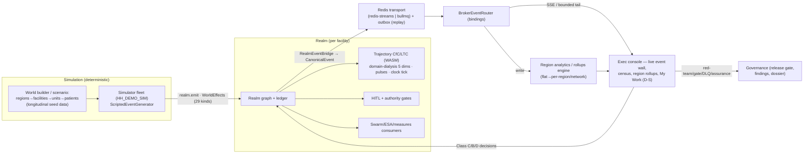

# Renal Enterprise — End-to-End Solution Analysis

> **Audience framing**: you are a Renal Enterprise running **hundreds of dialysis
> facilities**. Two consoles serve you today: **Admin UI** (`/admin/ui/`) is the
> *setup + data + simulation management* console; **Exec** (`/exec/`) is the
> *business console* used by administrators, clinicians (MD/safety) and
> operations executives.
>
> This document is a **holistic gap analysis**: what we have, what a real
> enterprise operator still needs, and a phased plan to reach an end-to-end,
> demoable, real-time solution — including the **Redis event transport** for live
> event simulation and where **Dempster–Shafer** should enhance decisions.
>
> Status: analysis only — no code changed. Every claim is verified against the
> current tree (file/kind/route identifiers included).

---

## 1. Business map: what the platform already covers

Map the features to the operating model of a multi-facility dialysis enterprise.

| Renal-enterprise domain | Today (producer) | Where an operator sees it |
|---|---|---|
| **Patient + facility census** | Simulator realms: `dialysis-demo` = 2 facilities / 4 units / 12 patients / 6 presences; realms at `/admin/realms`, patients via `populateFacility` (`FacilitySeed`), master-data `facilities/units/patients` rows | Exec **Patient intelligence**, **Facility operations**; Admin **World/Realm management** |
| **Live clinical ops** | 29 `WorldEffect` kinds emitted through `realm.emit` → authority + HITL gates, entity graph, ledger | Exec **Swarm control / Outcome command / My Work**; Admin **Effect ledger / Command center** |
| **MD / clinical work** | Class B/C/D episode approval in **My Work** (`/api/work`), `OutcomeEpisodeCoordinator`, delegations | Exec **My Work**, **Executive outcomes** |
| **Anemia / ESA program (CDSS)** | `anemia.*` P0–P3: reference + trained model, coverage gate, red-team, external validation, MDR file | Exec **Anemia & ESA** |
| **AI early-warning / trajectory** | `TrajectoryAmbientProcess` (CfC/LTC, `domain-dialysis` 5 dims, event-feature vector, WASM per patient) consumes **the same ledger WorldEffects** as model pulses + steps on the realm clock | Exec **Patient intelligence** (risk), Admin **Anant Trajectory** (what-if/train/score) |
| **Quality / regulatory** | Real CMS CSVs (`/admin/cms/readiness`), EQRS submission lifecycle, embedded/CQL measure eval | Exec **CMS operations**; Admin **Governance/Compliance** |
| **Payer / revenue cycle** | `payer.ts`: care-gap, prior-auth, network-access episodes, claims | Exec (payer lens), Admin **Renal Swarm** |
| **Operations / capacity** | Facility simulation checks from realm counts, staffing presences | Exec **Facility operations**; Admin realm pages |
| **Governance / assurance** | Green/red team, findings lifecycle, release gate + dossier, DLQ, agent studio, drift | Exec **AI assurance**; Admin **AI Assurance / Release center** |
| **Shared intelligence** | Hypergraph-ish topology + canvases/notes, cited what-if | Exec **Shared intelligence** |

**Console roles (verified split)**
- **Admin UI** = setup & world: 11 sections (Overview, Agents, Catalog, World, Inner lives, Governance, Anant Trajectory, System, Platform, Renal Swarm, Exec assets) → agent authoring, catalog/master-data CRUD, realm/simulator control, broker, FHIR, enterprise (webhooks/alerts/retention/audit), settings, release center, DLQ.
- **Exec** = business run, 12 pages under Operate/Understand/Govern: My Work, Swarm control, Agent operations, Outcome command, Patient intelligence, **Anemia & ESA**, Facility operations, Assessment intelligence, Shared intelligence, Executive outcomes, CMS operations, AI assurance, Platform admin, Configuration studio. Roles: exec (`admin|md|safety`) via `console-gate` + `api-auth`.

**Where the roles live today** is correct (Admin=setup, Exec=run) — the *gaps* below are about **volume**, **real-time**, and **cross-facility intelligence**, not the basic split.

---

## 2. Synthetic data generator — what it produces today

**Simulator** (`src/simulator/`): `SimulatorController.start(scenario)` builds each
realm with `AcceleratedClock`, `populateFacility`, `spawnPresences`, and a
`ScriptedEventGenerator` that emits scripted `WorldEffect`s through `realm.emit`
(real authority + HITL gates run). Counters tick from real `clock.subscribe` +
`ledger.onAppend`. Fleet persists to `simulator_fleet` + realm specs/snapshots and
**resumes across restarts**. Boot auto-run: `HH_DEMO_SIM=1`.

**What a script can emit**: `order-lab`, `result-lab`, `record-vitals`,
`record-assessment`, `schedule-followup`, `submit-claim`, `flag-safety-event`
(moderate + rare `critical` → suspends into HITL), `order-med`, `administer-med`,
`hold-med`, `titrate-med`, `admit/discharge/transfer`, `update-care-plan`,
`request-prior-auth`, … (29 kinds total).

**Trajectory relationship (critical, verified)**: one `WorldEffect` has **three
parallel consumers**:
1. **Graph/entity** mutation + `ledger.append` (source of truth),
2. **Trajectory model** — `TrajectoryAmbientProcess.onEffect` accumulates decayed
   *pulses* per patient, and the CfC/LTC **step** runs on the realm **clock tick**
   (not on the event), using pulse vector `[missed_treatment, access_complication,
   lab_marker_elevated, abnormal_vital_reading, diet_phosphate_violation]` → 5
   dims `vitals_instability, deterioration_risk, ktv_adequacy, phosphate,
   anemia_severity` (WASM `LiquidSimulation`, α=0 baseline until promoted weights),
3. **Canonical broker event** — `RealmEventBridge` projects each ledger append →
   `CanonicalEvent` (`effectKindToEventType`) → outbox → EventBroker.

> So **events already feed the trajectory today — in-process on the realm clock**.
> Redis is NOT required for CfC/LTC. Redis is required for the *enterprise,
> real-time, multi-consumer, cross-process, replayable* demo (next section).

**"Complete data" gap**: current sim patients carry a *sparse* window of data:
`lastVitals {hr,bp,spo2}`, `labs {K,HGB,URR,PHOS}`, `trajectory`, `problemList`,
`phosBinderAdherence`, `accessIssue`. For a convincing hundreds-of-facilities demo
(and to feed the anemia/ESA program + quality measures + claims), each patient
needs a **denser longitudinal record** — weekly labs (Hb/MCV/ferritin/TSAT/CRP/Ca/
PTH, Kt/V, PHOS), monthly ESA dose + iron status, visit/vitals history,
treatment-session history (missed/completed with Kt/V delivered), assessments,
claims, and prior-authorizations — generated deterministically at seed time, then
*evolved live* by the scripts.

---

## 3. Redis queue / real-time event simulation — what exists vs what to build

**What exists (verified)**
- EventBroker with **9 drivers** incl. `redis-streams` and `bullmq`; factory picks
  by `HH_EVENTBROKER_DRIVER` (default `inprocess` in dev, configurable). BullMQ
  job bus (`harness-jobs`) with handlers; **Redis** service in docker-compose
  (`anant-health-redis`, `redis:7-alpine`, AOF) wired via `HH_REDIS_URL`.
- Outbox (`SqlEventOutbox` + `OutboxPublisher`) → durable, replayable publication.
- **Real-time listeners that exist**: Admin **Command center** = SSE
  `/admin/stream` fed by per-realm `ledger.onAppend`/`rules.subscribe`; exec polls
  `startLiveRuntime` (4s) + patients (8s); admin Simulator panel polls 2s.
- Real-broker conformance gate: `RUN_REAL_BROKER_TESTS=1` spins `redis:7-alpine`.

**What is missing for the ask** ("use Redis queue to show real-time event
simulation")
- **No Redis transport in the dev demo path by default** (dev = inprocess), and no
  *end-to-end* Redis data path: realm → Redis → consumer.
- **`BrokerEventRouter` exists but is never instantiated** in dev/bootstrap — no
  broker→application fan-out (bindings → dispatch) is wired, so nothing consumes
  the Redis events into dashboards/EPs.
- **Exec has no live event wall** (it polls snapshots). Admin Command center is
  in-process ledger SSE, not broker-driven.
- Sim realm *creation* is a scripted, in-process fleet — it cannot yet be a
  **multi-worker** fleet where each region/facility produces through Redis.

**Proposed build (Slice R0 — Redis real-time event mode)**
1. **`BrokerEventRouter` in dev/bootstrap** + a small canonical-event registry
   binding (topic `anant.canonical.events` → route). Run dev with
   `HH_EVENTBROKER_DRIVER=redis-streams` (or `bullmq`) + `HH_REDIS_URL` to make
   every sim `WorldEffect` land in Redis as a `CanonicalEvent` (durable,
   replayable, orderable).
2. **A live events endpoint** for exec (SSE or a bounded `/api/live/events`
   tail) fed by the router, plus a per-facility filter. Add a "LIVE · Redis" badge
   + event ticker to exec pages (e.g., Swarm control / a new Ops wall) so the demo
   visibly shows real-time event flow through Redis (no 4s polling for the wall).
3. **Replay from Redis** (already have outbox `replay`) exposed to a button so a
   presenter can re-run the last N minutes.
4. Guardrails: keep the in-process path as the deterministic fallback (tests stay
   green); Redis mode is an opt-in env (`HH_EVENTBROKER_DRIVER` + Redis URL) so CI
   and the vitest suite are untouched.

> Note: trajectory CfC/LTC **stays in-process** on the realm clock (correct design
> — low-latency per-patient math). Redis carries the **observable/decoupled event
> stream**: what an enterprise sees as "real-time", and what external consumers
> (dashboards, data lake, region analytics) subscribe to.

---

## 4. Gap analysis: from 2-facility demo to "hundreds of facilities"

**Scale gaps (verified)**
1. **1 realm ≈ 1 facility** in the simulator scenario model
   (`SimRealmDef.facility: FacilitySeed` is singular). `dialysis-demo` = 2
   facilities / 4 units / 12 patients. No scenario/catalog drives hundreds.
2. **Hierarchy is reference data, not runtime**: `operating-model` scopePath
   (enterprise→division→region→market→facility, e.g., Riverbend 312→SE 74→Middle
   TN 18→Nashville South 6→Franklin 1) and payer org exist as seed docs. There is
   **no live region/network rollup engine**; topology's "region" band is a
   projection label; master-data facilities are per-realm rows.
3. **Live swarm treats each realm as one facility scope** and aggregates flat KPIs
   (`treatmentsProtected=Σpatients`, `capacityHours`, `cmsReadiness`,
   `valueAtRisk=Σeffects×250`) — no per-region/network rollups, no facility
   heat-maps.
4. **Sparse patient data** (above) — not enough longitudinal depth to power
   facility QIP, anemia, trajectory, and claims for a big fleet.
5. **Exec has no business "operations/region" surface** — no census board, no
   per-facility MD queues at scale, no region executive rollup page; Patient
   intelligence + Facility operations are per-real patient/facility (small).

**What a renal enterprise operator expects (and is missing)**
- A **fleet/world builder**: pick regions → facilities → units/patients; seed a
  deterministic enterprise (e.g., 6–10 regions, 20–60 facilities, 300+ patients)
  with longitudinal data — not 12 patients.
- A **live census board** (facilities × status: admissions, missed tx, safety,
  labs due, ESA patients) at facility/region/network scope.
- **Region & network rollups** for the metrics executives already see (quality,
  ops, revenue, safety) computed from real underlying facilities, with drill-down.
- **MD work at scale**: My Work grouped by facility/region with D-S-belief-aware
  priority (see §6), not just urgency rank.
- **Live event wall** (Redis) for demos + a per-facility event tail.
- **Assurance that scales**: the existing red-team/gate/DLQ machinery already
  generalizes to any number of facilities because it is config/domain-agnostic —
  no change needed for volume.

---

## 5. End-to-end target architecture

**Principles**
- Trajectory stays **in-process per realm** (low-latency), Redis carries the
  observable/decoupled event stream for live UI + analytics (per §3 note).
- Deterministic by default (tests/live verify), Redis as opt-in demo/scale path.
- Everything new rides existing seams: `SimulatorController`, `RealmEventBridge`,
  `BrokerEventRouter` (already written), `projectTopology`,
  `SwarmWorkspaceStore`, `/api/work`, `executeLiveSwarm`.

---

## 6. Dempster–Shafer — current state and how to enhance

**Already built (verified)** — an honest D-S substrate:
- `src/evidence/dempster.ts`: `Mass`/`fuse`/`belief`/`plausibility`/`uncertainty`/
  `conflictMass`, Zadeh handling, discounting, `dst` frames.
- Swarm insights (`aggregateSwarmInsights` mode `dst`, `DST_K_GATE=0.3`,
  `DST_DISSENT_PL_GATE=0.6`, reliability discounting), outcome-episode evidence
  fusion (`fuseEpisodeEvidence`, `evidenceStatusFor`, resolve gate Bel≥0.55, K≥0.3
  contested), belief-aware NBA ranking, `reliabilityBySource` (`realm-ledger` 0.95,
  `sim:`/synthetic 0.3 …), surfaced as `Bel/Pl/K` in exec + admin.

**Where D-S should now enhance the enterprise solution (gaps the analysis found)**
1. **Belief-aware My Work queue.** `buildWorkQueue` sorts by urgency/recency only.
   Prioritize by *interval* — e.g., score = decision value × Bel − γ·Pl(harm),
   with `awaiting-approval` gating on Pl(harm) and conflict K (machinery already in
   `nba.ts`) applied to the `/api/work` queue so clinicians see the highest-
   *believed-impact, lowest-risk* items first.
2. **Cross-facility / regional evidence aggregation.** Today fusion is per
   insight/episode at facility scope. At enterprise scale we want a **region-level
   D-S layer**: pool the *same signal type* across facilities (e.g., rising Kt/V
   misses or safety events), discount each facility's mass by a per-facility
   reliability, and retain a finding only when region **Bel** crosses a gate with
   low K — turning "12 facilities each had 1 signal" into "the SE region is
   degrading (Bel 0.83)". This is the D-S answer to false positives across many
   small facilities.
3. **Multi-signal early-warning (patient).** Combine vitals + labs + attendance +
   ESA-no-response pulses into a single deteriorating-patient belief, and only
   open an alert/episode when Bel ≥ gate (not on any single noisy threshold). This
   directly complements the CfC/LTC trajectory (model gives the *forecast*; D-S
   gives the *combined-evidence belief* about an intervention being warranted).
4. **ESA episode fusion.** The `anemia.esa-response` episodes are seeded but carry
   no fused evidence — attach the evidence fusion so a Class-C dose suggestion is
   rated (Bel/Pl/K) from lab + trend + prior-response evidence before it lands in
   My Work, consistent with the resolve gate.
5. **Revenue-cycle / claims.** Apply the same belief-aware adjudication to
   payer decisions (evidence from orders + auth + contract terms), reusing the
   existing reliability + discount machinery instead of adding a new ad-hoc
   scoring path.

---

## 7. Recommended phased plan (each slice independently demoable + tested)

- **R0 — Redis real-time event simulation.** Wire `BrokerEventRouter` + a live
  events SSE/tail for exec; runnable demo with `HH_EVENTBROKER_DRIVER=redis-streams`
  (or bullmq) against the docker Redis; replay-from-Redis button; "LIVE · Redis"
  badge. (Satisfies the explicit real-time ask; no change to trajectory.)
- **R1 — Enterprise world + complete data.** Fleet/world builder: multi-facility
  deterministic enterprise (regions→facilities→units→patients) + **rich
  longitudinal patient generator** (weekly labs incl. anemia panel, monthly ESA,
  session history, claims, assessments) that feeds facility QIP + anemia + claims
  + trajectory. Scale knob for "hundreds of facilities".
- **R2 — Region/network operations layer (exec).** Live census board + region &
  network rollups + facility heat-maps + per-facility/region MD work filters,
  built on a real regional rollup engine (not projection labels).
- **R3 — D-S at enterprise scale.** Belief-aware `/api/work` queue, region-level
  D-S aggregation, multi-signal early-warning alerts, ESA + revenue-cycle fusion
  (the four enhancements in §6).
- **R4 — Assurance/UX hardening for the enterprise demo.** End-to-end demo runbook,
  scenario presets (quality / ops / payer / anemia journeys), load & restore
  drills at fleet scale, labels.

Suggested start: **R0** (your explicit ask) → then **R1** (complete data) → **R2**
→ **R3**. Each slice lands as a committed, fully-tested increment like P0–P3 did.
