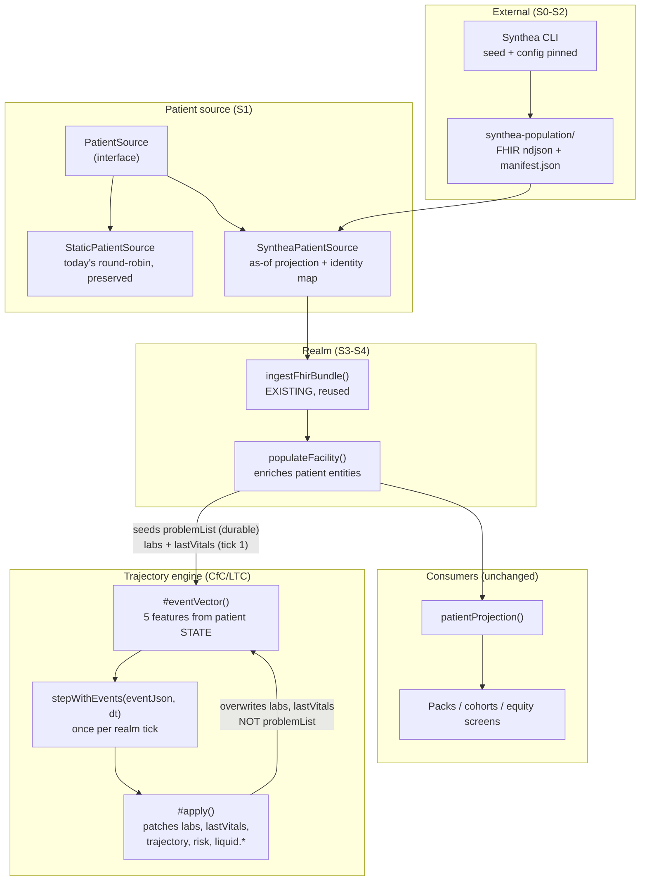

# Synthetic population from Synthea — analysis and implementation plan

**Status:** proposed for review · **Date:** 2026-09-16 · **Branch:** `platform`
**External inputs:** [synthetichealth/synthea](https://github.com/synthetichealth/synthea) (MITRE, Java) · [TIET-AI/tietai-synthea](https://github.com/TIET-AI/tietai-synthea) (PySynthea, Python)

---

## How to read this document

Sections 1–4 are the analysis: what the population is today, why the limitation is
worth fixing rather than cosmetic, and what the two candidate generators actually
provide. Sections 5–6 are the approach and the phases, each with an exit criterion
and a statement of what is testable. Sections 7–8 are the boundaries, the risks,
and the decisions that are yours rather than mine.

**Section 9 is a review of §1–8 through a different lens** — *does this work for
**every** specialty, or only for renal?* It found that the plan was renal-centric in
ways the plan itself did not confront, including a fourth place one specialty's
medicine is hardcoded in the platform layer, and a deeper question about whether the
population is per-realm or per-platform. **Read §9 before treating §4–5 as the
design.**

Phase IDs are `S0`…`S6` (`S` is unused; the repo already uses `G` for gaps, `F` for
FHIR, `M` for milestones).

**One thing to say up front, because it shapes everything below.** I have read both
generators' documentation but I have **not run either of them**. Every claim about
their output in this document is quoted from their READMEs as of 2026-09-16 and
marked as such. `S0` exists precisely to replace those claims with evidence before
anything is built on them. I have measured our own side, and those numbers are
mine.

---

## 1. What we have today, measured

The population is generated in `src/realm/sim-populator.ts`. Every attribute of
every patient is selected as `array[index % array.length]`:

```ts
const trajectory   = TRAJECTORIES[i % TRAJECTORIES.length]!;
const age          = AGES[i % AGES.length]!;
const sex          = SEXES[i % SEXES.length]!;
const unitId       = unitIds[i % unitIds.length]!;
      type:   ACCESS_TYPES[i % ACCESS_TYPES.length]!,
      problemList: [...problemsFor(seed.kind, trajectory), ...comorbidityFor(i)],
```

| Dimension | Source | Size |
|---|---|---|
| `AGES` | `sim-populator.ts` | 10 — `45 … 79`, no patient under 45 or over 79 |
| `SEXES` | `sim-populator.ts` | 2 — `['F','M']`, strictly alternating |
| `TRAJECTORIES` | `sim-populator.ts` | 7 |
| `ACCESS_TYPES` | `sim-populator.ts` | 4 — `['avf','avf','avg','catheter']` |
| `COMORBIDITIES` | `sim-populator.ts` | 9, **5 of them empty** |

The population is therefore a **deterministic round-robin**: a patient's entire
identity is a function of their index. The five dimensions together have a cycle of
`LCM(10,2,7,4,9) = 1260`, so beyond 1260 patients the population repeats exactly.
The scenarios define **58 patients** across nine realms, which is inside one cycle —
but the diversity ceiling is what matters, not the repeat point:

- **10 ages.** No 30-year-old on dialysis, no 85-year-old.
- **Sex alternates strictly**, so a unit of six is always 3F/3M. A unit can never be
  5:1 in either direction.
- **9 comorbidity patterns, 5 of them empty.** Across the nine deployed realms the
  58 patients split **36 with exactly one of four malignancy presentations** and
  **22 with no comorbidity at all**. Four oncology stories, no onsets, no stages, no
  treatment lines.
- **`ACCESS_TYPES` is `['avf','avf','avg','catheter']`** — a 50/25/25 split. That is
  an assertion about vascular access distribution that nobody measured, and it is
  higher catheter prevalence than the real figure.

The comment on `COMORBIDITIES` already names what this is:

> *"In a real deployment these arrive as `condition.recorded` from the EMR, and this
> list is the stand-in for that feed."*

**So the gap is not "the data is fake" — it is that the stand-in has quietly become
the thing we reason about.** Two consequences follow, and they are the actual case
for this work.

### 1.1 The population cannot exercise the multi-specialty platform

We have just spent a long sequence of work (G1…G6, the cohort contribution, the
vocabulary split) making the platform host ten specialties at once. A specialty
earns its place by having a cohort — patients it is responsible for. But the
malignancy that puts a patient in the oncology cohort comes from
`COMORBIDITIES[i % 9]`, i.e. from **four** hardcoded presentations. `packs/oncology-provider/cohort.ts`
selects on recorded problems, so it does work — it currently finds 3 patients — but
the population behind it has four distinct oncology stories in total, and none of
them carries an onset date, a stage, a treatment line, or a diagnosis pathway.

A multi-specialty platform validated against a population with four
single-comorbidity patients per specialty is validated against a fixture that
cannot fail in the ways that matter.

### 1.2 The population cannot exhibit the disparities our equity reporting looks for

This is the stronger argument and it is the one to weigh.

The platform ships fairness and equity screens — `/admin/swarm/assurance/fairness`,
the liquid promotion gate's `noEquityRegression` signal, vintage as a slice
dimension in the infection triage. Those exist to detect that an outcome differs
across a population subgroup.

A population whose sex alternates strictly and whose ages cycle through ten values
has **parity by construction**. Run an equity screen against it and the honest
result is "no disparity found" — not because the system is equitable, but because
the fixture is arithmetically incapable of showing the difference. The screen can
never be seen to fire. That is a test that passes for the wrong reason, and it is
the failure mode this platform has been careful about elsewhere: a check that
reports success while measuring nothing.

And it is worse than that argument alone implies. §9.2 measured it: the seeded
population carries **no race, ethnicity, language or insurance** — age and sex are
the only demographic axes it has, and healthcare equity is predominantly measured on
the other four. The screens do not lack signal; they lack fields. See §9.2.

A population drawn from real census demographics with real disease prevalence —
which is exactly what Synthea is for — is the difference between an equity screen
that *can* find something and one that structurally cannot.

---

## 2. What Synthea is, and what it is not

### 2.1 What it is

Synthea is a **synthetic patient population simulator**: it models individual
patients from birth to death and emits their health records. From the MITRE README:

- Birth-to-death lifecycle; **231 disease modules**; modular JSON state machines
- Encounters, conditions, allergies, medications, vaccinations, observations,
  vitals, labs, procedures, care plans
- Demographics from **real census data** with geographic distributions
- Exports **FHIR R4 / STU3 / DSTU2**, **Bulk FHIR (`ndjson`)**, C-CDA, CSV, CPCDS
- CLI: `-s seed`, `-p population`, `-g gender`, `-a minAge-maxAge`, `-m module`,
  `-r referenceDate`, state/city
- Apache-2.0 · Java 17+ · ~3.3k stars, 20 releases, commits within the last month

PySynthea is a Python port of it (Apache-2.0, `pip install tietai-synthea`, import
name and CLI both `synthea`), claiming the same 231 modules, FHIR R4 / CSV / JSON
export, and resources bundled with the package so no checkout is needed. Python
3.9+, `uv` for development. Its README states it is "a Python implementation of
Synthea™" and acknowledges MITRE's original.

### 2.2 What it is not — the boundary that matters

**Synthea does not model dialysis.** It generates a lifetime of general healthcare.
It has no concept of a thrice-weekly treatment schedule, Kt/V, ultrafiltration
rate, ESA dosing, iron, vascular access surveillance, or a chair-side session. Its
CKD module covers CKD as a condition; it does not produce our domain.

So Synthea cannot replace the simulator. What it replaces is narrower and more
valuable:

| Concern | Today | Source of truth after |
|---|---|---|
| **Who the patients are** — age, sex, conditions, meds, history | `AGES[i%10]`, `COMORBIDITIES[i%9]`, index arithmetic | **Synthea** |
| **What happens to them** — sessions, ESA dosing, access surveillance, Kt/V dynamics | `longitudinal.ts`, `scenarios.ts`, the liquid engine | **Unchanged — our renal domain** |

The boundary is slightly more porous than that table suggests for one field, and §4.5
works it out precisely: Synthea also supplies the **initial** lab and vitals state
that the trajectory engine starts from. What it does not supply is anything the
engine computes afterwards.

That division is the whole design. **Synthea supplies the patient; the realm
supplies the time.**

### 2.3 A consequence worth naming early

Synthea emits a *lifetime record with real timestamps*. Our realm has a *live
accelerated clock*. They do not line up, and pretending otherwise will produce a
patient whose conditions all have onset dates in the future or 40 years ago relative
to `realmAt`.

The mapping is therefore an **as-of projection**: pick a reference date, take the
patient's state *as of* that instant, and seed the realm from it. Synthea's `-r
referenceDate` supports this directly, and the same projection is what makes a
regenerated population stable. This is a design decision with real consequences —
notably that conditions arrive with **onset dates**, which our `problemList` (a flat
`string[]`) currently discards. Onset dates are what a cohort definition needs to
say "newly diagnosed" as opposed to "has ever had".

---

## 3. Generator choice

| | Java (MITRE) | PySynthea (TIET-AI) |
|---|---|---|
| Maturity | Reference implementation, 84 contributors, 20 releases, active last month | v1.0.1, 5 contributors, 13 stars, released ~2 months ago |
| Toolchain | JDK 17+ (LTS recommended), Gradle | Python 3.9+, `uv` or pip |
| Outputs | FHIR R4/STU3/DSTU2, Bulk ndjson, C-CDA, CSV, CPCDS | FHIR R4, CSV, JSON |
| Interface | CLI, Gradle tasks | CLI **and a Python API** (`Generator`, `Person`, `FHIRExporter`) |
| Fidelity risk | None — it defines fidelity | Port drift is unverified; the README claims completeness but the project is young |
| Fit to this repo | External CLI process | External CLI process **or** an importable library |

**Recommendation:** default to the **Java reference implementation**, and treat
PySynthea as a supported alternative — because the decision should not be load-bearing.
Our stack is Node/TypeScript + Rust; neither generator runs in-process, both are
external CLIs, so we are already in the "spawn a tool" business. We do exactly this
today: `src/liquid/trainer.ts` spawns the `liquid-train` Rust CLI to train the CfC
model.

The mitigation for the wrong choice is architectural rather than a bet: **make the
population source a seam** (§4). If the two generators disagree, swapping is a
config change. `S0` should settle it on evidence — generate the same population
with both and compare what we actually need.

Note the licensing obligation either way: both are Apache-2.0, so Synthea's NOTICE
requires attribution. This repo has a strict header regime (`add_copyright.py`,
`copyright.md`), so a dependency on Synthea adds a `NOTICE` entry, and vendoring its
231 module JSON files into our tree is a decision to make deliberately rather than
by copying a directory. PySynthea additionally asks for a citation in academic work.

---

## 4. The approach: three seams, all reusing something we already have

**A note on the section title.** These three are seams where we *reuse* something
already built. §9.1 identifies a fourth that is not a reuse — the **`state_model`
declaration**, which makes the trajectory engine's vocabulary a specialty's rather
than the platform's. It is absent from this section because it is absent from the
original plan, which is the finding §9 is about. It is scheduled in S1 (§9.7).



Three things we already own and should not rebuild:

1. **`ingestFhirBundle(realm, ctx, bundle, opts)` — `src/fhir/bundle-ingest.ts`.**
   This is a real FHIR ingest: modes, idempotency ledger, dry-run preview, rollback,
   durable mirror. Synthea emits FHIR. Almost all of S3 is wiring, not writing.

2. **The `LiquidTrainer` pattern — `src/liquid/trainer.ts`.** Spawns an external CLI,
   reads a declared artifact, promotes it with metrics, and takes an **injectable
   runner** so CI never needs the toolchain. `SyntheaRunner` mirrors it exactly, and
   that injectability is what keeps `S2`'s tests free of Java and Python.

3. **The `cms-data/` pattern — `cms-data/` + `manifest.json` + `CMS_DATA_DIR`.**
   The established shape for external datasets: a directory, a manifest recording
   provenance, an env override, a loader, and a documented source. The population
   directory mirrors it.

### 4.1 The `PatientSource` seam

```ts
export interface PatientSource {
  readonly id: string;                 // 'static' | 'synthea'
  readonly provenance: PopulationProvenance;
  patients(seed: { facilityId: string; count: number }): readonly PopulatedPatient[];
}
```

`PopulatedPatient` is the *populator's* vocabulary (age, sex, problem list with
onsets, medications, history) — deliberately not `RenalPatientInput`, which is a
specialty-facing projection. The existing round-robin moves behind
`StaticPatientSource` unchanged, which is what makes `S1` a zero-behaviour-change
step and lets the static source remain the dependency-free default for tests.

### 4.2 Provenance and the synthetic guarantee

The population manifest records generator name and version, seed, config hash,
module set, patient count, reference date, and generation timestamp.

Non-negotiable: **Synthea patients must be structurally incapable of being
classified as `phi`.** The platform already has the pattern — `record-access-acoustic`
throws without a synthetic label. The same enforcement applies here: population-
sourced events carry the synthetic marker, and the existing "Synthetic patient data"
badge becomes true rather than decorative.

---

### 4.3 Why the existing FHIR ingestor is the front half — and not the whole answer

We already own a real FHIR ingest, so the obvious question is whether the
population work collapses into "point the batch ingestor at Synthea's output".
**Half of it does, and the other half would quietly empty every specialty's
cohort.** The division is measurable.

`renalPatientInputs` (`src/swarm/renal-cohort.ts`) hands the entity's state bag
straight to the packs:

```ts
state: patient.state as Record<string, unknown>,
```

So what a pack can see is exactly what the patient entity carries. The two writers
of that bag disagree almost completely:

| | Written by the FHIR ingestor<br/>`structuralState`, `src/fhir/canonical.ts` | Written by the seeder<br/>`populateFacility` |
|---|---|---|
| `sex`, `facilityId` | ✅ | ✅ |
| `name`, `mrn` | ✅ | — |
| **`birthDate`** | ✅ | — |
| **`age`** | — | ✅ |
| `problemList` | — | ✅ |
| `trajectory`, `dialysisVintageYears` | — | ✅ |
| `access`, `sessions`, `accessObservations` | — | ✅ |
| `lastVitals`, labs, `admitted` | — | ✅ |

**The overlap is two fields: `sex` and `facilityId`.** Three consequences, each of
which is a regression rather than a gap:

1. **Every specialty's cohort empties.** `problemList` is how a cohort names its
   patients — `packs/oncology-provider/cohort.ts` reads `state.problemList`. Nothing
   in the ingest path writes it. Ingesting alone would take the oncology board back
   to empty, undoing the cohort work.
2. **The renal protocols break on age.** They read `state.age`; the ingestor writes
   `birthDate`. Nothing in the *simulation* reads `birthDate` — see §4.4, where the
   one existing relationship between the two turns out to be the wrong way round. A
   realm of ingested patients would therefore have no age at all as far as every
   protocol is concerned.
3. **There is nothing to simulate.** No `access`, `sessions` or `trajectory` means
   the renal simulator has no state to advance.

Also worth stating plainly: **ingested `Condition` resources do not reach the
cohorts either.** `RESOURCE_TO_KIND` maps `Condition` to its own `condition` entity
kind, not into `state.problemList`, so a patient can carry a perfectly good Synthea
malignancy and remain invisible to the oncology cohort.

And a terminology point, because "batch" means two different things here:
**there is no bulk ingestor.** `bulkExport` appears only as a *vendor capability
flag* in the integration profiles (`fhir-integration-routes.ts`) — a description of
what Epic or Cerner supports, not an endpoint we implement. What exists is
`POST /fhir` → `ingestFhirBundle` with `MAX_BUNDLE_ENTRIES = 500` per bundle. A
231-module, multi-hundred-patient population therefore arrives as **many bundles**,
which is fine, but it is not a single bulk load.

### 4.4 What the ingestor nonetheless removes

The reframing is **ingest → enrich**, not *seed → maybe ingest*:

- `populateFacility` stops **creating** patients and starts **completing** them —
  assign unit, access type, vintage, trajectory, and derive `age`.
- The bespoke `parse.ts` this plan originally proposed is **deleted from it**. We
  inherit idempotency, dry-run/rollback, `Patient.link` merge handling, and identity
  resolution — built and tested — instead of writing a parallel parser that would
  have to grow all of it again.

That is strictly less new code, and it removes the phase's largest risk (a
hand-rolled FHIR reader drifting from the real one). The trade is that the
enrichment step must be explicit and tested, because it is now the only place the
renal shape is applied.

Two decisions this surfaces, both recorded in §8:

- **`age` vs `birthDate`.** The platform snapshots `age` — a derived,
  time-dependent value that rots as the realm clock advances. Synthea supplies
  `birthDate`, which does not. Synthea makes fixing this possible, and the fix is to
  derive `age` from `birthDate` at read time rather than freeze it at seed time.

  Checked, because the honest version is more specific than "nothing reads it": the
  two are already related, in the **wrong direction**. The outbound FHIR serializer
  prefers a stored `birthDate` and otherwise **falls back to deriving one from the
  stored age** (`src/fhir/mapping.ts`):

  ```ts
  ...(birthDate ? { birthDate } : age !== undefined
    ? { birthDate: `${new Date().getFullYear() - age}-01-01` }
    : {}),
  ```

  So the wire direction is already correct — `birthDate` wins when it exists, which is
  what the ingest path writes. The gap is that the **simulation** reads `age` and
  nothing keeps the two in step, so the fallback is doing real work today: `age` is
  frozen at seed time while the realm clock runs accelerated, and the derived birth
  date is computed against the **wall clock**. A patient in a realm that has simulated
  three years goes out to an EMR with a birth date from real time and an age that has
  not moved. Ingesting a real `birthDate` inverts the relationship properly —
  `birthDate` becomes the stored fact, `age` the derived read — and `identity.ts`
  already consumes `birthDate` for patient matching, so it is a fact the platform
  half-uses already.
- **Conditions → `problemList`.** Either project ingested `condition` entities into
  `state.problemList` (keeps today's cohort contract, smaller step), or change the
  cohorts to read `condition` entities (the right destination, but it touches every
  pack's cohort). The first is the smaller step; the second is where this should
  end up, because "a recorded problem" is precisely a `Condition`.

### 4.5 How Synthea reaches the trajectory engine — it feeds the STATE, not the events

The simulator's scripted `emit` entries are not what CfC/LTC consume. The engine is
stepped once per realm tick with a **5-element event-feature vector computed from
patient state**, in `TrajectoryAmbientProcess.#eventVector`:

```
EVENT_ORDER = [missed_treatment, access_complication, lab_marker_elevated,
               abnormal_vital_reading, diet_phosphate_violation]
```

| Feature | Where the input actually comes from |
|---|---|
| `missed_treatment` | effect pulse from `flag-safety-event` · **or** `state.trajectory === 'underdialyzed'` · **or** `problemList` ∋ `Underdialysis` |
| `access_complication` | effect pulse from access safety events · **or** `state.accessIssue` |
| `lab_marker_elevated` | effect pulse from lab events / abnormal `result-lab` · **or** `state.labs` thresholds (K>5.5, URR<65, PHOS>5.5, HGB<10) |
| `abnormal_vital_reading` | `state.lastVitals` (hr>110, hr<50, spo2<92) |
| `diet_phosphate_violation` | `state.phosBinderAdherence === 'poor'` · **or** `problemList` ∋ `CKD-MBD` |

**Four of the five inputs are a function of patient state** — `problemList`, `labs`,
`lastVitals`, `trajectory`, `accessIssue`, `phosBinderAdherence`. Two of those,
`problemList` and `labs`, are precisely what Synthea supplies and what the FHIR
ingestor does not write (§4.3).

So the answer to "how does Synthea data integrate with the events the simulator
loads" is: **it doesn't enter the event stream. It enters the state the event vector
is computed from.** The events keep coming from the realm.

Three mechanics that decide the design:

1. **`problemList` is durable; `labs` and `lastVitals` are not.** `#apply` patches
   `trajectory`, `risk`, `lastVitals`, `labs` and `liquid.*` back onto the patient
   **every tick**. So a seeded `labs` value is consumed on tick 1 and then the engine
   owns it — the seed is an *initial condition*, not a persistent input. `problemList`
   is never written by the engine, so a Synthea problem list shapes the event vector
   for the patient's whole life in the realm. **That is Synthea's strongest and most
   durable contribution.**
2. **The engine state is seeded, not derived.** `forkFrom(stateJson, t)` sets the 5
   dimensions directly; there is no "derive dims from a lab record" path.
3. **`stepWithEvents(eventJson, dt)` is the only way in.** A warm-up replay is
   therefore possible: feed Synthea's observation history as a sequence of steps with
   `dt` between observations, so the engine's own dynamics produce the state rather
   than us hand-setting dimensions. Cost is one model step per patient per observation,
   so subsample — monthly over five years is 60 steps, a full lifetime at observation
   granularity is not.

### 4.6 The honest dimension mapping — Synthea supplies two of five

Whatever route is taken, the ceiling is the same, and it is worth stating before
anyone plans around it:

| Engine dimension (0..1) | Synthea source |
|---|---|
| `anemia_severity` | ✅ haemoglobin observations |
| `phosphate` | ✅ serum phosphate observations, *if* the enabled modules emit them |
| `ktv_adequacy` | ⚠️ **no.** Synthea has no Kt/V, and eGFR/creatinine are not dialysis adequacy. A proxy here would be invented — and inventing it silently would be worse than declaring the gap |
| `vitals_instability` | ⚠️ partially. BP/HR exist, but *intra-dialytic* instability is not in Synthea |
| `deterioration_risk` | ❌ derived; no Synthea source |

**Synthea sets the clinical baseline; the renal simulator still owns the dialysis
dynamics.** That is less than "we no longer need the simulator" and more than "a
problem list" — and it is the reason §6 keeps the renal domain firmly out of scope.

### 4.7 We have already hand-rolled a worse version of this

`src/simulator/longitudinal.ts` — `generateLongitudinalHistory({patientId,
facilityId, trajectory, days, seed, asOf})` — produces, for one trajectory, a
consistent 90-day history of labs, vitals and ESA doses, and `populateFacility` seeds
it via `PopulateHistoryOptions`.

That is the same idea as Synthea, at 90 days instead of a lifetime, for one disease
instead of 231, with hand-written dynamics instead of clinical modules. **Synthea's
real target on the state side is `longitudinal.ts`**, not the scenario definitions —
and the warm-up replay in §4.5 is the direct replacement for what
`generateLongitudinalHistory` fabricates.

## 5. Phases

### S0 — Prove the tool, and decide (§3)

Run both generators on the same brief: ~50 patients, CKD/dialysis-relevant modules,
a pinned seed, `-r` reference date. Inspect the FHIR for what we actually need —
Condition with onset, MedicationRequest, Observation with LOINC codes — and check
how much is dialysis-adjacent.

**Exit:** a written comparison of real output, and a decision on generator. Nothing
is built on documentation alone.

### S1 — The seams, with no new data

Two seams, both zero-behaviour-change:

1. **`PatientSource`.** Move the round-robin behind `StaticPatientSource`
   **unchanged**; `populateFacility` consumes a source.
2. **The `state_model` declaration** (§9.1, §9.7). Add a `state_model` section to the
   specialty contract beside `ontology`/`events`/`workflows`/`measures`/`ui_lens`, and
   express `dialysis` as its first declaration — `DIALYSIS_DIMENSIONS`, `EVENT_ORDER`,
   `projectDialysisState` and the renal thresholds move behind it. A specialty that
   declares none gets patient state as-is, the same compatibility default `cohort`
   and view kinds use.

Both are seams rather than migrations, and doing them together is deliberate: §9.1
shows the population seam and the state-model seam are the same defect in two places,
and separating them would mean touching the population layer twice.

**Exit:** full suite green, and a golden comparison showing the seeded realm is
byte-for-byte what it was. This phase must change no behaviour; if the golden
differs, a seam is wrong.

### S2 — Runner, manifest, fixtures

`SyntheaRunner` mirroring `LiquidTrainer` with an injectable runner.
`scripts/generate-population.ts` (the `scripts/generate-pack-manifests.ts`
convention). A population manifest with seed/version/config hash. A **tiny committed
golden bundle** under `tests/fixtures/synthea/` — the precedent is
`native/domain-dialysis/tests/fixtures/parity_model.safetensors`.

**Exit:** generation is reproducible from the manifest; `S2`'s tests pass with no
JDK and no Python installed.

### S3 — Ingest onto the platform, then enrich, then prime the engine

Three steps, in this order, and the order is the design (§4.5):

1. **Ingest.** Feed Synthea's FHIR through `ingestFhirBundle` — the existing path,
   with its idempotency ledger, dry-run and merge handling. One or more bundles per
   population (§4.3).
2. **Enrich — the durable half.** Complete the ingested patients with the renal
   shape: unit, access type, vintage, `trajectory`, derived `age`, and the conditions
   projected into `problemList`. **`problemList` is the part the engine never
   overwrites**, so it shapes the event vector for the patient's whole life in the
   realm — this is where Synthea's contribution actually sticks.
3. **Prime — the transient half.** Seed `labs` / `lastVitals` for tick 1, and the
   engine's 5 dimensions either by warm-up replay (preferred, §4.5(3)) or by
   `forkFrom(stateJson, t)` where Synthea has no source (§4.6).

The critical sub-problem is **identity**: `ingestFhirBundle` warns that an EMR feed
must supply `identity` or *"a patient whose MRN the harness has not seen before
silently becomes a second chart."* Synthea patient ids need a deterministic mapping
onto our `facilityId-pt-NNNN` ids so regeneration does not duplicate charts.

**Exit:** a realm seeded entirely from Synthea output renders in both consoles;
re-running generation produces no duplicates; every specialty's cohort is
**non-empty**; and **the trajectory engine advances from the seeded state rather
than from zero** — asserted by checking that a patient seeded with an abnormal
Synthea haemoglobin starts in a non-zero `anemia_severity` and moves.

### S4 — Replace the round-robin, and retire `longitudinal.ts`

`sim-populator` enriches from the configured source rather than generating.
`AGES` / `SEXES` / `COMORBIDITIES` / `ACCESS_TYPES` stop being the population's
source of truth — though `StaticPatientSource` keeps them for the test path, which
is what lets the unit suite stay dependency-free.

In the same step, `generateLongitudinalHistory` (§4.7) becomes the Synthea warm-up:
the hand-written 90-day lab/vitals history is replaced by real observation history
from the bundle. This is the substep with the most direct clinical payoff, because it
is where the engine's starting state stops being authored and starts being measured.

**Exit:** every installed specialty's cohort is non-empty and clinically coherent,
and patients are distinct. Measurably: the oncology cohort is no longer drawn from
four presentations; comorbidity is not `i % 9`.

### S5 — The payoff: specialty realism and equity that can fail

This is the phase the whole document is for. Having a population with real
heterogeneity, check two things:

1. **Every specialty finds its cohort.** A Synthea population is multi-morbid by
   construction — a real patient has CKD *and* diabetes *and* often a malignancy —
   so ten specialties stop being ten empty boards.
2. **An equity screen can find a disparity.** Deliberately validate against a
   population subgroup where an outcome *should* differ, and confirm the screen
   fires. A screen that has never fired is not evidence that the system is
   equitable.

**Exit:** a recorded run in which an equity/fairness screen reports a real
difference, and a recorded run in which each specialty's cohort is populated. If (2)
cannot be made to fire, the screens are measuring less than they claim — which is a
finding worth more than the integration.

### S6 — Lifecycle

Version and pin the population; document a demo pin versus an on-demand regenerate;
decide the admin surface (if any).

**Exit:** a fresh clone can reproduce the exact population a demo used, from the
manifest alone.

---

## 6. Non-goals

- **Replacing the renal simulator.** No dialysis schedule, Kt/V, UF rate, ESA
  dosing, or access surveillance comes from Synthea (§2.2).
- **Real data of any kind.** Synthea output is synthetic; this does not change the
  platform's PHI posture and must not appear to.
- **HL7 v2 or C-CDA ingestion.** Synthea can emit C-CDA; our ingest speaks FHIR and
  Bulk FHIR. Stay on FHIR.
- **Making the platform depend on a JVM or Python at runtime.** Generation is a
  build-time activity with committed artifacts; `S2`'s injectable runner is what
  guarantees this.
- **A population large enough to be a research dataset.** We need enough
  heterogeneity for cohorts and equity screens — likely 50–500 patients — not a
  census.

---

## 7. Risks

| Risk | Why it bites | Mitigation |
|---|---|---|
| **Diversity measured by count, not by distribution** | 500 patients drawn from 3 demographics is 500 rows and no heterogeneity | Validate the *distribution* (age, sex, comorbidity, access type), not the row count; assert on histograms in `S5` |
| **Clock mismatch** | Synthea timestamps vs accelerated `realmAt` → future-dated onsets | The as-of projection is a design decision, not an implementation detail (§2.3) |
| **Identity duplication** | Regeneration creates a second chart per patient; `ingestFhirBundle` warns of exactly this | Deterministic Synthea-id → platform-id map, tested by re-running generation (`S3`) |
| **PySynthea port drift** | The README claims completeness; the project is young | Prefer Java; `S0` validates on output; the seam makes it swappable |
| **Synthea resources vendored into our tree** | 231 module JSONs + 394 resources, against a strict copyright regime | Consume as an external artifact + `NOTICE` entry; never copy resources in without attribution |
| **Over-reliance on generated fixtures** | Tests that need a 200-patient artifact become slow and opaque | Commit a tiny golden bundle; keep `StaticPatientSource` as the unit-test default |
| **Inventing a Kt/V from what Synthea has** | Synthea has no Kt/V (§4.6). An eGFR-based proxy would look like data, pass a review, and quietly become a clinical claim the platform makes | Declare the gap: seed `ktv_adequacy` from the renal domain, never from a proxy; assert in `S3` that no dimension is derived from a non-analogous observation |
| **Warm-up replay cost** | One model step per patient per observation; a lifetime at observation granularity is thousands of steps × patients | Subsample (monthly over a bounded window), bound the window in config, and measure it in `S2` |
| **Seeded state silently overwritten** | `labs` and `lastVitals` are engine outputs after tick 1 — a Synthea history that lands only there disappears immediately | Put the durable contribution in `problemList` (never overwritten) and assert the priming survived the first tick |
| **Building a renal-only population layer** | §9.1: `src/liquid/` names dialysis throughout, and `populateFacility` gives every patient renal attributes. A population component written against that shape is a fourth place renal is hardcoded, and ten specialties cannot share it | Introduce the `state_model` declaration in S1 while only dialysis implements it, so `dialysis` is the first *implementation* of the platform's state model rather than its shape |
| **A population that cannot satisfy a declared measure** | §9.6: a measure screen reads as "nothing to do" when the fixture has no denominator-qualifying patient | Validate at deployment level — every declared measure has ≥1 qualifying patient — and report it as a population issue, not a blank screen |
| **Two realms, one human** | §9.5: ids are minted per facility, so one patient treated at two facilities is two unrelated patients and overlapping cohorts cannot mean what they claim | Decide per-realm vs per-platform population before S3's identity mapping is designed, because the mapping's shape depends on the answer |
| **The equity screen still cannot fire after S5** | Would mean the population was never the limiting factor | `S5`'s exit criterion is that it *does* fire — a negative result here is a real finding, not a failure to be hidden |

---

## 8. Open decisions

1. **Generator.** My default is Java; `S0` settles it on evidence. Is there a reason
   to prefer PySynthea (e.g. an existing Python toolchain in your environment) that
   should weight this?
2. **Artifact policy.** Commit a generated population (the `cms-data/` precedent
   commits 7 MB CSVs), or commit only the manifest and generate on demand? This
   affects reproducibility guarantees and clone size.
3. **Population size and module set.** 50–200 for cohorts and equity screens, or
   larger for load? Any condition modules you want guaranteed present?
4. **Default or opt-in.** Does Synthea become the default `PatientSource`, with
   static as the test fallback — or opt-in via config, with static remaining the
   default?
5. **Scope of `S5`.** Should the equity work be part of this, or is it a follow-on?
   It is the strongest justification for the work, and it is also where a negative
   result would be most informative — so I would keep it in scope.
6. **`age` vs `birthDate` as the source of truth** (§4.4). Deriving age at read time
   is the more correct model and Synthea makes it possible; it also touches every
   reader of `state.age`.
7. **Conditions → `problemList` by projection, or cohorts reading `condition`
   entities directly** (§4.4). The first is smaller; the second is the destination.
8. **Warm-up replay vs direct dimension seeding** (§4.5(3)). Replay is more faithful —
   the engine's own dynamics produce the state instead of us asserting it — but costs
   one model step per patient per observation. Direct `forkFrom` is cheap but means we
   invented the mapping from observations to dimensions, which is the same class of
   mistake as a Kt/V proxy. I would start with replay on a bounded window and fall
   back to `forkFrom` only for the dimensions §4.6 shows Synthea cannot inform.
9. **Is the population per-realm or per-platform?** (§9.5). Today it is per-realm and
   patient ids are minted per facility, so one human treated at two facilities is two
   unrelated patients — which is incompatible with the overlapping-cohort premise.
   This is the decision §9 calls the deepest gap, and it is yours rather than mine.
10. **How many care settings must the platform express?** (§9.3). `FacilitySeed.kind`
    is four values restated in five places. Generalising it is cheap; agreeing the
    vocabulary is a product decision.

---

## 9. Review — what this plan still misses for ten specialties

Read back with one question — *does this work for **every** specialty, or only for
renal?* — the plan above is renal-centric in ways it did not confront. Six findings,
each measured, and the first reframes the work.

### 9.1 The headline: this is the FOURTH place renal is hardcoded in the platform

The plan treats the population layer as the thing to change. It is also **the third
and fourth place one specialty's medicine lives in the platform layer**, and the
population component is where that has to stop:

| Layer | Renal hardcoded as | Status |
|---|---|---|
| `src/swarm/*`, protocol union | the specialty's modules and protocol ids | **fixed** — G1, G4b |
| Shell vocabulary | `NavigationId` naming `mbd`, `nutrition`, `access` | **fixed** — G5b |
| **`populateFacility`** | `problemsFor(kind)` says dialysis ⇒ ESRD/HTN/DM2; `ACCESS_TYPES`, `dialysisVintageYears`, `trajectory` are renal attributes every patient gets | **this plan** |
| **`src/liquid/`** | `DIALYSIS_DIMENSIONS`, `EVENT_ORDER`, `projectDialysisState`, renal lab thresholds | **not in this plan** |

The fourth row is the one the plan misses, and it is the largest. `src/liquid/` is the
*platform's* trajectory engine, and it names dialysis throughout:

- `src/liquid/types.ts` — `DIALYSIS_DIMENSIONS`, `DialysisState`, `DialysisDim`
- `src/liquid/trajectory.ts` — `EVENT_ORDER = [missed_treatment, access_complication,
  lab_marker_elevated, abnormal_vital_reading, diet_phosphate_violation]`, and
  `#eventVector` hardcodes `Underdialysis`, `CKD-MBD`, K>5.5, URR<65, PHOS>5.5, HGB<10
- `src/liquid/project.ts` — `projectDialysisState`
- `src/liquid/regime.ts`, `forecast.ts` — iterate `DIALYSIS_DIMENSIONS`

So §4.5's "prime the engine" is written as though the engine were renal's. It is
parameterised — `TrajectoryAmbientProcess` takes `opts.domainId ?? 'dialysis'` and
`native/domain-healthcare` exists — but **`domain-healthcare` is referenced nowhere
in `src/`**, and every consumer of the engine is written against dialysis dimensions.
Ten specialties cannot share this.

**What this means for the plan:** the population component is not "better data for
the existing engine". It is the point at which the **state model must become a
declaration**, in exactly the way protocols (`G4b`) and views (`G5a/G5b`) did. A
specialty should declare its state model the way it already declares its ontology,
events, workflows, measures and lens — and `dialysis` becomes the first
implementation of that declaration rather than the shape of the platform.

### 9.2 The population has no equity dimensions at all

§1.2 argues the population cannot *show* disparity because sex alternates and ages
cycle. That understates it. `populateFacility` writes **no race, ethnicity, language
or insurance** — grepped, zero occurrences in `src/realm/sim-populator.ts`.

So the equity screens do not have a weak signal; **they have no fields to slice on.**
Age and sex are the only demographic axes the synthetic population carries, and
healthcare equity is predominantly measured on race, ethnicity, language and payer.

This makes the payoff materially larger than §1.2 claims. Synthea's demographics are
census-derived and its FHIR carries race/ethnicity/language (US Core extensions) —
*claimed from its documentation, to be confirmed in `S0`*, which is exactly the kind
of claim `S0` exists to settle.

### 9.3 `FacilitySeed.kind` is a closed platform vocabulary of care settings

```ts
kind: 'dialysis' | 'primary-care' | 'urgent-care' | 'hospital';
```

— declared in `sim-populator.ts` and **restated verbatim in four places** in
`src/server/admin-routes.ts` (the realm-create route and three more request schemas),
plus re-exported as `FacilityKind` in `src/onboarding/bootstrap.ts`.

Four care settings cannot express infusion, oncology clinic, home health, hospice,
long-term care, radiology or dialysis-as-a-provider. This is the same closed-union
defect G5b fixed in the shell, one layer down, and `PatientSource` as specified
inherits it.

### 9.4 Enrollment is a platform assertion, not a clinical fact

`problemsFor(kind, trajectory)` decides that a dialysis patient has ESRD/HTN/DM2 —
the platform asserting a specialty's case mix on the specialty's behalf. Combined
with §9.3, *where a patient is treated and what they therefore have* is currently a
facility-kind lookup.

For multi-specialty this inverts. Enrollment should be a fact **from the record**
(Synthea's encounters and conditions), and each specialty should declare what it
needs to see — which is the direction the `cohort` work already established
(*"which of these patients are mine"*, declared by the pack). The population should
not be telling specialties who their patients are.

### 9.5 One patient, several specialties — and today they cannot be one patient

This is the deepest gap, and it follows from multi-specialty rather than from Synthea.

The multi-specialty premise is a patient who belongs to **several** cohorts at once —
that is what made the cohort work worth doing. But `populateFacility` mints patient
ids as `${facilityId}-pt-0001`, so **a patient treated at two facilities is two
patients**, generated independently by two realms. `renalPatientInputs` then emits one
input per patient entity per realm, so the same human surfaces twice with different
ids and different conditions.

A real Synthea patient has encounters at multiple facilities over one lifetime — which
is exactly the overlapping-cohort case. So the population component has to answer a
question the plan never asks: **is the population per-realm or per-platform?**

This needs a decision, and it interacts with §4.3's identity mapping: the mapping is
not merely "Synthea id → our id" but "one Synthea patient → one platform patient,
visible to every realm that treats them".

### 9.6 Nothing checks that a population can satisfy the declared measures

Packs declare CMS-bound measures (oncology declares `cms:enhancing-oncology-model`).
A measure screen is empty unless the population contains denominator-qualifying
patients — and nothing verifies it. This is the population-sized version of the
oncology board problem: not broken, just *correctly empty*, and therefore readable as
"nothing to do" rather than "your fixture cannot reach this code".

A deployment-level check belongs here, next to the conformance matrix: **every declared
measure has at least one qualifying patient in the configured population**, reported
as a population issue rather than discovered on a screen.

### 9.7 Sequencing — the recommendation

§9.1 is large, and bundling it would double the plan. The recommendation is the one
this codebase has used at every other generalization:

1. **Introduce the declaration seam now, implement only dialysis.** Add a `state_model`
   section to the specialty contract alongside `ontology`/`events`/`workflows`/`measures`/
   `ui_lens`. `dialysis` is its first declaration; `src/liquid/` keeps working unchanged
   against a pack-supplied vocabulary. **No behaviour change**, and the platform stops
   growing renal by default.
2. **Keep the compatibility default**, as `cohort` and view kinds do: a specialty that
   declares no state model gets the patient state as-is.
3. **Migrate when a second specialty needs it** — which is the same trigger the view
   kinds used intentionally, and the reason `PLATFORM_VIEW_KINDS` still has one entry.

That puts §9.1 in scope as a *seam*, not as a migration, and leaves the renal-first
implementation honestly labelled as such.

## Appendix — proposed file layout

```
synthea-population/                  # generated (gitignored) + manifest.json committed
  manifest.json                      # generator, version, seed, config hash, counts
  fhir/*.ndjson                      # output
scripts/generate-population.ts       # tsx, mirrors scripts/generate-pack-manifests.ts
src/population/
  source.ts                          # PatientSource, PopulatedPatient, provenance
  static-source.ts                   # today's round-robin, unchanged, default for tests
  synthea/
    runner.ts                        # spawns the CLI — injectable, mirrors LiquidTrainer
    identity.ts                      # deterministic Synthea id → platform id
    enrich.ts                        # ingested patient → renal shape (+ age from birthDate)
    conditions.ts                    # ingested condition entities → cohort vocabulary
  # NO bespoke FHIR parser: ingestFhirBundle is the front half (§4.3)
tests/fixtures/synthea/              # tiny committed golden bundle
tests/population-*.test.ts
docs/synthea-population-integration.md   # this document
```

## Sources

- Synthea (Java, MITRE) — <https://github.com/synthetichealth/synthea>, README and
  repository metadata read 2026-09-16. Apache-2.0.
- PySynthea (TIET-AI) — <https://github.com/TIET-AI/tietai-synthea>, README and
  repository metadata read 2026-09-16. Apache-2.0, citation requested.
  Paper: Cruz, R. & Rey-Blanco, D. (2026), *PySynthea: A Python-Native Framework for
  Scalable Synthetic Healthcare Data Generation*.
- Our side measured directly from `src/realm/sim-populator.ts`,
  `src/simulator/scenarios.ts`, `src/fhir/bundle-ingest.ts`, `src/liquid/trainer.ts`,
  `cms-data/` on 2026-09-16.
