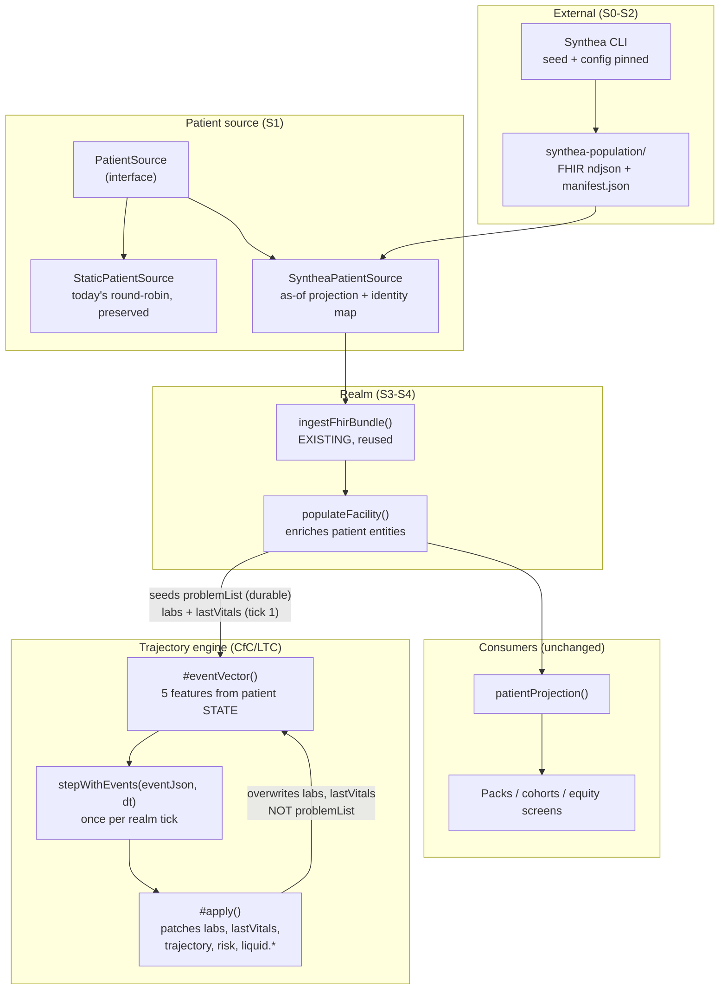

# Synthetic population from Synthea — analysis and implementation plan

**Status:** proposed for review · **Date:** 2026-09-16 · **Branch:** `platform`
**External inputs:** [synthetichealth/synthea](https://github.com/synthetichealth/synthea) (MITRE, Java) · [TIET-AI/tietai-synthea](https://github.com/TIET-AI/tietai-synthea) (PySynthea, Python)

---

## How to read this document

Sections 1–4 are the analysis: what the population is today, why the limitation is
worth fixing rather than cosmetic, and what the two candidate generators actually
provide. Sections 5–6 are the approach and the phases, each with an exit criterion
and a statement of what is testable. Sections 7–8 are the boundaries, the risks,
and the decisions that are yours rather than mine.

**Section 9 is a review of §1–8 through a different lens** — *does this work for
**every** specialty, or only for renal?* It found that the plan was renal-centric in
ways the plan itself did not confront, including a fourth place one specialty's
medicine is hardcoded in the platform layer. **Read §9 before treating §4–5 as the
design.** §9.5 also records the one decision made so far — the population is
**per realm** — and what follows from it.

Phase IDs are `S0`…`S6` (`S` is unused; the repo already uses `G` for gaps, `F` for
FHIR, `M` for milestones).

**One thing to say up front, because it shapes everything below.** I have read both
generators' documentation but I have **not run either of them**. Every claim about
their output in this document is quoted from their READMEs as of 2026-09-16 and
marked as such. `S0` exists precisely to replace those claims with evidence before
anything is built on them. I have measured our own side, and those numbers are
mine.

---

## 1. What we have today, measured

The population is generated in `src/realm/sim-populator.ts`. Every attribute of
every patient is selected as `array[index % array.length]`:

```ts
const trajectory   = TRAJECTORIES[i % TRAJECTORIES.length]!;
const age          = AGES[i % AGES.length]!;
const sex          = SEXES[i % SEXES.length]!;
const unitId       = unitIds[i % unitIds.length]!;
      type:   ACCESS_TYPES[i % ACCESS_TYPES.length]!,
      problemList: [...problemsFor(seed.kind, trajectory), ...comorbidityFor(i)],
```

| Dimension | Source | Size |
|---|---|---|
| `AGES` | `sim-populator.ts` | 10 — `45 … 79`, no patient under 45 or over 79 |
| `SEXES` | `sim-populator.ts` | 2 — `['F','M']`, strictly alternating |
| `TRAJECTORIES` | `sim-populator.ts` | 7 |
| `ACCESS_TYPES` | `sim-populator.ts` | 4 — `['avf','avf','avg','catheter']` |
| `COMORBIDITIES` | `sim-populator.ts` | 9, **5 of them empty** |

The population is therefore a **deterministic round-robin**: a patient's entire
identity is a function of their index. The five dimensions together have a cycle of
`LCM(10,2,7,4,9) = 1260`, so beyond 1260 patients the population repeats exactly.
The scenarios define **58 patients** across nine realms, which is inside one cycle —
but the diversity ceiling is what matters, not the repeat point:

- **10 ages.** No 30-year-old on dialysis, no 85-year-old.
- **Sex alternates strictly**, so a unit of six is always 3F/3M. A unit can never be
  5:1 in either direction.
- **9 comorbidity patterns, 5 of them empty.** Across the nine deployed realms the
  58 patients split **36 with exactly one of four malignancy presentations** and
  **22 with no comorbidity at all**. Four oncology stories, no onsets, no stages, no
  treatment lines.
- **`ACCESS_TYPES` is `['avf','avf','avg','catheter']`** — a 50/25/25 split. That is
  an assertion about vascular access distribution that nobody measured, and it is
  higher catheter prevalence than the real figure.

The comment on `COMORBIDITIES` already names what this is:

> *"In a real deployment these arrive as `condition.recorded` from the EMR, and this
> list is the stand-in for that feed."*

**So the gap is not "the data is fake" — it is that the stand-in has quietly become
the thing we reason about.** Two consequences follow, and they are the actual case
for this work.

### 1.1 The population cannot exercise the multi-specialty platform

We have just spent a long sequence of work (G1…G6, the cohort contribution, the
vocabulary split) making the platform host ten specialties at once. A specialty
earns its place by having a cohort — patients it is responsible for. But the
malignancy that puts a patient in the oncology cohort comes from
`COMORBIDITIES[i % 9]`, i.e. from **four** hardcoded presentations. `packs/oncology-provider/cohort.ts`
selects on recorded problems, so it does work — it currently finds 3 patients — but
the population behind it has four distinct oncology stories in total, and none of
them carries an onset date, a stage, a treatment line, or a diagnosis pathway.

A multi-specialty platform validated against a population with four
single-comorbidity patients per specialty is validated against a fixture that
cannot fail in the ways that matter.

**And the cohort mechanism itself has one implementation.** `PackCohort` is declared
by exactly one pack — `packs/oncology-provider/cohort.ts`, gating on
`ONCOLOGY_PROBLEMS = [NSCLC, Breast cancer, Colorectal cancer, RCC]`. Every other
`cohort:` in the tree is a *response field* on an assurance or route payload, not a
declaration. So "every specialty's cohort is non-empty" — S3's exit criterion and
S5's — is today a criterion about a mechanism that nine of ten specialties do not use.
Populating it is still the right thing to do; assuming it has been validated ten times
over is not, and the difference matters when S5 reports success.

### 1.2 The population cannot exhibit the disparities our equity reporting looks for

This is the stronger argument and it is the one to weigh.

The platform ships fairness and equity screens — `/admin/swarm/assurance/fairness`,
the liquid promotion gate's `noEquityRegression` signal, vintage as a slice
dimension in the infection triage. Those exist to detect that an outcome differs
across a population subgroup.

A population whose sex alternates strictly and whose ages cycle through ten values
has **parity by construction**. Run an equity screen against it and the honest
result is "no disparity found" — not because the system is equitable, but because
the fixture is arithmetically incapable of showing the difference. The screen can
never be seen to fire. That is a test that passes for the wrong reason, and it is
the failure mode this platform has been careful about elsewhere: a check that
reports success while measuring nothing.

And it is worse than that argument alone implies. §9.2 measured it: the seeded
population carries **no race, ethnicity, language or insurance** — age and sex are
the only demographic axes it has, and healthcare equity is predominantly measured on
the other four. The screens do not lack signal; they lack fields. See §9.2.

A population drawn from real census demographics with real disease prevalence —
which is exactly what Synthea is for — is the difference between an equity screen
that *can* find something and one that structurally cannot.

---

## 2. What Synthea is, and what it is not

### 2.1 What it is

Synthea is a **synthetic patient population simulator**: it models individual
patients from birth to death and emits their health records. From the MITRE README:

- Birth-to-death lifecycle; **231 disease modules**; modular JSON state machines
- Encounters, conditions, allergies, medications, vaccinations, observations,
  vitals, labs, procedures, care plans
- Demographics from **real census data** with geographic distributions
- Exports **FHIR R4 / STU3 / DSTU2**, **Bulk FHIR (`ndjson`)**, C-CDA, CSV, CPCDS
- CLI: `-s seed`, `-p population`, `-g gender`, `-a minAge-maxAge`, `-m module`,
  `-r referenceDate`, state/city
- Apache-2.0 · Java 17+ · ~3.3k stars, 20 releases, commits within the last month

PySynthea is a Python port of it (Apache-2.0, `pip install tietai-synthea`, import
name and CLI both `synthea`), claiming the same 231 modules, FHIR R4 / CSV / JSON
export, and resources bundled with the package so no checkout is needed. Python
3.9+, `uv` for development. Its README states it is "a Python implementation of
Synthea™" and acknowledges MITRE's original.

### 2.2 What it is not — the boundary that matters

**Synthea does not model dialysis.** It generates a lifetime of general healthcare.
It has no concept of a thrice-weekly treatment schedule, Kt/V, ultrafiltration
rate, ESA dosing, iron, vascular access surveillance, or a chair-side session. Its
CKD module covers CKD as a condition; it does not produce our domain.

So Synthea cannot replace the simulator. What it replaces is narrower and more
valuable:

| Concern | Today | Source of truth after |
|---|---|---|
| **Who the patients are** — age, sex, conditions, meds, history | `AGES[i%10]`, `COMORBIDITIES[i%9]`, index arithmetic | **Synthea** |
| **What happens to them** — sessions, ESA dosing, access surveillance, Kt/V dynamics | `longitudinal.ts`, `scenarios.ts`, the liquid engine | **Unchanged — our renal domain** |

The boundary is slightly more porous than that table suggests for one field, and §4.5
works it out precisely: Synthea also supplies the **initial** lab and vitals state
that the trajectory engine starts from. What it does not supply is anything the
engine computes afterwards.

That division is the whole design. **Synthea supplies the patient; the realm
supplies the time.**

### 2.3 A consequence worth naming early

Synthea emits a *lifetime record with real timestamps*. Our realm has a *live
accelerated clock*. They do not line up, and pretending otherwise will produce a
patient whose conditions all have onset dates in the future or 40 years ago relative
to `realmAt`.

The mapping is therefore an **as-of projection**: pick a reference date, take the
patient's state *as of* that instant, and seed the realm from it. Synthea's `-r
referenceDate` supports this directly, and the same projection is what makes a
regenerated population stable. This is a design decision with real consequences —
notably that conditions arrive with **onset dates**, which our `problemList` (a flat
`string[]`) currently discards. Onset dates are what a cohort definition needs to
say "newly diagnosed" as opposed to "has ever had".

---

## 3. Generator choice

| | Java (MITRE) | PySynthea (TIET-AI) |
|---|---|---|
| Maturity | Reference implementation, 84 contributors, 20 releases, active last month | v1.0.1, 5 contributors, 13 stars, released ~2 months ago |
| Toolchain | JDK 17+ (LTS recommended), Gradle | Python 3.9+, `uv` or pip |
| Outputs | FHIR R4/STU3/DSTU2, Bulk ndjson, C-CDA, CSV, CPCDS | FHIR R4, CSV, JSON |
| Interface | CLI, Gradle tasks | CLI **and a Python API** (`Generator`, `Person`, `FHIRExporter`) |
| Fidelity risk | None — it defines fidelity | Port drift is unverified; the README claims completeness but the project is young |
| Fit to this repo | External CLI process | External CLI process **or** an importable library |

**Recommendation — now settled on evidence, see the S0 result in §5.** Take the **Java
reference implementation**. This section originally proposed Java as the default with
PySynthea as a supported alternative on the grounds that the decision should not be
load-bearing; **S0 ran both and showed that it is**, at least for PySynthea: it emits
`Unknown Unknown` as a patient name and a 1898 birth date for a living patient, where
the reference emits `Olivo261` / `["Andrés117","Hernán834"]` and `1969-12-13`. Those are
the exact fields §4.3 reads through `structuralState`.

The seam argument below still stands as insurance — swapping generators remains a
config change — but it is no longer the *reason* to be relaxed about the choice.

Note the licensing obligation either way: both are Apache-2.0, so Synthea's NOTICE
requires attribution. This repo has a strict header regime (`add_copyright.py`,
`copyright.md`), so a dependency on Synthea adds a `NOTICE` entry, and vendoring its
231 module JSON files into our tree is a decision to make deliberately rather than
by copying a directory. PySynthea additionally asks for a citation in academic work.

---

## 4. The approach: three seams, all reusing something we already have

**A note on the section title.** These three are seams where we *reuse* something
already built. §9.1 identifies a fourth that is not a reuse — the **`state_model`
declaration**, which would make the trajectory engine's vocabulary a specialty's
rather than the platform's. It is absent from this section because it is absent from
the original plan, which is the finding §9 is about — but §9.7 then concludes it
should **not** be built yet, and S1 carries two guards to keep that deferral honest
rather than an omission.



Three things we already own and should not rebuild:

1. **`ingestFhirBundle(realm, ctx, bundle, opts)` — `src/fhir/bundle-ingest.ts`.**
   This is a real FHIR ingest: modes, idempotency ledger, dry-run preview, rollback,
   durable mirror. Synthea emits FHIR. Almost all of S3 is wiring, not writing.

2. **The `LiquidTrainer` pattern — `src/liquid/trainer.ts`.** Spawns an external CLI,
   reads a declared artifact, promotes it with metrics, and takes an **injectable
   runner** so CI never needs the toolchain. `SyntheaRunner` mirrors it exactly, and
   that injectability is what keeps `S2`'s tests free of Java and Python.

3. **The `cms-data/` pattern — `cms-data/` + `manifest.json` + `CMS_DATA_DIR`.**
   The established shape for external datasets: a directory, a manifest recording
   provenance, an env override, a loader, and a documented source. The population
   directory mirrors it.

### 4.1 The `PatientSource` seam

```ts
export interface PatientSource {
  readonly id: string;                 // 'static' | 'synthea'
  readonly provenance: PopulationProvenance;
  patients(seed: { facilityId: string; count: number }): readonly PopulatedPatient[];
}
```

`PopulatedPatient` is the *populator's* vocabulary (age, sex, problem list with
onsets, medications, history) — deliberately not `RenalPatientInput`, which is a
specialty-facing projection. The existing round-robin moves behind
`StaticPatientSource` unchanged, which is what makes `S1` a zero-behaviour-change
step and lets the static source remain the dependency-free default for tests.

### 4.2 Provenance and the synthetic guarantee

The population manifest records generator name and version, seed, config hash,
module set, patient count, reference date, and generation timestamp.

Non-negotiable: **Synthea patients must be structurally incapable of being
classified as `phi`.** The platform already has the pattern — `record-access-acoustic`
throws without a synthetic label. The same enforcement applies here: population-
sourced events carry the synthetic marker, and the existing "Synthetic patient data"
badge becomes true rather than decorative.

---

### 4.3 Why the existing FHIR ingestor is the front half — and not the whole answer

We already own a real FHIR ingest, so the obvious question is whether the
population work collapses into "point the batch ingestor at Synthea's output".
**Half of it does, and the other half would quietly empty every specialty's
cohort.** The division is measurable.

`renalPatientInputs` (`src/swarm/renal-cohort.ts`) hands the entity's state bag
straight to the packs:

```ts
state: patient.state as Record<string, unknown>,
```

So what a pack can see is exactly what the patient entity carries. The two writers
of that bag disagree almost completely:

| | Written by the FHIR ingestor<br/>`structuralState`, `src/fhir/canonical.ts` | Written by the seeder<br/>`populateFacility` |
|---|---|---|
| `sex`, `facilityId` | ✅ | ✅ |
| `name`, `mrn` | ✅ | — |
| **`birthDate`** | ✅ | — |
| **`race`, `ethnicity`, `birthSex`, `language`** | ✅ | ❌ — absent entirely (§9.2) |
| **`age`** | — | ✅ |
| `problemList` | — | ✅ |
| `trajectory`, `dialysisVintageYears` | — | ✅ |
| `access`, `sessions`, `accessObservations` | — | ✅ |
| `lastVitals`, labs, `admitted` | — | ✅ |

**The overlap is two fields: `sex` and `facilityId`.** Three consequences, each of
which is a regression rather than a gap:

1. **Every specialty's cohort empties.** `problemList` is how a cohort names its
   patients — `packs/oncology-provider/cohort.ts` reads `state.problemList`. Nothing
   in the ingest path writes it. Ingesting alone would take the oncology board back
   to empty, undoing the cohort work.
2. **The renal protocols break on age.** They read `state.age`; the ingestor writes
   `birthDate`. Nothing in the *simulation* reads `birthDate` — see §4.4, where the
   one existing relationship between the two turns out to be the wrong way round. A
   realm of ingested patients would therefore have no age at all as far as every
   protocol is concerned.
3. **There is nothing to simulate.** No `access`, `sessions` or `trajectory` means
   the renal simulator has no state to advance.

Also worth stating plainly: **ingested `Condition` resources do not reach the
cohorts either.** `RESOURCE_TO_KIND` maps `Condition` to its own `condition` entity
kind, not into `state.problemList`, so a patient can carry a perfectly good Synthea
malignancy and remain invisible to the oncology cohort.

And a terminology point, because "batch" means two different things here:
**there is no bulk ingestor.** `bulkExport` appears only as a *vendor capability
flag* in the integration profiles (`fhir-integration-routes.ts`) — a description of
what Epic or Cerner supports, not an endpoint we implement. What exists is
`POST /fhir` → `ingestFhirBundle` with `MAX_BUNDLE_ENTRIES = 500` per bundle. A
231-module, multi-hundred-patient population therefore arrives as **many bundles**,
which is fine, but it is not a single bulk load.

### 4.4 What the ingestor nonetheless removes

The reframing is **ingest → enrich**, not *seed → maybe ingest*:

- `populateFacility` stops **creating** patients and starts **completing** them —
  assign unit, access type, vintage, trajectory, and derive `age`.
- The bespoke `parse.ts` this plan originally proposed is **deleted from it**. We
  inherit idempotency, dry-run/rollback, `Patient.link` merge handling, and identity
  resolution — built and tested — instead of writing a parallel parser that would
  have to grow all of it again.

That is strictly less new code, and it removes the phase's largest risk (a
hand-rolled FHIR reader drifting from the real one). The trade is that the
enrichment step must be explicit and tested, because it is now the only place the
renal shape is applied.

Two decisions this surfaces, both recorded in §8:

- **`age` vs `birthDate`.** The platform snapshots `age` — a derived,
  time-dependent value that rots as the realm clock advances. Synthea supplies
  `birthDate`, which does not. Synthea makes fixing this possible, and the fix is to
  derive `age` from `birthDate` at read time rather than freeze it at seed time.

  Checked, because the honest version is more specific than "nothing reads it": the
  two are already related, in the **wrong direction**. The outbound FHIR serializer
  prefers a stored `birthDate` and otherwise **falls back to deriving one from the
  stored age** (`src/fhir/mapping.ts`):

  ```ts
  ...(birthDate ? { birthDate } : age !== undefined
    ? { birthDate: `${new Date().getFullYear() - age}-01-01` }
    : {}),
  ```

  So the wire direction is already correct — `birthDate` wins when it exists, which is
  what the ingest path writes. The gap is that the **simulation** reads `age` and
  nothing keeps the two in step, so the fallback is doing real work today: `age` is
  frozen at seed time while the realm clock runs accelerated, and the derived birth
  date is computed against the **wall clock**. A patient in a realm that has simulated
  three years goes out to an EMR with a birth date from real time and an age that has
  not moved. Ingesting a real `birthDate` inverts the relationship properly —
  `birthDate` becomes the stored fact, `age` the derived read — and `identity.ts`
  already consumes `birthDate` for patient matching, so it is a fact the platform
  half-uses already.
- **Conditions → `problemList`.** Either project ingested `condition` entities into
  `state.problemList` (keeps today's cohort contract, smaller step), or change the
  cohorts to read `condition` entities (the right destination, but it touches every
  pack's cohort). The first is the smaller step; the second is where this should
  end up, because "a recorded problem" is precisely a `Condition`.

### 4.5 How Synthea reaches the trajectory engine — it feeds the STATE, not the events

The simulator's scripted `emit` entries are not what CfC/LTC consume. The engine is
stepped once per realm tick with a **5-element event-feature vector computed from
patient state**, in `TrajectoryAmbientProcess.#eventVector`:

```
EVENT_ORDER = [missed_treatment, access_complication, lab_marker_elevated,
               abnormal_vital_reading, diet_phosphate_violation]
```

| Feature | Where the input actually comes from |
|---|---|
| `missed_treatment` | effect pulse from `flag-safety-event` · **or** `state.trajectory === 'underdialyzed'` · **or** `problemList` ∋ `Underdialysis` |
| `access_complication` | effect pulse from access safety events · **or** `state.accessIssue` |
| `lab_marker_elevated` | effect pulse from lab events / abnormal `result-lab` · **or** `state.labs` thresholds (K>5.5, URR<65, PHOS>5.5, HGB<10) |
| `abnormal_vital_reading` | `state.lastVitals` (hr>110, hr<50, spo2<92) |
| `diet_phosphate_violation` | `state.phosBinderAdherence === 'poor'` · **or** `problemList` ∋ `CKD-MBD` |

**Four of the five inputs are a function of patient state** — `problemList`, `labs`,
`lastVitals`, `trajectory`, `accessIssue`, `phosBinderAdherence`. Two of those,
`problemList` and `labs`, are precisely what Synthea supplies and what the FHIR
ingestor does not write (§4.3).

So the answer to "how does Synthea data integrate with the events the simulator
loads" is: **it doesn't enter the event stream. It enters the state the event vector
is computed from.** The events keep coming from the realm.

Three mechanics that decide the design:

1. **`problemList` is durable; `labs` and `lastVitals` are not.** `#apply` patches
   `trajectory`, `risk`, `lastVitals`, `labs` and `liquid.*` back onto the patient
   **every tick**. So a seeded `labs` value is consumed on tick 1 and then the engine
   owns it — the seed is an *initial condition*, not a persistent input. `problemList`
   is never written by the engine, so a Synthea problem list shapes the event vector
   for the patient's whole life in the realm. **That is Synthea's strongest and most
   durable contribution.**
2. **The engine state is seeded, not derived.** `forkFrom(stateJson, t)` sets the 5
   dimensions directly; there is no "derive dims from a lab record" path.
3. **`stepWithEvents(eventJson, dt)` is the only way in — and the warm-up replay this
   section originally preferred does not work.** It was specified as: feed Synthea's
   observation history as a sequence of steps with `dt` between observations, so the
   engine's own dynamics produce the state instead of us hand-setting dimensions. S3
   rejected it on **measurement**, not on cost. `stepWithEvents` does not take
   observations; it takes a FIVE-ELEMENT EVENT VECTOR, and `#eventVector` reduces a
   haemoglobin to ONE BINARY FEATURE (`lab_marker_elevated`, set when HGB < 10). HGB
   8.9 and HGB 7.1 therefore produce the *same* input, and a replay converges to
   whatever the baseline ODE drives it to — a state uncorrelated with the chart it came
   from. It would have satisfied the letter of "seeded, not zero" while making
   `anemia_severity` mean nothing, which is worse than not seeding at all.

   The route taken instead is to **invert the engine's own declared projection**, which
   is why `DIALYSIS_PROJECTION` was exported from `src/liquid/project.ts` as data rather
   than the inverse being written inside it: seeding
   `anemia_severity = (13 − HGB) / 5` makes the engine's next projected haemoglobin the
   haemoglobin that was measured. The numbers stay in the engine; the mapping stays in
   the population layer (§9.7 constraint 1).

### 4.6 The honest dimension mapping — Synthea supplies two of five

Whatever route is taken, the ceiling is the same, and it is worth stating before
anyone plans around it:

| Engine dimension (0..1) | Synthea source |
|---|---|
| `anemia_severity` | ✅ haemoglobin observations |
| `phosphate` | ✅ serum phosphate observations, *if* the enabled modules emit them |
| `ktv_adequacy` | ⚠️ **no.** Synthea has no Kt/V, and eGFR/creatinine are not dialysis adequacy. A proxy here would be invented — and inventing it silently would be worse than declaring the gap |
| `vitals_instability` | ⚠️ partially. BP/HR exist, but *intra-dialytic* instability is not in Synthea |
| `deterioration_risk` | ❌ derived; no Synthea source |

**Synthea sets the clinical baseline; the renal simulator still owns the dialysis
dynamics.** That is less than "we no longer need the simulator" and more than "a
problem list" — and it is the reason §6 keeps the renal domain firmly out of scope.

### 4.7 We have already hand-rolled a worse version of this

`src/simulator/longitudinal.ts` — `generateLongitudinalHistory({patientId,
facilityId, trajectory, days, seed, asOf})` — produces, for one trajectory, a
consistent 90-day history of labs, vitals and ESA doses, and `populateFacility` seeds
it via `PopulateHistoryOptions`.

That is the same idea as Synthea, at 90 days instead of a lifetime, for one disease
instead of 231, with hand-written dynamics instead of clinical modules. **Synthea's
real target on the state side is `longitudinal.ts`**, not the scenario definitions —
and the warm-up replay in §4.5 is the direct replacement for what
`generateLongitudinalHistory` fabricates.

#### Outcome — the intent is met, and the function stays

This section's target was *"the engine's starting state stops being authored and
starts being measured"*. **S3 met it without deleting anything.** For a
Synthea-seeded realm, `enrich.ts` writes `labs` and `lastVitals` from real
observations in the bundle, and `prime.ts` inverts `DIALYSIS_PROJECTION` to set the
five engine dimensions from those measurements. `generateLongitudinalHistory` is not
in that path at all.

So "retire" in §5's S4 heading means **retire as the population's source of truth**,
which has happened — not "delete the function", which S4 deliberately did not do and
should not. Two reasons, and the second is the load-bearing one:

1. Its output is still the honest baseline for a realm seeded **without** Synthea.
2. `StaticPatientSource` needs *a* history generator. It is the deliberately-kept
dependency-free test path (§5 S4, §7), so removing this would either leave the
fixture with no labs at all or force the unit suite onto a committed artifact —
trading a hand-written 90-day history for a build-time dependency, to make a fixture
worse at being a fixture.

What is left of §4.7 is a *supersession* rather than a deletion, and the honest
statement of it is: two history generators exist, one measured and one authored, the
measured one is the default for a configured deployment, and the authored one is the
fixture's. Nothing selects between them at runtime, because the selection is the same
choice as §8 #4 (opt-in per realm).

## 5. Phases

### S0 — Prove the tool, and decide (§3)

Run both generators on the same brief: ~50 patients, CKD/dialysis-relevant modules,
a pinned seed, `-r` reference date. Inspect the FHIR for what we actually need —
Condition with onset, MedicationRequest, Observation with LOINC codes — and check
how much is dialysis-adjacent.

**Exit:** a written comparison of real output, and a decision on generator. Nothing
is built on documentation alone.

#### S0 result — both generators run, 2026-09-16

Run on this machine, throwaway spikes in `/tmp`. **S0's exit criterion is now met.**

**Environment.** `javac` was 17 but the default `java` runtime was `1.8.0_502`, and
Synthea needs JDK 17+. A JDK 17 is installed at
`/usr/lib/jvm/java-17-openjdk-amd64`; the fix is `JAVA_HOME` for the runner, **not**
a system-wide `update-alternatives` change. That is a concrete S2 requirement: the
Synthea runner must set `JAVA_HOME` explicitly rather than trusting `java` on PATH.

**Reference (Java), commit `d9d07a6`.** Clone + build + 5 patients = 50s.

```
3 -- Ashely524 Maybelle917 Balistreri607 (28 y/o F) Shrewsbury, Massachusetts
4 -- Miguel815 Bashirian201            (52 y/o M) Dalton, Massachusetts
2 -- Kimi714 Katerine813 Watsica258    (63 y/o F) Boston, Massachusetts
1 -- Andrés117 Olivo261                (56 y/o M) Chicopee, Massachusetts
5 -- Louie190 Botsford977              (80 y/o F) South Yarmouth, Massachusetts
```

**The decisive comparison** — the `Patient` resource, which §4.3 consumes through
`structuralState`:

| | Reference (Java) | PySynthea |
|---|---|---|
| `name.family` | `Olivo261` | `Unknown` |
| `name.given` | `["Andrés117", "Hernán834"]` | `["Unknown"]` |
| `name.prefix` | `["Mr."]` | absent |
| `gender` | `male` | `female` |
| `birthDate` | `1969-12-13` | `1898-09-15` |

**Recommendation: take the Java reference.** PySynthea's demographics are broken in
the exact field our integration reads, and it is worse than the round-robin it would
replace because it looks like real data.

**Three corrections to my own first-pass findings**, which is the other half of what
running S0 bought:

1. **The module-count "inconsistency" was my error, not a defect.** The reference has
   **85 top-level of 242** module files. Loading top-level entry points and resolving
   the rest as sub-modules *by relative path* is the normal Synthea design. PySynthea's
   99-of-256 is the same shape. `--list-modules` and the generation log both said 99 —
   they agreed with each other; I assumed all 256 should load.
2. **The 128-year-old is legal.** The reference reports `Min Age: 0, Max Age: 140`, so
   that birth date is inside Synthea's own range. The real defect is the **name**, not
   the age.
3. **The `-m breast_cancer` result was not a valid comparison.** The **Java CLI has no
   `-m` flag** at all, so there was nothing to compare against. It stays an open
   question about PySynthea rather than a confirmed defect — stated as such.

**A CLI divergence the runner must handle:** `-o` means *output directory* in PySynthea
and *overflow population* in the reference. Same letter, different meaning, silent if
wrong — the reference simply writes to its default `output/`.

**The sizing answer, which the plan needed and did not have.** Reference Synthea, seed
`4242`:

| Population | renal patients | oncology patients |
|---|---|---|
| 25 | **0** | **0** |
| 200 (235 records) | **28** (11.9%) | **15** (6.4%) |

Plus diabetes in 45.1% and cardiac in 32.8% of patients.

**The sizing answer, which the plan needed and did not have.** Reference Synthea, seed
`4242`:

| Population | renal patients | oncology patients |
|---|---|---|
| 25 | **0** | **0** |
| 200 (235 records) | **28** (11.9%) | **15** (6.4%) |

Plus diabetes in 45.1% and cardiac in 32.8% of patients.

So **at 25 patients every renal and oncology cohort is empty**, and at 200 both
populate. That is a measured answer to §9.6's question, and it changes the plan's
assumed scale: the current scenarios deploy **58 patients**, and the population has to
be roughly **an order of magnitude larger** for ten specialties to each find a cohort.
It also confirms the multi-morbidity premise directly — 45% diabetic and 33% cardiac
in the same 200 people is what makes overlapping cohorts real rather than contrived.

**And the equity payoff is verified rather than assumed.** Every one of those 233
patients carries `us-core-race`, `us-core-ethnicity`, `us-core-birthsex` and
`communication` — the four axes §9.2 found entirely absent from our population.

### S1 — The seam, with no new data

Add `PatientSource`. Move the round-robin behind `StaticPatientSource` **unchanged**.
`populateFacility` consumes a source.

**The `state_model` seam is deliberately NOT in this phase** — §9.7 reverses the
earlier recommendation and explains why: a declaration with one implementation is
what `PLATFORM_VIEW_KINDS` was explicitly written to avoid. Instead S1 carries two
small guards that keep the deferral honest:

- the Synthea → event-vector mapping lives in `src/population/synthea/`, never in
  `src/liquid/` (§9.7 constraint 1)
- the first new renal constant needed *inside* `src/liquid/` is the trip-wire to stop
  and declare the state model (§9.7 constraint 2)

**Exit:** full suite green, and a golden comparison showing the seeded realm is
byte-for-byte what it was. This phase must change no behaviour; if the golden
differs, the seam is wrong.

### S2 — Runner, manifest, fixtures

`SyntheaRunner` mirroring `LiquidTrainer` with an injectable runner (so CI needs no
JVM). `scripts/generate-population.ts` (the `scripts/generate-pack-manifests.ts`
convention). A population manifest with seed/version/config hash. A **tiny committed
golden bundle** under `tests/fixtures/synthea/` — the precedent is
`native/domain-dialysis/tests/fixtures/parity_model.safetensors`.

**Exit:** generation is reproducible from the manifest; `S2`'s tests pass with no
JDK and no Python installed.

#### What building it changed — reproducibility is per layer, not per run

The plan assumed "generation is reproducible from the manifest" as one property.
Running the reference generator twice with an identical `--seed` and
`--reference-date` showed it is not one property. Measured by diffing two real runs:

| Layer | Reproducible? |
|---|---|
| Patient identity (name + UUID), and the bundle filename | **yes** |
| Patient clinical content — resources, references, dates, codes | **yes** |
| Provider display names (`Dr. Eldridge510 Roob72` → `Dr. Victoria535 Roob72`) | **no** |
| Practitioner roster — 122 entries, different UUIDs *and* names | **no** |
| `hospitalInformation` content | yes, but its **filename** carries a wall-clock epoch |

So a single byte digest over the output directory is compared "different" on every
legitimate regeneration — a reuse gate that can never hit while looking careful. S2
therefore carries **two** digests over two questions:

- `outputDigest` — raw bytes. *Has this directory been touched since we made it?*
- `patientDigest` — the patient layer with entity display names normalised (a
  `display` beside a `reference` is a name; a `display` alone is a code, and is
  kept). *Is this the same population?*

The second is the one comparable across regenerations, and it still fails loudly on
a different seed, an age-range change, a Synthea upgrade, or a module-set change.
`nonReproducible` records the excluded layers as data, so a specialty author reading
a manifest does not have to rediscover this by experiment.

**Two CLI traps are encoded, both silent when wrong** (`runner.ts`):

1. `-o` is *overflow population* in the reference, not output directory. Output goes
   to the default `output/` and the caller looks elsewhere, with exit code 0.
2. `--exporter.baseDirectory=` is a **base**, not the FHIR directory — Synthea
   appends `fhir/`. Passing `<dir>/fhir` writes to `<dir>/fhir/fhir` while the reader
   looks in `<dir>/fhir`, reporting a successful run that produced **0 files**. This
   was found by running it, not by reading the docs.

A third is a property of the machine rather than the CLI: `javac` and `java` can be
different versions (S0's host had `javac` 17, `java` 1.8), so the runner resolves a
JDK by reading each candidate's `release` file and never falls back to bare `java`.

### S3 — Ingest onto the platform, then enrich, then prime the engine

Three steps, in this order, and the order is the design (§4.5):

1. **Ingest.** Feed Synthea's FHIR through `ingestFhirBundle` — the existing path,
   with its idempotency ledger, dry-run and merge handling. One or more bundles per
   population (§4.3).
2. **Enrich — the durable half.** Complete the ingested patients with the renal
   shape: unit, access type, vintage, `trajectory`, derived `age`, and the conditions
   projected into `problemList`. **`problemList` is the part the engine never
   overwrites**, so it shapes the event vector for the patient's whole life in the
   realm — this is where Synthea's contribution actually sticks.
3. **Prime — the transient half.** Seed `labs` / `lastVitals` for tick 1, and the
   engine's 5 dimensions either by warm-up replay (preferred, §4.5(3)) or by
   `forkFrom(stateJson, t)` where Synthea has no source (§4.6).

The critical sub-problem is **identity**, and the decision in §9.5 makes it smaller:
an `ingestFhirBundle` call must supply `identity` or *"a patient whose MRN the harness
has not seen before silently becomes a second chart."* Because the population is
**per realm**, that mapping is scoped to one realm — `syntheaPatientId →
realmId-pt-NNNN` — with **no global reconciliation** and no cross-realm merge. The
requirement is only that regeneration within a realm is stable.

**Exit:** a realm seeded entirely from Synthea output renders in both consoles;
re-running generation produces no duplicates; every specialty's cohort is
**non-empty**; and **the trajectory engine advances from the seeded state rather
than from zero** — asserted by checking that a patient seeded with an abnormal
Synthea haemoglobin starts in a non-zero `anemia_severity` and moves.

#### What building it changed

S3 is implemented and verified against a real 150-patient population: `POST
/admin/realms` now accepts a `population` source alongside `seed`, and a real run
ingests **130,119 bundle entries down to 7,056** in 8.2 s, admitting 150 patients
across 4 units with 211 problem-list conditions and zero leaked presences.

**The ingest ceiling was not a tuning problem.** `MAX_BUNDLE_ENTRIES` is 500 and a
measured Synthea patient file reaches 17,272 entries — 34× over, so every bundle in a
real population is refused outright. S3 therefore *projects* each bundle down
(`projection.ts`, a per-resource-type rule with a stated reason for every exclusion)
and chunks the result. Conditions survive in full because a problem list is
cumulative; observations are retained per `(patient, analyte)`.

Retention is per analyte rather than by time window, and that choice is measured. A
90-day age bound keeps only **24 of 174** patients with any laboratory result and 12
with a haemoglobin; capping the newest value per analyte keeps **150 of 150** with a
haemoglobin for 6,244 observations instead of 36,289. Coverage is what a seeding
population needs, and history is what the engine's own dynamics are for.

**Six defects surfaced only by running it on real data.** Four are in shared platform
code, not in S3, and all six were silent:

| Defect | Found by | Effect if shipped |
|---|---|---|
| Recognised `Condition`s were counted as *kept* and never pushed into any chunk | asserting on chunk contents, not on the report | `problemList` empty for every patient — the one piece of state the engine never overwrites — while the report claimed thousands kept |
| The vocabulary matched only the **first** rule, so `Disorder of kidney due to diabetes mellitus` produced `CKD` but not `DM2` | diffing the matcher against an independent match-all over all 215 measured displays | 17 patients (11% of the sample) silently lost their type 2 diabetes flag; `DM2` reads 18 instead of 28 |
| `Suspected …` displays were read as diagnoses | the same diff | `Suspected disease caused by SARS-CoV-2` — 17 patients — was the single largest contributor to `Sepsis-risk` |
| `record-vitals` rebuilt `lastVitals` from scratch, and `EntityGraph.patch` replaces a nested object rather than merging into it | a seeded patient whose heart rate vanished when a blood-pressure panel followed it | the platform could not read back the blood pressure **it had just written** (`effect-map.ts` emits the panel code `55284-4` with `component[]`, the reader only looked at `valueQuantity`), and a weight observation cleared every vital. The event vector then fell back to `hr = 72, spo2 = 97` — a reading that looks *stable* |
| `order-lab` / `order-med` derived ids from `clock.seq`, which does **not** advance during an ingest | a live seed that threw `entity-exists` at patient 136 of 150 | two orders of the same drug in one bundle abort the entry, and a `transaction` bundle rolls back wholesale |
| `ingestFhirBundle` leaks one presence per call and never retires it | reading its spawn site | 150 stale presences per population seed, counted and displayed by the console |

The lesson worth carrying: the projection's `kept` counts and the chunk contents are
two independent facts, and a test that reads only the report cannot tell a working
filter from one that discards everything. `tests/population-projection.test.ts` now
reconciles them.

**What the population is actually made of**, measured over the 150 living patients
(24 of 174 are deceased and excluded — Synthea's `-p N` means N *living*):

| | count |
|---|---|
| Problem-list terms | Anemia 48, Hyperlipidemia 23, HTN 22, CAD 21, Sepsis-risk 20, DM2 18, CKD 7, Breast cancer 5, Colorectal 1, **ESRD 1** |
| No problem term at all | **67 of 150** — most Synthea conditions are administrative or social (`Medication review due` alone appears on all 150) |
| Haemoglobin | 150 of 150, with **20+ saturating above the engine's ceiling of 13 g/dL** |
| Potassium | 18 of 150 — so adequacy is `no-source` for 132 |
| Phosphate | 4 of 150 |
| Age range | **1 to 103** |

Two of those are S5's inputs rather than S3's problems. **Only 1 of 150 living
patients has ESRD**, which is the dialysis-realm mismatch §4.6 predicted: Synthea
generates a general population, not a dialysis population, and the engine's ranges
are dialysis ranges — hence the haemoglobin saturation, which the seeder reports
rather than hides. The age range says the same thing in a different way.

**The engine's initial condition does not persist, and that is the most important
finding here.** Measuring the untrained engine directly (`setResidualAlpha(0)`, no
promoted weights), a patient seeded at `anemia_severity = 0.9` follows
`0.88 → 0.71 → 0.55 → 0.21 → 0.03` over 1 h → 12 h → 24 h → 72 h → 168 h, and the
attractor is **0** for every starting point. So:

- the exit criterion is met — the engine starts from the patient, not from zero, and
  two patients seeded at different haemoglobins are distinguishable for ~48 h;
- but a seeded population's clinical distinctiveness is a **~2–3 day transient**, and
  after that every patient converges to the same healthy dialysis state.

That is a property of the *baseline* model, not of the seeding: with no trained
weights the ODE is a convergence operator. S3 therefore delivers the durable half
(real problem lists, real comorbidity denominators, a real initial condition) and
S4's training is what makes a trajectory hold. Recorded here because the phase exit
criterion as written would have been satisfied by a seeding whose effect evaporated
overnight.

**Deferred, with the fix named.** `result-lab` creates an orphaned `result` entity —
no `patientId`, and no `order` to link through, because a bare `Observation` never
produces one — so S3 summarises patients from the bundle rather than from the graph.
And `result-lab` stamps `this.clock.realmAt` rather than the observation's
`effectiveDateTime`, so ingested laboratory results all carry the ingest instant; the
fix is an `observedAt?: string` on the effect honoured by the reducer, for which
`record-immunisation` already carries the precedent.

### S4 — Replace the round-robin, and retire `longitudinal.ts` as the source of truth

> **Outcome (2026-09-17):** the seam and the `age`/`birthDate` inversion landed
> (`d6c1718`, `5e6470b`, `c20e976`); the §8 #7 `condition`-entity projection and the
> S4 exit measurement did not. `longitudinal.ts` is retained, with the reasoning in
> §4.7 — "retire" here means retire as the population's source of truth, which S3
> achieved, not delete the function. Details below the exit criterion.

`sim-populator` enriches from the configured source rather than generating.
`AGES` / `SEXES` / `COMORBIDITIES` / `ACCESS_TYPES` stop being the population's
source of truth — though `StaticPatientSource` keeps them for the test path, which
is what lets the unit suite stay dependency-free.

In the same step, `generateLongitudinalHistory` (§4.7) becomes the Synthea warm-up:
the hand-written 90-day lab/vitals history is replaced by real observation history
from the bundle. This is the substep with the most direct clinical payoff, because it
is where the engine's starting state stops being authored and starts being measured.

**Exit:** every installed specialty's cohort is non-empty and clinically coherent,
and patients are distinct. Measurably: the oncology cohort is no longer drawn from
four presentations; comorbidity is not `i % 9`.

#### What landed (2026-09-17)

Three commits, all verified. This phase is **partly** complete; the remainder is named
below rather than implied.

| Commit | Change |
|---|---|
| `d6c1718` | §9.7 step 2 — `problemsFor` deleted, `FacilityKind` widened to `string` in the same commit, 2 regression guards |
| `5e6470b` | The **async** seam — `PopulationSeeder`, `seederRequestFrom` |
| `c20e976` | §8 #6 — `birthDate` stored, `age` derived via `patientAge(state, at)` |

**Two §9.7 premises turned out to be measurable rather than arguable.** Widening
`FacilityKind` produced exactly **two** type errors, both missing imports: the closed
union had no enforcer anywhere. And deleting `problemsFor` moved **no** golden hash,
because the only fixture in use is `kind: 'dialysis'`, whose problem list is
unchanged — so it was a real behaviour change only for non-dialysis fixtures, which
nothing exercises. It was also already wrong: `packs/dialysis-provider` declares
`['outpatient-dialysis','home-dialysis']` and `packs/oncology-deep` declares
`['oncology','infusion','hospital']`, neither of which intersects `'dialysis'`.

**On the seam.** §4.1 originally had one `PatientSource`. The measurement that
changed it: `PatientSource.patients()` is synchronous by design, and seeding a
generated population is not "pick some patients" — it is ingest → enrich → prime,
where ingest goes through `ingestFhirBundle` and prime forks the trajectory engine.
There is no honest synchronous version. So there are two seams with different shapes:
`PatientSource` (sync, static path, unchanged) and `PopulationSeeder` (async, realm
path). Widening the sync one would have pushed `await` into `populateFacility` and
therefore into every test that seeds a realm, to buy nothing for the static path.

The seam's real payoff was **`seederRequestFrom`**, and it is worth recording because
it was not the stated motivation. The payload → options mapping had been written
**twice** — once in `POST /admin/realms`, once in `realm-restore.ts` — each
re-deriving `facilityKind ?? 'dialysis'` and `facilityName ?? facilityId` inline. Both
were correct, but by copying rather than by construction, so adding one artifact field
would have made a *restored* realm seed differently from a *created* one. Both
outcomes look healthy, so nothing would ever have reported the divergence.

**`patientAge` also removed a wall-clock read that was not part of the plan.**
`src/fhir/mapping.ts` reconstructed a birth date from `age` against
`new Date().getFullYear()`, so a realm that had simulated three years emitted a birth
date from *real* time beside an `age` that had not moved — one resource, two facts
disagreeing (§4.4). It now uses the record's own timestamp.

**Still open in this phase**, each with its size measured rather than guessed:

- **§8 #7** — `problemList` projected from the graph's `condition` entities. S3 wrote
the same clinical fact twice (211 `condition` entities *and* the same terms as
strings); the projection gives one source and makes onset dates reachable. Deferred
because it is the one remaining S4 item that can silently empty every cohort if it is
got wrong, and the current duplication is redundant rather than incorrect.
- **`generateLongitudinalHistory`** — retained, on the reasoning in §4.7.
- **The S4 exit criterion is not yet evidenced.** "Every specialty's cohort is
  non-empty" has not been measured on a 20-patient realm; §1.1 already warns that
  `PackCohort` has one implementation, so the measurement is worth more than the claim.

### S5 — The payoff: specialty realism and equity that can fail

This is the phase the whole document is for. Having a population with real
heterogeneity, check two things:

1. **Every specialty finds its cohort.** A Synthea population is multi-morbid by
   construction — a real patient has CKD *and* diabetes *and* often a malignancy —
   so ten specialties stop being ten empty boards.
2. **An equity screen can find a disparity.** Deliberately validate against a
   population subgroup where an outcome *should* differ, and confirm the screen
   fires. A screen that has never fired is not evidence that the system is
   equitable.

**Exit:** a recorded run in which an equity/fairness screen reports a real
difference, and a recorded run in which each specialty's cohort is populated. If (2)
cannot be made to fire, the screens are measuring less than they claim — which is a
finding worth more than the integration.

#### What measuring it first found (2026-09-17) — and why half 2 was rescoped

Before building anything, the fairness screen was traced to its inputs. **It has no
inputs.** The finding has three levels, and the first is the one that matters:

**Level 0 — the screen is not reachable.**

- `grep -rn "swarm/assurance" src/` returns **one** hit, an unrelated type import.
  **No backend route exists** for any of the 12+ endpoints that
  `exec-app/src/lib/assurance.ts` calls — `/fairness`, `/gate`, `/overview`,
  `/cohort-rows`, `/burden`, `/modes`, `/rules`, the red-team and drift actions. The
  frontend is a client for a surface that was never implemented.
- `grep -rn "assuranceTrack" src/` returns **nothing**. `crossPackAssurance(...)` in
  `src/swarm/assurance-track.ts` is called only by `tests/assurance-track.test.ts`.
- `fairnessRows` is supplied only by tests, at **7 of 7** call sites, always as `[]`.
- Nothing anywhere builds a `FairnessRow` from a realm: the only `vintageYears` hits
  outside this document are inside `src/evidence/fairness.ts` itself.

So `fairnessReport([], …)` always returns `verdict: 'insufficient'` —
`rows.length < FAIRNESS_REFERENCE.minSliceN` — by construction. It has never been
*reachable*, let alone fired.

**Level 1 — the axes are renal, not demographic.**
`SliceDimension = 'age' | 'sex' | 'vintage' | 'access'`. Race, ethnicity, birth sex and
language are **not declared dimensions**, even though §8 #5 wired all four onto the
patient. So the S6-prep ingest work has no consumer in the fairness screen.

**Level 2 — the population's disparity.** The half §1.2 and §9.2 were about, and now
the third barrier rather than the first.

**This makes §7's own risk row measured true.** It says: *"The equity screen still
cannot fire after S5 — would mean the population was never the limiting factor."* That
is now established: **the population was never the limiting factor for this half of
S5.** Making the population more heterogeneous, which is what half 2 was scoped as,
cannot make this screen fire, because there is no screen.

**Decision — half 2 is available, and it is a sequence.**

Tracing the inputs found the screen *is* buildable, and cheaply, because the pieces
exist and only the join is missing:

- **The row facts exist.** `RenalPatientFacts` (`src/swarm/renal-cohort.ts`) already
  carries `age`, `sex`, `vintageYears`, `access` and `realmId` per patient, and
  `renalPatientInputs(realms)` already walks every realm. `patientAge(state, at)` now
  supplies `age` from the stored `birthDate` rather than a seeded snapshot.
- **The two boolean columns exist.** `covered` is the protocol's coverage gate and
  `flagged` is "this protocol surfaced a finding" — both already computed per patient
  per protocol in the governance modules (`coverage.covered` in
  `anemia-governance.ts`, `adequacy-governance.ts`, `access-governance.ts`).

So the missing piece is a single function — **`fairnessRowsFromRealms(realms)`**
producing `FairnessRow[]` — plus the route that serves it. **That is the next
increment, and half 2 is therefore not withdrawn, it is rescheduled.** The order is
deliberate: build rows over the **declared** dimensions first (age, sex, vintage,
access), because those are the ones the screen can band today and the ones that answer
"does this screen fire at all?". Widening `SliceDimension` to race / ethnicity /
language is a separate, second step — worth doing, and worth doing *after* the screen
has been seen to fire once, so that a failure to fire is attributable.

What half 2 has already bought, before any code: the knowledge that this criterion
was three barriers away rather than one, and that two of those barriers were not the
population's fault.

### S6 — Lifecycle

Version and pin the population; document a demo pin versus an on-demand regenerate;
decide the admin surface (if any).

**Exit:** a fresh clone can reproduce the exact population a demo used, from the
manifest alone.

**The artifact form is decided (§8 #2), and it is what makes this criterion
reachable.** The generator writes TWO forms: a raw pool under `synthea-population/`
that stays gitignored (~4.2 MB per patient), and the **projected** form under
`synthea-seeds/` that is committed (~50 KB per patient). The seeder reads the
projected form directly, so a fresh clone needs no JVM — the non-goal about a runtime
dependency holds, and the clone size for a 10-realm demo is ~10 MB rather than 820 MB.

---

## 6. Non-goals

- **Replacing the renal simulator.** No dialysis schedule, Kt/V, UF rate, ESA
  dosing, or access surveillance comes from Synthea (§2.2).
- **Real data of any kind.** Synthea output is synthetic; this does not change the
  platform's PHI posture and must not appear to.
- **Cross-facility patient continuity** (§9.5). Decided: the population is per realm,
  so one human treated at two facilities is two patients, and `Federation`'s
  cross-realm analytics remain aggregate. A patient belongs to several *cohorts*,
  not to several *facilities*.
- **HL7 v2 or C-CDA ingestion.** Synthea can emit C-CDA; our ingest speaks FHIR and
  Bulk FHIR. Stay on FHIR.
- **Making the platform depend on a JVM or Python at runtime.** Generation is a
  build-time activity with committed artifacts; `S2`'s injectable runner is what
  guarantees this.
- **A population large enough to be a research dataset.** The decided deployment is
  **20 patients x 10 realms = 200 platform-wide**, which is enough for the oncology
  cohort (~8) and the common comorbidities, and *not* enough to look like a dialysis
  unit (ESRD is ~0.7% of a general population, so ~1 patient). Making a renal realm
  look like a dialysis unit is a generator-module question, not a population-size one.
  See §8 #3.

---

## 7. Risks

| Risk | Why it bites | Mitigation |
|---|---|---|
| **Diversity measured by count, not by distribution** | 500 patients drawn from 3 demographics is 500 rows and no heterogeneity | Validate the *distribution* (age, sex, comorbidity, access type), not the row count; assert on histograms in `S5` |
| **Clock mismatch** | Synthea timestamps vs accelerated `realmAt` → future-dated onsets | The as-of projection is a design decision, not an implementation detail (§2.3) |
| **Identity duplication** | Regeneration creates a second chart per patient; `ingestFhirBundle` warns of exactly this | Deterministic Synthea-id → platform-id map, tested by re-running generation (`S3`) |
| **PySynthea port drift** | The README claims completeness; the project is young | **RESOLVED by S0** — Java chosen on evidence: PySynthea emits `Unknown Unknown` names and a 1898 birth date where the reference emits real names and plausible dates. Kept as a row because the failure was invisible from the shape and volume, which both looked correct |
| **Synthea resources vendored into our tree** | 231 module JSONs + 394 resources, against a strict copyright regime | Consume as an external artifact + `NOTICE` entry; never copy resources in without attribution |
| **Over-reliance on generated fixtures** | Tests that need a 200-patient artifact become slow and opaque | Commit a tiny golden bundle; keep `StaticPatientSource` as the unit-test default |
| **Inventing a Kt/V from what Synthea has** | Synthea has no Kt/V (§4.6). An eGFR-based proxy would look like data, pass a review, and quietly become a clinical claim the platform makes | Declare the gap: seed `ktv_adequacy` from the renal domain, never from a proxy; assert in `S3` that no dimension is derived from a non-analogous observation |
| **Warm-up replay cost** — **CLOSED, not mitigated** | The plan bounded replay's cost; S3 showed the approach cannot work at all, so there is no cost to bound. `stepWithEvents` takes a five-element event vector in which a haemoglobin is ONE BINARY FEATURE, so a replayed HGB 8.9 and HGB 7.1 are the same input | **Ruled out by measurement** (§4.5(3), §8 #8). Priming inverts the engine's own declared projection (`DIALYSIS_PROJECTION`), so no dimension is derived from a non-analogous observation |
| **The primed state does not persist** | Measured on the untrained engine (`setResidualAlpha(0)`, no promoted weights): `anemia_severity` decays `0.88 → 0.71 → 0.55 → 0.21 → 0.03` over 1 h → 12 h → 24 h → 72 h → 168 h, and the attractor is **0** from every starting point. A seeded population's clinical distinctiveness is therefore a ~2–3 day transient | Recorded rather than discovered later (§5, S3). S3 delivers the durable half (`problemList`, comorbidity denominators) plus a real initial condition; **S4's training is what makes a trajectory hold**, so S4 is not optional polish |
| **Seeded state silently overwritten** | `labs` and `lastVitals` are engine outputs after tick 1 — a Synthea history that lands only there disappears immediately | Put the durable contribution in `problemList` (never overwritten) and assert the priming survived the first tick |
| **Building a renal-only population layer** | §9.1: `src/liquid/` names dialysis throughout, and `populateFacility` gives every patient renal attributes. A population component written against that shape is a fourth place renal is hardcoded, and ten specialties cannot share it | Keep the Synthea → event-vector mapping OUT of `src/liquid/`, and treat the first new renal constant needed inside it as the trip-wire to declare the state model (§9.7). The seam itself is deferred deliberately, not forgotten |
| **A population that cannot satisfy a declared measure** | §9.6: a measure screen reads as "nothing to do" when the fixture has no denominator-qualifying patient | Validate at deployment level — every declared measure has ≥1 qualifying patient — and report it as a population issue, not a blank screen |
| **Two realms, one human** | §9.5: ids are minted per facility, so one patient treated at two facilities is two unrelated patients | **Decided** — population is per realm and cross-realm patient identity is out of scope (§6). Generation therefore takes a realm as a parameter; a single artifact must never seed two realms |
| **The equity screen still cannot fire after S5** | Would mean the population was never the limiting factor | **MEASURED TRUE (2026-09-17), and stronger than the row expected.** The population was never the limiting factor: the screen has no route and no row producer, so `fairnessReport([], …)` is `insufficient` by construction (§5 S5). The row is kept because the conclusion is real and the mitigation is now a *build* rather than a population change |

---

## 8. Open decisions

1. **Generator.** — **DECIDED: the Java reference** (§5, S0). PySynthea was run and its
   demographics are broken in the field our integration reads (`name`, `birthDate`),
   so it is not a supported alternative for this purpose. See the S0 result for the
   side-by-side and for the corrections to my own first-pass findings.
2. **Artifact policy.** — **DECIDED: commit the PROJECTED artifact, never the raw
   FHIR.** Measured over a real 174-patient population: raw output is **4,196 KB per
   patient** (713 MB) because each bundle is a lifetime record carrying base64
   clinical notes and billing; after `projectBundle` it is **49.6 KB per patient**
   (8.44 MB) — an **84.5x** reduction. So 10 realms x 20 patients is **9.7 MB**
   committed, against **820 MB** raw. The raw pool stays a gitignored build-time
   intermediate. This is what makes S6's exit criterion true: a fresh clone reproduces
   the demo population with no JVM, because the artifact is already in the form the
   seeder reads. The trade is that changing a projection rule needs a regeneration, so
   the manifest records the form it holds.
3. **Population size and module set.** — **DECIDED: 20 patients per realm, at most 10
   realms (200 platform-wide).** The size works **because cohorts are platform-scoped**
   (§9.5 point 3), so the number that matters for a board is 200, not 20. Measured rates
   from a 150-patient sample, applied to 200: Anemia ~64, HTN ~29, DM2 ~24, CKD ~9,
   oncology ~8, **ESRD ~1**. Consequences to hold onto: a per-realm view will show an
   empty specialty board in most realms even though the platform board is populated, and
   **a renal realm cannot be made to look like a dialysis unit at this scale** — ESRD is
   ~0.7% of a general population and more patients only scale that linearly. If the demo
   needs a dialysis unit, the lever is the generator's **module set**, which needs an
   experiment (S0 established the reference CLI has no `-m` flag, so it is a
   `synthea.properties` / modules-directory question) and belongs to S5.
4. **Default or opt-in.** — **DECIDED: opt-in, per realm.** S3 already implements it
   this way: `POST /admin/realms` takes `population` *or* `seed`, and the choice is the
   caller's. Static stays the default, which keeps the non-goal ("no runtime JVM") and
   keeps the unit suite dependency-free; with 10 realms, some should stay on the static
   source so tests never depend on an artifact.
5. **Scope of `S5`.** — **DECIDED: in scope**, both halves. It is the strongest
   justification for the work and the place a negative result is most informative. One
   prerequisite was found while checking: `structuralState`'s patient branch writes only
   `name`/`sex`/`birthDate`/`mrn`/`facilityId` and never reads `Patient.extension[]` or
   `Patient.communication`, so Synthea's `us-core-race` / `us-core-ethnicity` /
   `us-core-birthsex` / language are **dropped at ingest** even though S0 verified they
   are present on 100% of patients. That is a small ingestion change and it gates the
   equity half — **and it has since landed** (S6-prep), so all four axes now reach the
   patient.

   **Half 2 rescheduled, not withdrawn (2026-09-17).** Tracing the screen's inputs
   before building on it found it has none: there is **no route** for
   `/admin/swarm/assurance/*`, nothing in `src/` calls `assuranceTrack`, and
   `fairnessRows` is passed at 7 of 7 call sites as `[]` — by tests only. So the
   screen reports `insufficient` by construction and has never been *reachable*.
   §7's risk row for this is now measured true: the population was never the limiting
   factor. That does not remove half 2 — it reorders it, because the join is missing
   rather than the data. `RenalPatientFacts` already carries `age`, `sex`,
   `vintageYears` and `access` per patient, and `covered` / `flagged` are already
   computed per patient per protocol in the governance modules, so the missing piece
   is one function — `fairnessRowsFromRealms(realms)` — plus the route that serves it.
   Those land **before** widening `SliceDimension` to the demographic axes, so that a
   failure to fire is attributable to the population rather than to the plumbing.
   Full reasoning in §5 S5.
6. **`age` vs `birthDate` as the source of truth** (§4.4). **DECIDED: `birthDate` is
   the stored fact — the ingest already writes it — and `age` becomes a derived read,
   landing at S4 with a `patientAge(state, at)` helper.** Deliberately low priority:
   a demo realm advances hours-to-days of realm time, so the drift is ~0. It is
   correctness hygiene, not a blocker, and S4 already rewrites `populateFacility`.
7. **Conditions → `problemList`** (§4.4). **DECIDED: keep `problemList` as the read
   contract; remove the duplication at S4.** S3 currently writes the same clinical
   fact twice — 211 `condition` entities *and* the same terms as `problemList`
   strings — and two representations of one fact will rot. At S4 `problemList`
   becomes a projection *of the graph's condition entities* rather than a second parse
   of the bundle, which gives one source **and** makes onset dates reachable (the flat
   array discards them, and "newly diagnosed" is what a cohort needs them for).
   Cohorts reading `Condition` entities directly is the destination, post-S5, because
   it touches every pack.
8. **Warm-up replay vs direct dimension seeding** (§4.5(3)). — **DECIDED BY
   MEASUREMENT: direct seeding, with the inverse derived from the engine's own
   projection.** Replay is not merely more expensive; it cannot work, because the
   event vector collapses a haemoglobin to one binary feature (§4.5(3)). The plan's
   stated preference for replay is withdrawn, and §4.5(3) and §7 are updated to say so.
9. **Is the population per-realm or per-platform?** — **DECIDED: per realm** (§9.5).
   Cross-realm patient identity is therefore out of scope; `Federation`'s aggregate
   rollups already reflect that boundary. Consequence: the population artifact is
   per-realm and generation takes a realm as a parameter.
10. **How many care settings must the platform express?** — **DECIDED** (§9.7):
    deduplicate to one exported type now; widen to `string` at S4 in the same commit
    that deletes `problemsFor`, so the closed union never exists without a consumer.

---

## 9. Review — what this plan still misses for ten specialties

Read back with one question — *does this work for **every** specialty, or only for
renal?* — the plan above is renal-centric in ways it did not confront. Six findings,
each measured, and the first reframes the work.

### 9.1 The headline: this is the FOURTH place renal is hardcoded in the platform

The plan treats the population layer as the thing to change. It is also **the third
and fourth place one specialty's medicine lives in the platform layer**, and the
population component is where that has to stop:

| Layer | Renal hardcoded as | Status |
|---|---|---|
| `src/swarm/*`, protocol union | the specialty's modules and protocol ids | **fixed** — G1, G4b |
| Shell vocabulary | `NavigationId` naming `mbd`, `nutrition`, `access` | **fixed** — G5b |
| **`populateFacility`** | `problemsFor(kind)` says dialysis ⇒ ESRD/HTN/DM2; `ACCESS_TYPES`, `dialysisVintageYears`, `trajectory` are renal attributes every patient gets | **this plan** |
| **`src/liquid/`** | `DIALYSIS_DIMENSIONS`, `EVENT_ORDER`, `projectDialysisState`, renal lab thresholds | **not in this plan** |

The fourth row is the one the plan misses, and it is the largest. `src/liquid/` is the
*platform's* trajectory engine, and it names dialysis throughout:

- `src/liquid/types.ts` — `DIALYSIS_DIMENSIONS`, `DialysisState`, `DialysisDim`
- `src/liquid/trajectory.ts` — `EVENT_ORDER = [missed_treatment, access_complication,
  lab_marker_elevated, abnormal_vital_reading, diet_phosphate_violation]`, and
  `#eventVector` hardcodes `Underdialysis`, `CKD-MBD`, K>5.5, URR<65, PHOS>5.5, HGB<10
- `src/liquid/project.ts` — `projectDialysisState`
- `src/liquid/regime.ts`, `forecast.ts` — iterate `DIALYSIS_DIMENSIONS`

So §4.5's "prime the engine" is written as though the engine were renal's. It is
parameterised — `TrajectoryAmbientProcess` takes `opts.domainId ?? 'dialysis'` and
`native/domain-healthcare` exists — but **`domain-healthcare` is referenced nowhere
in `src/`**, and every consumer of the engine is written against dialysis dimensions.
Ten specialties cannot share this.

**What this means for the plan:** the population component is not "better data for
the existing engine". It is the point at which the **state model becomes visible as a
coupling** — the same coupling protocols (`G4b`) and views (`G5a/G5b`) were built to
remove. Where protocols and views were declared immediately, however, §9.7 concludes
this one should **not** be: the population work does not need it, and a declaration
with one implementation is what `PLATFORM_VIEW_KINDS` was written to avoid. It is
deferred to its trigger, with two guards so the coupling cannot grow silently in the
meantime.

### 9.2 The population has no equity dimensions at all

§1.2 argues the population cannot *show* disparity because sex alternates and ages
cycle. That understates it. `populateFacility` writes **no race, ethnicity, language
or insurance** — grepped, zero occurrences in `src/realm/sim-populator.ts`.

So the equity screens do not have a weak signal; **they have no fields to slice on.**
Age and sex are the only demographic axes the synthetic population carries, and
healthcare equity is predominantly measured on race, ethnicity, language and payer.

This makes the payoff materially larger than §1.2 claims. Synthea's demographics are
census-derived and **S0 verified** that its FHIR carries the missing axes on *every*
patient — all 233 patients in one 200-patient run carried `us-core-race`,
`us-core-ethnicity`, `us-core-birthsex` and `communication` (language). Those are
exactly the four fields §9.2 found absent, and they are present on 100% of output
rather than on a subset.

### 9.3 `FacilitySeed.kind` is a closed platform vocabulary of care settings

```ts
kind: 'dialysis' | 'primary-care' | 'urgent-care' | 'hospital';
```

— declared in `sim-populator.ts` and **restated verbatim in four places** in
`src/server/admin-routes.ts` (the realm-create route and three more request schemas),
plus re-exported as `FacilityKind` in `src/onboarding/bootstrap.ts`.

Four care settings cannot express infusion, oncology clinic, home health, hospice,
long-term care, radiology or dialysis-as-a-provider. This is the same closed-union
defect G5b fixed in the shell, one layer down, and `PatientSource` as specified
inherits it.

### 9.4 Enrollment is a platform assertion, not a clinical fact

`problemsFor(kind, trajectory)` decides that a dialysis patient has ESRD/HTN/DM2 —
the platform asserting a specialty's case mix on the specialty's behalf. Combined
with §9.3, *where a patient is treated and what they therefore have* is currently a
facility-kind lookup.

For multi-specialty this inverts. Enrollment should be a fact **from the record**
(Synthea's encounters and conditions), and each specialty should declare what it
needs to see — which is the direction the `cohort` work already established
(*"which of these patients are mine"*, declared by the pack). The population should
not be telling specialties who their patients are.

### 9.5 One patient, several specialties — and today they cannot be one patient

**Status: DECIDED — the population is PER REALM.** Recorded here with the evidence,
because the decision simplifies several later phases.

This section originally called the gap "the deepest" in the plan. Having gone and
checked what actually depends on cross-realm identity, that framing was too strong,
and the correction matters:

`populateFacility` mints patient ids as `${facilityId}-pt-0001`, so **a patient
treated at two facilities is two patients**, generated independently by two realms.
`renalPatientInputs` then emits one input per patient entity per realm, so the same
human surfaces twice with different ids and different conditions.

But `src/realm/federation.ts` shows the platform never tries to join them. Its
cross-realm surface is entirely **aggregate**:

- `ProviderOrg { orgId, displayName, realmIds }` — an org is a *set of realms*
- `costRollup(orgId)` — "Roll up cost/outcome ledger across all realms in the org",
  summing `dollars`, `clinicianMin`, `safetyRisk` and returning `perRealm` breakdowns
- `hitlLoad(orgId)` — pending/approved/rejected **counts per realm**
- cross-realm plan throughput — intents and plans **per realm**

**No patient identity appears anywhere in it.** So cross-realm patient continuity is
not a capability this plan is failing to preserve; it is a boundary the architecture
already draws, and the useful thing is to make it a decision rather than an accident.

**What "per realm" means, precisely:**

1. Each realm is seeded with its own population, and patient ids stay realm-scoped —
   exactly as today.
2. **Cohort overlap happens WITHIN a realm.** That is the case the cohort work
   enabled, and it is fully preserved: one realm's population is multi-morbid, so a
   patient can be in the renal, oncology and care-management cohorts at once. This is
   what the multi-specialty goal actually requires, and per-realm delivers it.
3. Specialties remain **platform-scoped**: `patientProjection()` spans realms, so
   oncology sees its cohort across every facility, and the equity screens slice across
   the whole projected population.
4. **Cross-realm analytics stay aggregate** — `Federation`, unchanged.
5. **Cross-facility patient continuity is out of scope by decision.** One human
   treated at two facilities is two patients. That is a real limitation of the
   synthetic population, and it is now a stated one (§6) rather than a latent surprise.

**The consequence the plan must absorb:** the population artifact becomes **per
realm**, not per platform. A single generated population cannot seed two realms —
they would mint the same ids for different people, or reconcile into the same chart.
So generation takes a realm (or a realm's cohort spec) as a parameter, and S3's
identity mapping is scoped to one realm with no global reconciliation.

### 9.6 Nothing checks that a population can satisfy the declared measures

Packs declare CMS-bound measures (oncology declares `cms:enhancing-oncology-model`).
A measure screen is empty unless the population contains denominator-qualifying
patients — and nothing verifies it. This is the population-sized version of the
oncology board problem: not broken, just *correctly empty*, and therefore readable as
"nothing to do" rather than "your fixture cannot reach this code".

A deployment-level check belongs here, next to the conformance matrix: **every declared
measure has at least one qualifying patient in the configured population**, reported
as a population issue rather than discovered on a screen.

### 9.7 Sequencing — the recommendation, **revised**

§9.7 originally said: introduce the `state_model` declaration seam in S1, with
dialysis as its only implementation. **That was wrong, and the reversal is worth
recording because the reason is the codebase's own rule rather than a preference.**

**Does the Synthea work actually need the seam?** Tested rather than assumed — no:

| Synthea contribution | Needs a `state_model` seam? |
|---|---|
| → `problemList` (the durable half) | **No.** `#eventVector` already reads `problemList`; the enricher writes it from the population layer |
| → initial `labs` / `lastVitals` | **No.** Already read by `#eventVector` |
| → warm-up replay of observation history | **No generalisation.** Needs one *additive* entry point — the engine takes an event vector and steps — not a change of vocabulary |

So the seam is **not a prerequisite**, and introducing a declaration with exactly one
implementation is precisely what this codebase decided against elsewhere, in writing:

> *"It starts with ONE, and that is the discipline rather than an oversight: a kind is
> justified when a second specialty needs it, and kinds are promoted from real packs,
> never designed up front."* — `PLATFORM_VIEW_KINDS`, `src/control-plane/pack-contract.ts`

`PLATFORM_VIEW_KINDS` still has one entry for exactly this reason. A `state_model`
declaration with one implementation would violate the rule the platform wrote for
itself, and would be unvalidated by any real consumer — the failure mode this
codebase has repeatedly found produces the wrong shape.

**Recommendation for §9.1: do NOT introduce the seam now.** Instead:

1. **A constraint that keeps it honest:** the Synthea → event-vector mapping lives in
   the population layer (`src/population/synthea/`), never in `src/liquid/`. The engine
   gains one additive warm-up entry point and nothing else. If the mapping were put
   inside `#eventVector`, the population work would *deepen* the coupling rather than
   avoid it.
2. **A trip-wire:** the first new renal constant the population work needs *inside*
   `src/liquid/` is the signal to stop and declare the state model. That is a small,
   checkable rule in the spirit of `tests/navigation-ids.test.ts`, and it means the
   coupling cannot grow silently while the seam is deferred.
3. **The trigger for the seam is a second specialty that needs a non-dialysis state
   model.** At that point `dialysis` becomes the first *declaration* rather than the
   shape of the platform — and there will be two implementations to validate the shape
   against.

**Recommendation for §9.3, in two steps** — the closed care-setting union has exactly
one functional consumer today, and **the Synthea work deletes it**, so the two
changes must not be separated:

1. **Now, no behaviour change:** replace the five restatements of
   `'dialysis' | 'primary-care' | 'urgent-care' | 'hospital'` (declared in
   `sim-populator.ts`, restated four times in `admin-routes.ts`, re-exported as
   `FacilityKind` in `onboarding/bootstrap.ts`) with **one exported type**.
2. **At S4, when `problemsFor` is deleted: widen it to `string`.** Everything checked
   supports this and nothing opposes it:
   - **Nothing branches on it.** Grepped for conditionals: the only matches are
     construction sites. It is a label on the entity.
   - **The database already treats it as free text** — `kind TEXT`, unconstrained. A
     closed union here is enforced only in TypeScript, so openness matches what is
     already persisted.
   - **Its one functional consumer is `problemsFor(seed.kind, trajectory)`** — the
     platform dictating a specialty's case mix (§9.4), which S4 removes.
   - Nothing reads a facility's `kind` at all; the readers take `.id`.

   Widening it *before* `problemsFor` dies would only move the closed union into
   `problemsFor` and leave a half-migrated consumer. Doing the two in one commit means
   the closed union never exists without a consumer — which is also why, unlike §9.1,
   this is a change with a real justification today rather than a speculative one.

## Appendix — proposed file layout

```
synthea-population/                  # RAW pool — gitignored build-time intermediate
  <realmId>/                         # PER REALM (§9.5) — one artifact must not seed two
    fhir/*.json                      # Synthea's own output, unmodified (~4.2 MB/patient)
    manifest.json                    # generator, version, config hash, the two digests
synthea-seeds/                       # COMMITTED and projected (§8 #2, ~50 KB/patient)
  <realmId>/
    manifest.json                    # the same manifest + the form it records
    bundles.json                     # the <=500-entry chunks the seeder ingests as-is
scripts/generate-population.ts       # tsx, mirrors scripts/generate-pack-manifests.ts
                                     #   takes a realm + population spec as parameters
                                     #   `--project` writes the committed form too
src/population/
  source.ts                          # PatientSource, PopulatedPatient, provenance
  static-source.ts                   # today's round-robin, unchanged, default for tests
  state-model.ts                     # the declared state model (§9.1, S1 seam)
  synthea/
    runner.ts                        # spawns the CLI — injectable, mirrors LiquidTrainer
    manifest.ts                      # per-realm pins, config hash, the two digests,
                                     #   and the artifact form (raw | projected)
    digest.ts                        # patient-layer normalisation for `patientDigest`
    identity.ts                      # Synthea id → realmId-pt-NNNN, realm-scoped
    conditions.ts                    # Synthea condition displays → the problem vocabulary
    projection.ts                    # bundle → ≤500-entry chunks, for either form
    prime.ts                         # measured observation → the engine's initial condition
    enrich.ts                        # ingested patient → renal shape (+ age from birthDate)
    population.ts                    # artifact loader: manifest + EITHER form → bundles
    seed.ts                          # the orchestrator: ingest → enrich → prime
    project-population.ts            # writes the projected form from the raw pool
tests/
  population-conditions.test.ts      # the 215 measured displays, pinned verbatim
  population-identity.test.ts
  population-projection.test.ts
  population-prime.test.ts
  population-seed.test.ts            # the S3 exit criteria, end to end
  population-route.test.ts           # POST /admin/realms with a `population` source
# NO bespoke FHIR parser: ingestFhirBundle is the front half (§4.3)
tests/fixtures/synthea/              # tiny committed golden bundle
tests/population-*.test.ts
docs/synthea-population-integration.md   # this document
```

## Sources

- Synthea (Java, MITRE) — <https://github.com/synthetichealth/synthea>, README and
  repository metadata read 2026-09-16. Apache-2.0.
- PySynthea (TIET-AI) — <https://github.com/TIET-AI/tietai-synthea>, README and
  repository metadata read 2026-09-16. Apache-2.0, citation requested.
  Paper: Cruz, R. & Rey-Blanco, D. (2026), *PySynthea: A Python-Native Framework for
  Scalable Synthetic Healthcare Data Generation*.
- Our side measured directly from `src/realm/sim-populator.ts`,
  `src/simulator/scenarios.ts`, `src/fhir/bundle-ingest.ts`, `src/liquid/trainer.ts`,
  `cms-data/` on 2026-09-16.
