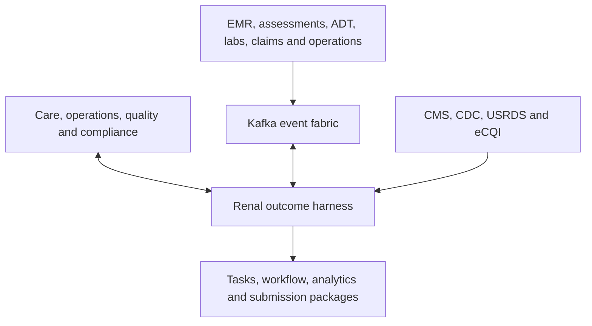
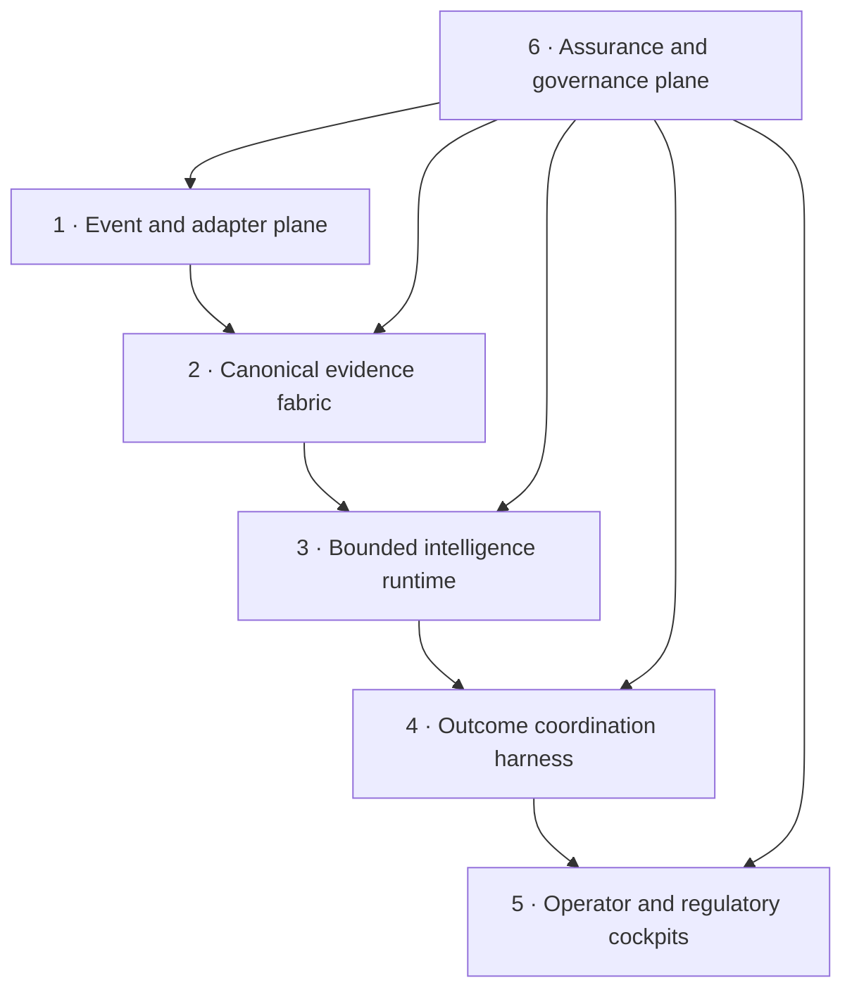
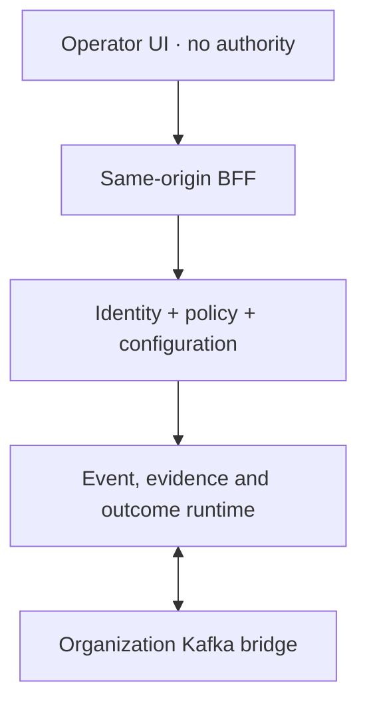
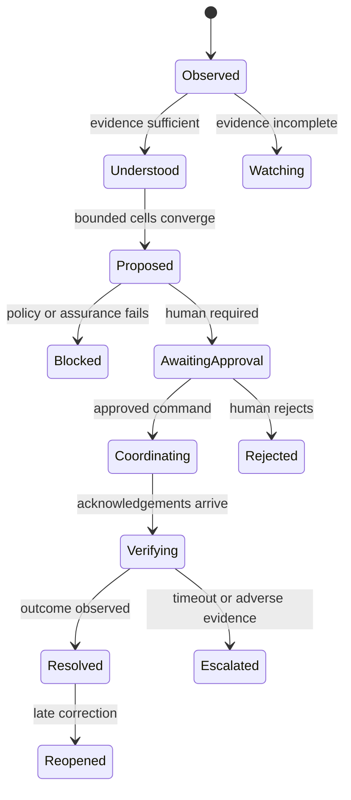

# Renal Swarm Intelligence

## Product-grade reference architecture · 2026–2039

Renal Swarm Intelligence is a governed business outcome harness for the full renal-care enterprise. It sits above an event-first microservice estate and coordinates bounded analytical and AI cells across patient care, facilities, workforce, quality, experience, growth, finance, assets and regulatory operations.

It is not a clinical-autonomy layer, an EMR replacement, a generic copilot or a one-year CMS rules engine. The foundation begins with production controls even while this demonstration uses synthetic patient and operational records.

## Durable product primitives

The system is not organized around chat sessions, model calls, alerts or dashboard tiles. Its durable primitives are:

- **canonical events and evidence objects** with tenant, purpose, origin, valid time, recorded time and integrity;
- **topology nodes and typed relations** connecting enterprise, division, region, market, facility, patient, assessment, intervention, outcome, measure, policy and authority;
- **swarm insights** that preserve each bounded cell’s contribution, conflict, abstention and dependency;
- **next-best actions** ranked by explicit outcome, urgency, value, confidence, scope, owner and approval class;
- **outcome episodes** that coordinate evidence, proposals, approvals, commands, acknowledgements and verified results;
- **configuration releases** that pin organization models, adapters, contracts, agents, policies, thresholds, workflows, sources and measures.

All six primitives carry end-to-end trace and assurance evidence.

## Non-negotiable principles

1. **Event native:** Kafka is the operational nervous system.
2. **Human authority:** clinical changes, service changes, communications and submissions use explicit action classes and approvals.
3. **Bounded intelligence:** every cell has typed I/O, an action allowlist, eval gate, owner and kill switch.
4. **Provenance first:** every derived fact resolves to an immutable source envelope and exact supporting content.
5. **Bitemporal by default:** retain when a fact was true and when it became known.
6. **Configuration over year code:** sources, measures, mappings, policies, prompts and manifests have versions and effective windows.
7. **Deterministic where possible:** measures, policy, eligibility, reconciliation and idempotency do not depend on a language model.
8. **Fail closed:** scope mismatch, stale authority, missing approval or failed eval blocks the affected action.
9. **Synthetic-by-default development:** only labeled public authority fixtures are real.
10. **Assurance is runtime architecture:** green team, red team, observability and governance are gates.

## Configurable enterprise operating model

The reference organization is synthetic and models a large dialysis network through `enterprise → division → region → market → facility`. Role cockpits and decision rights are configured for EVP/COO, DVP, ROD, Facility Administrator, Medical Director, Quality Director, Finance VP and Biomedical Director. The product does not encode any company’s proprietary hierarchy or data.

RBAC establishes the role. Contextual ABAC then constrains organization scope, patient relationship, purpose of use, action class and effective time. An executive rollup can aggregate outcomes but cannot use that rollup to traverse unauthorized patient evidence.

## System context



## Logical architecture



### 1 · Event and adapter plane

Responsibilities:

- receive FHIR R4/R5, HL7 v2, file, API, claims, CDC/NHSN and operational messages;
- normalize source-specific data into versioned canonical contracts;
- validate schema, tenant, patient, identity, purpose and time;
- deduplicate and quarantine without silent loss;
- retain raw pointers and content hashes;
- support correction and deterministic Kafka replay.

| Topic family | Examples | Purpose |
|---|---|---|
| Source facts | `adt.discharge.v2`, `assessment.response.v1`, `lab.observation.v3` | Rebuild patient state |
| Operations | `chair.changed.v2`, `staff.changed.v2`, `machine.changed.v2` | Rebuild facility state |
| Cell output | `continuity.proposal.v1`, `assessment.fact-candidate.v1` | Reviewable reasoning evidence |
| Outcomes | `outcome.opened.v1`, `outcome.state-changed.v1` | Durable coordination state |
| Commands | `coordinator.task.requested.v1` | Governed, idempotent intent |
| Acknowledgements | `task.accepted.v1`, `treatment.attended.v2` | Outcome verification |
| Assurance | `eval.completed.v1`, `policy.blocked.v1`, `source.stale.v1` | Release and audit evidence |
| Dead letter | `*.dlq.v1` | Recovery without loss |

Canonical envelope:

```json
{
  "event_id": "immutable-source-id",
  "event_type": "assessment.response.v1",
  "schema_version": "1.0.0",
  "tenant_id": "tenant-boundary",
  "subject": { "type": "patient", "id": "tokenized-id" },
  "purpose": "care-coordination",
  "valid_time": "2026-08-18T16:20:00Z",
  "recorded_time": "2026-08-18T16:22:04Z",
  "correlation_id": "outcome-id",
  "causation_id": "prior-event-id",
  "source": { "system": "emr-adapter", "resource": "QuestionnaireResponse" },
  "integrity": { "algorithm": "sha256", "content_hash": "..." },
  "classification": ["phi", "patient-authored"],
  "payload": {}
}
```

Patient topics partition by `tenant_id + patient_id`; facility topics partition by `tenant_id + facility_id`. Commands carry stable business idempotency keys and never rely on delivery semantics alone.

### Frontend, BFF and control-plane boundary

The browser is an untrusted operator surface. It sends identifiers and intended operations, never authoritative evidence, role decisions, policy results or executable commands. Same-origin API routes act as a BFF and delegate to server-only control-plane services. Those services resolve workspace identity, scoped role, purpose, active configuration and permitted evidence before returning a projection.



Mutation requests require JSON, same-site/origin context, authenticated identity and a server-authorized role. Detail drawers fail closed if server context cannot be assembled. Patient-authored exact text is removed when the role lacks evidence-review authority. Raw secrets are rejected; integration records store only runtime binding references.

### Zero-redeploy configuration plane

Tenant environments, integration connections, configuration objects, validation evidence and releases are durable records. A draft can contain agent manifests, action policies, adapter/topic mappings, measure packs, workflows and role maps. Schema, green-team, red-team, integration and promotion suites evaluate the same content-addressed release. Activation changes the single active release pointer; new server-side events resolve it immediately, while the previous active version remains the rollback target.

The executable reference hot-loads agent enablement, typed triggers, versions, proposal allowlists, evaluation gates and the global escalation policy. The generic configuration-object model and PostgreSQL-portable schema allow the same lifecycle to govern adapters, measures and workflows as their organization-specific executors are attached.

### 2 · Canonical evidence fabric

- **Immutable evidence objects:** raw pointers, exact assessment spans, signed public-source snapshots and hashes.
- **Bitemporal projections:** current and historical patient, facility and measure state.
- **Temporal hypergraph:** typed nodes and first-class relations connecting evidence, cells, policies, actions, outcomes and measures.
- **Analytical marts:** reproducible population, facility and regulatory views.

The hypergraph is not free-form AI memory. Every node and edge has a schema, tenant, patient/purpose scope, provenance, time bounds, visibility policy and confidence. Embeddings can accelerate retrieval but never become authority.

### 3 · Bounded intelligence runtime

The swarm is a registry of small independent cells, not uncontrolled agent conversation. Cells publish typed proposals to the harness rather than calling each other directly.

Each manifest declares version, owner, typed I/O, mode, data/tool permissions, allowed proposals, approval class, eval thresholds, timeout/fallback, model/prompt/rule versions, kill switch and rollback.

| Cell | Mode | Business purpose | Maximum authority |
|---|---|---|---|
| Hospital transition | Stream rules | Detect post-discharge gaps | Propose review or confirmation |
| Treatment continuity | Rules + forecast | Prevent avoidable treatment breaks | Propose coordinator task or chair option |
| Assessment intelligence | Grounded extraction | Create cited fact candidates | Request human confirmation |
| Facility capacity | Constraint optimization | Offer policy-compatible capacity | Propose schedule plan |
| Access surveillance | Rules + anomaly | Surface access observations | Propose nurse review |
| CMS readiness | Deterministic engine | Calculate measures and gaps | Prepare package or quality task |
| Workforce resilience | Constraint optimization | Detect and cover staffing exposure | Propose coverage option |
| Growth and demand | Forecast + constraints | Connect referrals to viable capacity | Propose demand plan |
| Clinical quality | Measures + surveillance | Detect quality variation | Prepare evidence brief |
| Experience and equity | Grounded extraction + rules | Surface barriers and experience themes | Propose human follow-up |
| Revenue cycle | Rules + anomaly | Detect eligibility and clean-claim risk | Prepare claim evidence |
| Asset reliability | Rules + prediction | Protect machine and supply capacity | Draft maintenance review |

### 4 · Outcome coordination harness



The harness owns episode detection, scope validation, evidence sufficiency, proposal time budgets, conflict detection, deterministic policy arbitration, approval routing, command idempotency, acknowledgement correlation, outcome verification and dossier generation.

| Class | Examples | Default policy |
|---|---|---|
| A | Read-only summary and analytics | Allowed with audit |
| B | Service coordination or quality task | Named operator approval |
| C | Clinical review task or patient communication | Authorized-role approval |
| D | Treatment/order change or external submission | Dual approval and source-system controls; never autonomous |

### 5 · Cockpits

| Product surface | Primary responsibility |
|---|---|
| Swarm Control | Enterprise topology, cross-facility patterns, emerging-risk propagation, cell proposals/conflicts, NBAs, Kafka replay and policy simulation |
| Outcome Command | Resolve active care and operational episodes |
| Patient Intelligence | Understand temporal changes, assessments and interventions |
| Facility Operations | Chairs, staff, machines, late arrivals and capacity |
| Assessment Intelligence | Review extracted facts, changes and supporting answers |
| CMS Operations | Measures, deadlines, readiness, submission and reconciliation |
| Agent Operations | Agent manifests, runtime state, message fabric, contributions, conflicts, cost and traces |
| AI Assurance | Evals, drift, safety, cost, observability and model governance |
| Executive Outcomes | Clinical, operational, regulatory and economic outcomes |
| Platform Admin | Customer onboarding, identity posture, Kafka bridge, agent/policy editing, validation and hot activation |
| Configuration Studio | Organization, adapters, measures, agents, policies, workflows and thresholds |
| Shared Intelligence | Obsidian-style Three.js canvases, typed connections and institutional knowledge |

## Assessment intelligence

Assessment answers are evidence, not instructions. Retain patient and tenant scope, instrument/question/version, answer type and exact value, respondent, channel, language, consent/purpose, valid/recorded time, source hash, extracted concept, cited span, model/prompt version, confidence, reviewer decision and downstream-use policy.

Structured answers use deterministic mappings. Free text passes through an untrusted-content boundary, patient-scoped retrieval, grounded extraction, negation/temporality checks and human confirmation. Embedded instructions in an answer can never become tool or system instructions.

## CMS and regulatory intelligence

The authority registry records authority, publication state, dates, effective window, URL, refresh policy, retrieval time and hash. Measure packs reference source IDs; proposed, final and superseded versions coexist. Proposed sources support scenario analysis but cannot activate a final submission pack.

Submission pipeline:

1. freeze the eligible evidence window;
2. calculate with a pinned pack;
3. validate schema, completeness, time and gold-set parity;
4. reconcile corrections and exclusions;
5. create a content-addressed package and dossier;
6. obtain role-specific dual approval;
7. transmit through an independently credentialed connector;
8. reconcile acknowledgement, rejection and resubmission;
9. retain the exact package, snapshot and receipt.

The demo performs steps 1–5. Live CMS, EQRS and NHSN transmission stays disabled until credentials, connector certification and designated approvers exist.

## Assurance architecture

### Green team

- schema compatibility, idempotency and replay;
- patient/tenant isolation;
- assessment groundedness and citation accuracy;
- precision/recall by demographic and language slice;
- policy truth tables;
- deterministic measure gold-set parity;
- trace completeness, accessibility and operator comprehension;
- latency, capacity, recovery and chaos.

### Red team

- prompt injection and untrusted clinical text;
- cross-patient/tenant contamination;
- duplicate, out-of-order and late-correction events;
- malformed or poisoned FHIR;
- authority spoofing and stale-rule activation;
- unsafe clinical/regulatory proposals;
- privilege and approval bypass;
- model/tool outage, timeout and malicious output;
- model/prompt/feature/measure drift;
- re-identification and exfiltration attempts.

### Release gate

A change cannot promote unless contracts and gold sets pass, applicable green thresholds pass by slice, red scenarios are contained, sources are current and effective, privacy/security gates pass, domain owners approve, rollback/kill-switch targets are proven, and a content-addressed dossier is retained.

## Observability

W3C trace context and domain correlation IDs propagate from Kafka ingress through projection, cell evaluation, policy, human decision, command, acknowledgement and outcome verification.

Required telemetry covers event throughput/lag/rejection/duplicates/DLQ, projection latency and lineage, cell eligibility/timeout/abstention/fallback, outcome state and approval latency, command idempotency, source freshness, measure completeness, package conformance, isolation failures, policy blocks, injection detection and kill-switch state. High-risk actions are sampled at 100%; logs exclude raw PHI by default.

## Security and governance

- zero-trust workload identity and least-privilege Kafka/tool ACLs;
- tenant/patient scope at ingress, retrieval, graph traversal and action;
- encryption, environment-specific keys and rotation;
- secrets through deployment bindings only;
- RBAC plus contextual ABAC for role, facility, relationship, purpose and action class;
- audited, time-limited break glass;
- append-only approval, release, policy and source-change records;
- data minimization, retention, legal hold, correction and lineage-aware deletion;
- vendor/model inventory, BAA/security assessment, change notification and exit plan;
- clinical safety case, hazard log, intended-use statement and local validation.

## Product sequence

This is one product foundation with widening evidence, not a disposable MVP.

| Stage | Scope | Exit evidence |
|---|---|---|
| Foundation | Contracts, replay, evidence, harness, policy, audit, evals and cockpits | Synthetic end-to-end replay and threat model |
| Controlled shadow | Read-only EMR/Kafka feed; no commands | Isolation, concordance, precision and burden results |
| Assisted pilot | Class B/C proposals in selected facilities | Workflow safety, latency, outcomes and rollback |
| Regulatory pilot | One measure dry-run beside current process | Gold parity, reconciliation and signed dossier |
| Production expansion | More facilities, cells and measures under the same gates | SLOs, surveillance, equity slices and drills |
| 2039 continuity | Parallel versions and source replacement | Historical replay reproducible across retired versions |

## Current executable reference boundary

The implementation includes twelve cockpits and a shared server runtime. Eleven canonical replay events are integrity checked and persisted as event envelopes, exact evidence and bitemporal states. Twelve deterministic bounded cells execute from manifests; their independent proposals become five swarm insights, four ranked NBAs and one retained capacity conflict. Role, organization scope and action class are rechecked on the server. An approved NBA becomes an idempotent command and leased Kafka-outbox row; an acknowledgement closes the episode and calculates a measure result. Policy and facility “what-if” runs replay persisted evidence without changing runtime state. The topology is projected into D1 and shared notes keep version/comment history. Model registry, drift, traces, cost, incidents, red-team runs and dry-run submission packages are persisted. Platform Admin persists the tenant environment, bridge contract, draft objects, five-suite validation evidence and active/rollback releases. Agent eligibility and the escalation threshold are resolved from the active server-side release without rebuilding the application.

The hosted worker intentionally terminates Kafka at authenticated HTTPS. `services/kafka-bridge` is the deployable connection to the organization’s brokers: it consumes canonical topics, posts them through integrity/tenant validation, leases outbox rows, publishes with an idempotent producer and records receipts or terminal incidents.

This is not a production authorization to process PHI or transmit regulatory data. Before real patient data or live submissions, complete organization-specific adapter mapping, enterprise identity/role assignments, patient-relationship and purpose-of-use enforcement, secrets/network configuration, security/privacy review, clinical safety validation, local data reconciliation, connector certification, performance/chaos testing, operational ownership and rollback drills.
